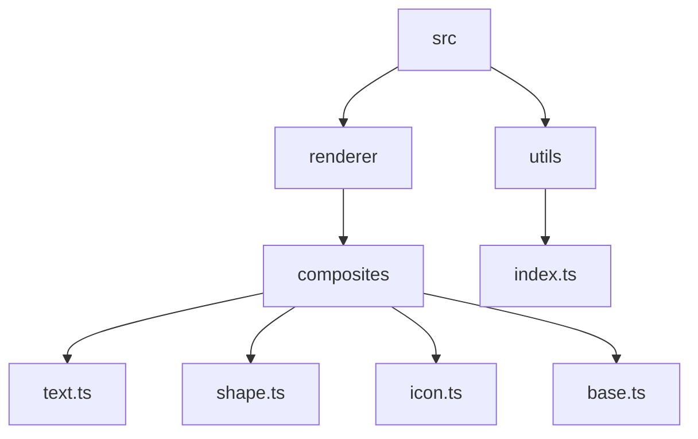
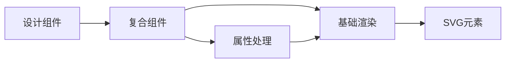
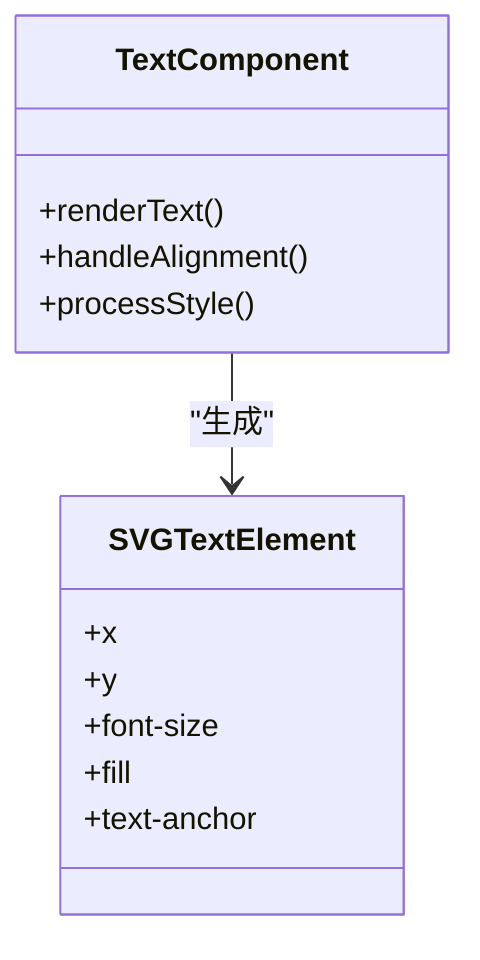
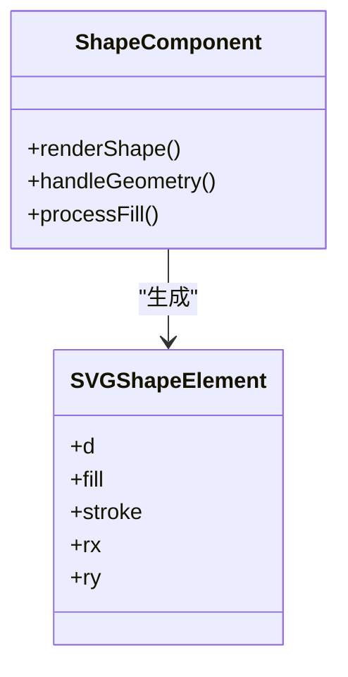
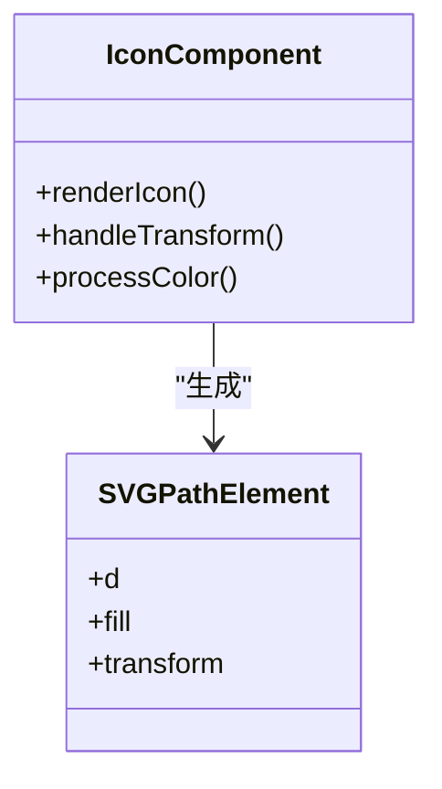
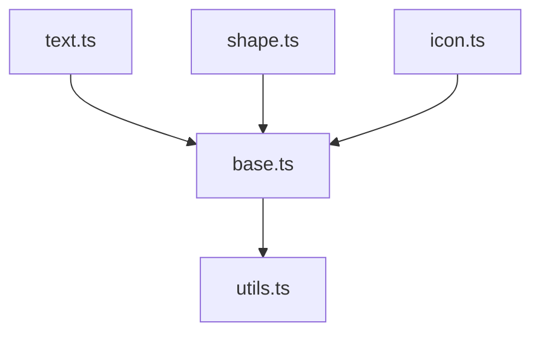

# 复合组件映射

<cite>
**本文档中引用的文件**  
- [base.ts](file://src/renderer/composites/base.ts)
- [text.ts](file://src/renderer/composites/text.ts)
- [shape.ts](file://src/renderer/composites/shape.ts)
- [icon.ts](file://src/renderer/composites/icon.ts)
- [utils.ts](file://src/utils/index.ts)
- [renderer.ts](file://src/renderer/renderer.ts)
- [text.test.tsx](file://__tests__/unit/jsx/components/text.test.tsx)
- [prompt.md](file://src/designs/structures/prompt.md)
</cite>

## 目录
1. [简介](#简介)
2. [项目结构](#项目结构)
3. [核心组件](#核心组件)
4. [架构概述](#架构概述)
5. [详细组件分析](#详细组件分析)
6. [依赖分析](#依赖分析)
7. [性能考虑](#性能考虑)
8. [故障排除指南](#故障排除指南)
9. [结论](#结论)

## 简介
本文档详细说明了高级设计组件到基础SVG元素的转换机制。重点阐述了`composites`目录下各组件（如text、shape、icon等）如何将设计语义映射为具体的SVG元素（如text、rect、path等）。文档还解释了基础组件（base.ts）提供的通用渲染逻辑和属性处理方法，以及组件如何处理样式继承、坐标变换和层级关系。

## 项目结构
项目结构显示了复合组件位于`src/renderer/composites`目录下，这些组件负责将高级设计元素转换为底层SVG表示。测试文件位于`__tests__/unit/jsx/components/`目录下，提供了组件行为的验证。

**Diagram sources**
- [src/renderer/composites](file://src/renderer/composites)
- [__tests__/unit/jsx/components](file://__tests__/unit/jsx/components)

**Section sources**
- [src](file://src)
- [__tests__](file://__tests__)

## 核心组件
核心组件包括`text`、`shape`、`icon`等，它们分别处理文本、形状和图标元素的渲染。这些组件使用基础渲染函数来处理通用属性，并将设计语义转换为具体的SVG元素。

**Section sources**
- [text.ts](file://src/renderer/composites/text.ts)
- [shape.ts](file://src/renderer/composites/shape.ts)
- [icon.ts](file://src/renderer/composites/icon.ts)

## 架构概述
系统架构展示了从设计组件到SVG元素的转换流程。设计组件通过复合组件层转换为SVG元素，该层使用基础渲染函数处理通用属性。

**Diagram sources**
- [renderer.ts](file://src/renderer/renderer.ts)
- [base.ts](file://src/renderer/composites/base.ts)

## 详细组件分析
### 文本组件分析
文本组件将设计文本转换为SVG text元素，处理字体、颜色、对齐等属性。

**Diagram sources**
- [text.ts](file://src/renderer/composites/text.ts)
- [text.test.tsx](file://__tests__/unit/jsx/components/text.test.tsx)

### 形状组件分析
形状组件将设计形状转换为SVG path、rect等元素，处理填充、描边、圆角等属性。

**Diagram sources**
- [shape.ts](file://src/renderer/composites/shape.ts)
- [utils.ts](file://src/utils/index.ts)

### 图标组件分析
图标组件将设计图标转换为SVG path元素，处理尺寸、颜色、变换等属性。

**Diagram sources**
- [icon.ts](file://src/renderer/composites/icon.ts)
- [utils.ts](file://src/utils/index.ts)

**Section sources**
- [icon.ts](file://src/renderer/composites/icon.ts)
- [shape.ts](file://src/renderer/composites/shape.ts)
- [text.ts](file://src/renderer/composites/text.ts)

## 依赖分析
复合组件依赖于基础渲染函数和工具函数来处理通用属性和DOM操作。

**Diagram sources**
- [base.ts](file://src/renderer/composites/base.ts)
- [utils.ts](file://src/utils/index.ts)

**Section sources**
- [base.ts](file://src/renderer/composites/base.ts)
- [utils.ts](file://src/utils/index.ts)

## 性能考虑
复合组件的设计考虑了渲染性能，通过复用基础渲染逻辑和最小化DOM操作来优化性能。

## 故障排除指南
当组件渲染出现问题时，应检查属性传递、基础渲染函数调用和SVG元素生成。

**Section sources**
- [text.test.tsx](file://__tests__/unit/jsx/components/text.test.tsx)
- [prompt.md](file://src/designs/structures/prompt.md)

## 结论
复合组件映射机制有效地将高级设计语义转换为底层SVG表示，通过基础渲染函数和组件特定逻辑的结合，实现了灵活而高效的渲染。