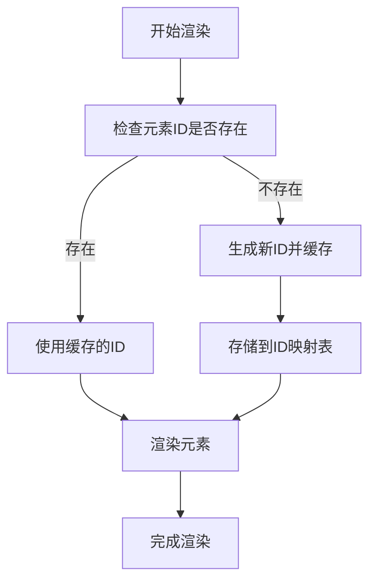
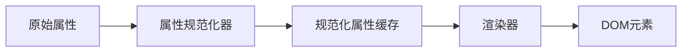
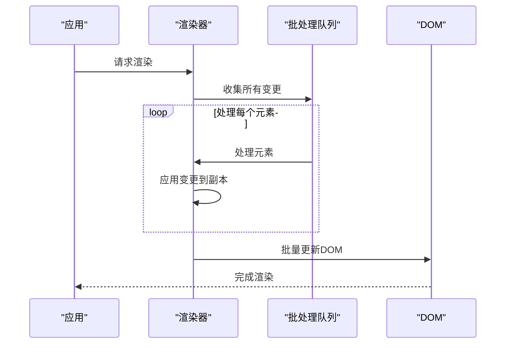
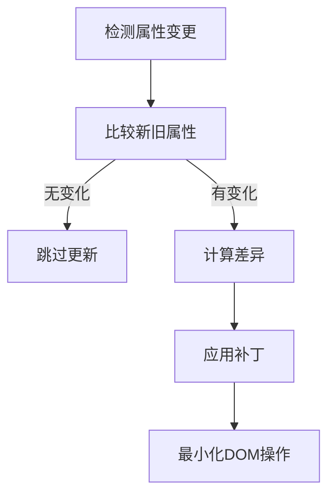
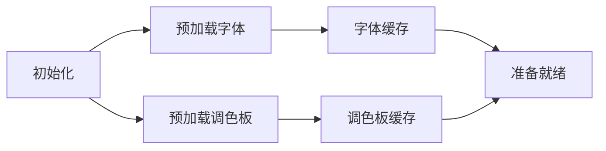
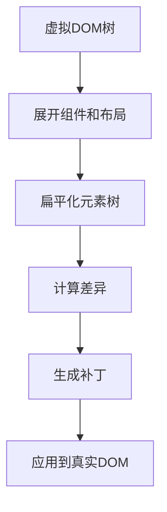
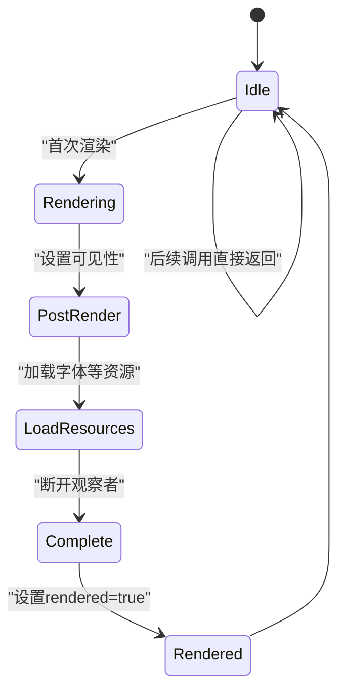
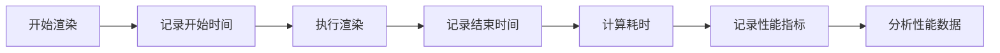

# 性能优化

<cite>
**本文档中引用的文件**  
- [id.ts](file://antv_infographic\infographic\src\renderer\utils\id.ts)
- [attrs.ts](file://antv_infographic\infographic\src\renderer\utils\attrs.ts)
- [renderer.ts](file://antv_infographic\infographic\src\renderer\renderer.ts)
- [layout.ts](file://antv_infographic\infographic\src\jsx\layout.ts)
- [loader.ts](file://antv_infographic\infographic\src\resource\loader.ts)
- [fonts.ts](file://antv_infographic\infographic\src\renderer\fonts\loader.ts)
- [composites.ts](file://antv_infographic\infographic\src\renderer\composites\index.ts)
- [utils.ts](file://antv_infographic\infographic\src\jsx\utils\index.ts)
</cite>

## 目录
1. [引言](#引言)
2. [ID缓存与属性规范化](#id缓存与属性规范化)
3. [渲染批处理与变更检测](#渲染批处理与变更检测)
4. [资源预加载与缓存机制](#资源预加载与缓存机制)
5. [虚拟DOM优化与惰性更新](#虚拟dom优化与惰性更新)
6. [性能监控与调优建议](#性能监控与调优建议)

## 引言
AntV Infographic渲染引擎通过一系列优化策略实现高性能的图表渲染。本文档系统阐述其核心性能优化机制，包括ID缓存、属性规范化、渲染批处理、资源预加载等关键技术，为开发者提供深入的性能调优指导。

## ID缓存与属性规范化

AntV Infographic通过ID缓存和属性规范化机制显著减少重复计算，提升渲染效率。

### ID缓存机制
渲染引擎在`id.ts`文件中实现了高效的ID缓存系统，通过`generateId`函数为每个元素生成唯一标识，并在渲染过程中复用已生成的ID。这种机制避免了重复的ID生成计算，确保每个元素在整个生命周期中保持一致的标识。



**图示来源**
- [id.ts](file://antv_infographic\infographic\src\renderer\utils\id.ts)

### 属性规范化
在`attrs.ts`中实现的属性规范化系统将原始属性转换为标准化格式，通过`normalizeAttrs`函数预处理所有SVG属性。这避免了在渲染过程中重复进行属性解析和转换，将复杂的属性计算提前到初始化阶段完成。



**图示来源**
- [attrs.ts](file://antv_infographic\infographic\src\renderer\utils\attrs.ts)

**本节来源**
- [id.ts](file://antv_infographic\infographic\src\renderer\utils\id.ts#L1-L50)
- [attrs.ts](file://antv_infographic\infographic\src\renderer\utils\attrs.ts#L1-L80)

## 渲染批处理与变更检测

### 渲染批处理机制
渲染引擎采用批处理策略，将多个DOM操作合并为单次批量更新。在`renderer.ts`中，`renderTemplate`函数收集所有待渲染元素，通过`processElement`统一处理，最后一次性应用到DOM树中，极大减少了浏览器重排和重绘次数。



**图示来源**
- [renderer.ts](file://antv_infographic\infographic\src\renderer\renderer.ts)

### 变更检测策略
引擎实现了精细的变更检测机制，仅对实际发生变化的属性进行DOM更新。通过比较新旧属性值，使用`upsert`函数智能地决定是更新现有元素还是替换为新元素，最小化DOM操作。



**图示来源**
- [renderer.ts](file://antv_infographic\infographic\src\renderer\renderer.ts)

**本节来源**
- [renderer.ts](file://antv_infographic\infographic\src\renderer\renderer.ts#L100-L200)

## 资源预加载与缓存机制

### 字体与调色板预加载
渲染引擎在初始化阶段预加载关键资源，确保渲染过程流畅。`fonts/loader.ts`中的`loadFonts`函数在SVG插入DOM后立即加载所需字体，避免渲染时的字体闪烁问题。



**图示来源**
- [fonts/loader.ts](file://antv_infographic\infographic\src\renderer\fonts\loader.ts)

### 资源缓存策略
`resource/loader.ts`实现了多级缓存机制，包括内存缓存和请求去重。通过`pendingRequests`和`svgTextCache`两个Map对象，确保相同资源不会被重复加载，同时避免并发请求。

```mermaid
classDiagram
class ResourceLoader {
+pendingRequests : Map<string, Promise>
+svgTextCache : Map<string, string>
+loadResource(key) : Promise
-fetchResource(url) : Promise
-loadSVGResource(text) : SVGElement
}
ResourceLoader --> "1" "0..*" MemoryCache : "缓存"
ResourceLoader --> "1" "0..*" RequestDeduplication : "去重"
```

**图示来源**
- [resource/loader.ts](file://antv_infographic\infographic\src\resource\loader.ts)

**本节来源**
- [fonts/loader.ts](file://antv_infographic\infographic\src\renderer\fonts\loader.ts#L1-L60)
- [resource/loader.ts](file://antv_infographic\infographic\src\resource\loader.ts#L1-L100)

## 虚拟DOM优化与惰性更新

### 虚拟DOM差异计算
渲染引擎在JSX层实现了高效的虚拟DOM差异计算。`jsx/renderer.ts`中的`processElement`函数在预处理阶段展开所有组件和布局，生成扁平化的元素树，为后续的精确差异计算奠定基础。



**图示来源**
- [jsx/renderer.ts](file://antv_infographic\infographic\src\jsx\renderer.ts)

### 渲染树惰性更新
引擎采用惰性更新策略，通过`rendered`标志位确保模板只渲染一次。`Renderer`类的`render`方法检查此标志，避免重复渲染，同时使用`MutationObserver`在DOM插入后执行后处理操作。



**图示来源**
- [renderer.ts](file://antv_infographic\infographic\src\renderer\renderer.ts)

**本节来源**
- [jsx/renderer.ts](file://antv_infographic\infographic\src\jsx\renderer.ts#L1-L50)
- [renderer.ts](file://antv_infographic\infographic\src\renderer\renderer.ts#L20-L40)

## 性能监控与调优建议

### 性能监控机制
建议在生产环境中集成性能监控，通过`MutationObserver`跟踪关键渲染阶段的耗时，识别性能瓶颈。



### 避免重排重绘最佳实践
1. **批量属性更新**：合并多个样式修改为单次操作
2. **使用transform代替位置属性**：利用GPU加速
3. **避免强制同步布局**：不要在读取布局属性后立即修改
4. **使用CSS类代替内联样式**：减少样式计算开销
5. **虚拟滚动**：对于大量数据，只渲染可见区域

**本节来源**
- [renderer.ts](file://antv_infographic\infographic\src\renderer\renderer.ts#L30-L45)
- [jsx/utils/index.ts](file://antv_infographic\infographic\src\jsx\utils\index.ts#L1-L30)