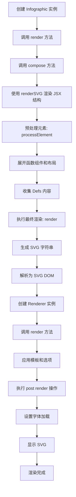

# 渲染机制

<cite>
**本文档引用的文件**  
- [jsx-runtime.ts](file://antv_infographic\infographic\src\jsx\jsx-runtime.ts)
- [renderer.ts](file://antv_infographic\infographic\src\jsx\renderer.ts)
- [Infographic.tsx](file://antv_infographic\infographic\src\runtime\Infographic.tsx)
- [renderer.js](file://antv_infographic\infographic\lib\renderer\renderer.js)
- [composites](file://antv_infographic\infographic\src\renderer\composites)
</cite>

## 目录
1. [简介](#简介)
2. [JSX运行时机制](#jsx运行时机制)
3. [渲染器核心架构](#渲染器核心架构)
4. [复合组件映射机制](#复合组件映射机制)
5. [渲染流程分析](#渲染流程分析)
6. [性能优化策略](#性能优化策略)
7. [错误处理与边界情况](#错误处理与边界情况)
8. [总结](#总结)

## 简介
AntV Infographic 是一个基于 SVG 的信息图表渲染引擎，它通过 JSX 语法描述可视化结构，并将其转换为高效的 SVG 输出。本文档深入解析其渲染机制，涵盖从 JSX 描述到最终 SVG 元素的完整转换流程，重点分析渲染器（renderer.ts）的核心架构、渲染上下文管理、复合组件（Composites）的映射机制以及性能优化策略。

**本节不涉及具体源码分析，因此无来源标注**

## JSX运行时机制
AntV Infographic 实现了一个轻量级的 JSX 运行时，用于将 JSX 语法转换为虚拟 DOM 节点。该机制定义了 `jsx`、`jsxs` 和 `jsxDEV` 函数，它们均指向同一个核心函数 `jsx`，负责创建具有 `type` 和 `props` 属性的元素对象。

`Fragment` 作为特殊符号被引入，用于支持无包裹的元素集合。`createFragment` 函数允许创建片段节点，这些节点在渲染过程中会被展开而不生成额外的 DOM 结构。

该运行时机制不依赖 React，而是自定义实现，确保了轻量化和对 SVG 渲染的针对性优化。

**Section sources**
- [jsx-runtime.ts](file://antv_infographic\infographic\src\jsx\jsx-runtime.ts#L1-L18)

## 渲染器核心架构
渲染器是 AntV Infographic 的核心组件，负责将 JSX 描述的虚拟节点树转换为实际的 SVG 字符串或 DOM 元素。其架构分为两个主要阶段：预处理阶段和渲染阶段。

在预处理阶段，`processElement` 函数递归遍历虚拟节点树，执行以下操作：
- 展开函数式组件（Function Components）
- 处理布局组件（Layout Components）
- 收集 `<Defs>` 中的定义内容
- 处理片段（Fragment）并将其子节点扁平化

渲染阶段由 `render` 函数执行，将预处理后的节点转换为 SVG 字符串。此阶段包括属性转换（`renderAttrs`）、样式处理（`renderStyle`）和内容拼接。

渲染上下文（`RenderContext`）贯穿整个过程，用于存储全局状态，如 `defs` 集合和默认配置。

**Section sources**
- [renderer.ts](file://antv_infographic\infographic\src\jsx\renderer.ts#L17-L65)
- [renderer.ts](file://antv_infographic\infographic\src\jsx\renderer.ts#L70-L110)

## 复合组件映射机制
复合组件（Composites）是 AntV Infographic 中将高级语义组件映射为底层 SVG 元素的关键机制。这些组件定义在 `src/renderer/composites` 目录下，每个复合组件负责特定类型的元素渲染。

例如，`renderIllus` 处理插图元素，`renderItemIcon` 处理图标元素，`renderStaticText` 处理静态文本，而 `renderStaticShape` 处理基本形状。这些函数根据数据和选项动态生成或修改 SVG 元素。

复合组件通过类型检测函数（如 `isItemIllus`、`isItemIcon`）识别目标元素，并使用 `upsert` 函数进行元素的替换或删除，确保 DOM 树的正确更新。

这种设计实现了关注点分离，使得高级组件的定义与底层渲染逻辑解耦，提高了代码的可维护性和扩展性。

**Section sources**
- [renderer.js](file://antv_infographic\infographic\lib\renderer\renderer.js#L95-L113)
- [composites](file://antv_infographic\infographic\src\renderer\composites)

## 渲染流程分析
从 Infographic 组件挂载到最终 SVG 输出的完整流程如下：

**Diagram sources**
- [Infographic.tsx](file://antv_infographic\infographic\src\runtime\Infographic.tsx#L27-L34)
- [renderer.ts](file://antv_infographic\infographic\src\jsx\renderer.ts#L115-L152)
- [renderer.js](file://antv_infographic\infographic\lib\renderer\renderer.js#L27-L42)

## 性能优化策略
AntV Infographic 采用了多种性能优化策略来确保高效的渲染：

1. **虚拟 DOM 差异计算**：虽然未直接实现完整的虚拟 DOM diff 算法，但通过 `upsert` 函数实现了元素的精确替换，避免了不必要的 DOM 操作。

2. **渲染批处理**：使用 `MutationObserver` 监听 DOM 变化，在 SVG 被添加到文档后统一执行后处理操作（如字体加载），减少重排和重绘。

3. **惰性渲染**：`Renderer` 类通过 `rendered` 标志位确保渲染只执行一次，避免重复渲染。

4. **属性过滤**：在 `renderAttrs` 函数中，过滤掉 `undefined` 和 `null` 值的属性，减少生成的 SVG 字符串体积。

5. **上下文复用**：渲染上下文（`RenderContext`）在整个渲染过程中被复用，避免了重复创建和销毁。

这些策略共同作用，确保了在复杂图表场景下的高性能渲染。

**Section sources**
- [renderer.js](file://antv_infographic\infographic\lib\renderer\renderer.js#L33-L42)
- [renderer.ts](file://antv_infographic\infographic\src\jsx\renderer.ts#L157-L170)

## 错误处理与边界情况
AntV Infographic 在设计时充分考虑了错误处理和边界情况：

1. **空值处理**：在 `processElement` 和 `render` 函数中，对 `null`、`undefined` 和布尔值进行了显式处理，返回 `null` 或空字符串。

2. **未处理组件警告**：在渲染阶段检测到未处理的函数组件或布局组件时，会输出警告信息，便于调试。

3. **SVG 解析失败处理**：在 `compose` 方法中，如果 `parseSVG` 返回 `null`，会抛出明确的错误信息。

4. **状态检查**：在 `toDataURL` 方法中，检查 `this.node` 是否存在，避免在未渲染时调用导出功能。

5. **资源加载保障**：通过 `MutationObserver` 确保在 SVG 完全挂载后才执行字体加载等后处理操作，避免资源竞争。

这些机制确保了渲染过程的健壮性，即使在异常情况下也能提供清晰的错误反馈。

**Section sources**
- [renderer.ts](file://antv_infographic\infographic\src\jsx\renderer.ts#L18-L26)
- [renderer.ts](file://antv_infographic\infographic\src\jsx\renderer.ts#L95-L98)
- [Infographic.tsx](file://antv_infographic\infographic\src\runtime\Infographic.tsx#L58-L62)
- [Infographic.tsx](file://antv_infographic\infographic\src\runtime\Infographic.tsx#L79-L80)

## 总结
AntV Infographic 的渲染机制通过 JSX 运行时、渲染器核心、复合组件映射和性能优化策略的协同工作，实现了从高级语义描述到高效 SVG 输出的完整转换。其架构清晰，关注点分离，既保证了开发体验的友好性，又确保了运行时的高性能。通过深入理解这一机制，开发者可以更好地利用该框架创建复杂而高效的信息图表。

**本节为总结性内容，因此无来源标注**