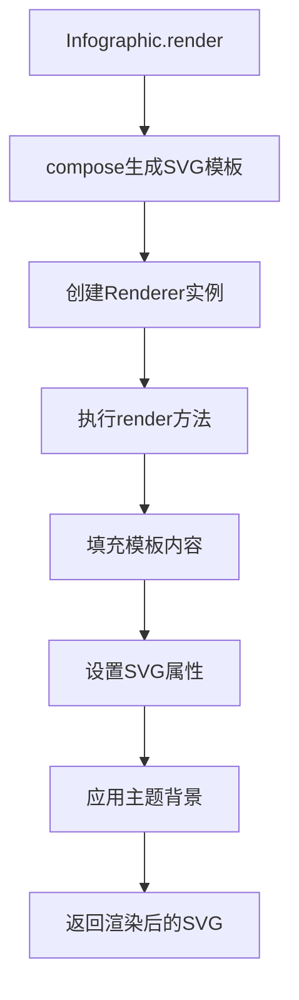
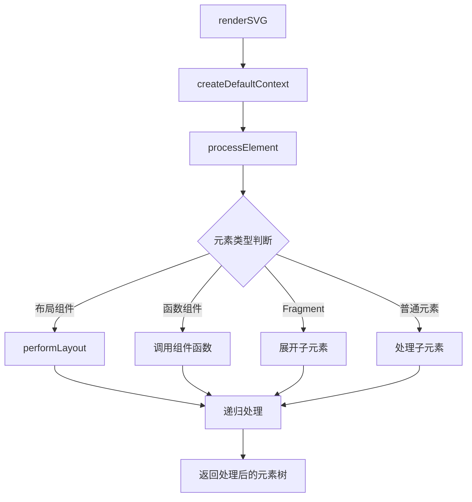
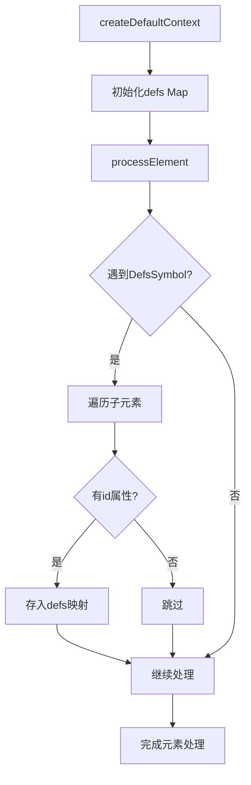
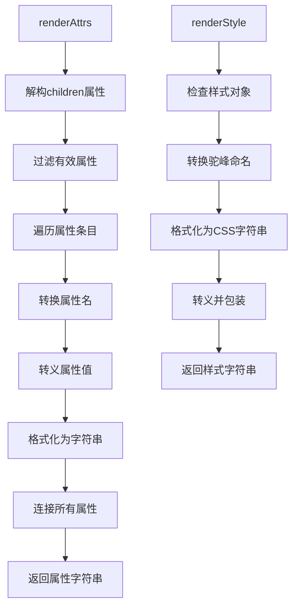
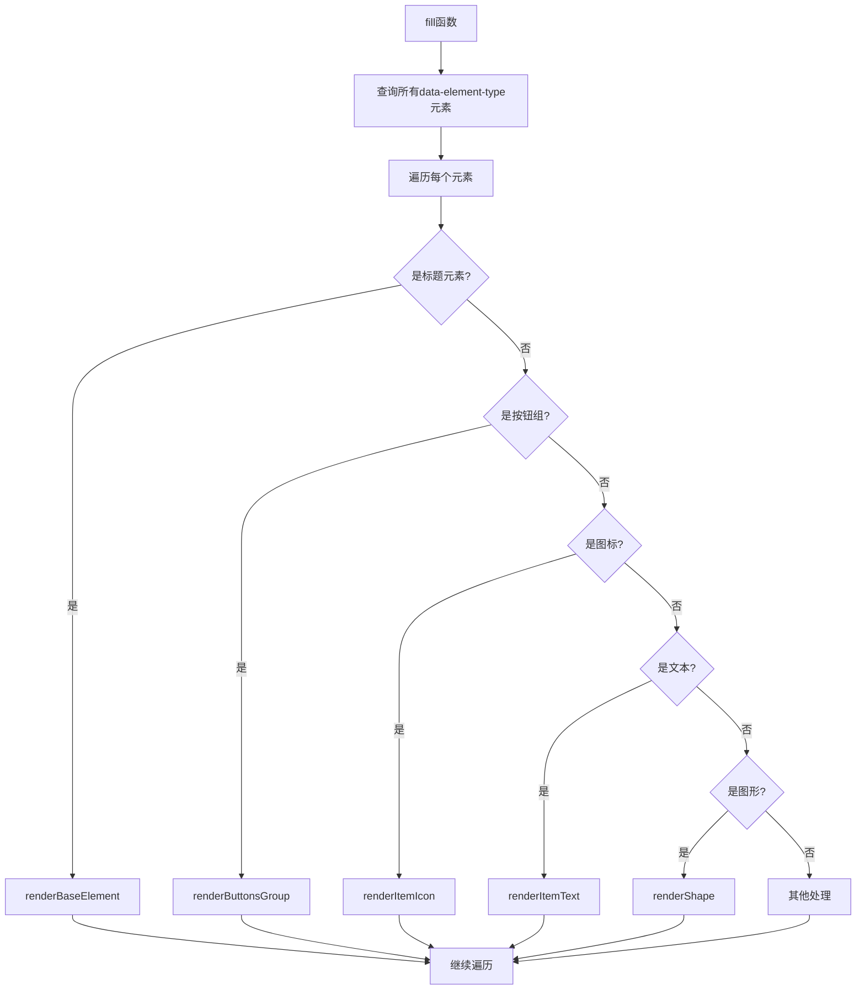
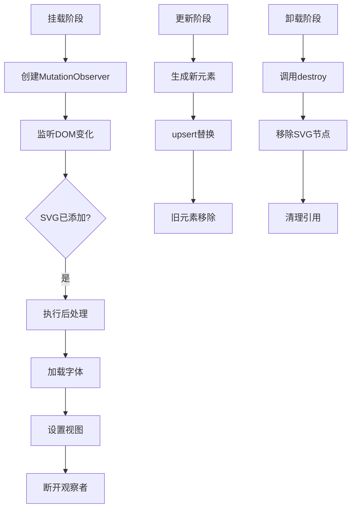
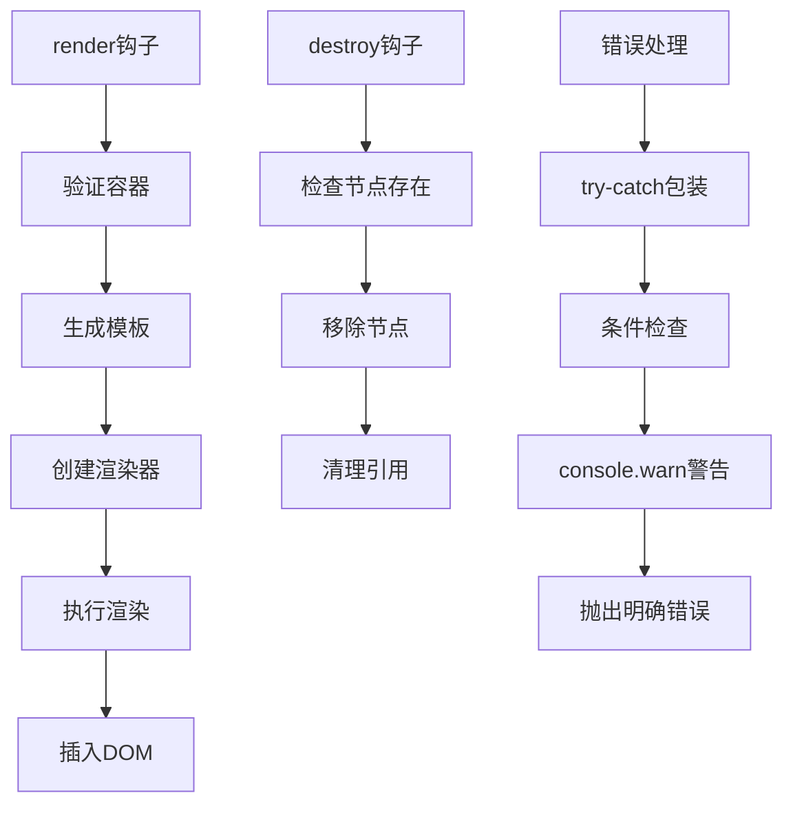

# 渲染流程

<cite>
**本文档中引用的文件**  
- [Infographic.tsx](file://src/runtime/Infographic.tsx)
- [renderer.ts](file://src/renderer/renderer.ts)
- [renderer.ts](file://src/jsx/renderer.ts)
- [context.ts](file://src/jsx/utils/context.ts)
- [button.ts](file://src/renderer/composites/button.ts)
- [text.ts](file://src/renderer/composites/text.ts)
- [shape.ts](file://src/renderer/composites/shape.ts)
- [icon.ts](file://src/renderer/composites/icon.ts)
- [illus.ts](file://src/renderer/composites/illus.ts)
</cite>

## 目录
1. [初始化与渲染器创建](#初始化与渲染器创建)
2. [JSX元素树解析与渲染树构建](#jsx元素树解析与渲染树构建)
3. [渲染上下文管理](#渲染上下文管理)
4. [元素属性处理](#元素属性处理)
5. [渲染遍历与复合组件调用](#渲染遍历与复合组件调用)
6. [挂载、更新与卸载流程](#挂载更新与卸载流程)
7. [生命周期钩子与错误边界](#生命周期钩子与错误边界)

## 初始化与渲染器创建

Infographic组件通过`render`方法初始化渲染流程。该方法首先调用`compose`方法生成SVG模板，然后创建Renderer实例并执行渲染。Renderer构造函数接收解析后的选项和SVG模板作为参数，在首次渲染时执行模板填充和后处理逻辑。

**Diagram sources**  
- [Infographic.tsx](file://src/runtime/Infographic.tsx#L27-L34)
- [renderer.ts](file://src/renderer/renderer.ts#L59-L89)

**Section sources**
- [Infographic.tsx](file://src/runtime/Infographic.tsx#L15-L34)
- [renderer.ts](file://src/renderer/renderer.ts#L43-L89)

## JSX元素树解析与渲染树构建

JSX元素树的解析通过`renderSVG`函数启动，该函数位于`src/jsx/renderer.ts`文件中。解析过程首先创建默认渲染上下文，然后调用`processElement`函数对JSX元素树进行预处理。预处理阶段会递归遍历元素树，处理布局组件、函数组件和Fragment等特殊元素类型。

对于布局组件，系统通过`isLayoutComponent`检查并调用`performLayout`进行布局计算。函数组件则通过直接调用组件函数获取渲染结果。Fragment元素会被展开为其子元素集合。预处理完成后，原始JSX树被转换为可渲染的元素树。

**Diagram sources**  
- [renderer.ts](file://src/jsx/renderer.ts#L115-L124)
- [layout.ts](file://src/jsx/layout.ts#L39-L55)

**Section sources**
- [renderer.ts](file://src/jsx/renderer.ts#L17-L65)
- [layout.ts](file://src/jsx/layout.ts#L27-L55)

## 渲染上下文管理

渲染上下文（RenderContext）在`src/jsx/utils/context.ts`中定义，通过`createDefaultContext`函数创建。上下文对象包含一个Map类型的defs属性，用于收集和管理SVG的定义元素（如渐变、符号等）。在预处理阶段，当遇到DefsSymbol类型的元素时，其子元素会根据id被存储到上下文的defs映射中。

上下文在渲染过程中贯穿始终，确保定义元素能够在最终SVG输出中正确引用。这种机制允许在JSX中声明可重用的SVG资源，并在需要时通过引用id来使用。上下文的生命周期与单次渲染过程绑定，每次调用renderSVG都会创建新的上下文实例。

**Diagram sources**  
- [context.ts](file://src/jsx/utils/context.ts#L3-L5)
- [renderer.ts](file://src/jsx/renderer.ts#L50-L58)

**Section sources**
- [context.ts](file://src/jsx/utils/context.ts#L1-L5)
- [renderer.ts](file://src/jsx/renderer.ts#L50-L58)

## 元素属性处理

元素属性的处理在`renderAttrs`函数中实现，该函数负责将JSX元素的props转换为SVG属性字符串。处理过程中会过滤掉undefined和null值的属性，并将React风格的属性名（如className、htmlFor）转换为对应的SVG属性名（class、for）。属性值会被适当转义以确保SVG输出的安全性。

对于样式属性，`renderStyle`函数将其转换为CSS样式字符串。样式对象中的驼峰命名属性会被转换为连字符分隔格式（如backgroundColor → background-color）。最终生成的属性字符串会被插入到SVG元素标签中，形成完整的SVG输出。

**Diagram sources**  
- [renderer.ts](file://src/jsx/renderer.ts#L157-L170)
- [renderer.ts](file://src/jsx/renderer.ts#L172-L184)

**Section sources**
- [renderer.ts](file://src/jsx/renderer.ts#L157-L184)

## 渲染遍历与复合组件调用

渲染器通过`fill`函数遍历SVG模板中的所有元素，根据元素的数据类型调用相应的复合组件进行处理。系统使用一系列isXxx类型的判断函数（如isTitle、isItemLabel等）来识别元素类型，并分发到对应的渲染函数。

对于按钮组元素，调用`renderButtonsGroup`；对于图标元素，调用`renderItemIcon`；对于文本元素，调用`renderItemText`。这些复合组件位于`src/renderer/composites/`目录下，各自负责特定类型的SVG元素生成和更新。通过`upsert`辅助函数，新生成的SVG元素会替换原有的占位元素。

**Diagram sources**  
- [renderer.ts](file://src/renderer/renderer.ts#L108-L185)
- [index.ts](file://src/renderer/composites/index.ts#L1-L8)

**Section sources**
- [renderer.ts](file://src/renderer/renderer.ts#L101-L185)

## 挂载、更新与卸载流程

渲染流程包含完整的挂载、更新和卸载阶段。挂载阶段在`render`方法中执行，通过MutationObserver监听SVG元素的添加，确保在元素插入DOM后执行字体加载和视图设置等后处理操作。更新操作通过`upsert`函数实现，该函数会用新生成的SVG元素替换旧元素。

卸载流程在Infographic实例的`destroy`方法中处理，该方法会从DOM中移除已渲染的SVG节点并清理引用。整个流程通过观察者模式确保渲染时机的正确性，避免在元素未完全加载时进行操作。

**Diagram sources**  
- [renderer.ts](file://src/renderer/renderer.ts#L66-L85)
- [Infographic.tsx](file://src/runtime/Infographic.tsx#L88-L91)

**Section sources**
- [renderer.ts](file://src/renderer/renderer.ts#L66-L85)
- [Infographic.tsx](file://src/runtime/Infographic.tsx#L88-L91)

## 生命周期钩子与错误边界

Infographic类提供了明确的生命周期钩子：`render`用于初始渲染，`destroy`用于清理资源。错误处理主要通过try-catch和条件检查实现，例如在`compose`方法中，如果SVG解析失败会抛出明确的错误信息。

系统通过`console.warn`输出未处理组件的警告信息，帮助开发者发现潜在问题。虽然没有实现传统的错误边界机制，但关键操作都有适当的错误检查，如SVG解析失败时的错误抛出，确保系统的健壮性。

**Diagram sources**  
- [Infographic.tsx](file://src/runtime/Infographic.tsx#L27-L34)
- [Infographic.tsx](file://src/runtime/Infographic.tsx#L88-L91)
- [renderer.ts](file://src/jsx/renderer.ts#L96-L97)

**Section sources**
- [Infographic.tsx](file://src/runtime/Infographic.tsx#L27-L34)
- [Infographic.tsx](file://src/runtime/Infographic.tsx#L88-L91)
- [renderer.ts](file://src/jsx/renderer.ts#L96-L97)