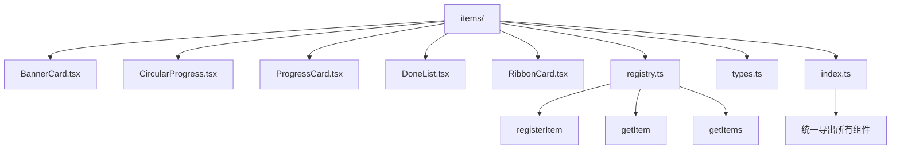
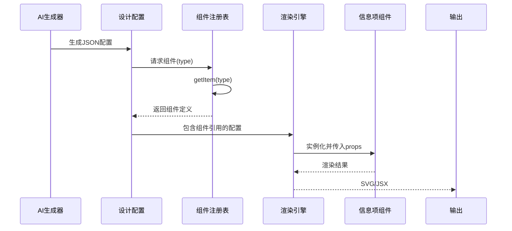
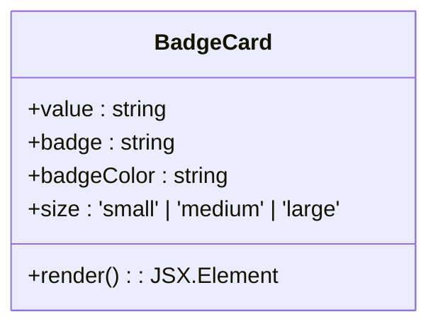
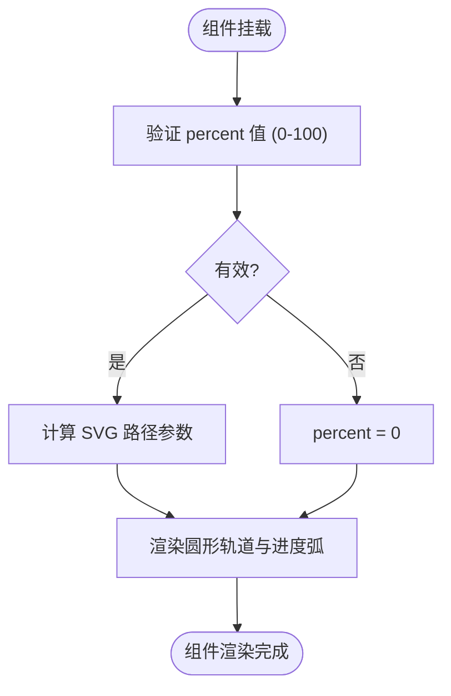

# 信息项组件

<cite>
**本文档中引用的文件**  
- [BadgeCard.tsx](file://antv_infographic/infographic/src/designs/items/BadgeCard.tsx)
- [CircularProgress.tsx](file://antv_infographic/infographic/src/designs/items/CircularProgress.tsx)
- [ProgressCard.tsx](file://antv_infographic/infographic/src/designs/items/ProgressCard.tsx)
- [DoneList.tsx](file://antv_infographic/infographic/src/designs/items/DoneList.tsx)
- [RibbonCard.tsx](file://antv_infographic/infographic/src/designs/items/RibbonCard.tsx)
- [registry.ts](file://antv_infographic/infographic/src/designs/items/registry.ts)
- [types.ts](file://antv_infographic/infographic/src/designs/types.ts)
- [prompt.md](file://antv_infographic/infographic/src/designs/items/prompt.md)
</cite>

## 目录
1. [介绍](#介绍)
2. [项目结构](#项目结构)
3. [核心组件](#核心组件)
4. [架构概述](#架构概述)
5. [详细组件分析](#详细组件分析)
6. [依赖分析](#依赖分析)
7. [性能考虑](#性能考虑)
8. [故障排除指南](#故障排除指南)
9. [结论](#结论)

## 介绍
本文档详细说明了信息项组件的设计与实现，这些组件专用于数据可视化场景，包括进度条、徽章、卡片列表等。重点分析了 `BadgeCard`、`CircularProgress`、`ProgressCard`、`DoneList` 和 `RibbonCard` 等组件如何封装特定的数据展示逻辑，并探讨其属性接口、数据绑定方式、状态管理机制及其在信息图中的语义作用。同时，深入解析 `registry.ts` 中的组件注册机制和 `types.ts` 中的类型定义如何支持动态加载与类型安全。结合 `prompt.md` 的设计意图，解释这些组件如何响应 AI 生成的数据结构，并提供组合使用的示例。

## 项目结构
信息项组件位于 `antv_infographic/infographic/src/designs/items/` 目录下，采用模块化组织方式，每个组件独立为 `.tsx` 文件，并通过 `index.ts` 统一导出。该目录还包含 `registry.ts`（组件注册中心）和 `types.ts`（类型定义），共同构成组件系统的基础设施。



**Diagram sources**  
- [BadgeCard.tsx](file://antv_infographic/infographic/src/designs/items/BadgeCard.tsx)
- [CircularProgress.tsx](file://antv_infographic/infographic/src/designs/items/CircularProgress.tsx)
- [ProgressCard.tsx](file://antv_infographic/infographic/src/designs/items/ProgressCard.tsx)
- [DoneList.tsx](file://antv_infographic/infographic/src/designs/items/DoneList.tsx)
- [RibbonCard.tsx](file://antv_infographic/infographic/src/designs/items/RibbonCard.tsx)
- [registry.ts](file://antv_infographic/infographic/src/designs/items/registry.ts)
- [types.ts](file://antv_infographic/infographic/src/designs/types.ts)

**Section sources**  
- [index.ts](file://antv_infographic/infographic/src/designs/items/index.ts)

## 核心组件
本节概述关键信息项组件的功能定位与设计目标。这些组件均基于 React 函数式组件构建，利用 TypeScript 提供强类型支持，确保在复杂信息图场景下的类型安全与可维护性。各组件通过标准化的属性接口接收数据与配置，实现一致的使用模式。

**Section sources**  
- [BadgeCard.tsx](file://antv_infographic/infographic/src/designs/items/BadgeCard.tsx)
- [CircularProgress.tsx](file://antv_infographic/infographic/src/designs/items/CircularProgress.tsx)
- [ProgressCard.tsx](file://antv_infographic/infographic/src/designs/items/ProgressCard.tsx)
- [DoneList.tsx](file://antv_infographic/infographic/src/designs/items/DoneList.tsx)
- [RibbonCard.tsx](file://antv_infographic/infographic/src/designs/items/RibbonCard.tsx)

## 架构概述
信息项组件系统采用注册-解析-渲染的三层架构。首先，组件通过 `registerItem` 注册到全局注册表；其次，设计配置通过 `getItem` 动态解析为具体组件；最后，渲染引擎将组件与数据结合进行输出。此架构支持动态加载和按需渲染，适应 AI 生成的多样化数据结构。



**Diagram sources**  
- [registry.ts](file://antv_infographic/infographic/src/designs/items/registry.ts)
- [types.ts](file://antv_infographic/infographic/src/designs/types.ts)

## 详细组件分析
本节深入分析各信息项组件的实现细节、数据绑定方式及语义作用。

### BadgeCard 分析
`BadgeCard` 组件用于展示带有徽章标识的数据项，常用于突出关键指标或状态标签。它通过 `value` 和 `badge` 属性分别绑定主数据和徽章内容，支持自定义徽章颜色与样式。

#### 组件属性接口


**Diagram sources**  
- [BadgeCard.tsx](file://antv_infographic/infographic/src/designs/items/BadgeCard.tsx)

**Section sources**  
- [BadgeCard.tsx](file://antv_infographic/infographic/src/designs/items/BadgeCard.tsx)

### CircularProgress 分析
`CircularProgress` 组件实现环形进度条，直观展示完成度或比例数据。它通过 `percent` 属性接收 0-100 的数值，并动态计算 SVG 路径以渲染进度弧线。

#### 数据绑定与状态管理


**Diagram sources**  
- [CircularProgress.tsx](file://antv_infographic/infographic/src/designs/items/CircularProgress.tsx)

**Section sources**  
- [CircularProgress.tsx](file://antv_infographic/infographic/src/designs/items/CircularProgress.tsx)

### ProgressCard 分析
`ProgressCard` 是一个复合组件，结合了文本标签、进度条和数值显示，提供更丰富的进度信息展示。它封装了布局逻辑，确保各元素的协调排列。

**Section sources**  
- [ProgressCard.tsx](file://antv_infographic/infographic/src/designs/items/ProgressCard.tsx)

### DoneList 分析
`DoneList` 组件用于展示已完成任务的列表，通常包含复选标记和简洁描述。它接收一个任务项数组，通过映射渲染每个完成项，强调成就与进展。

**Section sources**  
- [DoneList.tsx](file://antv_infographic/infographic/src/designs/items/DoneList.tsx)

### RibbonCard 分析
`RibbonCard` 实现丝带式卡片布局，常用于表彰或突出显示特定内容。其设计包含倾斜的丝带装饰，通过 CSS 变换实现视觉特效。

**Section sources**  
- [RibbonCard.tsx](file://antv_infographic/infographic/src/designs/items/RibbonCard.tsx)

## 依赖分析
信息项组件系统依赖于 `types.ts` 中定义的通用接口和 `registry.ts` 提供的注册机制。组件间无直接依赖，通过注册表实现松耦合。外部依赖主要来自 `jsx` 模块的 React 类型定义。

```mermaid
dependency-graph
"types.ts" --> "BadgeCard.tsx"
"types.ts" --> "CircularProgress.tsx"
"types.ts" --> "ProgressCard.tsx"
"types.ts" --> "DoneList.tsx"
"types.ts" --> "RibbonCard.tsx"
"registry.ts" --> "index.ts"
"types.ts" --> "registry.ts"
"BadgeCard.tsx" --> "index.ts"
"CircularProgress.tsx" --> "index.ts"
"ProgressCard.tsx" --> "index.ts"
"DoneList.tsx" --> "index.ts"
"RibbonCard.tsx" --> "index.ts"
```

**Diagram sources**  
- [types.ts](file://antv_infographic/infographic/src/designs/types.ts)
- [registry.ts](file://antv_infographic/infographic/src/designs/items/registry.ts)
- [index.ts](file://antv_infographic/infographic/src/designs/items/index.ts)

## 性能考虑
组件采用函数式编程与不可变数据模式，配合 React 的虚拟 DOM 机制，确保渲染效率。`CircularProgress` 等动画组件使用 `requestAnimationFrame` 优化动画流畅度。注册表使用 `Map` 结构保证组件查找的 O(1) 时间复杂度。

## 故障排除指南
当组件未正确渲染时，请检查：1) 组件是否已通过 `registerItem` 正确注册；2) 传递的 `type` 字符串是否与注册名称完全匹配；3) 必需的属性（如 `value`、`percent`）是否已提供且类型正确。可利用 `getItems()` 列出所有已注册组件进行调试。

**Section sources**  
- [registry.ts](file://antv_infographic/infographic/src/designs/items/registry.ts)

## 结论
信息项组件系统通过模块化设计、类型安全和动态注册机制，为信息图提供了灵活而强大的数据可视化能力。各组件封装了特定的展示逻辑，既可独立使用，也能组合构建复杂的信息展示界面。该架构特别适合响应 AI 生成的动态数据结构，是实现智能可视化的核心基础。