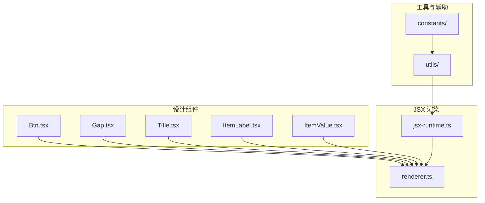
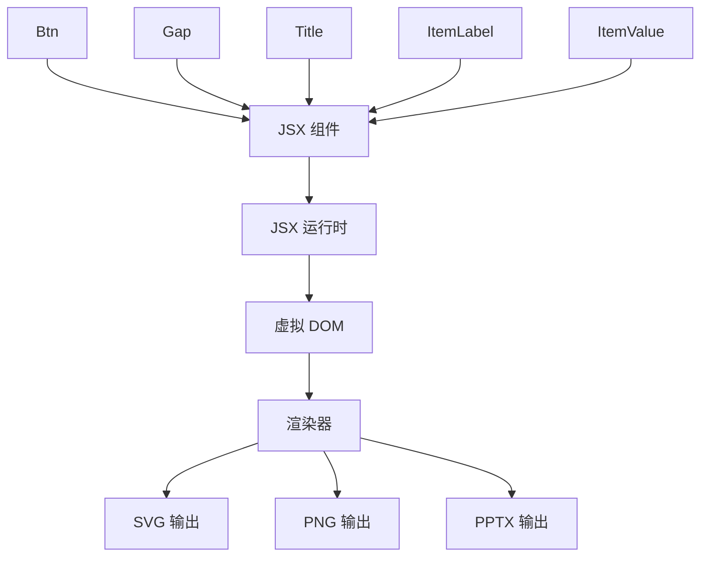
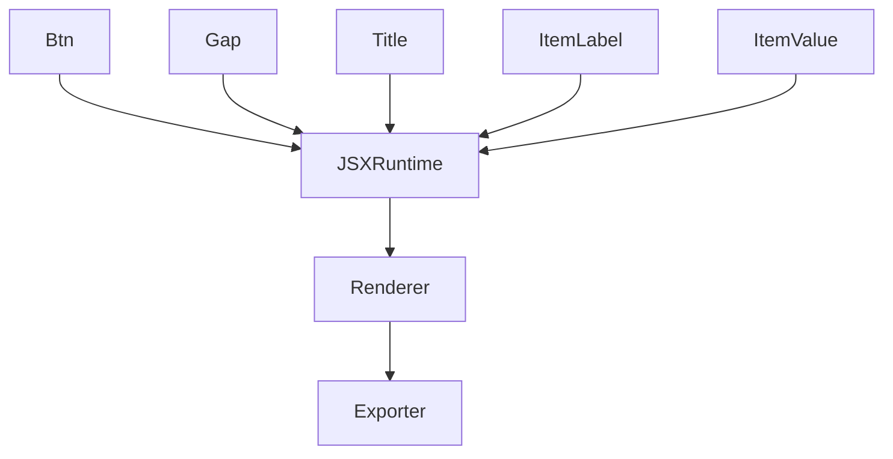

# 基础组件

<cite>
**本文档中引用的文件**  
- [Btn.tsx](file://antv_infographic/infographic/src/designs/components/Btn.tsx)
- [Gap.tsx](file://antv_infographic/infographic/src/designs/components/Gap.tsx)
- [Title.tsx](file://antv_infographic/infographic/src/designs/components/Title.tsx)
- [ItemLabel.tsx](file://antv_infographic/infographic/src/designs/components/ItemLabel.tsx)
- [ItemValue.tsx](file://antv_infographic/infographic/src/designs/components/ItemValue.tsx)
- [jsx-runtime.ts](file://antv_infographic/infographic/src/jsx/jsx-runtime.ts)
- [renderer.ts](file://antv_infographic/infographic/src/jsx/renderer.ts)
</cite>

## 目录
1. [简介](#简介)
2. [项目结构](#项目结构)
3. [核心组件](#核心组件)
4. [架构概述](#架构概述)
5. [详细组件分析](#详细组件分析)
6. [依赖分析](#依赖分析)
7. [性能考虑](#性能考虑)
8. [故障排除指南](#故障排除指南)
9. [结论](#结论)

## 简介
本文档详细描述了 AntV Infographic 中的基础 UI 组件，包括按钮（Btn）、间隙（Gap）、标题（Title）、标签（ItemLabel）和数值（ItemValue）等。这些组件是构建信息图可视化元素的基本构建块，通过 JSX 渲染机制实现高效的 UI 构建。文档将解释每个组件的用途、属性定义、样式定制方式及事件处理机制，并提供在信息图中的典型使用场景。

## 项目结构
AntV Infographic 项目采用模块化设计，基础组件主要位于 `src/designs/components` 目录下。JSX 渲染相关逻辑位于 `src/jsx` 目录，包含运行时和渲染器实现。项目结构清晰地分离了设计组件、渲染逻辑和工具函数，便于维护和扩展。

**Diagram sources**
- [Btn.tsx](file://antv_infographic/infographic/src/designs/components/Btn.tsx)
- [Gap.tsx](file://antv_infographic/infographic/src/designs/components/Gap.tsx)
- [Title.tsx](file://antv_infographic/infographic/src/designs/components/Title.tsx)
- [ItemLabel.tsx](file://antv_infographic/infographic/src/designs/components/ItemLabel.tsx)
- [ItemValue.tsx](file://antv_infographic/infographic/src/designs/components/ItemValue.tsx)
- [jsx-runtime.ts](file://antv_infographic/infographic/src/jsx/jsx-runtime.ts)
- [renderer.ts](file://antv_infographic/infographic/src/jsx/renderer.ts)

**Section sources**
- [Btn.tsx](file://antv_infographic/infographic/src/designs/components/Btn.tsx)
- [Gap.tsx](file://antv_infographic/infographic/src/designs/components/Gap.tsx)
- [Title.tsx](file://antv_infographic/infographic/src/designs/components/Title.tsx)
- [ItemLabel.tsx](file://antv_infographic/infographic/src/designs/components/ItemLabel.tsx)
- [ItemValue.tsx](file://antv_infographic/infographic/src/designs/components/ItemValue.tsx)

## 核心组件
AntV Infographic 的基础 UI 组件提供了构建信息图所需的基本元素。这些组件通过 JSX 语法声明式地定义 UI，然后由底层渲染器转换为 SVG 或其他输出格式。每个组件都设计为高度可定制，支持样式覆盖和事件处理，以满足多样化的可视化需求。

**Section sources**
- [Btn.tsx](file://antv_infographic/infographic/src/designs/components/Btn.tsx)
- [Gap.tsx](file://antv_infographic/infographic/src/designs/components/Gap.tsx)
- [Title.tsx](file://antv_infographic/infographic/src/designs/components/Title.tsx)
- [ItemLabel.tsx](file://antv_infographic/infographic/src/designs/components/ItemLabel.tsx)
- [ItemValue.tsx](file://antv_infographic/infographic/src/designs/components/ItemValue.tsx)

## 架构概述
AntV Infographic 的架构基于 JSX 渲染机制，将声明式的 UI 组件转换为可视化输出。基础组件作为叶子节点，通过组合形成复杂的可视化结构。JSX 运行时负责解析组件树，渲染器则将其转换为最终的图形表示。

**Diagram sources**
- [jsx-runtime.ts](file://antv_infographic/infographic/src/jsx/jsx-runtime.ts)
- [renderer.ts](file://antv_infographic/infographic/src/jsx/renderer.ts)

## 详细组件分析
本节详细分析每个基础组件的实现细节、属性定义和使用方式。

### 按钮组件分析
按钮组件（Btn）用于创建交互式控件，支持点击事件和多种视觉状态。

#### 组件属性
- `text`: 按钮显示文本
- `onClick`: 点击事件处理器
- `variant`: 按钮变体（主要、次要、危险等）
- `disabled`: 是否禁用状态

#### 样式定制
通过 CSS 类和内联样式支持外观定制，可调整颜色、边框、圆角等视觉属性。

**Section sources**
- [Btn.tsx](file://antv_infographic/infographic/src/designs/components/Btn.tsx)

### 间隙组件分析
间隙组件（Gap）用于在布局中创建空白间隔，支持灵活的尺寸控制。

#### 组件属性
- `size`: 间隙大小（小、中、大）
- `direction`: 间隙方向（水平、垂直）
- `flex`: 是否使用弹性布局

**Section sources**
- [Gap.tsx](file://antv_infographic/infographic/src/designs/components/Gap.tsx)

### 标题组件分析
标题组件（Title）用于展示章节标题和重要文本。

#### 组件属性
- `level`: 标题层级（1-6）
- `text`: 标题文本内容
- `align`: 文本对齐方式
- `color`: 文本颜色

**Section sources**
- [Title.tsx](file://antv_infographic/infographic/src/designs/components/Title.tsx)

### 标签组件分析
标签组件（ItemLabel）用于标识数据项的名称或类别。

#### 组件属性
- `text`: 标签文本
- `size`: 标签大小
- `color`: 标签颜色
- `icon`: 可选图标

**Section sources**
- [ItemLabel.tsx](file://antv_infographic/infographic/src/designs/components/ItemLabel.tsx)

### 数值组件分析
数值组件（ItemValue）用于展示关键数据指标。

#### 组件属性
- `value`: 数值内容
- `format`: 数值格式化方式
- `unit`: 单位后缀
- `trend`: 趋势指示（上升、下降）

**Section sources**
- [ItemValue.tsx](file://antv_infographic/infographic/src/designs/components/ItemValue.tsx)

## 依赖分析
基础组件依赖于 JSX 运行时和渲染器来实现 UI 渲染。组件之间通过标准的 React 式组合机制相互关联，形成复杂的可视化结构。

**Diagram sources**
- [jsx-runtime.ts](file://antv_infographic/infographic/src/jsx/jsx-runtime.ts)
- [renderer.ts](file://antv_infographic/infographic/src/jsx/renderer.ts)

**Section sources**
- [jsx-runtime.ts](file://antv_infographic/infographic/src/jsx/jsx-runtime.ts)
- [renderer.ts](file://antv_infographic/infographic/src/jsx/renderer.ts)

## 性能考虑
基础组件设计时考虑了渲染性能，通过虚拟 DOM 和高效的更新机制确保流畅的用户体验。建议在大量数据渲染时使用虚拟滚动等优化技术。

## 故障排除指南
当组件渲染出现问题时，首先检查 JSX 语法是否正确，然后验证组件属性是否符合类型定义。对于样式问题，检查 CSS 类名和内联样式的优先级。

**Section sources**
- [jsx-runtime.ts](file://antv_infographic/infographic/src/jsx/jsx-runtime.ts)
- [renderer.ts](file://antv_infographic/infographic/src/jsx/renderer.ts)

## 结论
AntV Infographic 的基础组件提供了构建信息图的强大基础。通过理解这些组件的属性和行为，开发者可以有效地创建各种可视化效果。组件的模块化设计和 JSX 驱动的渲染机制使得开发过程既灵活又高效。