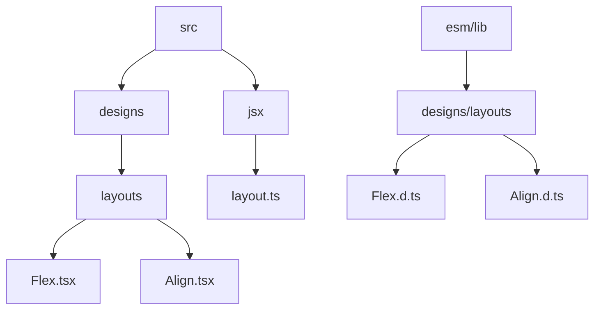
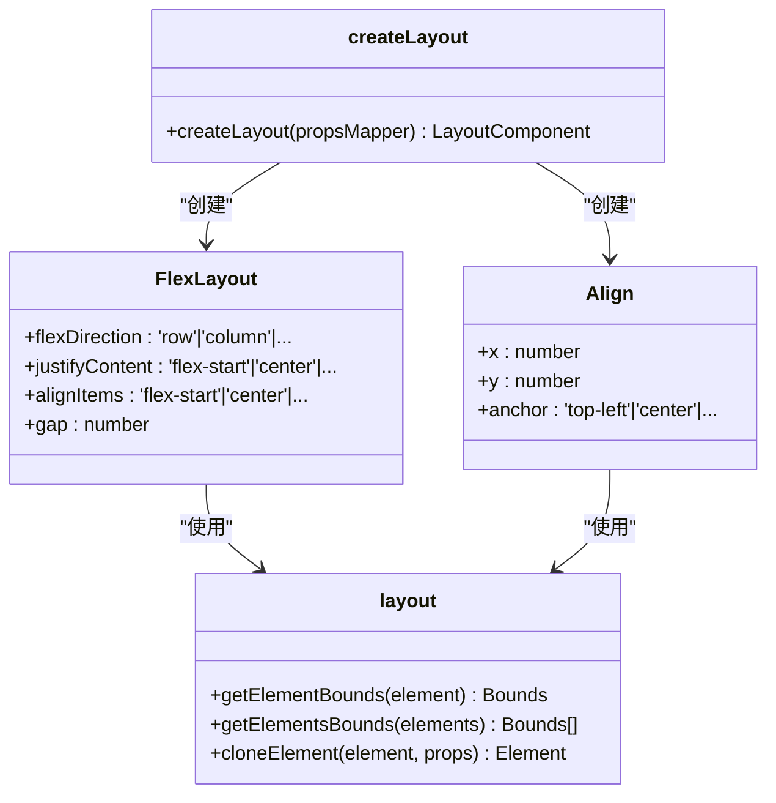
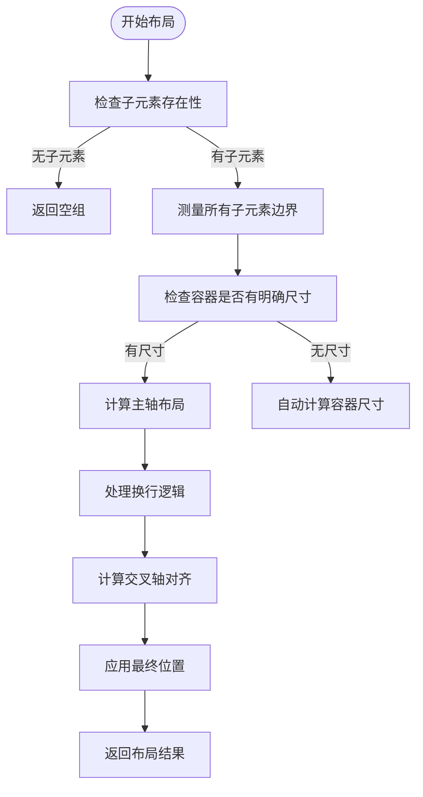
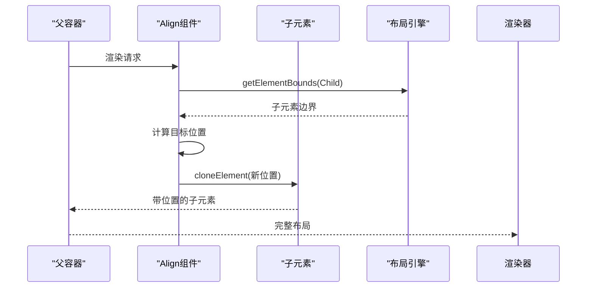
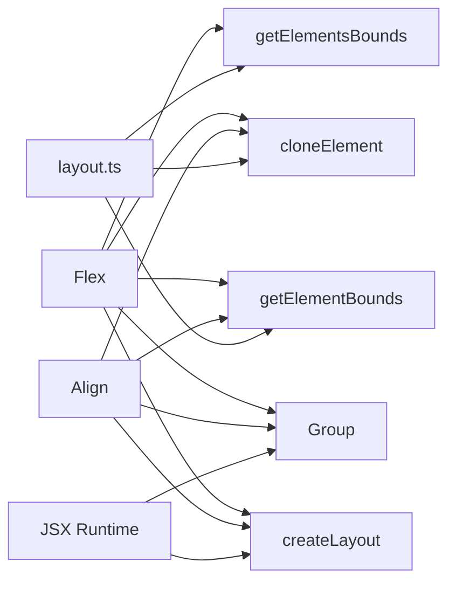

# 布局组件

<cite>
**本文档中引用的文件**  
- [Flex.tsx](file://antv_infographic/infographic/src/designs/layouts/Flex.tsx)
- [Align.tsx](file://antv_infographic/infographic/src/designs/layouts/Align.tsx)
- [layout.ts](file://antv_infographic/infographic/src/jsx/layout.ts)
- [Flex.d.ts](file://antv_infographic/infographic/lib/designs/layouts/Flex.d.ts)
- [Align.d.ts](file://antv_infographic/infographic/lib/designs/layouts/Align.d.ts)
</cite>

## 目录
1. [简介](#简介)
2. [项目结构](#项目结构)
3. [核心组件](#核心组件)
4. [架构概述](#架构概述)
5. [详细组件分析](#详细组件分析)
6. [依赖分析](#依赖分析)
7. [性能考虑](#性能考虑)
8. [故障排除指南](#故障排除指南)
9. [结论](#结论)

## 简介
本文档深入探讨了Flex和Align两个核心布局组件的实现原理与使用方法。文档将详细说明Flex组件如何实现弹性布局，支持水平和垂直方向的内容排列、对齐方式和间距控制；解释Align组件如何实现精准的对齐定位功能。结合jsx/layout.ts中的布局计算逻辑，分析组件如何响应式地处理子元素的尺寸和位置。提供多层级嵌套布局的示例，展示如何构建复杂的信息图结构。讨论布局性能优化策略和常见布局问题的解决方案。

## 项目结构
该项目采用分层架构设计，主要分为源码(src)、编译后代码(esm/lib)和测试(__tests__)三大目录。布局组件位于src/designs/layouts目录下，包含Flex和Align两个核心组件。这些组件通过JSX运行时系统进行渲染，并依赖于jsx/layout.ts中的布局计算逻辑。

**Diagram sources**
- [Flex.tsx](file://antv_infographic/infographic/src/designs/layouts/Flex.tsx)
- [Align.tsx](file://antv_infographic/infographic/src/designs/layouts/Align.tsx)
- [layout.ts](file://antv_infographic/infographic/src/jsx/layout.ts)

**Section sources**
- [Flex.tsx](file://antv_infographic/infographic/src/designs/layouts/Flex.tsx)
- [Align.tsx](file://antv_infographic/infographic/src/designs/layouts/Align.tsx)

## 核心组件
Flex和Align是本项目中的两个核心布局组件。Flex组件实现了类似CSS Flexbox的弹性布局系统，支持多种排列方向、对齐方式和间距控制。Align组件则专注于精确的对齐和定位功能，允许子元素在容器内进行精确定位。

**Section sources**
- [Flex.tsx](file://antv_infographic/infographic/src/designs/layouts/Flex.tsx)
- [Align.tsx](file://antv_infographic/infographic/src/designs/layouts/Align.tsx)

## 架构概述
系统采用基于JSX的声明式布局架构，通过createLayout高阶函数创建布局组件。布局计算逻辑集中在jsx/layout.ts中，提供getElementBounds、getElementsBounds等核心函数用于测量元素尺寸。Flex和Align组件作为布局容器，接收子元素并根据布局规则重新定位。

**Diagram sources**
- [layout.ts](file://antv_infographic/infographic/src/jsx/layout.ts)
- [Flex.tsx](file://antv_infographic/infographic/src/designs/layouts/Flex.tsx)
- [Align.tsx](file://antv_infographic/infographic/src/designs/layouts/Align.tsx)

## 详细组件分析

### Flex组件分析
Flex组件实现了完整的弹性布局系统，支持行/列方向排列、主轴和交叉轴对齐、换行和间距控制等功能。

#### 弹性布局实现

**Diagram sources**
- [Flex.tsx](file://antv_infographic/infographic/src/designs/layouts/Flex.tsx)

#### 属性配置
Flex组件支持以下关键属性：

| 属性 | 类型 | 默认值 | 描述 |
|------|------|--------|------|
| flexDirection | 'row'&#124;'column'&#124;'row-reverse'&#124;'column-reverse' | 'row' | 主轴方向 |
| justifyContent | 'flex-start'&#124;'flex-end'&#124;'center'&#124;'space-between' | 'flex-start' | 主轴对齐方式 |
| alignItems | 'flex-start'&#124;'flex-end'&#124;'center' | 'flex-start' | 交叉轴对齐方式 |
| alignContent | 'flex-start'&#124;'flex-end'&#124;'center'&#124;'space-between' | 'flex-start' | 多行对齐方式 |
| flexWrap | 'wrap'&#124;'nowrap' | 'nowrap' | 是否换行 |
| gap | number | 0 | 子元素间距 |

**Section sources**
- [Flex.tsx](file://antv_infographic/infographic/src/designs/layouts/Flex.tsx)

### Align组件分析
Align组件提供精确的定位能力，允许子元素相对于容器进行精确定位。

#### 对齐定位实现

**Diagram sources**
- [Align.tsx](file://antv_infographic/infographic/src/designs/layouts/Align.tsx)

## 依赖分析
布局组件依赖于JSX运行时系统的核心功能，包括元素克隆、边界测量和组容器。

**Diagram sources**
- [layout.ts](file://antv_infographic/infographic/src/jsx/layout.ts)
- [Flex.tsx](file://antv_infographic/infographic/src/designs/layouts/Flex.tsx)
- [Align.tsx](file://antv_infographic/infographic/src/designs/layouts/Align.tsx)

**Section sources**
- [layout.ts](file://antv_infographic/infographic/src/jsx/layout.ts)

## 性能考虑
布局计算是性能关键路径，需要注意以下优化策略：
- 避免在布局过程中进行不必要的边界测量
- 对于静态布局，考虑缓存布局结果
- 减少嵌套层级过深的布局结构
- 合理使用gap属性替代多个空白元素

## 故障排除指南
常见布局问题及解决方案：
- 子元素未正确对齐：检查alignItems和justifyContent属性设置
- 换行失效：确保设置了flexWrap='wrap'并有足够的容器宽度
- 位置偏移：检查gap属性值是否过大
- 尺寸计算异常：确保子元素有明确的尺寸或内容

**Section sources**
- [Flex.tsx](file://antv_infographic/infographic/src/designs/layouts/Flex.tsx)
- [Align.tsx](file://antv_infographic/infographic/src/designs/layouts/Align.tsx)
- [layout.ts](file://antv_infographic/infographic/src/jsx/layout.ts)

## 结论
Flex和Align组件构成了信息图布局系统的核心，提供了灵活而强大的布局能力。通过理解其内部实现原理和正确使用方法，可以构建出复杂而美观的信息图结构。建议在实际使用中结合具体场景选择合适的布局策略，并注意性能优化。