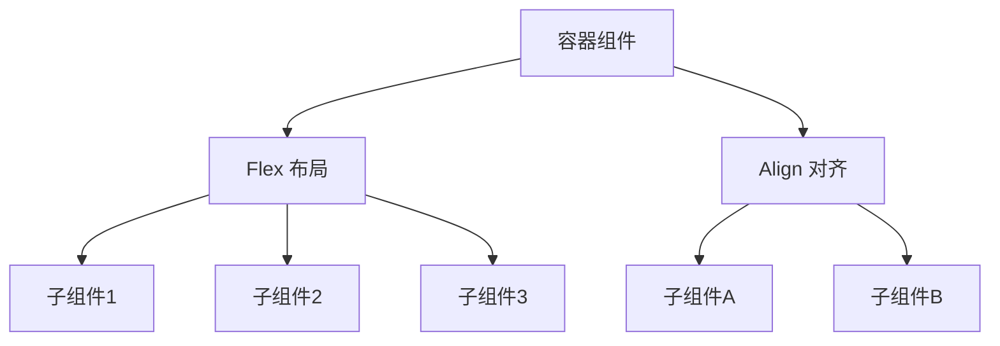
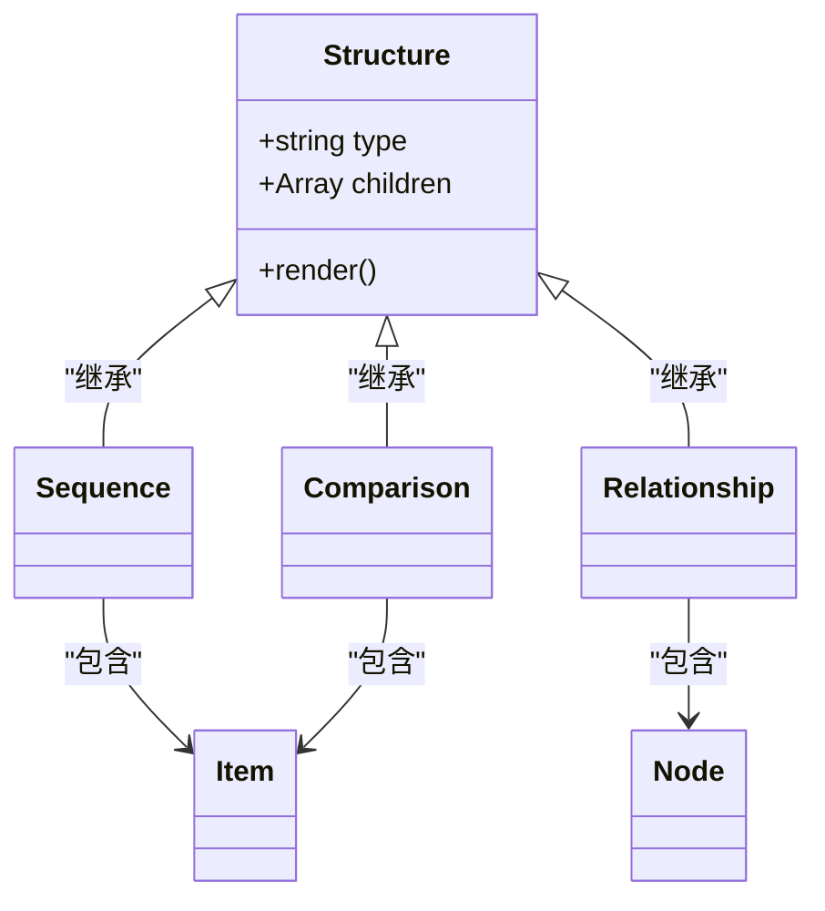
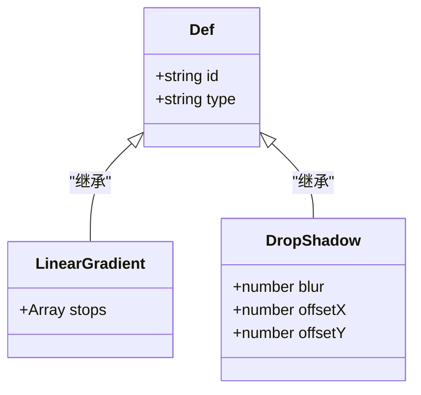

# 组件系统

<cite>
**本文档中引用的文件**  
- [Btn.tsx](file://src/jsx/components/Btn.tsx)
- [Text.ts](file://src/jsx/components/Text.ts)
- [Rect.ts](file://src/jsx/components/Rect.ts)
- [Flex.ts](file://src/designs/layouts/Flex.ts)
- [Align.ts](file://src/designs/layouts/Align.ts)
- [ItemsGroup.ts](file://src/designs/items/ItemsGroup.ts)
- [registry.ts](file://src/designs/items/registry.ts)
- [types.ts](file://src/designs/items/types.ts)
- [LinearGradient.ts](file://src/designs/defs/LinearGradient.ts)
- [DropShadow.ts](file://src/designs/defs/DropShadow.ts)
- [text-3d.ts](file://src/designs/decorations/text-3d.ts)
- [simple-arrow.ts](file://src/designs/decorations/simple-arrow.ts)
- [structures/index.ts](file://src/designs/structures/index.ts)
</cite>

## 目录
1. [简介](#简介)
2. [基础组件](#基础组件)
3. [信息项组件](#信息项组件)
4. [布局组件](#布局组件)
5. [结构组件](#结构组件)
6. [装饰组件](#装饰组件)
7. [定义组件](#定义组件)
8. [组件注册与类型系统](#组件注册与类型系统)
9. [组件嵌套与数据传递](#组件嵌套与数据传递)

## 简介
AntV Infographic 是一个用于创建信息图的可视化框架，其核心是基于组件化的系统设计。该系统通过分层的组件分类体系，支持从基础图形到复杂信息结构的灵活构建。本文档详细阐述其组件系统架构，包括基础、信息项、布局、结构、装饰和定义六大类组件，以及组件注册机制和类型定义。

## 基础组件
基础组件是构建信息图的最小可视化单元，提供基本的图形和文本能力。

### 按钮组件 (Btn)
`Btn` 组件用于创建可交互的按钮元素，支持文本、图标和状态样式配置，常用于信息图中的操作入口。

### 文本组件 (Text)
`Text` 组件用于渲染文本内容，支持字体、颜色、对齐方式等样式属性，是信息展示的核心组件之一。

### 矩形组件 (Rect)
`Rect` 组件用于绘制矩形图形，可作为背景、卡片容器或装饰元素，支持圆角、填充色和边框等属性。

**组件来源**
- [Btn.tsx](file://src/jsx/components/Btn.tsx)
- [Text.ts](file://src/jsx/components/Text.ts)
- [Rect.ts](file://src/jsx/components/Rect.ts)

## 信息项组件
信息项组件（Items）是数据可视化的基本单元，用于封装和展示具体的数据内容。

### ItemsGroup 组件
`ItemsGroup` 组件用于组织多个信息项，支持统一的布局和样式配置，便于批量处理相似数据。

### 数据绑定机制
信息项组件通过属性绑定接收数据，支持动态更新和条件渲染，实现数据驱动的可视化表达。

**组件来源**
- [ItemsGroup.ts](file://src/designs/items/ItemsGroup.ts)
- [types.ts](file://src/designs/items/types.ts)

## 布局组件
布局组件提供灵活的容器布局能力，控制子组件的排列方式和空间分配。

### Flex 布局
`Flex` 组件实现弹性布局，支持水平或垂直方向的子元素排列，可通过 `direction`、`gap` 等属性控制布局行为。

### Align 对齐
`Align` 组件用于精确控制子元素的对齐方式，支持左对齐、居中、右对齐等多种模式，确保视觉一致性。

**图示来源**
- [Flex.ts](file://src/designs/layouts/Flex.ts)
- [Align.ts](file://src/designs/layouts/Align.ts)

## 结构组件
结构组件用于构建复杂的信息图结构，表达数据之间的序列、比较、关系等逻辑。

### 序列结构
用于展示时间线或流程步骤，强调顺序关系。

### 比较结构
用于对比不同数据项，突出差异和趋势。

### 关系结构
用于表达实体间的关联，如组织架构或网络拓扑。

**图示来源**
- [structures/index.ts](file://src/designs/structures/index.ts)

## 装饰组件
装饰组件用于增强信息图的视觉表现力，提升美观度和吸引力。

### 3D 文本
`text-3d` 组件为文本添加三维效果，增强视觉层次感。

### 箭头装饰
`simple-arrow` 组件提供简洁的箭头图形，用于引导视线或表示方向。

**组件来源**
- [text-3d.ts](file://src/designs/decorations/text-3d.ts)
- [simple-arrow.ts](file://src/designs/decorations/simple-arrow.ts)

## 定义组件
定义组件（Defs）用于创建可复用的视觉效果定义，如渐变和阴影。

### 线性渐变
`LinearGradient` 组件定义线性渐变填充，支持多色停止点配置。

### 投影阴影
`DropShadow` 组件定义阴影效果，可控制模糊度、偏移和颜色。

**图示来源**
- [LinearGradient.ts](file://src/designs/defs/LinearGradient.ts)
- [DropShadow.ts](file://src/designs/defs/DropShadow.ts)

## 组件注册与类型系统
AntV Infographic 通过注册机制实现组件的动态管理和扩展。

### 组件注册机制
`registry.ts` 文件实现组件注册表，支持按名称注册和查找组件，便于插件化扩展。

### 类型定义
`types.ts` 文件定义组件的接口和类型约束，确保类型安全和开发体验。

**组件来源**
- [registry.ts](file://src/designs/items/registry.ts)
- [types.ts](file://src/designs/items/types.ts)

## 组件嵌套与数据传递
组件系统支持深度嵌套，父组件可通过属性向下传递数据和配置。

### 嵌套规则
组件可作为其他组件的子元素，形成树状结构，但需遵循类型兼容性规则。

### 数据传递方式
通过 JSX 属性传递数据，支持静态值和动态表达式，实现父子组件间的数据流。

**组件来源**
- [jsx-runtime.ts](file://src/jsx/jsx-runtime.ts)
- [renderer.ts](file://src/jsx/renderer.ts)