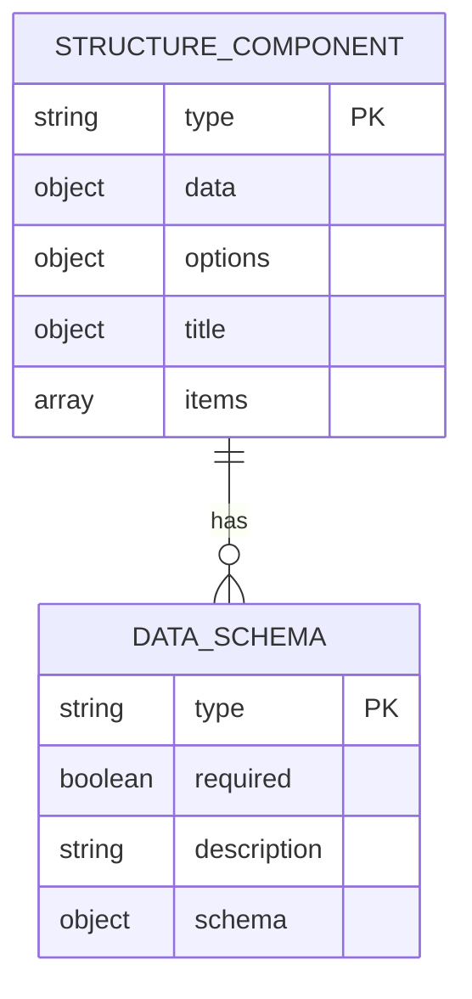
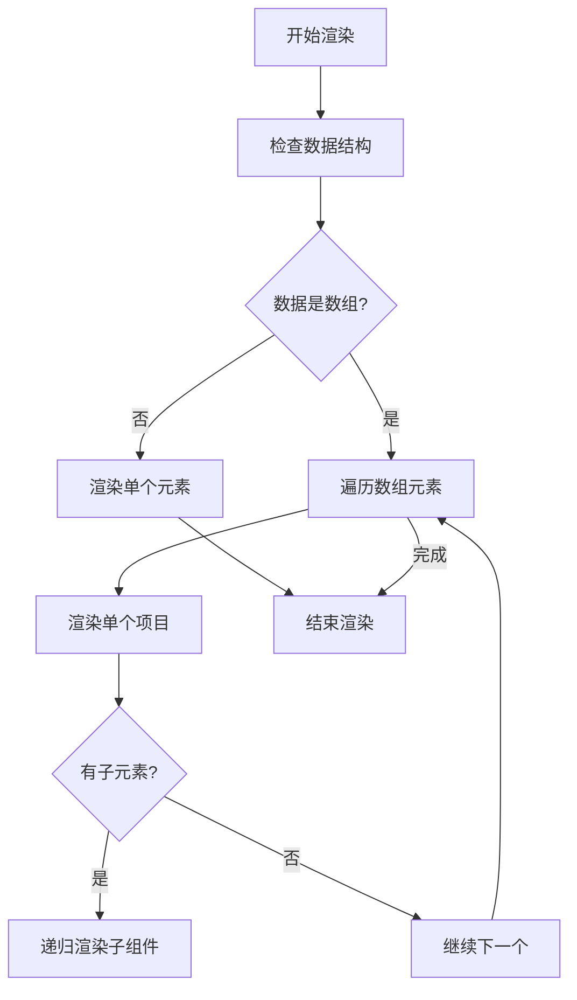
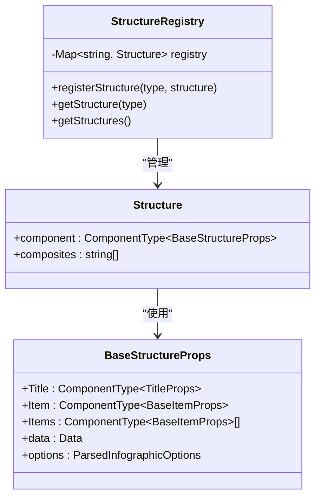
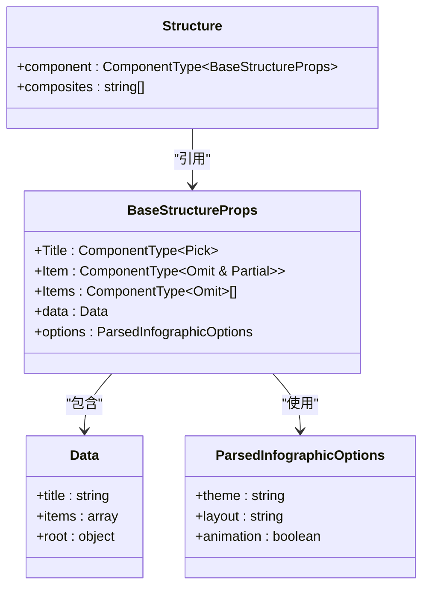

# 结构组件

<cite>
**本文档中引用的文件**  
- [registry.ts](file://antv_infographic/infographic/src/designs/structures/registry.ts)
- [types.ts](file://antv_infographic/infographic/src/designs/structures/types.ts)
- [prompt.md](file://backend/app/config/llm_prompts.yaml)
</cite>

## 目录
1. [引言](#引言)
2. [结构组件分类与适用场景](#结构组件分类与适用场景)
3. [数据结构要求与视觉表现](#数据结构要求与视觉表现)
4. [递归渲染机制与层级处理](#递归渲染机制与层级处理)
5. [动态数据绑定机制](#动态数据绑定机制)
6. [结构注册系统分析](#结构注册系统分析)
7. [复杂类型定义与数据一致性](#复杂类型定义与数据一致性)
8. [设计规范与实际应用案例](#设计规范与实际应用案例)
9. [配置技巧与最佳实践](#配置技巧与最佳实践)
10. [结论](#结论)

## 引言
本文档全面解析了信息图表系统中的结构组件体系，涵盖序列类、比较类、关系类和列表类等高级组件。通过深入分析组件的内部机制、数据结构和扩展系统，为开发者和设计者提供完整的理论基础和实践指导。文档重点阐述了结构注册系统如何支持动态扩展，以及类型系统如何确保数据一致性。

## 结构组件分类与适用场景

### 序列类组件
序列类组件用于展示具有时间或逻辑顺序的信息流。

- **sequence-timeline（标准时间轴）**：适用于历史事件、项目时间线和发展历程的展示
- **sequence-steps（步骤流程）**：适用于操作流程、任务步骤和工作流的展示
- **sequence-circular（环形流程）**：适用于生命周期、循环流程和PDCA循环的展示
- **sequence-ascending-steps（上升步骤）**：适用于成长路径、学习进阶和职业发展的展示
- **sequence-roadmap-vertical（垂直路线图）**：适用于产品路线图、项目规划和长期发展路径的展示

### 比较类组件
比较类组件用于展示两个或多个事物之间的对比关系。

- **compare-hierarchy-row（行层级对比）**：适用于分类对比、多维度对比和行式层级分析
- **compare-hierarchy-left-right（左右层级对比）**：适用于复杂对比和多层级分析
- **compare-binary-horizontal（横向二元对比）**：适用于方案选择、AB对比和优缺点分析

### 关系类组件
关系类组件用于展示实体之间的关联和网络结构。

- **relation-network（网络关系图）**：适用于复杂关系网、社交网络和依赖关系的展示
- **relation-circle（圆形关系图）**：适用于中心辐射关系、核心关联和生态系统的展示
- **hierarchy-tree（层级树）**：适用于组织架构、部门结构和团队组成的展示

### 列表类组件
列表类组件用于展示多个项目的集合。

- **list-grid（网格列表）**：适用于产品展示、团队成员和服务模块的平铺展示
- **list-pyramid（金字塔列表）**：适用于优先级展示、层级结构和组织架构的展示
- **list-waterfall（瀑布流列表）**：适用于图片展示、内容流和社交动态的自适应展示
- **list-sector（扇形列表）**：适用于服务介绍、产品分类和环形菜单的放射状展示

**Section sources**
- [generate_templates_from_structures.py](file://backend/scripts/generate_templates_from_structures.py#L44-L254)
- [templates_batch1_high_priority.json](file://archive/temp_files/templates_batch1_high_priority.json#L925-L978)
- [templates_initial.json](file://archive/temp_files/templates_initial.json#L203-L259)

## 数据结构要求与视觉表现

### 数据结构要求
各类结构组件对数据结构有特定要求：

**Diagram sources**
- [templates_initial.json](file://archive/temp_files/templates_initial.json#L208-L229)
- [collect_templates.py](file://backend/scripts/collect_templates.py#L195-L209)

### 视觉表现特征
不同类型的结构组件具有独特的视觉表现特征：

- **序列类**：强调时间轴或逻辑顺序，通常采用线性或环形布局
- **比较类**：采用对称或并列布局，突出对比关系
- **关系类**：采用网络或树状布局，展示连接关系
- **列表类**：采用网格或层级布局，便于信息浏览

**Section sources**
- [generate_templates_from_structures.py](file://backend/scripts/generate_templates_from_structures.py#L64-L254)
- [templates_batch1_high_priority.json](file://archive/temp_files/templates_batch1_high_priority.json)

## 递归渲染机制与层级处理

### 递归渲染机制
结构组件采用递归渲染机制处理嵌套数据结构：

**Diagram sources**
- [types.ts](file://antv_infographic/infographic/src/designs/structures/types.ts#L7-L16)
- [registry.ts](file://antv_infographic/infographic/src/designs/structures/registry.ts)

### 层级关系处理
层级关系处理是结构组件的核心功能之一：

- **树形结构**：通过父子节点关系构建层级
- **深度优先遍历**：确保层级顺序正确
- **层级样式继承**：子节点继承父节点的样式属性
- **动态层级展开**：支持按需加载和展开层级

**Section sources**
- [types.ts](file://antv_infographic/infographic/src/designs/structures/types.ts#L7-L26)
- [collect_templates.py](file://backend/scripts/collect_templates.py#L198-L208)

## 动态数据绑定机制
结构组件支持动态数据绑定，实现数据与视图的实时同步：

- **响应式更新**：数据变化时自动触发视图更新
- **数据验证**：在绑定前验证数据结构的完整性
- **默认值填充**：为缺失的可选字段提供默认值
- **类型转换**：确保数据类型与组件要求匹配

**Section sources**
- [types.ts](file://antv_infographic/infographic/src/designs/structures/types.ts)
- [prompt.md](file://backend/app/config/llm_prompts.yaml#L84-L88)

## 结构注册系统分析

### 注册系统架构
结构注册系统采用单例模式管理所有结构组件：

**Diagram sources**
- [registry.ts](file://antv_infographic/infographic/src/designs/structures/registry.ts#L1-L16)
- [types.ts](file://antv_infographic/infographic/src/designs/structures/types.ts#L7-L26)

### 动态扩展机制
注册系统支持动态扩展，允许运行时注册新的结构组件：

- **registerStructure**：注册新组件类型
- **getStructure**：获取已注册组件
- **getStructures**：获取所有注册组件列表
- **类型安全**：通过泛型确保类型一致性

**Section sources**
- [registry.ts](file://antv_infographic/infographic/src/designs/structures/registry.ts#L1-L16)

## 复杂类型定义与数据一致性

### 类型系统设计
类型系统确保结构组件的数据一致性：

**Diagram sources**
- [types.ts](file://antv_infographic/infographic/src/designs/structures/types.ts#L7-L26)

### 数据一致性保障
通过以下机制确保数据一致性：

- **接口定义**：明确组件属性和类型
- **泛型约束**：确保类型安全
- **编译时检查**：利用TypeScript进行静态类型检查
- **运行时验证**：在开发模式下进行额外验证

**Section sources**
- [types.ts](file://antv_infographic/infographic/src/designs/structures/types.ts#L7-L26)

## 设计规范与实际应用案例

### 设计规范
根据prompt.md中的设计规范，结构组件应遵循以下原则：

- **语义化命名**：组件类型名称应清晰表达其用途
- **一致性**：同类组件应保持视觉和交互一致性
- **可扩展性**：设计应支持未来扩展
- **性能优化**：考虑大数据量下的渲染性能

### 实际应用案例
结合具体场景的应用案例：

- **企业组织架构**：使用hierarchy-tree展示公司层级结构
- **产品发展路线图**：使用sequence-roadmap-vertical展示产品规划
- **市场竞争分析**：使用compare-hierarchy-row进行多维度对比
- **技术生态系统**：使用relation-network展示技术依赖关系

**Section sources**
- [prompt.md](file://backend/app/config/llm_prompts.yaml#L84-L88)
- [generate_templates_from_structures.py](file://backend/scripts/generate_templates_from_structures.py)

## 配置技巧与最佳实践

### 配置技巧
- **合理选择组件类型**：根据数据特征和展示需求选择最合适的组件
- **优化数据结构**：确保数据结构与组件要求匹配
- **利用默认配置**：充分利用内置的默认样式和布局
- **渐进式增强**：从基础配置开始，逐步添加高级特性

### 最佳实践
- **性能考虑**：对于大数据集，考虑分页或虚拟滚动
- **可访问性**：确保组件对所有用户都可访问
- **响应式设计**：适配不同屏幕尺寸
- **国际化支持**：考虑多语言环境下的文本处理

**Section sources**
- [prompt.md](file://backend/app/config/llm_prompts.yaml)
- [types.ts](file://antv_infographic/infographic/src/designs/structures/types.ts)

## 结论
结构组件系统通过清晰的分类、严谨的类型定义和灵活的注册机制，为信息图表的创建提供了强大而灵活的基础。递归渲染机制和动态数据绑定确保了复杂数据结构的有效展示，而注册系统则支持系统的持续扩展。遵循设计规范并应用最佳实践，可以创建出既美观又实用的信息图表。