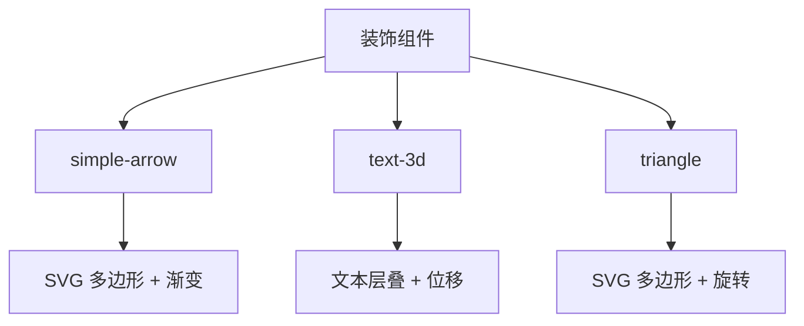
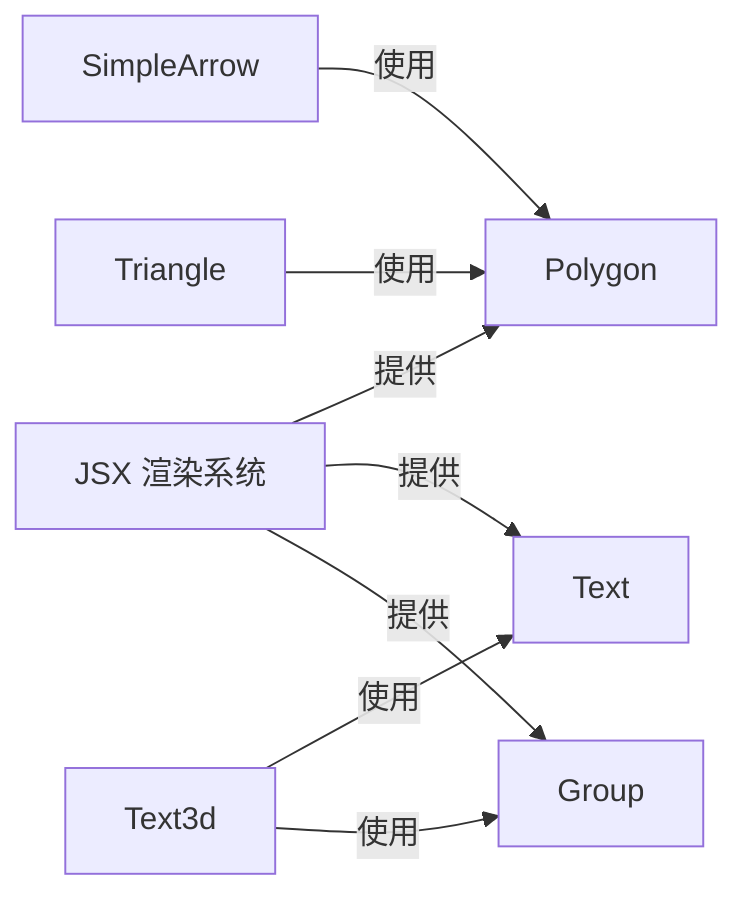
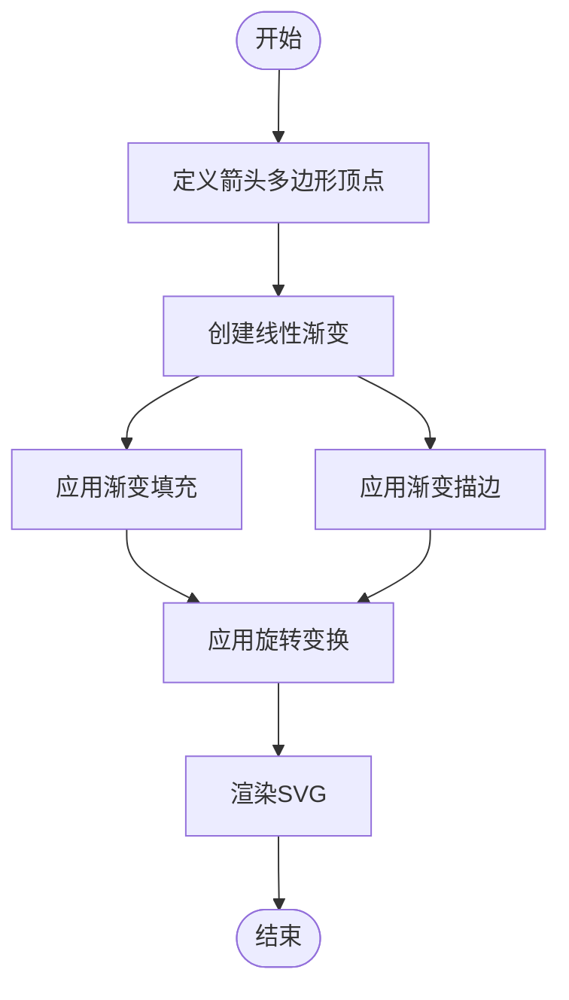
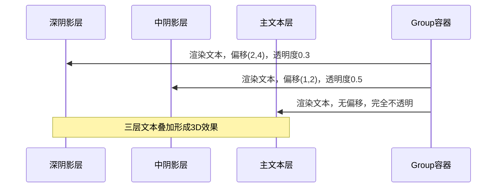
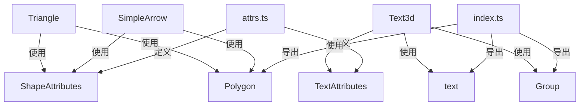

# 装饰组件

<cite>
**本文档引用的文件**  
- [simple-arrow.tsx](file://antv_infographic\infographic\src\designs\decorations\simple-arrow.tsx)
- [text-3d.tsx](file://antv_infographic\infographic\src\designs\decorations\text-3d.tsx)
- [triangle.tsx](file://antv_infographic\infographic\src\designs\decorations\triangle.tsx)
- [index.ts](file://antv_infographic\infographic\src\designs\decorations\index.ts)
- [attrs.ts](file://antv_infographic\infographic\src\types\attrs.ts)
- [jsx/index.ts](file://antv_infographic\infographic\src\jsx\index.ts)
- [sequence-steps.tsx](file://antv_infographic\infographic\src\designs\structures\sequence-steps.tsx)
- [sequence-roadmap-vertical.tsx](file://antv_infographic\infographic\src\designs\structures\sequence-roadmap-vertical.tsx)
- [sequence-ascending-stairs-3d.tsx](file://antv_infographic\infographic\src\designs\structures\sequence-ascending-stairs-3d.tsx)
</cite>

## 目录
1. [简介](#简介)
2. [项目结构](#项目结构)
3. [核心组件](#核心组件)
4. [架构概述](#架构概述)
5. [详细组件分析](#详细组件分析)
6. [依赖分析](#依赖分析)
7. [性能考虑](#性能考虑)
8. [故障排除指南](#故障排除指南)
9. [结论](#结论)

## 简介
本文档详细说明了信息图表生成器中的视觉增强装饰组件，包括 `simple-arrow`、`text-3d` 和 `triangle`。这些组件通过 SVG 特效和 CSS 3D 变换技术显著提升了信息图的视觉表现力。文档将解释每个装饰组件的属性配置、动画效果以及与其他组件的集成方法，分析其在引导视线、突出重点和增强层次感方面的设计价值，并提供在不同主题和配色方案下调整装饰效果的实践指南。

## 项目结构
该项目采用模块化结构，装饰组件位于 `src/designs/decorations` 目录下，作为独立的可复用视觉元素。这些组件通过 JSX 渲染为 SVG 元素，并利用 SVG 的渐变、变换和阴影特性实现丰富的视觉效果。



**图示来源**  
- [simple-arrow.tsx](file://antv_infographic\infographic\src\designs\decorations\simple-arrow.tsx)
- [text-3d.tsx](file://antv_infographic\infographic\src\designs\decorations\text-3d.tsx)
- [triangle.tsx](file://antv_infographic\infographic\src\designs\decorations\triangle.tsx)

**本节来源**  
- [src/designs/decorations/](file://antv_infographic\infographic\src\designs\decorations\)

## 核心组件
核心装饰组件包括 `SimpleArrow`、`Text3d` 和 `Triangle`，它们均基于 SVG 技术构建，通过不同的视觉策略增强信息图的表现力。`SimpleArrow` 使用线性渐变创造光感箭头，`Text3d` 通过多层文本偏移模拟 3D 深度，`Triangle` 则提供基础的几何形状并支持旋转。

**本节来源**  
- [simple-arrow.tsx](file://antv_infographic\infographic\src\designs\decorations\simple-arrow.tsx#L3-L57)
- [text-3d.tsx](file://antv_infographic\infographic\src\designs\decorations\text-3d.tsx#L97-L157)
- [triangle.tsx](file://antv_infographic\infographic\src\designs\decorations\triangle.tsx#L3-L39)

## 架构概述
装饰组件的架构基于 React 风格的 JSX 语法，将 SVG 元素封装为可复用的函数组件。它们依赖于项目内部的 JSX 渲染系统，通过 `Polygon`、`text` 和 `Group` 等基础组件构建复杂的视觉效果。属性系统允许用户通过标准的 SVG 属性（如 `fill`、`stroke`、`transform`）进行深度定制。



**图示来源**  
- [jsx/index.ts](file://antv_infographic\infographic\src\jsx\index.ts#L1)
- [simple-arrow.tsx](file://antv_infographic\infographic\src\designs\decorations\simple-arrow.tsx)
- [text-3d.tsx](file://antv_infographic\infographic\src\designs\decorations\text-3d.tsx)
- [triangle.tsx](file://antv_infographic\infographic\src\designs\decorations\triangle.tsx)

## 详细组件分析

### SimpleArrow 分析
`SimpleArrow` 组件通过定义一个由多个点构成的多边形来创建箭头形状，并利用 SVG 的 `linearGradient` 实现从左到右的渐变填充和描边效果，从而营造出立体的光感。箭头支持通过 `rotation` 属性进行旋转，以适应不同的布局需求。

#### 组件属性
| 属性 | 类型 | 默认值 | 描述 |
|------|------|--------|------|
| `width` | number | 25 | 箭头的宽度 |
| `height` | number | 25 | 箭头的高度 |
| `colorPrimary` | string | '#6699FF' | 主色调，用于填充和描边的渐变 |
| `rotation` | number | 0 | 旋转角度（度） |

#### 视觉实现


**图示来源**  
- [simple-arrow.tsx](file://antv_infographic\infographic\src\designs\decorations\simple-arrow.tsx#L19-L27)
- [simple-arrow.tsx](file://antv_infographic\infographic\src\designs\decorations\simple-arrow.tsx#L46-L53)

**本节来源**  
- [simple-arrow.tsx](file://antv_infographic\infographic\src\designs\decorations\simple-arrow.tsx)

### Text3d 分析
`Text3d` 组件通过渲染三层叠加的文本并应用不同的偏移和透明度来模拟 3D 效果。最底层的文本偏移最大且透明度最低，中间层次之，最上层为主文本，无偏移且完全不透明，从而创造出强烈的深度感。

#### 组件属性
| 属性 | 类型 | 默认值 | 描述 |
|------|------|--------|------|
| `text` | string/number | - | 要显示的文本内容 |
| `x`, `y` | number | 0 | 文本的坐标位置 |
| `fontSize` | number | 56 | 字体大小 |
| `fill` | string | '#FFFFFF' | 文本填充颜色 |
| `shadowOffsetX/Y` | number | 2/4 | 最深阴影层的偏移量 |
| `midShadowOffsetX/Y` | number | 1/2 | 中层阴影的偏移量 |
| `deepShadowOpacity` | number | 0.3 | 最深阴影层的透明度 |
| `midShadowOpacity` | number | 0.5 | 中层阴影的透明度 |

#### 视觉实现


**图示来源**  
- [text-3d.tsx](file://antv_infographic\infographic\src\designs\decorations\text-3d.tsx#L116-L153)

**本节来源**  
- [text-3d.tsx](file://antv_infographic\infographic\src\designs\decorations\text-3d.tsx)

### Triangle 分析
`Triangle` 组件是一个简单的等腰三角形，由三个顶点定义。它支持填充、描边和旋转，常用于指示方向或作为列表项的标记。

#### 组件属性
| 属性 | 类型 | 默认值 | 描述 |
|------|------|--------|------|
| `width` | number | 25 | 三角形的底边宽度 |
| `height` | number | 25 | 三角形的高度 |
| `colorPrimary` | string | '#6699FF' | 填充和描边颜色 |
| `rotation` | number | 0 | 旋转角度（度） |
| `strokeWidth` | number | 4 | 描边宽度 |

#### 视觉实现
```mermaid
classDiagram
class Triangle {
+width : number
+height : number
+colorPrimary : string
+rotation : number
+render() : JSX.Element
}
class Polygon {
+points : Array<{x, y}>
+fill : string
+stroke : string
+transform : string
}
Triangle --> Polygon : 使用
```

**图示来源**  
- [triangle.tsx](file://antv_infographic\infographic\src\designs\decorations\triangle.tsx#L15-L18)

**本节来源**  
- [triangle.tsx](file://antv_infographic\infographic\src\designs\decorations\triangle.tsx)

## 依赖分析
装饰组件依赖于项目核心的 JSX 渲染系统和类型定义。`SimpleArrow` 和 `Triangle` 依赖 `Polygon` 组件来绘制形状，`Text3d` 依赖 `text` 和 `Group` 组件。所有组件都使用 `attrs.ts` 中定义的通用 SVG 属性类型。



**图示来源**  
- [attrs.ts](file://antv_infographic\infographic\src\types\attrs.ts)
- [jsx/index.ts](file://antv_infographic\infographic\src\jsx\index.ts)
- [simple-arrow.tsx](file://antv_infographic\infographic\src\designs\decorations\simple-arrow.tsx)
- [text-3d.tsx](file://antv_infographic\infographic\src\designs\decorations\text-3d.tsx)
- [triangle.tsx](file://antv_infographic\infographic\src\designs\decorations\triangle.tsx)

**本节来源**  
- [src/types/attrs.ts](file://antv_infographic\infographic\src\types\attrs.ts)
- [src/jsx/index.ts](file://antv_infographic\infographic\src\jsx\index.ts)

## 性能考虑
这些装饰组件均为轻量级 SVG 元素，渲染性能优异。`Text3d` 虽然渲染三层文本，但由于 SVG 的高效性，对性能影响极小。建议避免在大量数据项中过度使用复杂的装饰，以保持信息图的清晰度和加载速度。

## 故障排除指南
如果装饰组件未正确显示，请检查以下几点：
1. 确保 `colorPrimary` 属性提供了有效的颜色值。
2. 检查 `rotation` 属性的值是否在合理范围内。
3. 对于 `Text3d`，确认 `x` 和 `y` 坐标设置正确，避免文本超出可视区域。
4. 确认父容器有足够的空间容纳装饰元素。

**本节来源**  
- [simple-arrow.tsx](file://antv_infographic\infographic\src\designs\decorations\simple-arrow.tsx)
- [text-3d.tsx](file://antv_infographic\infographic\src\designs\decorations\text-3d.tsx)
- [triangle.tsx](file://antv_infographic\infographic\src\designs\decorations\triangle.tsx)

## 结论
`simple-arrow`、`text-3d` 和 `triangle` 等装饰组件通过巧妙运用 SVG 技术，为信息图表提供了强大的视觉增强能力。它们的设计简洁而有效，易于集成和定制，能够显著提升信息的可读性和吸引力。在使用时，应遵循适度原则，确保装饰服务于内容，而非喧宾夺主。