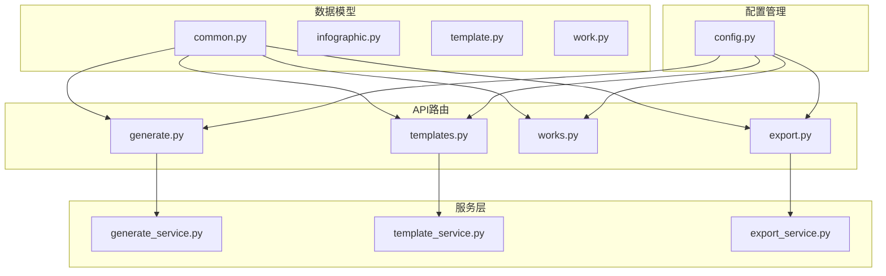
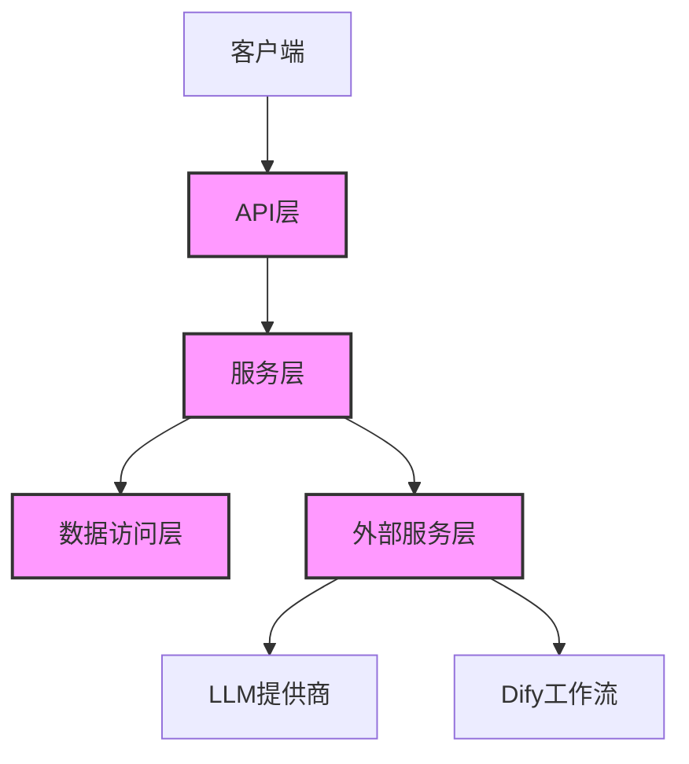
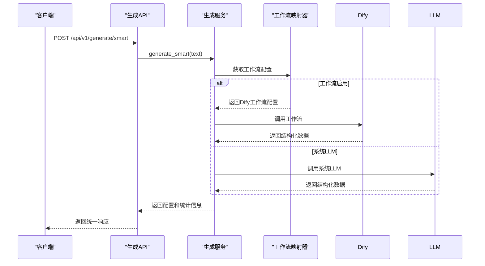
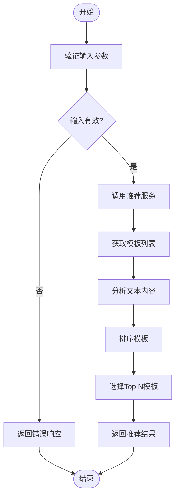
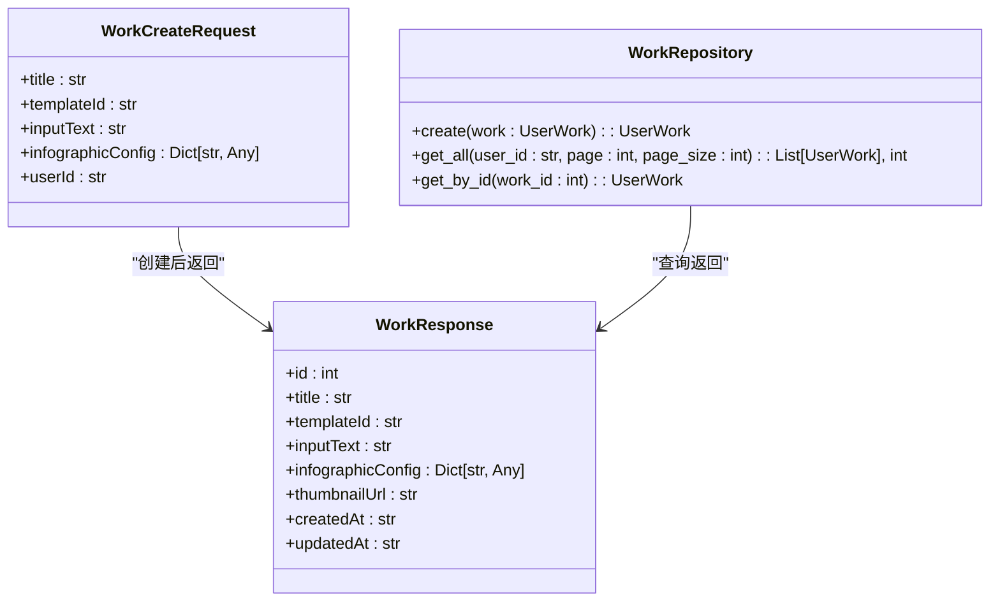
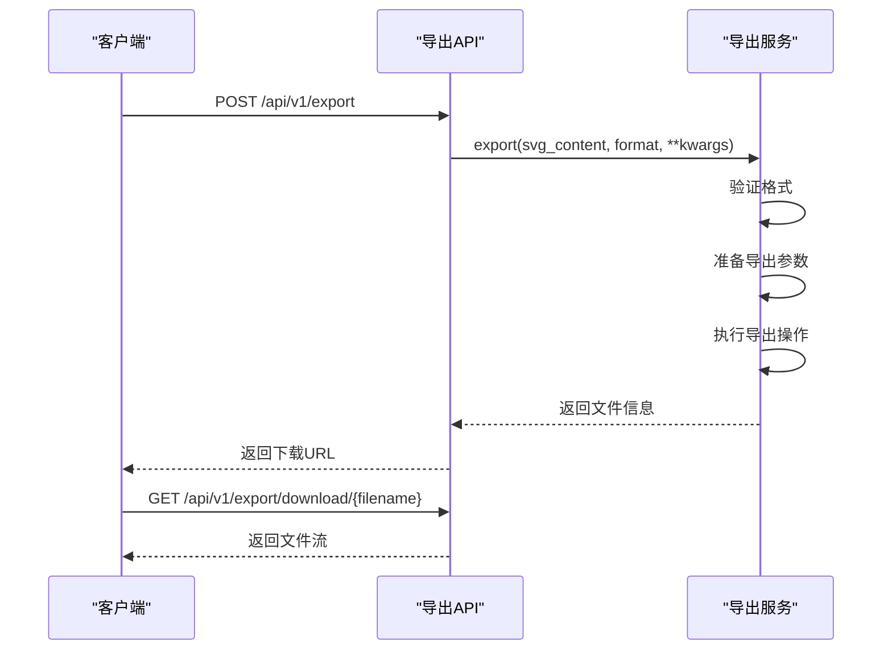
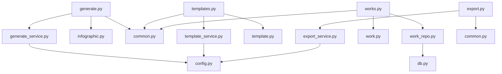

# API接口

<cite>
**本文档引用的文件**  
- [main.py](file://backend/app/main.py)
- [generate.py](file://backend/app/api/v1/generate.py)
- [templates.py](file://backend/app/api/v1/templates.py)
- [works.py](file://backend/app/api/v1/works.py)
- [export.py](file://backend/app/api/v1/export.py)
- [common.py](file://backend/app/schemas/common.py)
- [infographic.py](file://backend/app/schemas/infographic.py)
- [template.py](file://backend/app/schemas/template.py)
- [work.py](file://backend/app/schemas/work.py)
- [config.py](file://backend/app/config.py)
- [client.ts](file://frontend/src/api/client.ts)
- [generate.ts](file://frontend/src/api/generate.ts)
- [templates.ts](file://frontend/src/api/templates.ts)
- [work.ts](file://frontend/src/api/work.ts)
- [export.ts](file://frontend/src/api/export.ts)
</cite>

## 目录
1. [简介](#简介)
2. [项目结构](#项目结构)
3. [核心组件](#核心组件)
4. [架构概述](#架构概述)
5. [详细组件分析](#详细组件分析)
6. [依赖分析](#依赖分析)
7. [性能考虑](#性能考虑)
8. [故障排除指南](#故障排除指南)
9. [结论](#结论)

## 简介
本文档详细描述了基于FastAPI实现的RESTful API接口，重点阐述生成接口(/generate)、模板管理接口(/templates)、作品管理接口(/works)和导出接口(/export)的设计与实现。系统使用Pydantic模型定义请求和响应数据结构，确保类型安全和自动文档生成。API采用统一的响应格式，支持智能生成流程和传统模式两种信息图生成方式。系统还实现了完整的CORS配置和错误处理机制，并通过FastAPI自动生成Swagger UI和ReDoc文档。

## 项目结构
系统后端API采用模块化设计，主要分为API路由、服务层、数据模型和配置管理四个部分。API路由按功能划分为生成、模板、作品和导出四个模块，每个模块对应独立的Python文件。数据模型使用Pydantic定义，确保类型安全和自动验证。服务层封装核心业务逻辑，与API路由解耦。配置管理使用Pydantic Settings实现环境变量的加载和管理。

**图源**
- [main.py](file://backend/app/main.py#L1-L113)
- [generate.py](file://backend/app/api/v1/generate.py#L1-L116)

**节源**
- [main.py](file://backend/app/main.py#L1-L113)
- [generate.py](file://backend/app/api/v1/generate.py#L1-L116)
- [templates.py](file://backend/app/api/v1/templates.py#L1-L99)
- [works.py](file://backend/app/api/v1/works.py#L1-L106)
- [export.py](file://backend/app/api/v1/export.py#L1-L208)

## 核心组件
系统的核心组件包括API路由、Pydantic数据模型、服务层和配置管理。API路由使用FastAPI的APIRouter进行模块化组织，每个功能模块独立。Pydantic模型定义了统一的请求和响应格式，确保类型安全和自动文档生成。服务层封装了复杂的业务逻辑，如智能生成流程、模板推荐和数据提取。配置管理使用Pydantic Settings从环境变量加载配置，支持热更新。

**节源**
- [common.py](file://backend/app/schemas/common.py#L1-L21)
- [infographic.py](file://backend/app/schemas/infographic.py#L1-L22)
- [template.py](file://backend/app/schemas/template.py#L1-L27)
- [work.py](file://backend/app/schemas/work.py#L1-L27)
- [config.py](file://backend/app/config.py#L1-L51)

## 架构概述
系统采用分层架构设计，从上到下分为API层、服务层、数据访问层和外部服务层。API层负责HTTP请求的接收和响应，使用FastAPI框架实现。服务层封装核心业务逻辑，协调不同组件的工作。数据访问层处理数据库操作，目前作品管理功能使用简单的文件存储。外部服务层集成LLM提供商和Dify工作流，实现AI驱动的功能。

**图源**
- [main.py](file://backend/app/main.py#L1-L113)
- [generate.py](file://backend/app/api/v1/generate.py#L1-L116)

## 详细组件分析

### 生成接口分析
生成接口提供两种信息图生成模式：智能生成和传统模式。智能生成采用三阶段流程，自动完成类型识别、模板选择和数据提取。传统模式允许用户指定模板ID进行数据提取。接口使用Pydantic模型定义请求和响应格式，确保类型安全。

#### 智能生成流程

**图源**
- [generate.py](file://backend/app/api/v1/generate.py#L1-L116)
- [infographic.py](file://backend/app/schemas/infographic.py#L1-L22)

### 模板管理接口分析
模板管理接口提供模板列表获取、分类查询和AI推荐功能。系统预定义了七大模板分类，包括图表型、对比型、层级型等。AI推荐功能根据用户输入的文本内容，使用AI模型推荐最合适的模板。

#### 模板推荐流程

**图源**
- [templates.py](file://backend/app/api/v1/templates.py#L1-L99)
- [template.py](file://backend/app/schemas/template.py#L1-L27)

### 作品管理接口分析
作品管理接口提供作品的创建、查询和详情获取功能。每个作品包含标题、使用的模板ID、原始输入文本和完整的Infographic配置。系统支持分页查询，便于管理大量作品。

**图源**
- [works.py](file://backend/app/api/v1/works.py#L1-L106)
- [work.py](file://backend/app/schemas/work.py#L1-L27)

### 导出接口分析
导出接口支持将信息图导出为SVG、PNG、PDF和PPTX四种格式。系统使用临时目录存储导出的文件，并提供下载和清理功能。每种格式有不同的参数选项，如PNG格式支持宽度、高度和缩放比例设置。

#### 导出流程

**图源**
- [export.py](file://backend/app/api/v1/export.py#L1-L208)
- [client.ts](file://frontend/src/api/client.ts#L1-L46)

## 依赖分析
系统依赖关系清晰，API路由层依赖服务层和数据模型，服务层依赖配置管理和外部服务。通过依赖注入模式获取服务实例，确保组件间的松耦合。系统使用Pydantic模型作为数据传输对象，在各层之间传递数据。

**图源**
- [main.py](file://backend/app/main.py#L1-L113)
- [go.mod](file://backend/go.mod#L1-L20)

**节源**
- [main.py](file://backend/app/main.py#L1-L113)
- [generate.py](file://backend/app/api/v1/generate.py#L1-L116)
- [templates.py](file://backend/app/api/v1/templates.py#L1-L99)
- [works.py](file://backend/app/api/v1/works.py#L1-L106)
- [export.py](file://backend/app/api/v1/export.py#L1-L208)

## 性能考虑
系统在性能方面做了多项优化。API响应使用统一格式，减少序列化开销。服务层实现缓存机制，避免重复计算。导出功能使用临时文件存储，避免内存占用过高。系统配置了较长的超时时间（120秒），以支持复杂的Dify工作流处理。对于大量数据的查询操作，系统支持分页，避免一次性加载过多数据。

## 故障排除指南
系统实现了完善的错误处理机制。全局异常处理器捕获未处理的异常，返回统一的错误响应。每个API端点都有针对性的异常处理，如404错误表示资源不存在，400错误表示请求参数无效。日志系统记录关键操作和错误信息，便于问题排查。对于导出功能，系统提供了清理临时文件的接口，防止磁盘空间耗尽。

**节源**
- [main.py](file://backend/app/main.py#L39-L54)
- [export.py](file://backend/app/api/v1/export.py#L108-L121)

## 结论
本系统提供了一套完整的RESTful API接口，支持信息图的智能生成、模板管理、作品保存和多格式导出。API设计遵循REST原则，使用Pydantic模型确保类型安全和自动文档生成。系统架构清晰，组件职责分明，便于维护和扩展。通过集成LLM和Dify工作流，实现了AI驱动的智能功能。系统还提供了完善的错误处理和日志记录，确保稳定运行。