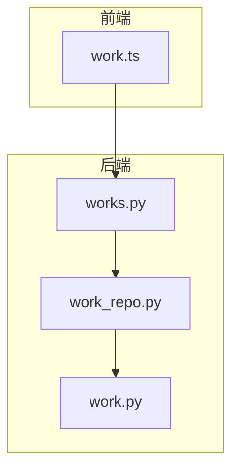
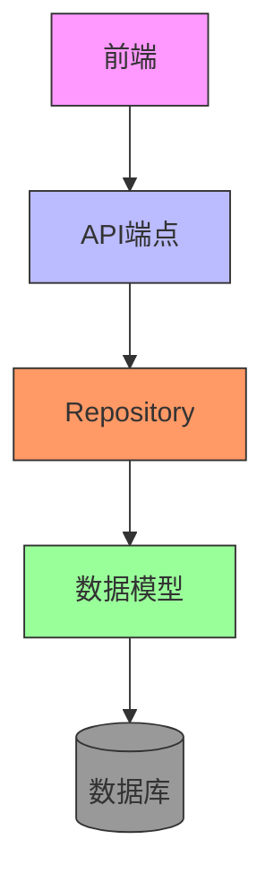
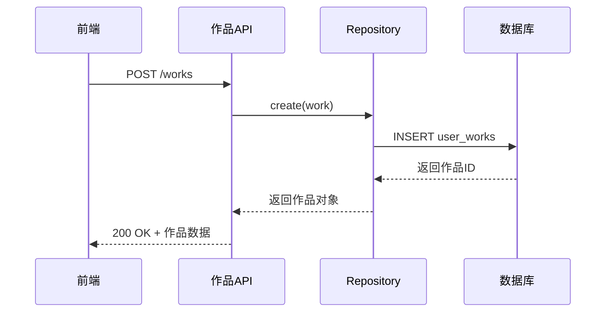
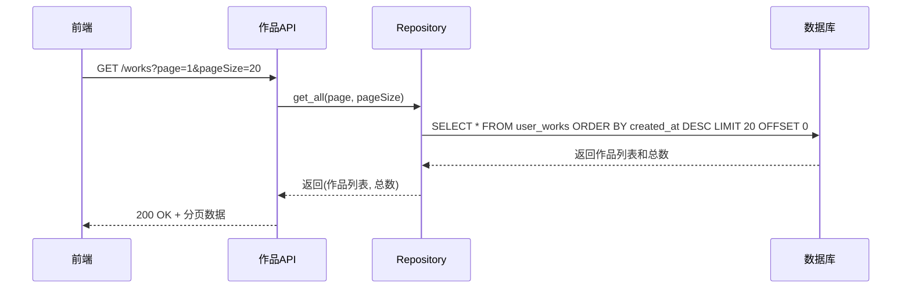
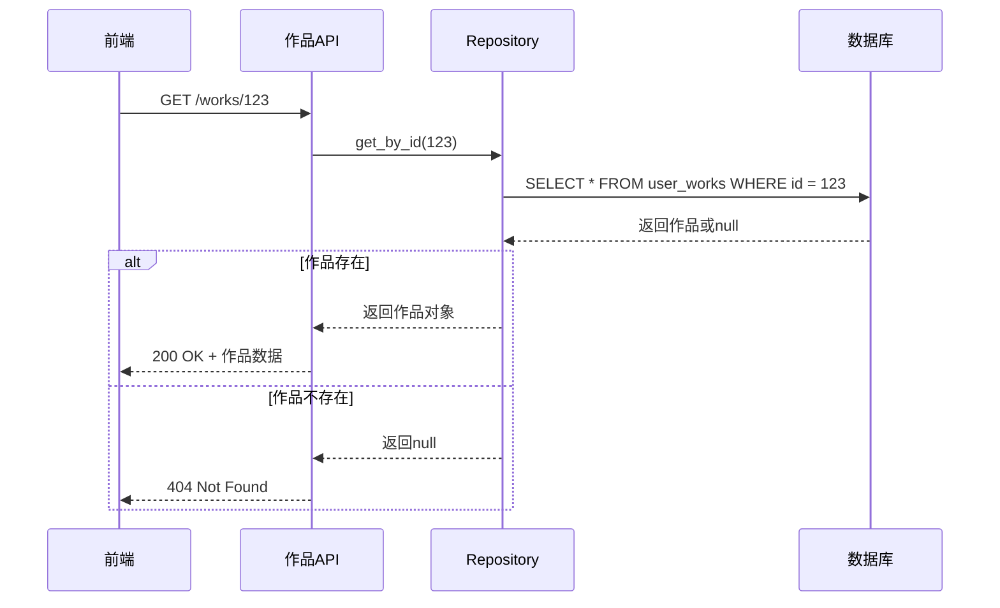
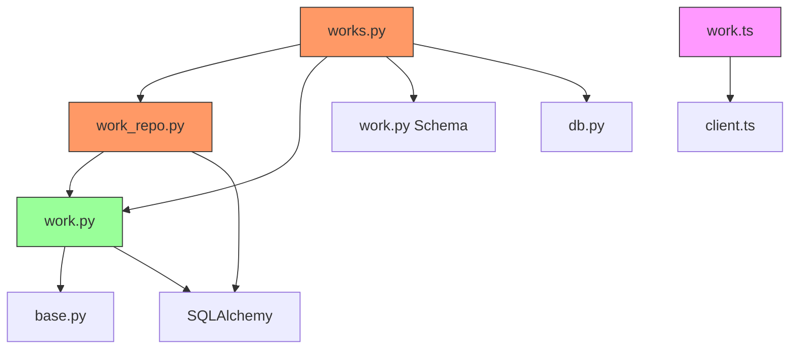

# 作品接口

<cite>
**本文档中引用的文件**   
- [works.py](file://backend/app/api/v1/works.py)
- [work.py](file://backend/app/models/work.py)
- [work_repo.py](file://backend/app/repositories/work_repo.py)
- [work.ts](file://frontend/src/api/work.ts)
- [main.py](file://backend/app/main.py)
</cite>

## 目录
1. [简介](#简介)
2. [项目结构](#项目结构)
3. [核心组件](#核心组件)
4. [架构概述](#架构概述)
5. [详细组件分析](#详细组件分析)
6. [依赖分析](#依赖分析)
7. [性能考虑](#性能考虑)
8. [故障排除指南](#故障排除指南)
9. [结论](#结论)
10. [附录](#附录)（如有必要）

## 简介
本文档全面描述了作品管理接口的CRUD操作，包括创建、读取、更新和删除用户作品的详细说明。文档涵盖了请求体结构（作品名称、配置数据、模板ID）、响应格式、作品持久化机制、数据库表设计、ORM映射关系、分页查询参数（如limit、offset）和排序选项的使用方法。同时，文档还解释了错误处理策略，如处理作品不存在或权限不足的情况，并提供了完整的API调用示例，展示从保存作品到加载编辑的完整工作流。

## 项目结构
作品管理功能分布在前后端多个目录中，形成了清晰的分层架构。后端API端点位于`backend/app/api/v1/works.py`，数据库模型定义在`backend/app/models/work.py`，数据访问层实现在`backend/app/repositories/work_repo.py`。前端API调用封装在`frontend/src/api/work.ts`中。这种分层结构确保了代码的可维护性和可扩展性。



**图示来源**
- [works.py](file://backend/app/api/v1/works.py)
- [work_repo.py](file://backend/app/repositories/work_repo.py)
- [work.py](file://backend/app/models/work.py)
- [work.ts](file://frontend/src/api/work.ts)

**章节来源**
- [works.py](file://backend/app/api/v1/works.py)
- [work.py](file://backend/app/models/work.py)
- [work_repo.py](file://backend/app/repositories/work_repo.py)

## 核心组件
作品接口的核心组件包括API端点、数据模型、数据访问层和前端API封装。API端点处理HTTP请求和响应，数据模型定义了作品在数据库中的结构，数据访问层负责与数据库的交互，前端API封装提供了简洁的调用接口。这些组件协同工作，实现了作品的完整生命周期管理。

**章节来源**
- [works.py](file://backend/app/api/v1/works.py)
- [work.py](file://backend/app/models/work.py)
- [work_repo.py](file://backend/app/repositories/work_repo.py)
- [work.ts](file://frontend/src/api/work.ts)

## 架构概述
作品管理接口采用典型的分层架构，从前端到后端依次为：前端调用层、API路由层、业务逻辑层（Repository）、数据模型层和数据库。这种架构确保了关注点分离，使得各层职责明确，便于维护和扩展。



**图示来源**
- [works.py](file://backend/app/api/v1/works.py)
- [work_repo.py](file://backend/app/repositories/work_repo.py)
- [work.py](file://backend/app/models/work.py)

## 详细组件分析
### 作品创建分析
作品创建功能通过POST请求实现，接收包含作品标题、模板ID、输入文本和信息图配置的请求体。后端API验证数据后，通过Repository保存到数据库，并返回包含作品ID和其他信息的响应。

#### 作品创建序列图


**图示来源**
- [works.py](file://backend/app/api/v1/works.py#L15-L47)
- [work_repo.py](file://backend/app/repositories/work_repo.py#L24-L37)
- [work.py](file://backend/app/models/work.py)

### 作品列表获取分析
作品列表获取功能支持分页查询，通过GET请求实现。客户端可以指定页码和每页数量，还可以通过用户ID进行筛选。后端按创建时间倒序返回作品列表，并包含总数、当前页码等分页信息。

#### 作品列表获取序列图


**图示来源**
- [works.py](file://backend/app/api/v1/works.py#L50-L78)
- [work_repo.py](file://backend/app/repositories/work_repo.py#L51-L81)

### 作品详情获取分析
作品详情获取功能通过GET请求实现，根据作品ID返回单个作品的完整信息。如果作品不存在，返回404错误。该功能用于加载作品进行编辑或查看。

#### 作品详情获取序列图


**图示来源**
- [works.py](file://backend/app/api/v1/works.py#L82-L105)
- [work_repo.py](file://backend/app/repositories/work_repo.py#L39-L49)

**章节来源**
- [works.py](file://backend/app/api/v1/works.py)
- [work_repo.py](file://backend/app/repositories/work_repo.py)

## 依赖分析
作品管理模块依赖于多个其他模块和外部库。后端依赖FastAPI框架、SQLAlchemy ORM和Pydantic数据验证库。数据模型依赖于基础模型类，Repository依赖于数据库会话。API端点依赖于Schema定义、Repository和数据库工具。



**图示来源**
- [works.py](file://backend/app/api/v1/works.py)
- [work_repo.py](file://backend/app/repositories/work_repo.py)
- [work.py](file://backend/app/models/work.py)
- [work.ts](file://frontend/src/api/work.ts)

**章节来源**
- [works.py](file://backend/app/api/v1/works.py)
- [work_repo.py](file://backend/app/repositories/work_repo.py)
- [work.py](file://backend/app/models/work.py)

## 性能考虑
作品列表查询在`user_id`字段上创建了索引，以提高按用户筛选的查询性能。查询结果按`created_at`字段倒序排列，符合用户查看最新作品的习惯。分页机制避免了一次性返回大量数据，减少了网络传输和内存占用。对于大量作品的场景，可以考虑在`template_id`字段上添加索引，以支持按模板类型筛选。

## 故障排除指南
### 作品保存失败
当作品保存失败时，服务器返回500错误，错误信息包含具体的异常描述。常见原因包括数据库连接问题、数据验证失败或缺少必需字段。检查请求体是否包含`templateId`和`inputText`等必需字段，确保数据库服务正常运行。

### 作品不存在
当请求获取不存在的作品时，服务器返回404错误，错误信息明确指出作品ID。这通常发生在用户尝试访问已被删除的作品或输入了错误的ID。前端应妥善处理此错误，提示用户作品不存在。

### 分页参数无效
当分页参数超出有效范围时，服务器会使用默认值。`page`参数必须大于等于1，`pageSize`参数必须在1-100之间。如果提供无效值，API将使用默认值（page=1, pageSize=20）。

**章节来源**
- [works.py](file://backend/app/api/v1/works.py)
- [work_repo.py](file://backend/app/repositories/work_repo.py)

## 结论
作品管理接口提供了完整的CRUD功能，支持作品的创建、读取、更新和删除操作。接口设计遵循RESTful原则，使用标准的HTTP方法和状态码。数据模型设计合理，包含了作品所需的所有关键信息。分页机制和错误处理策略确保了接口的可用性和健壮性。前后端分离的架构使得系统易于维护和扩展。

## 附录
### API端点列表
| 端点 | 方法 | 描述 | 认证 |
|------|------|------|------|
| `/works` | POST | 创建新作品 | 否 |
| `/works` | GET | 获取作品列表（分页） | 否 |
| `/works/{work_id}` | GET | 获取单个作品详情 | 否 |
| `/works/{work_id}` | DELETE | 删除指定作品 | 否 |

### 请求/响应示例
#### 创建作品请求
```json
{
  "title": "销售报告",
  "templateId": "bar-chart-vertical",
  "inputText": "第一季度销售额：100万，第二季度：150万",
  "infographicConfig": {
    "items": [...],
    "layout": "vertical"
  }
}
```

#### 创建作品响应
```json
{
  "success": true,
  "data": {
    "id": 123,
    "title": "销售报告",
    "templateId": "bar-chart-vertical",
    "inputText": "第一季度销售额：100万，第二季度：150万",
    "infographicConfig": {
      "items": [...],
      "layout": "vertical"
    },
    "createdAt": "2024-01-01T00:00:00",
    "updatedAt": "2024-01-01T00:00:00"
  },
  "message": "作品保存成功"
}
```