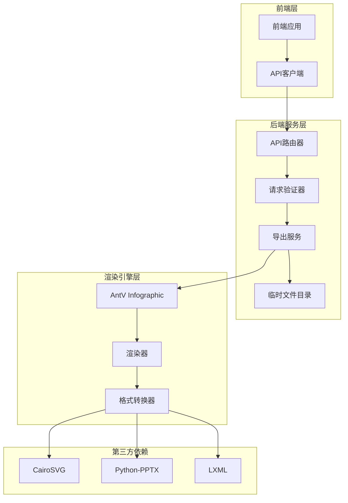
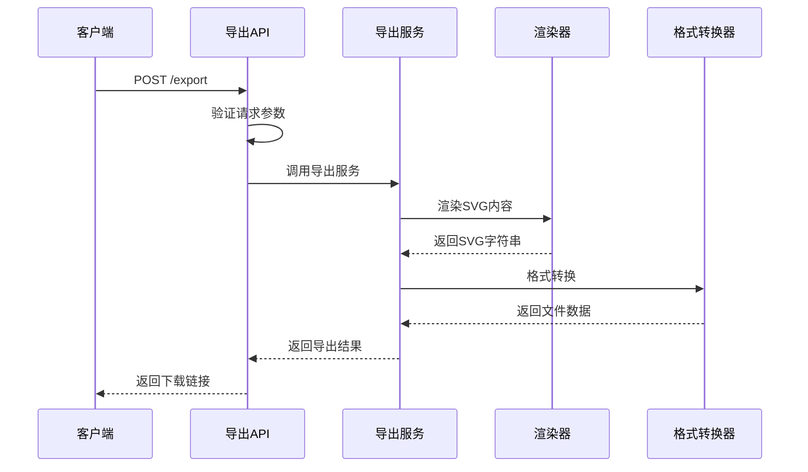
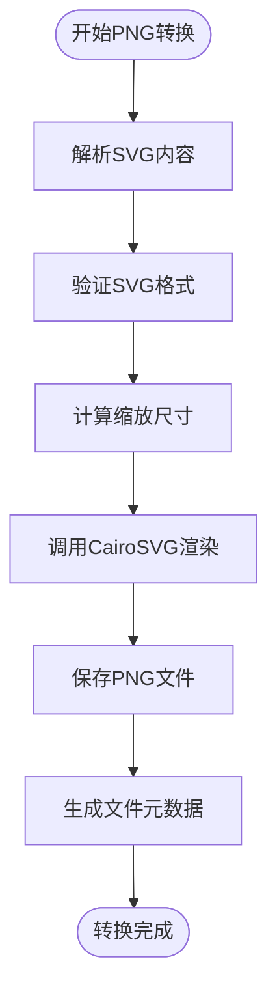
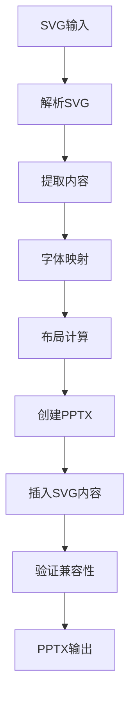

# 导出接口技术文档

<cite>
**本文档中引用的文件**
- [export.py](file://backend/app/api/v1/export.py)
- [export_service.py](file://backend/app/services/export_service.py)
- [export.ts](file://antv_infographic/src/exporter/index.ts)
- [svg.ts](file://antv_infographic/src/exporter/svg.ts)
- [png.ts](file://antv_infographic/src/exporter/png.ts)
- [export.ts](file://frontend/src/api/export.ts)
- [common.py](file://backend/app/schemas/common.py)
- [test_pptx_chinese.py](file://tests/backend/test_pptx_chinese.py)
- [test_backend_svg_conversion.py](file://tests/backend/test_backend_svg_conversion.py)
</cite>

## 目录
1. [概述](#概述)
2. [系统架构](#系统架构)
3. [API接口设计](#api接口设计)
4. [导出格式支持](#导出格式支持)
5. [服务器端渲染机制](#服务器端渲染机制)
6. [格式转换实现](#格式转换实现)
7. [性能优化策略](#性能优化策略)
8. [错误处理与监控](#错误处理与监控)
9. [实际调用示例](#实际调用示例)
10. [故障排除指南](#故障排除指南)

## 概述

导出接口是GenAI Chart系统的核心功能之一，负责将AntV Infographic库生成的信息图配置数据转换为多种格式的文件输出。该系统支持SVG、PNG、PDF、PPTX四种主要格式，通过统一的RESTful API接口提供服务，满足用户在不同场景下的信息图导出需求。

### 主要特性

- **多格式支持**：同时支持矢量图形（SVG）和位图格式（PNG、PDF、PPTX）
- **服务器端渲染**：利用AntV Infographic库进行高质量的服务器端渲染
- **智能转换**：针对不同格式的特殊需求进行内容适配和优化
- **异步处理**：支持大文件的异步导出和临时文件管理
- **中文字体支持**：特别优化了中文字符在PPTX格式中的显示效果

## 系统架构

导出系统采用前后端分离的架构设计，从前端接收SVG配置数据，经过服务器端处理后生成目标格式文件。



**图表来源**
- [export.py](file://backend/app/api/v1/export.py#L1-L208)
- [export_service.py](file://backend/app/services/export_service.py#L1-L670)

**章节来源**
- [export.py](file://backend/app/api/v1/export.py#L1-L208)
- [export_service.py](file://backend/app/services/export_service.py#L1-L670)

## API接口设计

### 导出请求接口

导出接口提供统一的POST请求端点，支持多种格式的转换。

#### 接口路径
```
POST /api/v1/export
```

#### 请求参数

| 参数名 | 类型 | 必填 | 描述 |
|--------|------|------|------|
| svgContent | string | 是 | SVG格式的原始内容字符串 |
| format | string | 是 | 导出格式：svg、png、pdf、pptx |
| filename | string | 否 | 自定义文件名（不含扩展名） |
| title | string | 否 | PPTX格式的幻灯片标题 |
| width | integer | 否 | PNG格式的宽度像素（默认800） |
| height | integer | 否 | PNG格式的高度像素（默认600） |
| scale | integer | 否 | PNG格式的缩放倍数（默认2） |

#### 响应格式

```typescript
interface ExportResponse {
  format: string;           // 导出格式
  filename: string;         // 文件名
  filepath: string;         // 临时文件路径
  size: number;            // 文件大小（字节）
  downloadUrl: string;     // 下载链接
  width?: number;          // PNG格式的宽度
  height?: number;         // PNG格式的高度
}
```

### 辅助接口

#### 获取支持的格式
```
GET /api/v1/export/formats
```

#### 下载导出文件
```
GET /api/v1/export/download/{filename}
```

#### 清理临时文件
```
DELETE /api/v1/export/cleanup/{filename}
```

**章节来源**
- [export.py](file://backend/app/api/v1/export.py#L16-L106)
- [export.ts](file://frontend/src/api/export.ts#L8-L31)

## 导出格式支持

系统支持四种主要的导出格式，每种格式都有其特定的应用场景和技术实现。

### 格式对比表

| 格式 | 扩展名 | 特性 | 应用场景 | 技术要求 |
|------|--------|------|----------|----------|
| SVG | .svg | 矢量图形，可无限缩放 | Web展示、印刷出版 | CairoSVG |
| PNG | .png | 高质量位图，支持透明度 | 图像展示、报告打印 | CairoSVG |
| PDF | .pdf | 便携式文档格式 | 文档归档、专业出版 | CairoSVG |
| PPTX | .pptx | PowerPoint演示文稿 | 演示文稿制作 | Python-PPTX, LXML |

### 格式特性详解

#### SVG格式
- **优势**：矢量图形，无损缩放，文件体积小
- **应用场景**：Web页面展示、矢量图形库、印刷设计
- **实现方式**：直接保存SVG字符串为文件

#### PNG格式
- **优势**：高分辨率图像，支持透明背景
- **应用场景**：网页图片、报告截图、社交媒体分享
- **实现方式**：使用CairoSVG将SVG转换为PNG，支持自定义分辨率

#### PDF格式
- **优势**：跨平台兼容，固定布局
- **应用场景**：正式文档、印刷出版、法律文件
- **实现方式**：CairoSVG将SVG转换为PDF

#### PPTX格式
- **优势**：保持矢量特性，可编辑性
- **应用场景**：演示文稿、教学材料、商务报告
- **实现方式**：复杂的SVG转换和PPTX结构重组

**章节来源**
- [export.py](file://backend/app/api/v1/export.py#L175-L207)
- [export_service.py](file://backend/app/services/export_service.py#L10-L16)

## 服务器端渲染机制

### AntV Infographic集成

系统深度集成了AntV Infographic库，利用其强大的渲染能力生成高质量的信息图。



**图表来源**
- [export.py](file://backend/app/api/v1/export.py#L38-L106)
- [export_service.py](file://backend/app/services/export_service.py#L232-L255)

### 渲染流程

1. **SVG解析**：接收前端传递的SVG配置字符串
2. **内容验证**：检查SVG内容的完整性和兼容性
3. **渲染执行**：调用AntV Infographic渲染引擎生成最终图形
4. **格式转换**：根据目标格式进行相应的转换处理
5. **文件生成**：保存转换后的文件到临时目录

**章节来源**
- [export_service.py](file://backend/app/services/export_service.py#L26-L255)

## 格式转换实现

### SVG到PNG转换

PNG转换是最常用的格式转换，涉及分辨率控制和质量优化。

#### 实现细节
- **依赖库**：CairoSVG
- **参数控制**：支持自定义宽度、高度和缩放比例
- **质量保证**：通过scale参数实现高清输出

#### 转换算法


**图表来源**
- [export_service.py](file://backend/app/services/export_service.py#L52-L93)

### SVG到PDF转换

PDF转换保持矢量特性，适合专业文档制作。

#### 关键特性
- **矢量保持**：完全保留SVG的矢量特性
- **标准兼容**：符合PDF标准，确保跨平台兼容
- **高质量输出**：支持高分辨率PDF生成

### SVG到PPTX转换

PPTX转换是最复杂的格式转换，需要处理复杂的XML结构。

#### 转换挑战
1. **ForeignObject处理**：将HTML内容转换为SVG文本
2. **字体映射**：将Web字体映射到系统字体
3. **布局适配**：调整内容以适应幻灯片布局
4. **XML结构**：重构PowerPoint的ZIP结构

#### 转换流程



**图表来源**
- [export_service.py](file://backend/app/services/export_service.py#L130-L230)

#### 中文字体支持

系统特别优化了中文字符在PPTX中的显示效果：

- **字体映射**：自动将Web字体映射到系统中文字体
- **Unicode处理**：确保中文字符的正确编码
- **样式保持**：保留原始字体样式和颜色

**章节来源**
- [export_service.py](file://backend/app/services/export_service.py#L269-L479)

## 性能优化策略

### 异步处理机制

对于大型信息图和复杂转换，系统采用异步处理策略：

1. **临时文件管理**：使用专用目录存储中间文件
2. **超时控制**：设置合理的处理超时时间
3. **资源清理**：自动清理过期的临时文件

### 内存管理

- **流式处理**：对大文件采用流式读写
- **缓存策略**：合理使用内存缓存提高性能
- **垃圾回收**：及时释放不再使用的资源

### 并发控制

- **队列管理**：限制同时处理的导出任务数量
- **优先级调度**：根据文件大小和紧急程度分配资源
- **负载均衡**：在多个处理实例间分配任务

**章节来源**
- [export_service.py](file://backend/app/services/export_service.py#L22-L25)
- [export_service.py](file://backend/app/services/export_service.py#L646-L658)

## 错误处理与监控

### 错误分类

系统实现了完善的错误处理机制：

1. **参数错误**：无效的请求参数
2. **格式错误**：不支持的导出格式
3. **渲染错误**：SVG内容无法渲染
4. **转换错误**：格式转换过程中的异常
5. **系统错误**：依赖库缺失或系统资源不足

### 监控指标

- **响应时间**：各格式转换的平均处理时间
- **成功率**：导出任务的成功率统计
- **错误分布**：不同类型错误的发生频率
- **资源使用**：CPU、内存、磁盘空间使用情况

### 日志记录

系统记录详细的日志信息：
- **请求日志**：记录每次导出请求的详细信息
- **错误日志**：记录异常堆栈和上下文信息
- **性能日志**：记录处理时间和资源消耗
- **安全日志**：记录访问控制和权限验证

**章节来源**
- [export.py](file://backend/app/api/v1/export.py#L108-L121)

## 实际调用示例

### 前端调用示例

```typescript
// 导出为PNG格式
const exportPNG = async () => {
  const response = await exportInfographic({
    svgContent: '<svg>...</svg>',
    format: 'png',
    filename: 'my-infographic',
    width: 1200,
    height: 800,
    scale: 2
  });
  
  if (response.success) {
    console.log('导出成功:', response.data);
    // 使用 downloadUrl 下载文件
  }
};

// 导出为PPTX格式
const exportPPTX = async () => {
  const response = await exportInfographic({
    svgContent: '<svg>...</svg>',
    format: 'pptx',
    title: '我的演示文稿',
    filename: 'presentation'
  });
  
  if (response.success) {
    console.log('PPTX导出成功');
  }
};
```

### 后端测试示例

```python
# 测试PNG导出
def test_png_export():
    service = get_export_service()
    result = service.export_png(
        svg_content=svg_string,
        filename="test.png",
        width=1024,
        height=768,
        scale=2
    )
    assert result['format'] == 'png'
    assert result['size'] > 0

# 测试PPTX导出
def test_pptx_export():
    service = get_export_service()
    result = service.export_pptx(
        svg_content=svg_string,
        title="测试标题",
        filename="test.pptx"
    )
    assert result['format'] == 'pptx'
    assert result['size'] > 0
```

### API请求示例

```bash
# 导出为SVG
curl -X POST "http://localhost:8000/api/v1/export" \
  -H "Content-Type: application/json" \
  -d '{
    "svgContent": "<svg>...</svg>",
    "format": "svg",
    "filename": "infographic"
  }'

# 导出为PNG
curl -X POST "http://localhost:8000/api/v1/export" \
  -H "Content-Type: application/json" \
  -d '{
    "svgContent": "<svg>...</svg>",
    "format": "png",
    "filename": "infographic",
    "width": 1920,
    "height": 1080,
    "scale": 2
  }'
```

**章节来源**
- [export.ts](file://frontend/src/api/export.ts#L46-L74)
- [test_pptx_chinese.py](file://tests/backend/test_pptx_chinese.py#L16-L27)

## 故障排除指南

### 常见问题及解决方案

#### 1. 依赖库缺失

**问题症状**：导出失败，提示缺少cairosvg或python-pptx

**解决方案**：
```bash
# 安装PNG/PDF导出依赖
pip install cairosvg

# 安装PPTX导出依赖
pip install python-pptx lxml
```

#### 2. 中文字体显示异常

**问题症状**：PPTX中中文字符显示为方块

**解决方案**：
- 确保系统安装了中文字体
- 检查字体映射配置
- 使用Noto Sans CJK SC作为备用字体

#### 3. 大文件导出超时

**问题症状**：大型信息图导出过程中断

**解决方案**：
- 增加API超时时间设置
- 优化SVG内容，减少复杂度
- 使用异步导出流程

#### 4. 权限错误

**问题症状**：临时文件创建失败

**解决方案**：
- 确保temp/exports目录存在且可写
- 检查文件系统权限设置
- 配置适当的umask值

### 性能调优建议

1. **SVG优化**：减少不必要的嵌套和复杂路径
2. **并发控制**：根据服务器资源调整并发数量
3. **缓存策略**：对重复的导出任务实施缓存
4. **监控告警**：设置关键指标的监控和告警

### 调试工具

系统提供了多种调试工具：
- **SVG转换测试**：验证foreignObject到text的转换
- **PPTX兼容性检查**：测试生成的PPTX文件兼容性
- **字体映射验证**：检查中文字体的正确映射

**章节来源**
- [test_backend_svg_conversion.py](file://tests/backend/test_backend_svg_conversion.py#L34-L101)
- [export_service.py](file://backend/app/services/export_service.py#L69-L71)