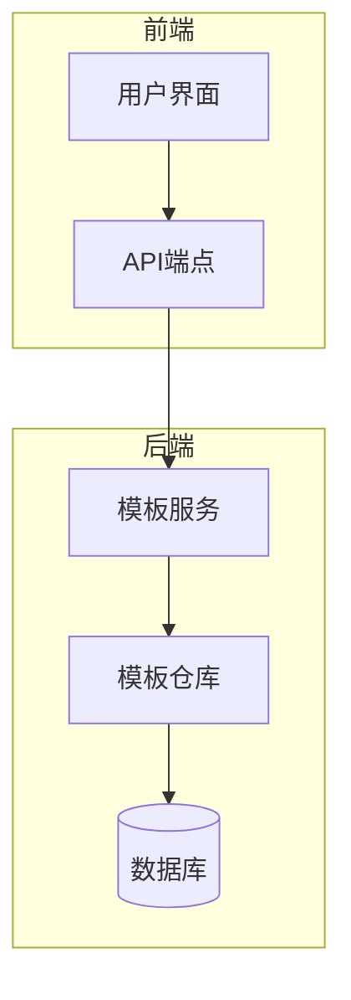
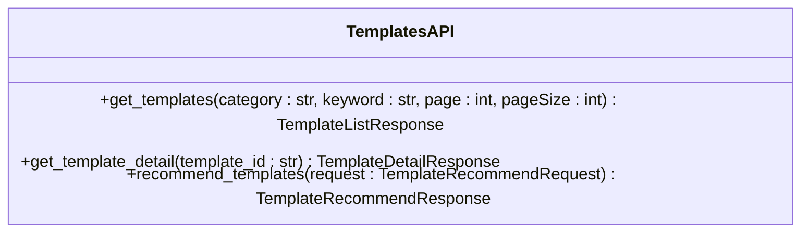
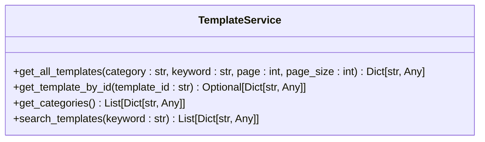
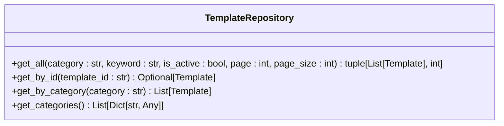
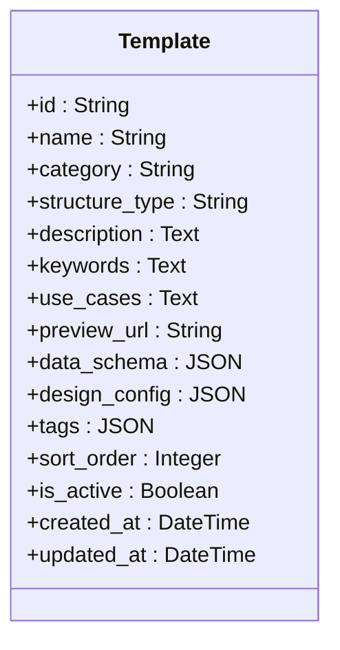
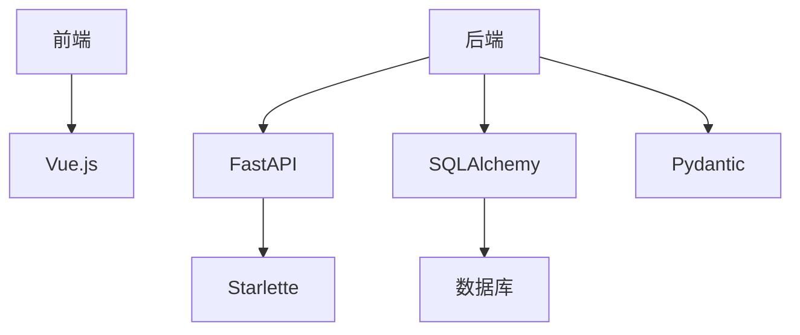
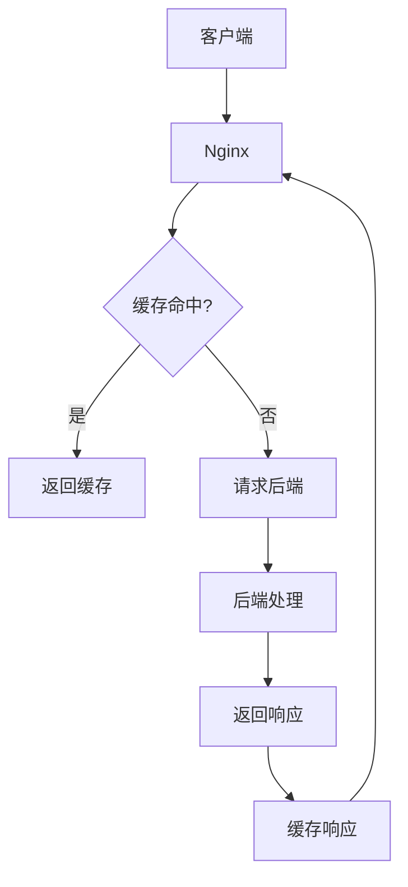

# 模板接口

<cite>
**本文档引用的文件**  
- [templates.py](file://backend/app/api/v1/templates.py)
- [template_service.py](file://backend/app/services/template_service.py)
- [template_repo.py](file://backend/app/repositories/template_repo.py)
- [template.py](file://backend/app/models/template.py)
- [common.py](file://backend/app/schemas/common.py)
- [template.py](file://backend/app/schemas/template.py)
- [frontend\src\api\templates.ts](file://frontend/src/api/templates.ts)
- [nginx.conf](file://frontend/nginx.conf)
</cite>

## 目录
1. [简介](#简介)
2. [项目结构](#项目结构)
3. [核心组件](#核心组件)
4. [架构概述](#架构概述)
5. [详细组件分析](#详细组件分析)
6. [依赖分析](#依赖分析)
7. [性能考虑](#性能考虑)
8. [故障排除指南](#故障排除指南)
9. [结论](#结论)

## 简介
本文档详细介绍了模板接口的实现，涵盖 `/templates` 端点的所有操作。文档说明了如何获取模板列表、查询特定模板详情以及模板搜索功能的实现。详细描述了请求参数（如分类、关键词）和响应数据结构，包括模板元数据、配置信息和预览URL。解释了模板分类系统的实现机制，以及如何通过API进行分类过滤。提供了分页查询的支持细节和响应格式。展示了如何通过GET请求获取模板数据，并说明了缓存策略和性能优化措施，确保高并发下的响应效率。

## 项目结构
项目结构清晰地组织了前端和后端代码。后端代码位于 `backend` 目录下，包含API、模型、服务和仓库等模块。前端代码位于 `frontend` 目录下，包含API客户端、路由、存储和视图等模块。`antv_infographic` 目录包含了AntV Infographic的源代码，提供了信息图的渲染和导出功能。

## 核心组件
核心组件包括模板API、模板服务、模板仓库和模板模型。模板API负责处理HTTP请求，模板服务负责业务逻辑，模板仓库负责数据访问，模板模型定义了数据库表结构。

**Section sources**
- [templates.py](file://backend/app/api/v1/templates.py)
- [template_service.py](file://backend/app/services/template_service.py)
- [template_repo.py](file://backend/app/repositories/template_repo.py)
- [template.py](file://backend/app/models/template.py)

## 架构概述
系统架构采用分层设计，前端通过API与后端通信，后端通过服务层和仓库层与数据库交互。前端使用Vue.js框架，后端使用FastAPI框架。数据库使用SQLAlchemy进行ORM映射。

**Diagram sources**
- [templates.py](file://backend/app/api/v1/templates.py)
- [template_service.py](file://backend/app/services/template_service.py)
- [template_repo.py](file://backend/app/repositories/template_repo.py)

## 详细组件分析

### 模板API分析
模板API提供了获取模板列表、获取模板详情和AI推荐模板的功能。API使用FastAPI框架，通过路由装饰器定义端点。

#### API端点

**Diagram sources**
- [templates.py](file://backend/app/api/v1/templates.py)

#### 请求参数
- **category**: 模板分类（可选）
- **keyword**: 搜索关键词（可选）
- **page**: 页码（默认1）
- **pageSize**: 每页数量（默认20）

#### 响应数据结构
- **templates**: 模板列表
- **total**: 总数
- **page**: 页码
- **pageSize**: 每页数量

**Section sources**
- [templates.py](file://backend/app/api/v1/templates.py)

### 模板服务分析
模板服务负责处理业务逻辑，包括获取模板列表、获取模板详情和AI推荐模板。服务层通过依赖注入获取数据库会话和仓库实例。

#### 服务方法

**Diagram sources**
- [template_service.py](file://backend/app/services/template_service.py)

#### 业务逻辑
- **get_all_templates**: 获取所有模板（分页）
- **get_template_by_id**: 根据ID获取模板
- **get_categories**: 获取所有分类及统计
- **search_templates**: 搜索模板

**Section sources**
- [template_service.py](file://backend/app/services/template_service.py)

### 模板仓库分析
模板仓库负责数据访问，通过SQLAlchemy与数据库交互。仓库层提供了获取模板列表、获取模板详情和获取分类统计的方法。

#### 仓库方法

**Diagram sources**
- [template_repo.py](file://backend/app/repositories/template_repo.py)

#### 数据访问
- **get_all**: 获取模板列表（分页）
- **get_by_id**: 根据ID获取模板
- **get_by_category**: 根据分类获取模板
- **get_categories**: 获取所有分类及统计

**Section sources**
- [template_repo.py](file://backend/app/repositories/template_repo.py)

### 模板模型分析
模板模型定义了数据库表结构，包括模板ID、名称、分类、描述、关键词、适用场景、预览URL、数据结构Schema、设计配置、标签、排序权重、是否启用、创建时间和更新时间。

#### 模型字段

**Diagram sources**
- [template.py](file://backend/app/models/template.py)

#### 数据库表
- **id**: 模板唯一标识
- **name**: 模板名称（中文）
- **category**: 分类（7类之一：chart/comparison/hierarchy/list/quadrant/relationship/sequence）
- **structure_type**: AntV structure类型（如list-row、sequence-timeline）
- **description**: 模板描述
- **keywords**: 关键词列表（逗号分隔）
- **use_cases**: 适用场景说明
- **preview_url**: 预览图URL
- **data_schema**: 数据结构Schema
- **design_config**: AntV设计配置
- **tags**: 标签数组
- **sort_order**: 排序权重
- **is_active**: 是否启用
- **created_at**: 创建时间
- **updated_at**: 更新时间

**Section sources**
- [template.py](file://backend/app/models/template.py)

## 依赖分析
系统依赖包括FastAPI、SQLAlchemy、Pydantic、Vue.js等。前端依赖Vue.js框架，后端依赖FastAPI框架和SQLAlchemy ORM。

**Diagram sources**
- [main.py](file://backend/app/main.py)
- [package.json](file://frontend/package.json)

## 性能考虑
为了提高性能，系统采用了缓存策略和分页查询。前端通过Nginx配置静态资源缓存，后端通过分页查询减少数据库压力。

### 缓存策略

**Diagram sources**
- [nginx.conf](file://frontend/nginx.conf)

### 分页查询
- **page**: 页码（默认1）
- **pageSize**: 每页数量（默认20）

**Section sources**
- [templates.py](file://backend/app/api/v1/templates.py)

## 故障排除指南
常见问题包括模板不存在、分类错误、关键词搜索失败等。可以通过检查请求参数、数据库连接和缓存配置来解决。

**Section sources**
- [templates.py](file://backend/app/api/v1/templates.py)
- [template_service.py](file://backend/app/services/template_service.py)
- [template_repo.py](file://backend/app/repositories/template_repo.py)

## 结论
本文档详细介绍了模板接口的实现，涵盖了所有操作和细节。通过分层设计和缓存策略，系统能够高效地处理高并发请求。开发者可以参考本文档快速理解和使用模板接口。