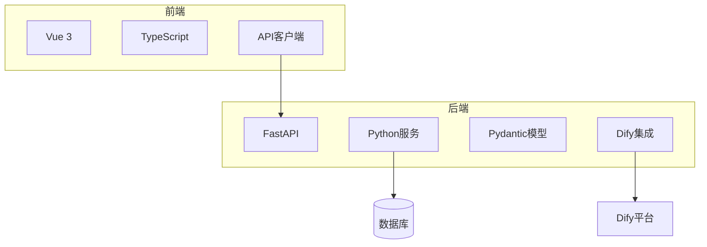
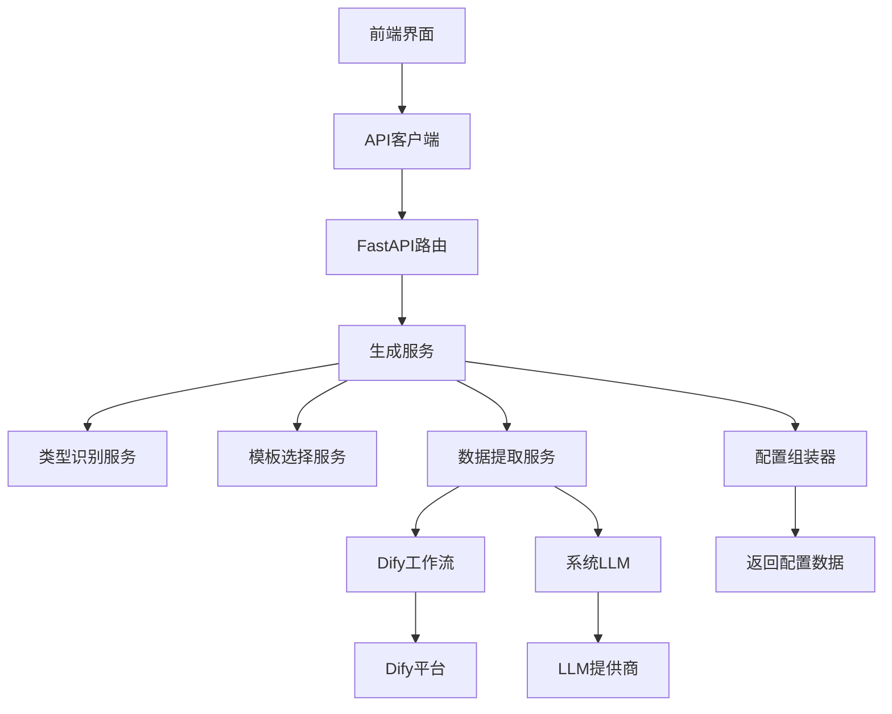
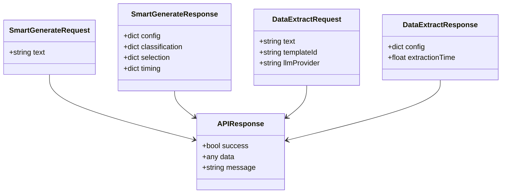
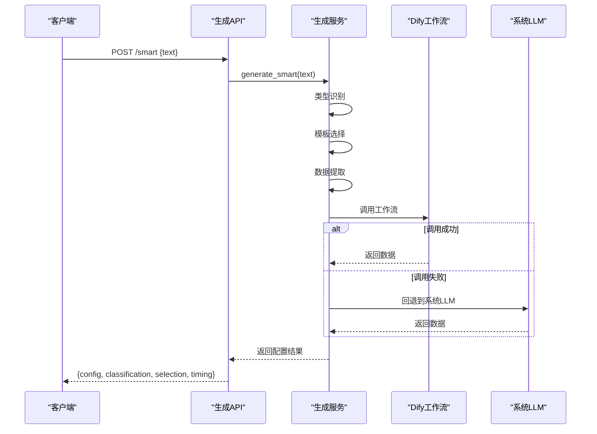
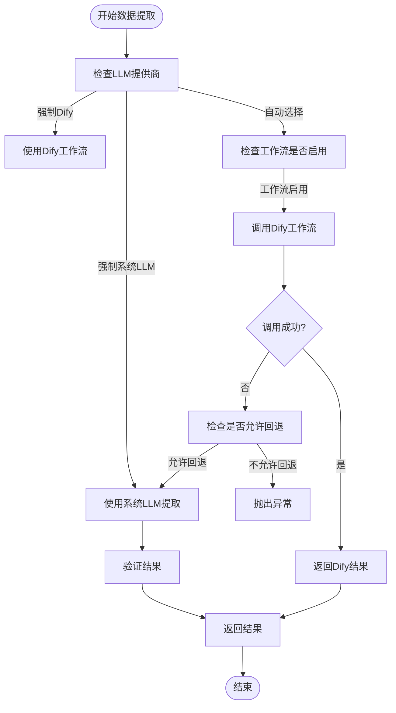
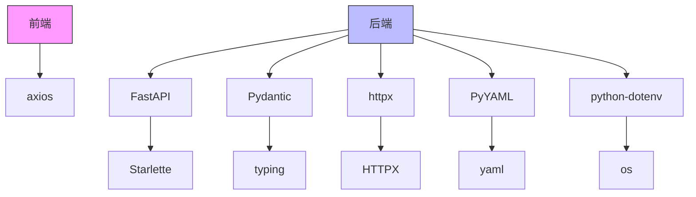

# 生成接口

<cite>
**本文档引用的文件**  
- [generate.py](file://backend/app/api/v1/generate.py)
- [generate_service.py](file://backend/app/services/generate_service.py)
- [infographic.py](file://backend/app/schemas/infographic.py)
- [dify_workflows.yaml](file://backend/app/config/dify_workflows.yaml)
- [llm_prompts.yaml](file://backend/app/config/llm_prompts.yaml)
- [dify_workflow_client.py](file://backend/app/services/dify_workflow_client.py)
- [workflow_mapper.py](file://backend/app/services/workflow_mapper.py)
- [client.ts](file://frontend/src/api/client.ts)
- [generate.ts](file://frontend/src/api/generate.ts)
</cite>

## 目录
1. [简介](#简介)
2. [项目结构](#项目结构)
3. [核心组件](#核心组件)
4. [架构概述](#架构概述)
5. [详细组件分析](#详细组件分析)
6. [依赖分析](#依赖分析)
7. [性能考虑](#性能考虑)
8. [故障排除指南](#故障排除指南)
9. [结论](#结论)

## 简介
本项目实现了一个智能信息图生成系统，核心功能是通过自然语言处理技术将用户输入的原始文本转换为结构化的信息图配置数据。系统支持两种生成模式：传统模式（直接指定模板）和智能模式（三阶段自动流程）。系统集成了Dify工作流平台，能够调用外部LLM服务进行数据处理，同时具备回退机制确保服务稳定性。前端通过Vue 3构建，后端采用FastAPI框架，实现了高效的数据交互和处理。

## 项目结构
项目采用前后端分离架构，后端服务位于`backend/`目录，前端位于`frontend/`目录。后端使用Python的FastAPI框架构建RESTful API，主要包含API路由、服务逻辑、数据模型和配置文件。前端使用Vue 3和TypeScript构建用户界面，通过API客户端与后端通信。系统还包含用于信息图渲染的AntV Infographic库和一系列测试脚本。

**图表来源**  
- [generate.py](file://backend/app/api/v1/generate.py#L1-L116)
- [client.ts](file://frontend/src/api/client.ts#L1-L45)

**章节来源**
- [generate.py](file://backend/app/api/v1/generate.py#L1-L116)
- [client.ts](file://frontend/src/api/client.ts#L1-L45)

## 核心组件
系统的核心组件包括生成API端点、生成服务、数据提取请求/响应模型、Dify工作流客户端和工作流映射器。生成API提供了`/smart`和`/extract`两个主要端点，分别支持智能生成和传统数据提取模式。生成服务协调类型识别、模板选择和数据提取三个阶段的处理流程。系统通过Pydantic模型定义了严格的请求和响应数据结构，确保接口的类型安全。Dify工作流客户端封装了与外部Dify平台的通信逻辑，而工作流映射器则管理模板与Dify工作流之间的映射关系。

**章节来源**
- [generate.py](file://backend/app/api/v1/generate.py#L1-L116)
- [generate_service.py](file://backend/app/services/generate_service.py#L1-L200)
- [infographic.py](file://backend/app/schemas/infographic.py#L1-L22)

## 架构概述
系统采用分层架构设计，从前端用户界面到后端服务处理，再到外部平台集成，形成了清晰的处理流水线。用户请求首先通过前端API客户端发送到后端FastAPI服务，经过路由分发到相应的处理函数。生成服务作为核心协调者，调用不同类型的服务组件完成特定任务。系统支持两种LLM集成模式：直接调用系统内置LLM或通过Dify工作流平台进行处理。这种设计既保证了处理的灵活性，又提供了故障回退机制，增强了系统的可靠性。

**图表来源**  
- [generate.py](file://backend/app/api/v1/generate.py#L1-L116)
- [generate_service.py](file://backend/app/services/generate_service.py#L1-L200)

## 详细组件分析

### 生成API分析
生成API组件提供了两个主要端点：`/smart`用于智能生成流程，`/extract`用于传统数据提取。智能生成流程采用三阶段设计：首先进行类型识别，然后选择最适合的模板，最后提取结构化数据。传统模式允许用户直接指定模板ID进行数据提取。API使用Pydantic模型定义请求和响应结构，确保数据的类型安全和验证。所有响应都包装在统一的APIResponse中，包含success、data和message字段。

**图表来源**  
- [generate.py](file://backend/app/api/v1/generate.py#L18-L29)
- [infographic.py](file://backend/app/schemas/infographic.py#L8-L22)
- [common.py](file://backend/app/schemas/common.py)

**章节来源**
- [generate.py](file://backend/app/api/v1/generate.py#L1-L116)
- [infographic.py](file://backend/app/schemas/infographic.py#L1-L22)

### 生成服务分析
生成服务是系统的核心业务逻辑组件，负责协调整个信息图生成流程。服务采用依赖注入模式，初始化时获取LLM客户端、模板服务、类型识别服务、模板选择服务、Dify工作流客户端、工作流映射器、数据验证器和配置组装器等依赖。`generate_smart`方法实现了三阶段智能生成流程，每个阶段都有详细的日志记录和性能统计。`extract_data`方法实现了灵活的数据提取策略，优先尝试使用Dify工作流，失败时自动回退到系统LLM，确保服务的高可用性。

**图表来源**  
- [generate_service.py](file://backend/app/services/generate_service.py#L33-L262)
- [dify_workflow_client.py](file://backend/app/services/dify_workflow_client.py#L1-L195)

**章节来源**
- [generate_service.py](file://backend/app/services/generate_service.py#L1-L200)

### Dify集成分析
Dify集成组件实现了与Dify工作流平台的安全通信。Dify工作流客户端封装了HTTP请求的细节，包括认证、超时处理和重试机制。工作流映射器从YAML配置文件加载模板与Dify工作流的映射关系，支持动态启用/禁用特定模板的工作流处理。系统配置允许设置Dify API的基础URL、API密钥、超时时间和响应模式。当调用Dify工作流失败时，系统会根据配置决定是否回退到系统LLM，这种设计既利用了外部平台的强大处理能力，又保证了服务的稳定性。

**图表来源**  
- [dify_workflow_client.py](file://backend/app/services/dify_workflow_client.py#L1-L195)
- [workflow_mapper.py](file://backend/app/services/workflow_mapper.py#L86-L141)
- [dify_workflows.yaml](file://backend/app/config/dify_workflows.yaml#L1-L81)

**章节来源**
- [dify_workflow_client.py](file://backend/app/services/dify_workflow_client.py#L1-L195)
- [workflow_mapper.py](file://backend/app/services/workflow_mapper.py#L1-L141)

## 依赖分析
系统依赖关系清晰，各组件职责分明。前端依赖axios进行HTTP通信，后端使用httpx进行异步API调用。核心依赖包括FastAPI（Web框架）、Pydantic（数据验证）、YAML（配置文件解析）和dotenv（环境变量管理）。系统通过单例模式管理服务实例，如Dify工作流客户端，确保资源的有效利用。依赖注入模式使得组件之间的耦合度降低，便于测试和维护。配置文件驱动的设计使得系统行为可以通过修改YAML文件进行调整，无需更改代码。

**图表来源**  
- [client.ts](file://frontend/src/api/client.ts#L4-L5)
- [dify_workflow_client.py](file://backend/app/services/dify_workflow_client.py#L9-L10)
- [generate_service.py](file://backend/app/services/generate_service.py#L9-L16)

**章节来源**
- [client.ts](file://frontend/src/api/client.ts#L1-L45)
- [dify_workflow_client.py](file://backend/app/services/dify_workflow_client.py#L1-L195)

## 性能考虑
系统在设计时充分考虑了性能因素。API客户端设置了120秒的超时时间，以适应Dify工作流可能较长的处理时间。生成服务对每个处理阶段都进行了性能统计，便于监控和优化。系统采用异步非阻塞IO模型，能够高效处理并发请求。Dify工作流调用实现了重试机制，最多重试3次，每次间隔1秒，提高了在网络不稳定情况下的成功率。日志系统记录了详细的处理信息，包括每个阶段的耗时，为性能分析提供了数据支持。配置文件中的超时设置允许根据实际网络状况进行调整。

## 故障排除指南
当遇到问题时，首先检查环境变量配置是否正确，特别是DIFY_API_BASE_URL和DIFY_API_KEY。使用`/generate/debug/workflow-mapper`端点可以查看工作流映射器的当前状态，确认配置文件是否正确加载。查看日志文件可以帮助定位问题，关键日志包括"[SmartGenerate]"前缀的智能生成流程日志和"[DifyWorkflowClient]"前缀的Dify调用日志。如果Dify工作流调用失败，系统会自动尝试回退到系统LLM，除非配置明确禁止回退。前端API客户端的响应拦截器会捕获并记录所有错误，便于调试。

**章节来源**
- [generate.py](file://backend/app/api/v1/generate.py#L90-L115)
- [client.ts](file://frontend/src/api/client.ts#L36-L44)
- [dify_workflow_client.py](file://backend/app/services/dify_workflow_client.py#L80-L84)

## 结论
该生成接口设计合理，功能完整，实现了从用户文本到信息图配置的智能转换。系统采用模块化设计，各组件职责清晰，便于维护和扩展。三阶段智能生成流程确保了生成结果的质量和相关性。Dify工作流集成提供了强大的外部处理能力，同时回退机制保证了服务的稳定性。统一的API响应格式和详细的错误处理提高了接口的可用性。未来可以考虑增加更多模板类型，优化LLM提示词，以及实现更复杂的层级关系解析，进一步提升系统的智能化水平。