# LLM集成机制全面文档

<cite>
**本文档引用的文件**
- [llm_client.py](file://backend/app/services/llm_client.py)
- [dify_workflow_client.py](file://backend/app/services/dify_workflow_client.py)
- [llm_prompts.yaml](file://backend/app/config/llm_prompts.yaml)
- [dify_workflows.yaml](file://backend/app/config/dify_workflows.yaml)
- [prompt_manager.py](file://backend/app/utils/prompt_manager.py)
- [prompts.py](file://backend/app/utils/prompts.py)
- [generate_service.py](file://backend/app/services/generate_service.py)
- [workflow_mapper.py](file://backend/app/services/workflow_mapper.py)
- [config.py](file://backend/app/config.py)
- [generate.py](file://backend/app/api/v1/generate.py)
</cite>

## 目录
1. [概述](#概述)
2. [系统架构](#系统架构)
3. [核心组件分析](#核心组件分析)
4. [提示词管理系统](#提示词管理系统)
5. [配置化设计](#配置化设计)
6. [错误处理与重试机制](#错误处理与重试机制)
7. [LLM调用流程](#llm调用流程)
8. [性能优化策略](#性能优化策略)
9. [故障排除指南](#故障排除指南)
10. [总结](#总结)

## 概述

本系统实现了完整的LLM集成机制，支持两种主要的AI能力调用模式：系统内置LLM和外部Dify工作流。通过抽象化不同LLM提供商的接口，提供了统一的AI服务调用体验，同时具备强大的错误处理和重试机制，确保在网络不稳定情况下的请求可靠性。

### 主要特性

- **双模式支持**：同时支持系统内置LLM和外部Dify工作流
- **配置化管理**：通过YAML文件定义工作流映射和提示词模板
- **智能回退机制**：Dify工作流失败时自动回退到系统LLM
- **模块化设计**：清晰的职责分离和可扩展的架构
- **完善的错误处理**：多层次的异常捕获和重试策略

## 系统架构

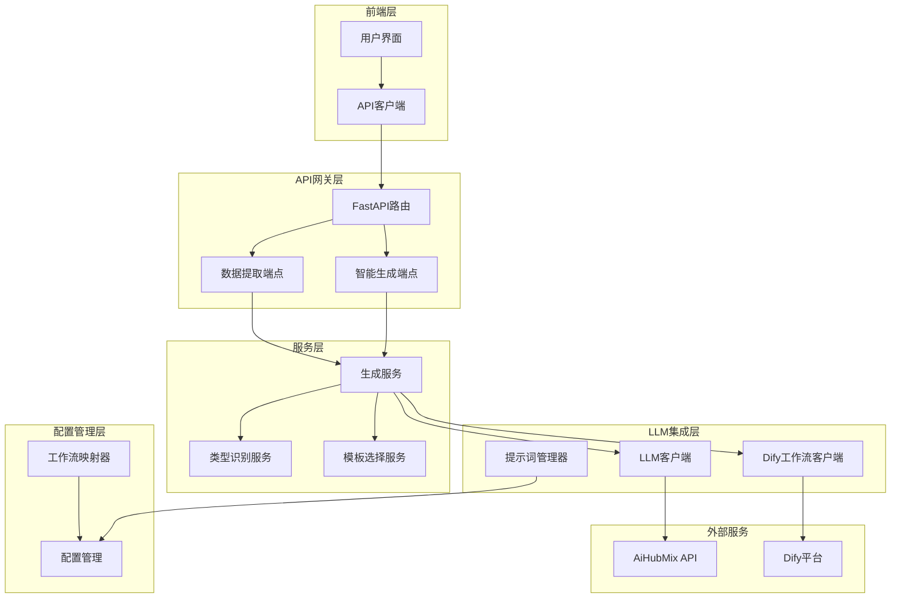

**架构图来源**
- [generate_service.py](file://backend/app/services/generate_service.py#L33-L46)
- [llm_client.py](file://backend/app/services/llm_client.py#L14-L28)
- [dify_workflow_client.py](file://backend/app/services/dify_workflow_client.py#L15-L30)

## 核心组件分析

### LLM客户端 (LLMClient)

LLM客户端是系统的核心组件，负责与AiHubMix API的通信，封装了OpenAI SDK的使用方式。

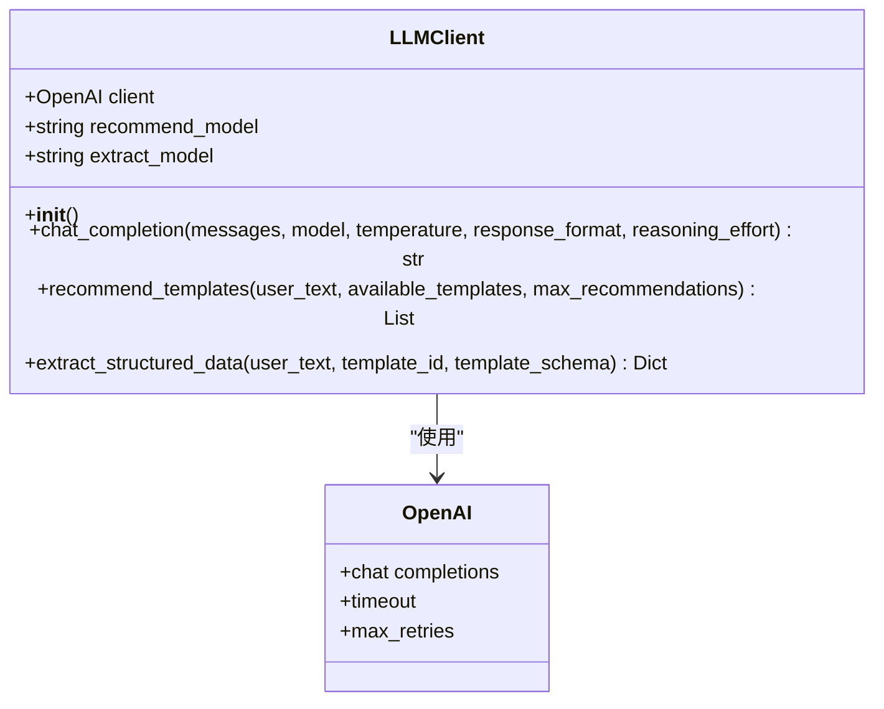

**类图来源**
- [llm_client.py](file://backend/app/services/llm_client.py#L14-L28)

#### 主要功能特性

1. **模型管理**：支持推荐模型和提取模型的差异化配置
2. **参数适配**：根据模型类型自动调整API参数（如reasoning_effort）
3. **响应格式控制**：支持JSON格式输出的自动处理
4. **智能推理支持**：针对o1/o3系列推理模型的特殊处理

**章节来源**
- [llm_client.py](file://backend/app/services/llm_client.py#L30-L89)

### Dify工作流客户端 (DifyWorkflowClient)

Dify工作流客户端专门负责与Dify平台的集成，支持阻塞模式的API调用。

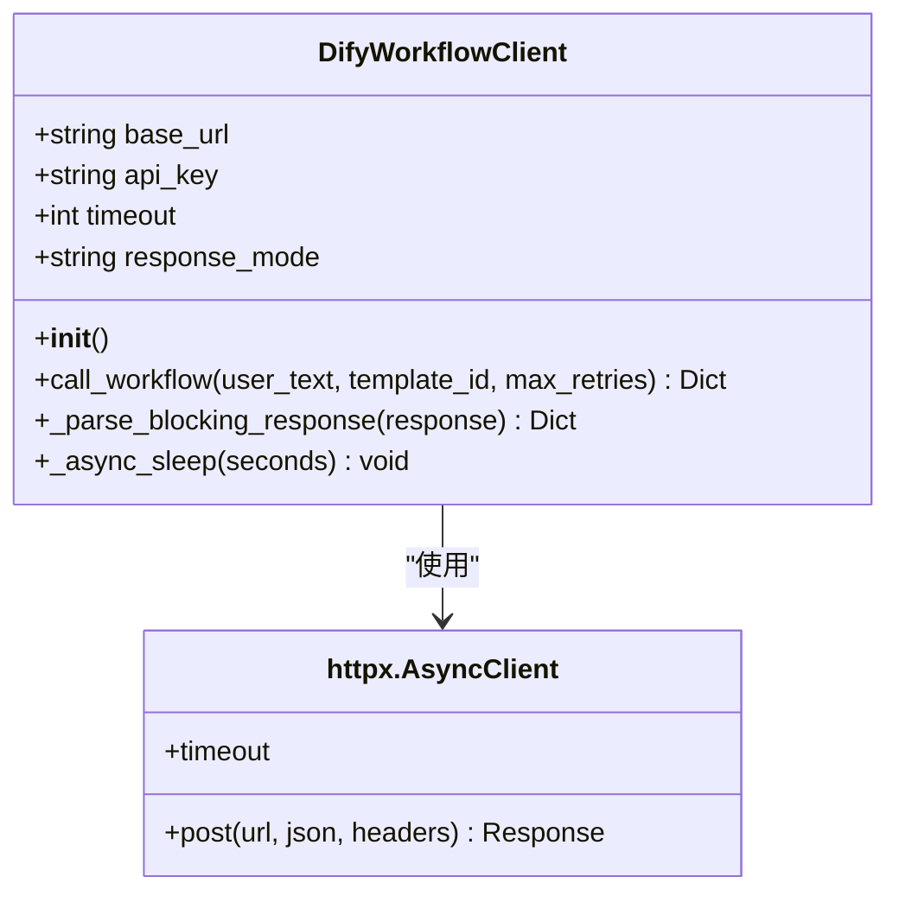

**类图来源**
- [dify_workflow_client.py](file://backend/app/services/dify_workflow_client.py#L15-L30)

#### 工作流调用流程

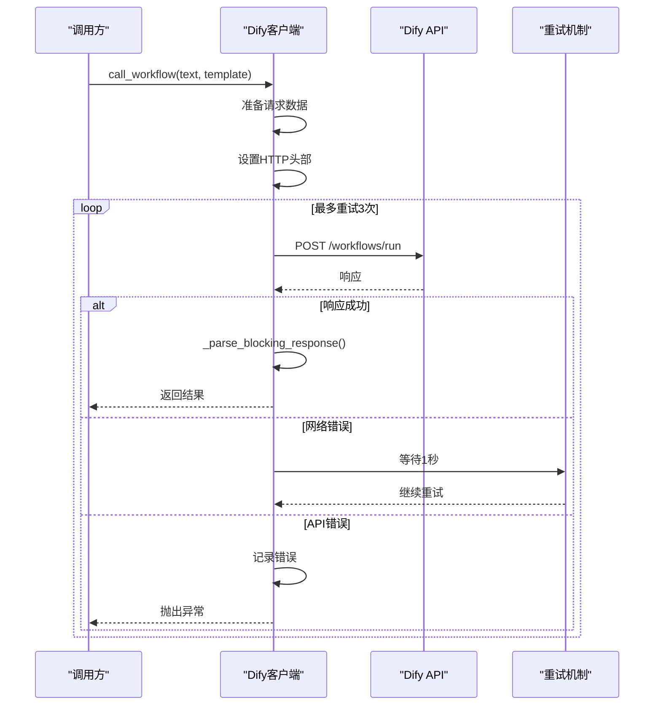

**序列图来源**
- [dify_workflow_client.py](file://backend/app/services/dify_workflow_client.py#L31-L132)

**章节来源**
- [dify_workflow_client.py](file://backend/app/services/dify_workflow_client.py#L31-L132)

### 生成服务 (GenerateService)

生成服务是整个LLM集成的核心协调器，实现了智能生成的三阶段流程。

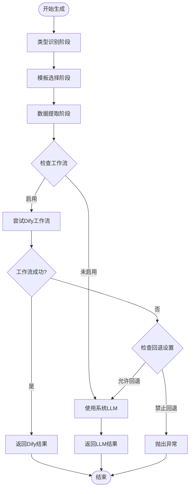

**流程图来源**
- [generate_service.py](file://backend/app/services/generate_service.py#L47-L118)

**章节来源**
- [generate_service.py](file://backend/app/services/generate_service.py#L47-L118)

## 提示词管理系统

### PromptManager架构

提示词管理系统通过YAML配置文件和动态加载机制，提供了灵活的提示词模板管理。

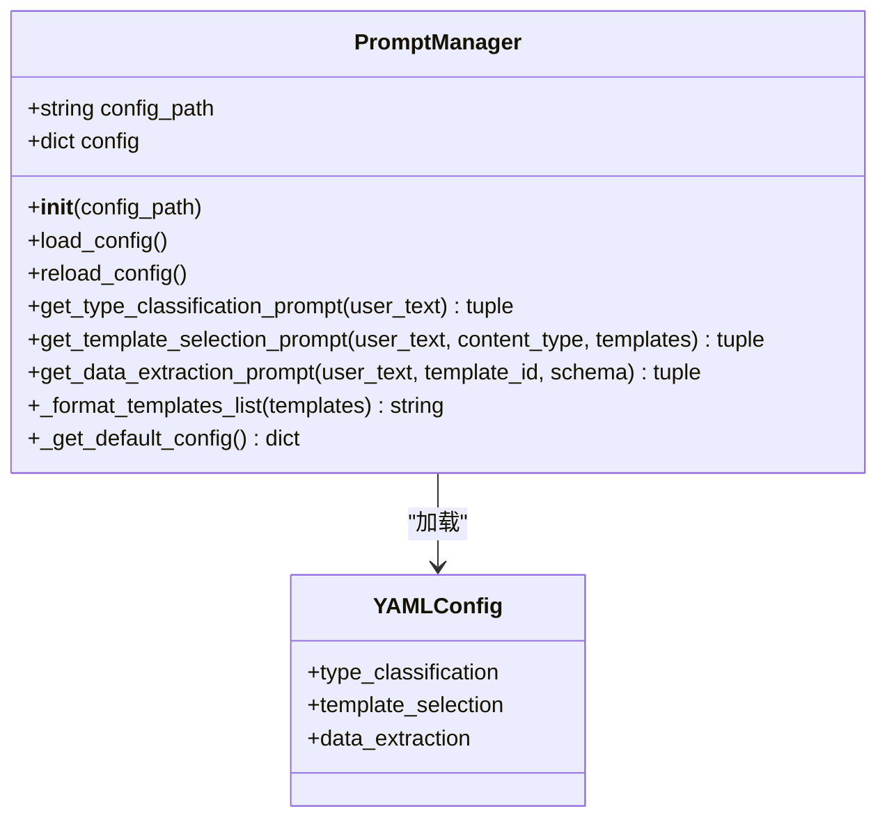

**类图来源**
- [prompt_manager.py](file://backend/app/utils/prompt_manager.py#L14-L34)

### 提示词模板结构

系统定义了三种核心提示词模板：

| 模板类型 | 功能描述 | 主要用途 | 输出格式 |
|---------|---------|---------|---------|
| type_classification | 内容类型识别 | 文本分类和类型判断 | JSON对象，包含type、confidence、reason |
| template_selection | 模板选择推荐 | 从候选模板中选择最佳匹配 | JSON对象，包含templateId、confidence、reason |
| data_extraction | 结构化数据提取 | 从文本中提取关键信息 | JSON对象，符合AntV Infographic schema |

**章节来源**
- [llm_prompts.yaml](file://backend/app/config/llm_prompts.yaml#L1-L201)
- [prompt_manager.py](file://backend/app/utils/prompt_manager.py#L58-L154)

### 动态提示词生成

系统提供了专门的提示词生成函数，用于在运行时动态构建复杂的提示词内容。

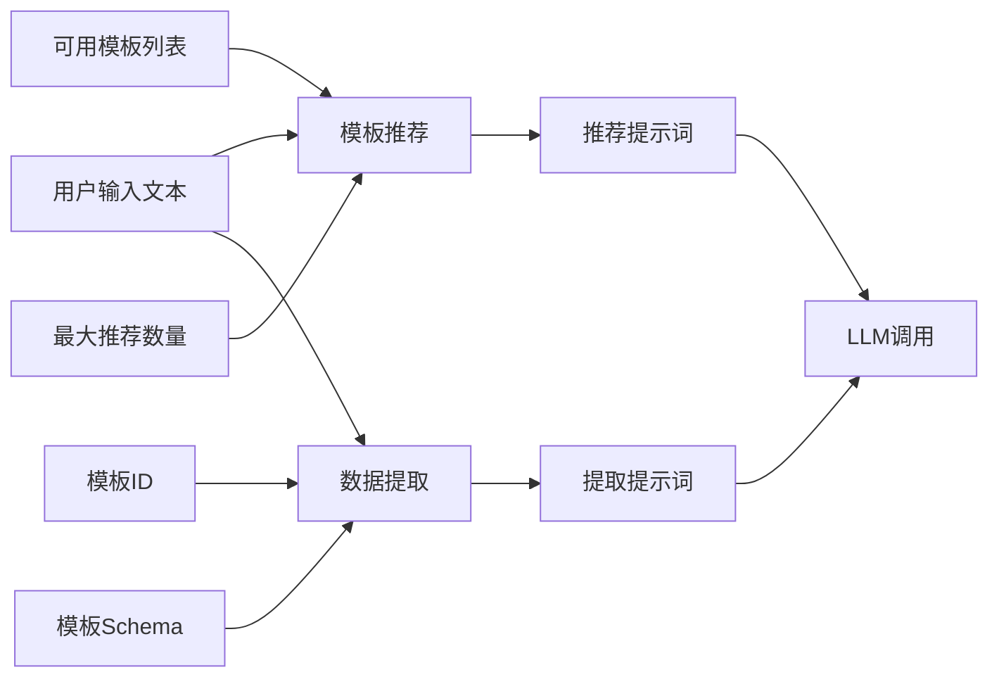

**流程图来源**
- [prompts.py](file://backend/app/utils/prompts.py#L9-L128)
- [prompts.py](file://backend/app/utils/prompts.py#L131-L208)

**章节来源**
- [prompts.py](file://backend/app/utils/prompts.py#L9-L208)

## 配置化设计

### 工作流映射配置

系统通过dify_workflows.yaml文件实现了模板ID到Dify工作流的灵活映射。

```yaml
# 示例配置结构
chart-column-simple:
  dify_app_id: null
  workflow_name: "chart-column-simple数据生成工作流"
  enabled: true
  fallback_to_system_llm: true
```

### 配置管理架构

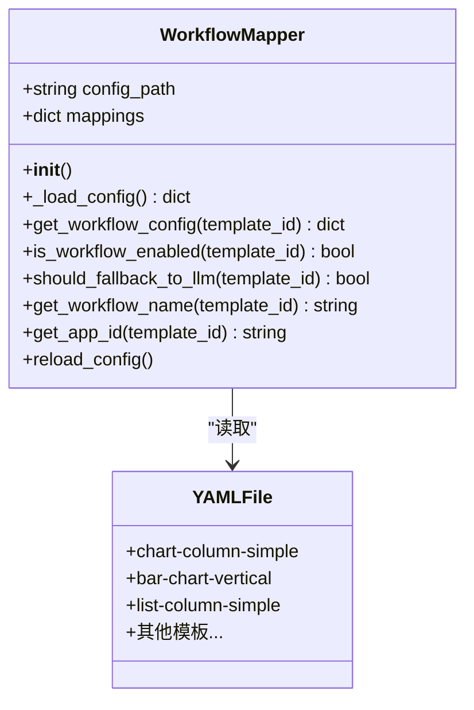

**类图来源**
- [workflow_mapper.py](file://backend/app/services/workflow_mapper.py#L13-L25)

### 配置优先级机制

系统实现了多层次的配置优先级：

1. **环境变量**：最高优先级，用于运行时覆盖
2. **YAML配置**：标准配置文件
3. **默认值**：系统内置的后备配置

**章节来源**
- [dify_workflows.yaml](file://backend/app/config/dify_workflows.yaml#L1-L81)
- [workflow_mapper.py](file://backend/app/services/workflow_mapper.py#L13-L141)

## 错误处理与重试机制

### 多层次错误处理

系统实现了完整的错误处理链路，涵盖网络、API、业务逻辑等多个层面。

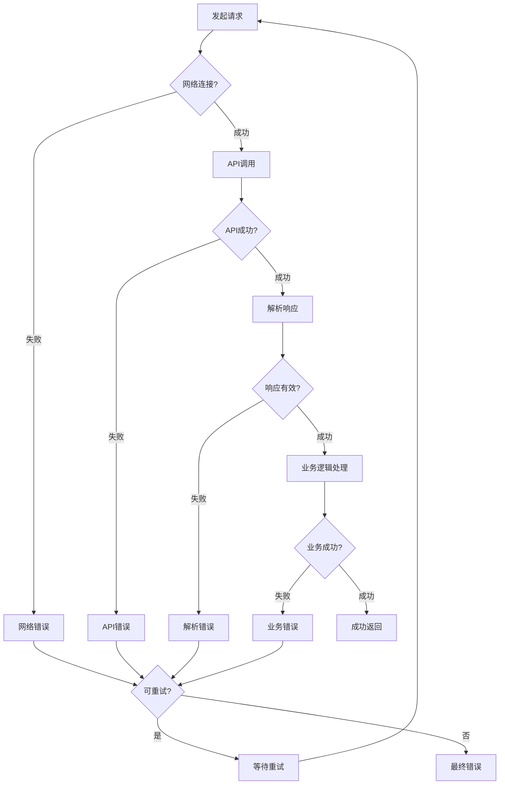

### 重试策略实现

Dify工作流客户端实现了指数退避的重试机制：

```python
# 重试逻辑示例
for attempt in range(1, max_retries + 1):
    try:
        # API调用逻辑
        response = await client.post(url, json=payload, headers=headers)
        break  # 成功则退出循环
    except Exception as e:
        if attempt < max_retries:
            await self._async_sleep(1)  # 等待1秒后重试
```

### 异常类型处理

| 异常类型 | 处理策略 | 重试次数 | 超时设置 |
|---------|---------|---------|---------|
| APITimeoutError | 立即重试 | 3次 | 30秒 |
| RateLimitError | 立即重试 | 3次 | 30秒 |
| APIError | 记录错误，可重试 | 3次 | 30秒 |
| HTTP超时 | 等待后重试 | 3次 | 30秒 |
| 网络错误 | 等待后重试 | 3次 | 30秒 |

**章节来源**
- [dify_workflow_client.py](file://backend/app/services/dify_workflow_client.py#L80-L132)
- [llm_client.py](file://backend/app/services/llm_client.py#L81-L92)

## LLM调用流程

### 智能生成流程

智能生成是系统的主打功能，实现了完整的三阶段AI驱动流程。

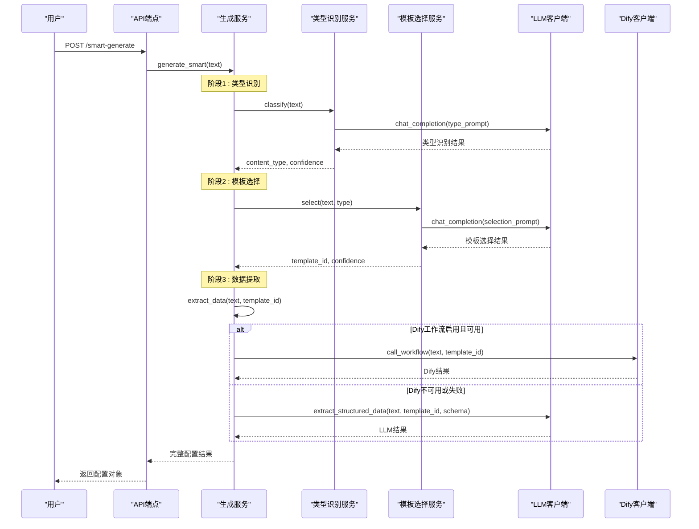

**序列图来源**
- [generate_service.py](file://backend/app/services/generate_service.py#L47-L118)

### 数据提取流程

数据提取是系统的核心功能，支持两种不同的数据生成方式。

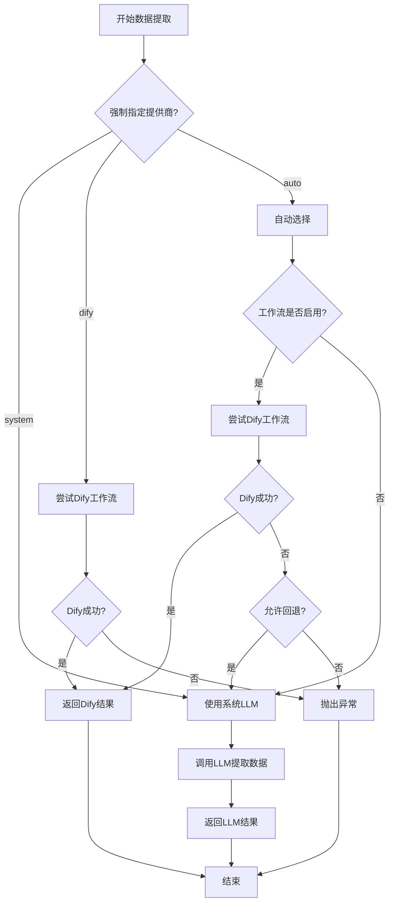

**流程图来源**
- [generate_service.py](file://backend/app/services/generate_service.py#L159-L257)

**章节来源**
- [generate_service.py](file://backend/app/services/generate_service.py#L47-L257)

## 性能优化策略

### 连接池管理

系统通过配置适当的超时和重试参数来优化性能：

- **API超时**：30秒基础超时
- **最大重试**：3次重试机会
- **连接复用**：使用httpx的连接池

### 缓存策略

- **配置缓存**：提示词配置和工作流映射采用内存缓存
- **单例模式**：客户端和服务类采用单例模式减少初始化开销

### 并发处理

- **异步调用**：所有API调用采用async/await模式
- **并发限制**：通过httpx的AsyncClient控制并发连接数

## 故障排除指南

### 常见问题诊断

| 问题类型 | 症状描述 | 可能原因 | 解决方案 |
|---------|---------|---------|---------|
| API超时 | 请求超时异常 | 网络延迟、服务器负载 | 增加超时时间，检查网络连接 |
| 配额限制 | RateLimitError | API调用频率过高 | 降低调用频率，检查配额使用 |
| 认证失败 | 401 Unauthorized | API密钥无效 | 检查.env配置文件中的API密钥 |
| 工作流失败 | Dify工作流调用失败 | 工作流配置错误 | 检查dify_workflows.yaml配置 |
| JSON解析错误 | JSONDecodeError | LLM返回格式错误 | 检查提示词模板，调整模型参数 |

### 调试工具

系统提供了专门的调试端点来诊断配置问题：

```python
@router.get("/debug/workflow-mapper")
async def debug_workflow_mapper():
    """调试端点：查看WorkflowMapper的状态"""
    mapper = get_workflow_mapper()
    # 返回配置路径、映射数量、测试结果等信息
```

**章节来源**
- [generate.py](file://backend/app/api/v1/generate.py#L90-L115)

## 总结

本LLM集成机制通过精心设计的架构，实现了以下核心价值：

### 技术优势

1. **灵活性**：支持多种LLM提供商和调用模式
2. **可靠性**：完善的错误处理和重试机制
3. **可扩展性**：模块化设计便于功能扩展
4. **易维护性**：配置化管理和清晰的职责分离

### 应用价值

- **智能生成**：通过三阶段流程实现高质量的信息图生成
- **成本优化**：Dify工作流提供更经济的数据生成功能
- **质量保证**：系统LLM作为后备保障，确保服务稳定性
- **用户体验**：无缝切换的AI服务调用，提升用户满意度

### 发展方向

1. **模型优化**：持续优化提示词模板和调用参数
2. **性能提升**：引入更多的缓存和并发优化策略
3. **功能扩展**：支持更多类型的LLM提供商和工作流
4. **监控增强**：增加更详细的性能监控和日志记录

这套LLM集成机制为AntV Infographic系统提供了强大的AI能力支撑，是现代AI驱动应用开发的最佳实践范例。