# 业务服务

<cite>
**本文档中引用的文件**
- [generate_service.py](file://backend/app/services/generate_service.py)
- [template_service.py](file://backend/app/services/template_service.py)
- [export_service.py](file://backend/app/services/export_service.py)
- [llm_client.py](file://backend/app/services/llm_client.py)
- [dify_workflow_client.py](file://backend/app/services/dify_workflow_client.py)
- [template_selection_service.py](file://backend/app/services/template_selection_service.py)
- [type_classification_service.py](file://backend/app/services/type_classification_service.py)
- [data_validator.py](file://backend/app/services/data_validator.py)
- [config_assembler.py](file://backend/app/services/config_assembler.py)
- [workflow_mapper.py](file://backend/app/services/workflow_mapper.py)
- [generate.py](file://backend/app/api/v1/generate.py)
- [templates.py](file://backend/app/api/v1/templates.py)
- [export.py](file://backend/app/api/v1/export.py)
- [config.py](file://backend/app/config.py)
- [dify_workflows.yaml](file://backend/app/config/dify_workflows.yaml)
- [llm_prompts.yaml](file://backend/app/config/llm_prompts.yaml)
</cite>

## 目录
1. [简介](#简介)
2. [系统架构概览](#系统架构概览)
3. [核心业务服务](#核心业务服务)
4. [生成服务详解](#生成服务详解)
5. [模板服务详解](#模板服务详解)
6. [导出服务详解](#导出服务详解)
7. [LLM客户端详解](#llm客户端详解)
8. [服务间依赖关系](#服务间依赖关系)
9. [关键业务流程](#关键业务流程)
10. [可扩展性设计](#可扩展性设计)
11. [总结](#总结)

## 简介

本文档深入解析AntV信息图生成系统的核心业务服务架构。该系统采用微服务化设计，通过多个专业化的服务协同工作，实现从用户文本输入到信息图生成的完整流程。系统支持智能生成和传统提取两种模式，具备强大的模板管理、多格式导出和LLM集成能力。

## 系统架构概览

系统采用分层架构设计，主要包含以下几个层次：

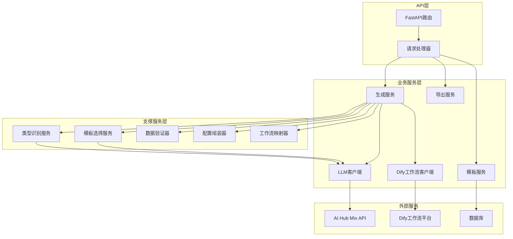

**图表来源**
- [generate_service.py](file://backend/app/services/generate_service.py#L33-L465)
- [template_service.py](file://backend/app/services/template_service.py#L160-L281)
- [export_service.py](file://backend/app/services/export_service.py#L19-L670)

## 核心业务服务

系统包含以下核心业务服务，每个服务都有明确的职责边界：

### 服务职责矩阵

| 服务名称 | 主要职责 | 核心功能 | 外部依赖 |
|---------|---------|---------|---------|
| 生成服务 | 智能生成流程协调 | 三阶段流程、模板推荐 | LLM客户端、模板服务、工作流客户端 |
| 模板服务 | 模板管理 | 模板检索、分类管理 | 数据库、模板仓库 |
| 导出服务 | 多格式导出 | SVG/PNG/PDF/PPTX导出 | CairoSVG、python-pptx |
| LLM客户端 | AI服务集成 | 模板推荐、数据提取 | OpenAI兼容API |
| Dify工作流客户端 | 工作流调用 | Dify API集成 | Dify平台 |

**章节来源**
- [generate_service.py](file://backend/app/services/generate_service.py#L33-L465)
- [template_service.py](file://backend/app/services/template_service.py#L160-L281)
- [export_service.py](file://backend/app/services/export_service.py#L19-L670)

## 生成服务详解

生成服务是系统的核心协调器，负责整个智能生成流程的 orchestration。它采用三阶段流水线架构，支持多种数据提取方式。

### 三阶段智能生成流程

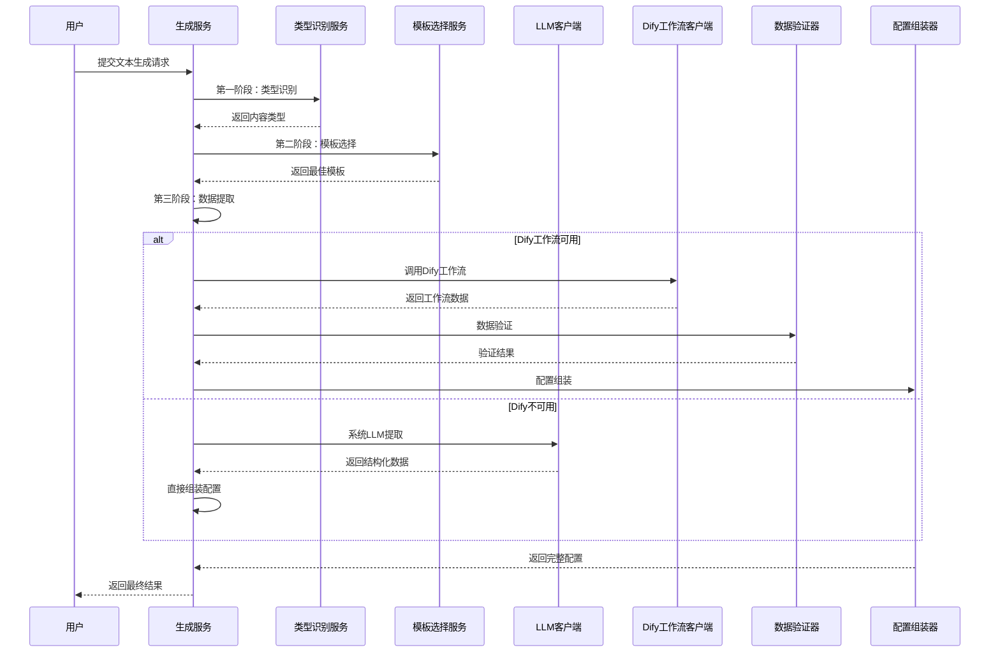

**图表来源**
- [generate_service.py](file://backend/app/services/generate_service.py#L47-L118)
- [type_classification_service.py](file://backend/app/services/type_classification_service.py#L22-L80)
- [template_selection_service.py](file://backend/app/services/template_selection_service.py#L24-L88)

### 数据提取策略

生成服务实现了灵活的数据提取策略，优先使用Dify工作流，失败时自动回退到系统LLM：

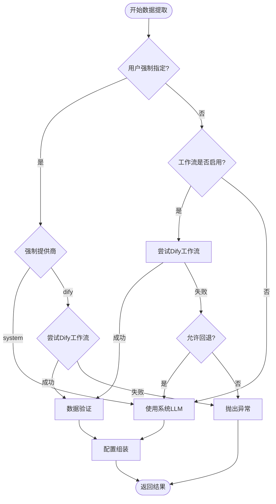

**图表来源**
- [generate_service.py](file://backend/app/services/generate_service.py#L159-L257)

**章节来源**
- [generate_service.py](file://backend/app/services/generate_service.py#L33-L465)

## 模板服务详解

模板服务负责管理AntV信息图的所有模板资源，提供完整的模板生命周期管理功能。

### 模板分类体系

系统支持7大分类的模板体系，每个分类都有明确的特征和适用场景：

| 分类 | 特征 | 关键词 | 适用场景 | 示例模板 |
|------|------|--------|----------|----------|
| 图表型 | 数值数据、统计信息 | 数据、增长率、百分比 | 销售数据、KPI指标 | bar-chart-vertical |
| 对比型 | 两个或多个事物对比 | VS、对比、优劣势 | 产品对比、竞品分析 | comparison-column |
| 层级型 | 上下级、父子关系 | 组织架构、层级、等级 | 公司架构、会员等级 | org-tree |
| 列表型 | 并列项目、要点 | 要点、步骤、特性 | 产品功能、解决方案 | list-column-simple |
| 四象限型 | 两个维度划分 | 矩阵、象限、维度 | 时间管理、SWOT分析 | quadrant-swot |
| 关系型 | 元素之间关联 | 关系、因果、影响 | 因果分析、业务流程 | mindmap-radial |
| 顺序型 | 时间线、流程 | 步骤、流程、顺序 | 操作流程、项目进度 | timeline-horizontal |

### 模板设计映射

模板服务维护了一个设计配置映射表，将模板ID映射到具体的AntV设计配置：

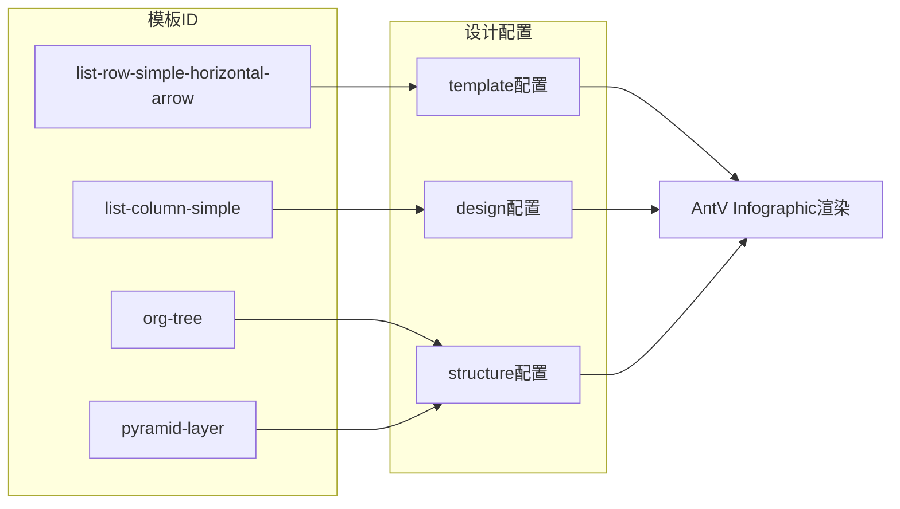

**图表来源**
- [template_service.py](file://backend/app/services/template_service.py#L12-L96)

**章节来源**
- [template_service.py](file://backend/app/services/template_service.py#L160-L281)

## 导出服务详解

导出服务提供了完整的多格式导出能力，支持SVG、PNG、PDF和PPTX四种主流格式。

### 支持的导出格式

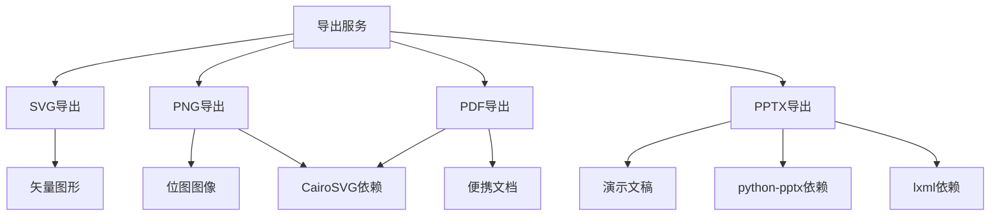

**图表来源**
- [export_service.py](file://backend/app/services/export_service.py#L10-L16)

### PPTX导出特殊处理

PPTX导出是最复杂的格式，需要特殊的SVG转换处理：

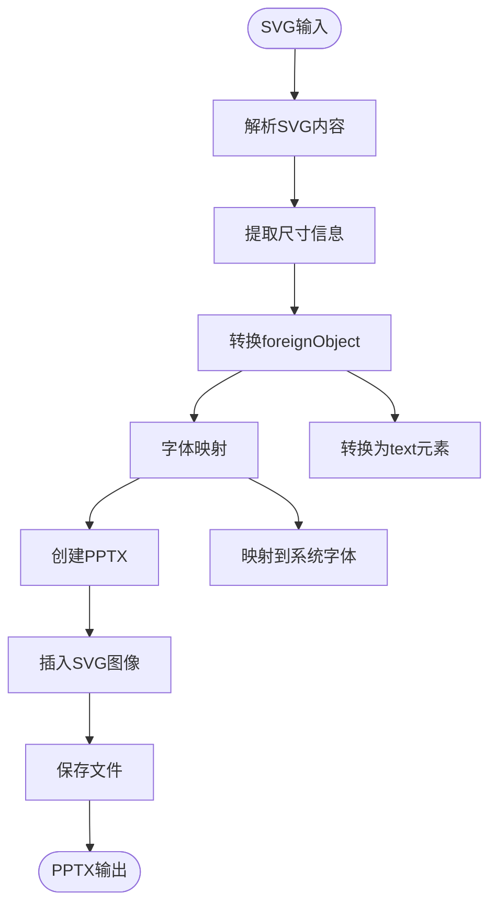

**图表来源**
- [export_service.py](file://backend/app/services/export_service.py#L129-L220)

**章节来源**
- [export_service.py](file://backend/app/services/export_service.py#L19-L670)

## LLM客户端详解

LLM客户端封装了与AI Hub Mix API的通信，提供模板推荐和数据提取功能。

### 支持的模型系列

系统支持多种AI模型，包括推理模型和生成模型：

| 模型系列 | 特点 | 用途 | 参数支持 |
|---------|------|------|----------|
| GPT-4系列 | 通用生成能力 | 数据提取、模板推荐 | temperature, response_format |
| o1系列 | 强推理能力 | 复杂数据分析 | reasoning_effort |
| o3系列 | 高级推理 | 复杂决策分析 | reasoning_effort |

### 请求处理流程

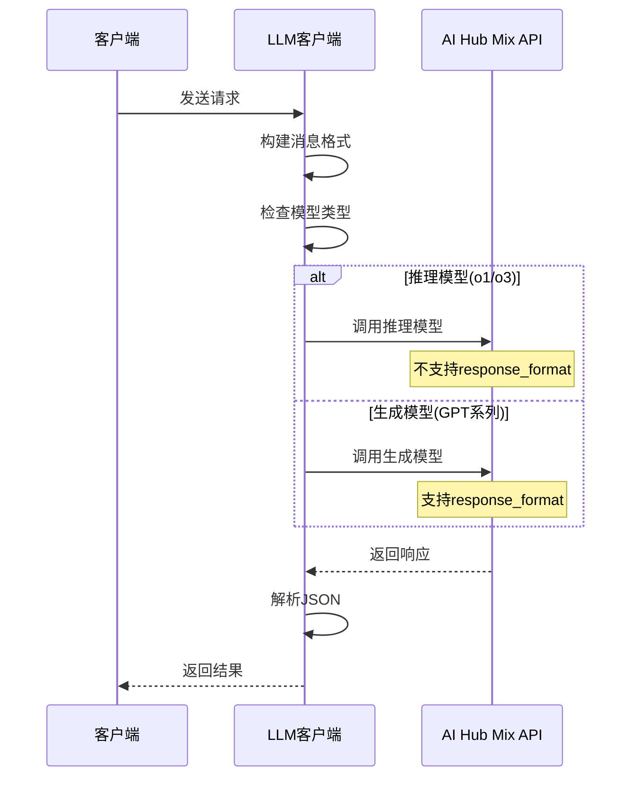

**图表来源**
- [llm_client.py](file://backend/app/services/llm_client.py#L30-L92)

**章节来源**
- [llm_client.py](file://backend/app/services/llm_client.py#L14-L217)

## 服务间依赖关系

系统采用依赖注入模式，通过全局服务实例实现松耦合设计。

### 依赖关系图

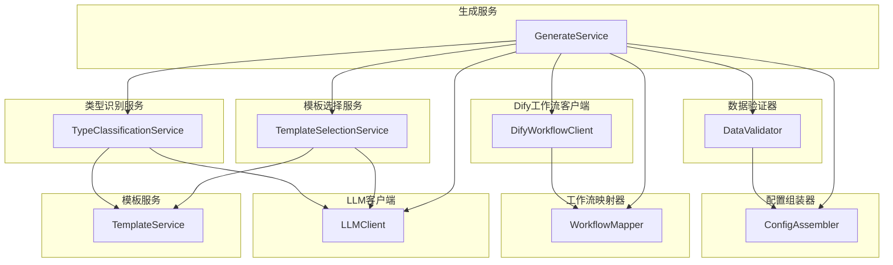

**图表来源**
- [generate_service.py](file://backend/app/services/generate_service.py#L36-L45)
- [template_selection_service.py](file://backend/app/services/template_selection_service.py#L18-L22)
- [type_classification_service.py](file://backend/app/services/type_classification_service.py#L17-L21)

### 服务初始化机制

每个服务都采用单例模式，通过工厂函数获取实例：

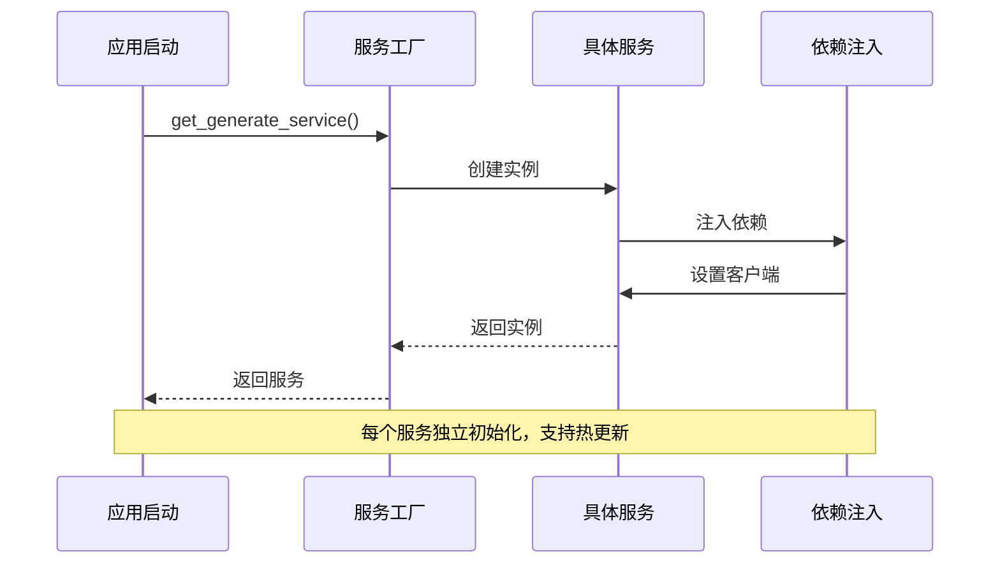

**图表来源**
- [generate_service.py](file://backend/app/services/generate_service.py#L459-L465)

**章节来源**
- [generate_service.py](file://backend/app/services/generate_service.py#L33-L465)
- [template_selection_service.py](file://backend/app/services/template_selection_service.py#L159-L169)
- [type_classification_service.py](file://backend/app/services/type_classification_service.py#L139-L149)

## 关键业务流程

### AI智能生成流程

智能生成是系统的核心功能，通过三阶段流程实现从文本到信息图的完整转换：

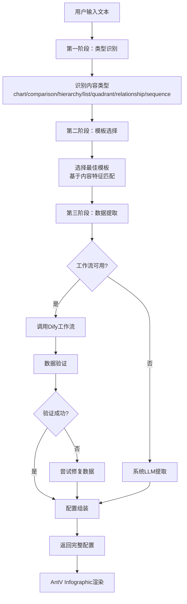

**图表来源**
- [generate_service.py](file://backend/app/services/generate_service.py#L47-L118)

### 模板推荐流程

模板推荐功能帮助用户快速找到合适的可视化模板：

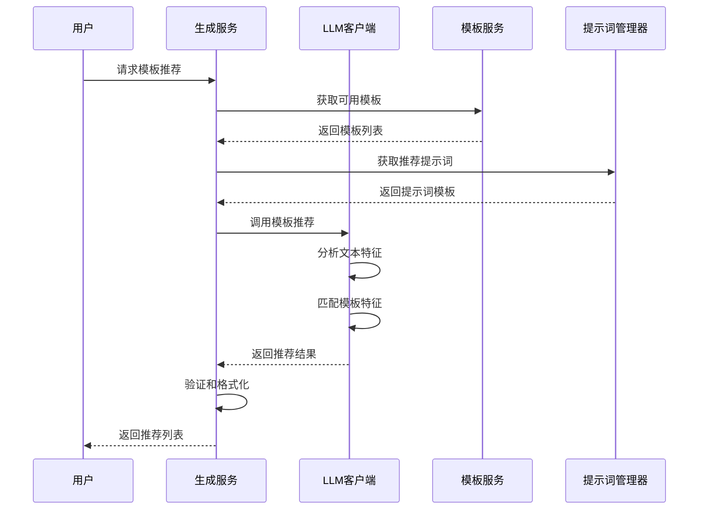

**图表来源**
- [generate_service.py](file://backend/app/services/generate_service.py#L124-L157)
- [template_selection_service.py](file://backend/app/services/template_selection_service.py#L24-L88)

**章节来源**
- [generate_service.py](file://backend/app/services/generate_service.py#L47-L157)

## 可扩展性设计

系统设计充分考虑了未来的扩展需求，支持多种扩展方式。

### 扩展点分析

| 扩展类型 | 扩展方式 | 实现示例 | 影响范围 |
|---------|---------|---------|----------|
| 新LLM提供商 | 实现客户端接口 | 添加新的LLM客户端 | 生成服务、模板服务 |
| 新导出格式 | 扩展导出服务 | 添加新格式处理器 | 导出服务 |
| 新模板类型 | 更新模板映射 | 添加新的设计配置 | 模板服务 |
| 新工作流 | 配置工作流映射 | 更新YAML配置 | 工作流映射器 |

### 配置驱动的扩展

系统通过配置文件实现部分功能的动态扩展：

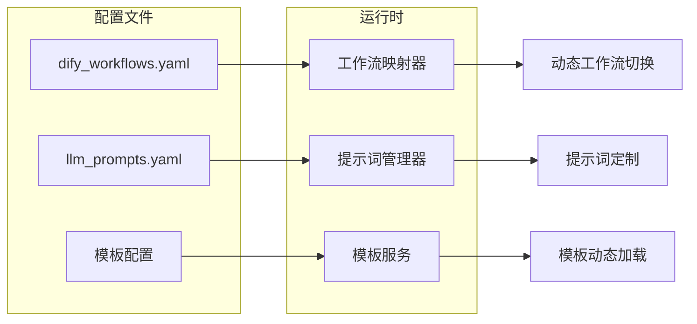

**图表来源**
- [workflow_mapper.py](file://backend/app/services/workflow_mapper.py#L13-L26)
- [dify_workflows.yaml](file://backend/app/config/dify_workflows.yaml#L1-L81)

### 热更新支持

系统支持配置的热更新，无需重启服务即可应用新配置：

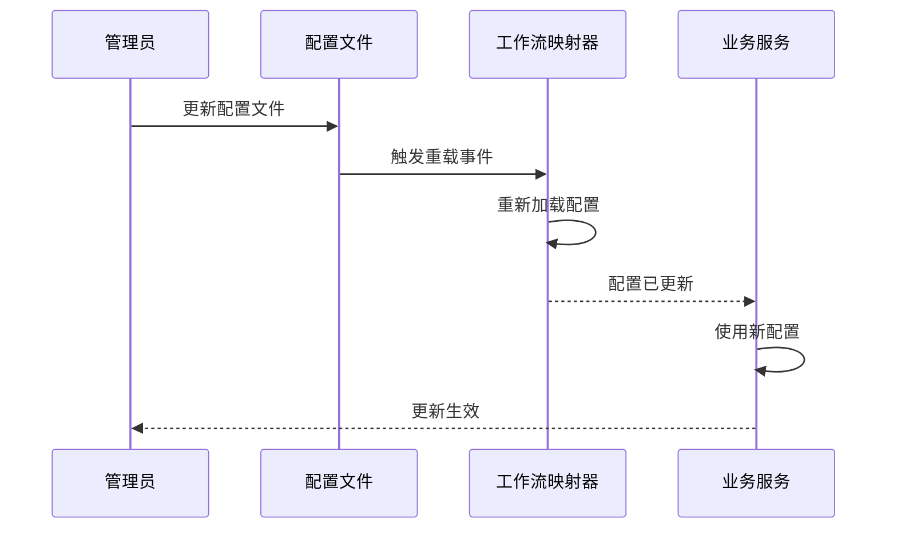

**图表来源**
- [workflow_mapper.py](file://backend/app/services/workflow_mapper.py#L138-L142)

**章节来源**
- [workflow_mapper.py](file://backend/app/services/workflow_mapper.py#L13-L157)
- [config.py](file://backend/app/config.py#L48-L51)

## 总结

AntV信息图生成系统的业务服务架构体现了现代软件设计的最佳实践：

1. **模块化设计**：每个服务都有明确的职责边界，便于维护和扩展
2. **依赖注入**：通过工厂模式实现松耦合，支持热更新和测试
3. **流程编排**：生成服务作为协调器，整合多个专业服务
4. **容错机制**：多重回退策略确保服务的可靠性
5. **配置驱动**：通过配置文件实现功能的动态扩展
6. **多格式支持**：导出服务提供完整的格式转换能力

这种设计使得系统既具备强大的功能，又保持了良好的可维护性和可扩展性，为未来的功能增强奠定了坚实的基础。开发者可以通过简单的配置变更或新增服务来扩展系统功能，而无需修改核心业务逻辑。