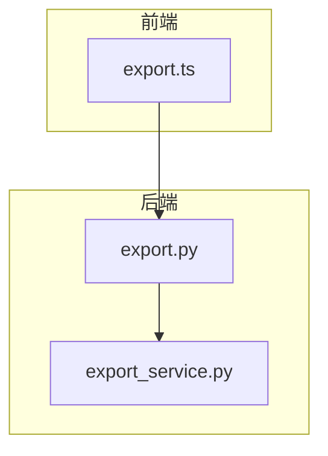
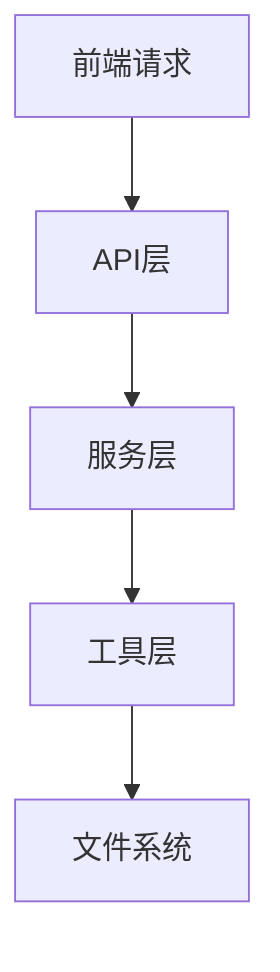
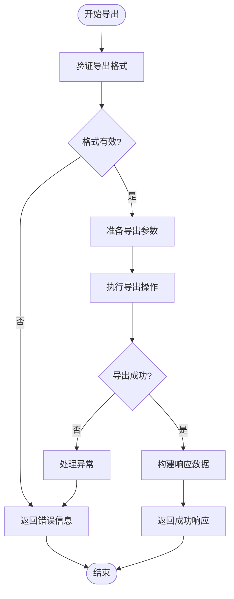
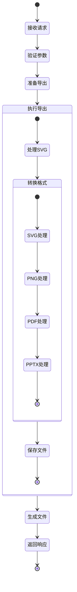
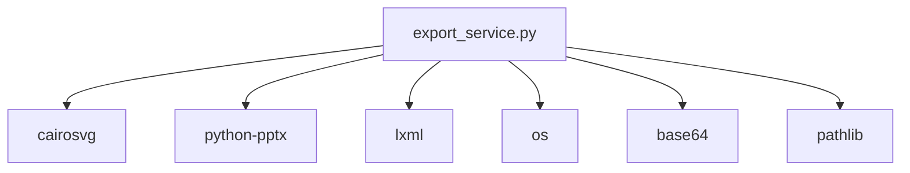

# 导出服务

<cite>
**本文档引用的文件**
- [export_service.py](file://backend/app/services/export_service.py)
- [export.py](file://backend/app/api/v1/export.py)
- [export.ts](file://frontend/src/api/export.ts)
</cite>

## 目录
1. [简介](#简介)
2. [项目结构](#项目结构)
3. [核心组件](#核心组件)
4. [架构概述](#架构概述)
5. [详细组件分析](#详细组件分析)
6. [依赖分析](#依赖分析)
7. [性能考虑](#性能考虑)
8. [故障排除指南](#故障排除指南)
9. [结论](#结论)

## 简介
导出服务是系统中的关键组件，负责将AntV Infographic生成的原始数据转换为多种格式的文件。该服务支持SVG、PNG、PDF和PPTX四种导出格式，满足不同场景下的使用需求。通过统一的导出接口，服务能够接收前端传递的SVG内容，并根据指定的格式进行相应的转换处理。对于PPTX格式，服务特别实现了将SVG元素转换为PowerPoint可识别的形状和文本的功能，确保导出的演示文稿具有良好的兼容性和可编辑性。整个导出过程采用异步处理机制，配合临时文件存储策略，保证了大文件导出的稳定性和性能。此外，服务还提供了导出质量控制功能，包括分辨率设置、字体嵌入和颜色管理等，确保输出文件的高质量。

## 项目结构
导出服务的实现分布在前后端多个模块中，形成了一个完整的导出功能体系。后端主要由API接口和导出服务两部分组成，前端则提供了相应的API调用封装。



**图表来源**
- [export.ts](file://frontend/src/api/export.ts)
- [export.py](file://backend/app/api/v1/export.py)
- [export_service.py](file://backend/app/services/export_service.py)

**章节来源**
- [export_service.py](file://backend/app/services/export_service.py)
- [export.py](file://backend/app/api/v1/export.py)

## 核心组件
导出服务的核心组件主要包括导出服务类(ExportService)和导出API接口。ExportService类提供了针对不同格式的导出方法，包括export_svg、export_png、export_pdf和export_pptx，每个方法都针对特定格式的特点进行了优化处理。其中，PPTX导出是服务中最复杂的部分，需要将SVG中的foreignObject元素转换为PowerPoint可识别的文本元素，并处理字体、颜色等样式信息。导出API接口则作为前后端的桥梁，接收前端的导出请求，调用相应的导出服务方法，并返回处理结果。整个导出流程从接收到SVG内容开始，经过格式验证、参数处理、文件生成等步骤，最终返回包含文件信息的响应。

**章节来源**
- [export_service.py](file://backend/app/services/export_service.py#L19-L670)
- [export.py](file://backend/app/api/v1/export.py#L38-L208)

## 架构概述
导出服务的架构设计遵循了分层原则，将业务逻辑与API接口分离，提高了代码的可维护性和可扩展性。整体架构分为三层：API层、服务层和工具层。API层负责处理HTTP请求和响应，定义了导出、下载和清理等接口。服务层实现了具体的导出逻辑，包括各种格式的转换处理。工具层提供了一系列辅助方法，如SVG转换、样式解析、字体映射等，支持服务层的功能实现。



**图表来源**
- [export.py](file://backend/app/api/v1/export.py)
- [export_service.py](file://backend/app/services/export_service.py)

## 详细组件分析

### 导出服务分析
导出服务是整个导出功能的核心，实现了多种格式的导出能力。服务采用单例模式，确保在整个应用生命周期内只有一个实例存在，避免了资源浪费。

#### 对于面向对象的组件：
```mermaid
classDiagram
class ExportService {
+temp_dir Path
+__init__()
+export_svg(svg_content, filename) dict
+export_png(svg_content, filename, width, height, scale) dict
+export_pdf(svg_content, filename) dict
+export_pptx(svg_content, title, filename) dict
+export(svg_content, format, **kwargs) dict
+get_base64(filepath) str
+cleanup(filepath)
+_convert_svg_for_ppt(svg_content) str
+_convert_foreign_object_to_text(foreign_object) ET.Element
+_parse_style(style_str) dict
+_extract_number(value) float
+_rgb_to_hex(rgb) str
+_map_to_system_font(font_family) str
+_insert_svg_to_pptx(input_pptx, output_pptx, svg_content, left, top, width, height)
+_create_svg_picture_element(namespaces, x, y, cx, cy, rid) ET.Element
}
ExportService : temp_dir : Path
ExportService : __init__()
ExportService : export_svg(svg_content, filename) dict
ExportService : export_png(svg_content, filename, width, height, scale) dict
ExportService : export_pdf(svg_content, filename) dict
ExportService : export_pptx(svg_content, title, filename) dict
ExportService : export(svg_content, format, **kwargs) dict
ExportService : get_base64(filepath) str
ExportService : cleanup(filepath)
ExportService : _convert_svg_for_ppt(svg_content) str
ExportService : _convert_foreign_object_to_text(foreign_object) ET.Element
ExportService : _parse_style(style_str) dict
ExportService : _extract_number(value) float
ExportService : _rgb_to_hex(rgb) str
ExportService : _map_to_system_font(font_family) str
ExportService : _insert_svg_to_pptx(input_pptx, output_pptx, svg_content, left, top, width, height)
ExportService : _create_svg_picture_element(namespaces, x, y, cx, cy, rid) ET.Element
```

**图表来源**
- [export_service.py](file://backend/app/services/export_service.py#L19-L670)

#### 对于API/服务组件：
```mermaid
sequenceDiagram
participant 前端 as 前端
participant API as export.py
participant 服务 as export_service.py
前端->>API : POST /api/v1/export
API->>API : 验证请求参数
API->>服务 : 调用export方法
服务->>服务 : 根据格式调用相应导出方法
alt SVG格式
服务->>服务 : export_svg
elif PNG格式
服务->>服务 : export_png
elif PDF格式
服务->>服务 : export_pdf
else PPTX格式
服务->>服务 : export_pptx
end
服务-->>API : 返回文件信息
API-->>前端 : 返回APIResponse
```

**图表来源**
- [export.py](file://backend/app/api/v1/export.py#L38-L107)
- [export_service.py](file://backend/app/services/export_service.py#L232-L255)

#### 对于复杂逻辑组件：


**图表来源**
- [export.py](file://backend/app/api/v1/export.py#L54-L107)

**章节来源**
- [export_service.py](file://backend/app/services/export_service.py#L19-L670)
- [export.py](file://backend/app/api/v1/export.py#L38-L208)

### 导出流程状态分析
导出服务的处理流程可以分为多个阶段，每个阶段都有明确的输入和输出，确保了整个导出过程的可追踪性和可靠性。



**图表来源**
- [export_service.py](file://backend/app/services/export_service.py)
- [export.py](file://backend/app/api/v1/export.py)

## 依赖分析
导出服务依赖于多个第三方库来实现不同格式的转换功能。对于PNG和PDF格式，服务依赖于cairosvg库，该库提供了SVG到位图和PDF的转换能力。对于PPTX格式，服务依赖于python-pptx和lxml库，前者用于创建和操作PowerPoint文件，后者用于处理XML文档。此外，服务还使用了标准库中的os、base64、pathlib等模块来处理文件系统操作和数据编码。这些依赖关系通过requirements.txt文件进行管理，确保了开发环境的一致性。



**图表来源**
- [export_service.py](file://backend/app/services/export_service.py#L4-L8)
- [export.py](file://backend/app/api/v1/export.py#L10)

**章节来源**
- [export_service.py](file://backend/app/services/export_service.py#L4-L8)
- [export.py](file://backend/app/api/v1/export.py#L10)

## 性能考虑
导出服务在设计时充分考虑了性能因素，特别是在处理大文件导出时的稳定性和效率。服务采用异步处理机制，避免了长时间的同步阻塞，提高了系统的响应能力。文件存储策略方面，服务使用临时目录来存储生成的文件，避免了内存占用过高的问题。对于PPTX格式的导出，服务通过直接操作PPTX文件的ZIP结构来插入SVG内容，避免了使用Office自动化组件带来的性能开销和稳定性问题。此外，服务还实现了临时文件的自动清理功能，防止磁盘空间被无限制占用。

## 故障排除指南
在使用导出服务时，可能会遇到一些常见问题。对于依赖库缺失的问题，需要确保已安装cairosvg、python-pptx和lxml等必要的第三方库。对于文件导出失败的情况，可以检查临时目录的写入权限和磁盘空间是否充足。对于PPTX导出后内容显示异常的问题，需要确认SVG中的foreignObject元素是否被正确转换为文本元素，以及字体映射是否正确。在调试过程中，可以通过查看日志信息来定位问题，服务在关键步骤都添加了日志记录，便于问题排查。

**章节来源**
- [export_service.py](file://backend/app/services/export_service.py#L646-L658)
- [export.py](file://backend/app/api/v1/export.py#L108-L121)

## 结论
导出服务通过精心设计的架构和实现，成功地解决了将AntV Infographic生成的SVG内容转换为多种格式文件的需求。服务不仅支持常见的SVG、PNG、PDF格式，还特别实现了PPTX格式的导出，满足了用户在不同场景下的使用需求。通过对PPTX导出流程的深入优化，服务能够将SVG中的复杂元素准确地转换为PowerPoint可识别的形状和文本，保证了导出文件的质量和兼容性。异步处理机制和临时文件存储策略的结合，确保了大文件导出的稳定性和性能。未来可以考虑增加更多导出格式的支持，如Word文档、Excel表格等，进一步提升服务的实用性。