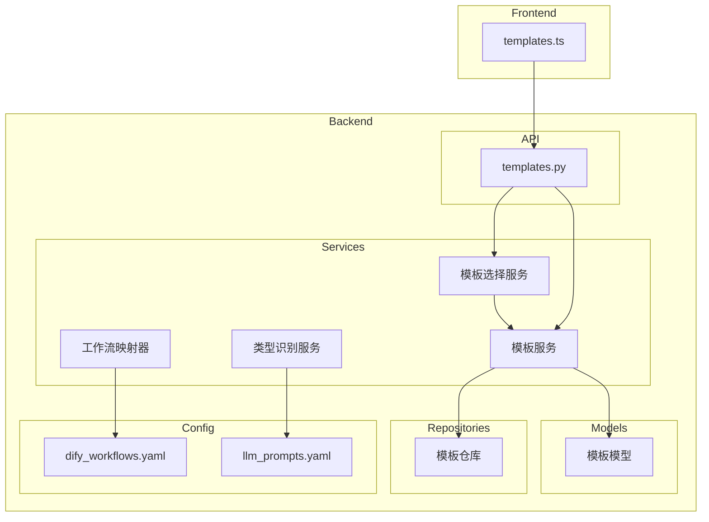
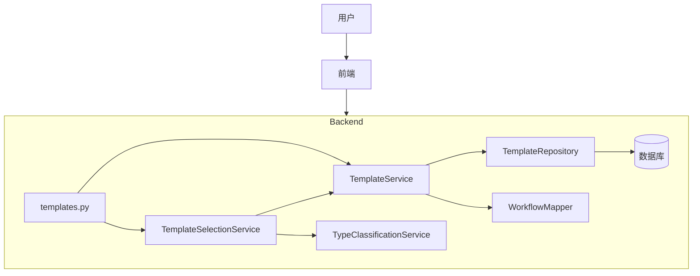
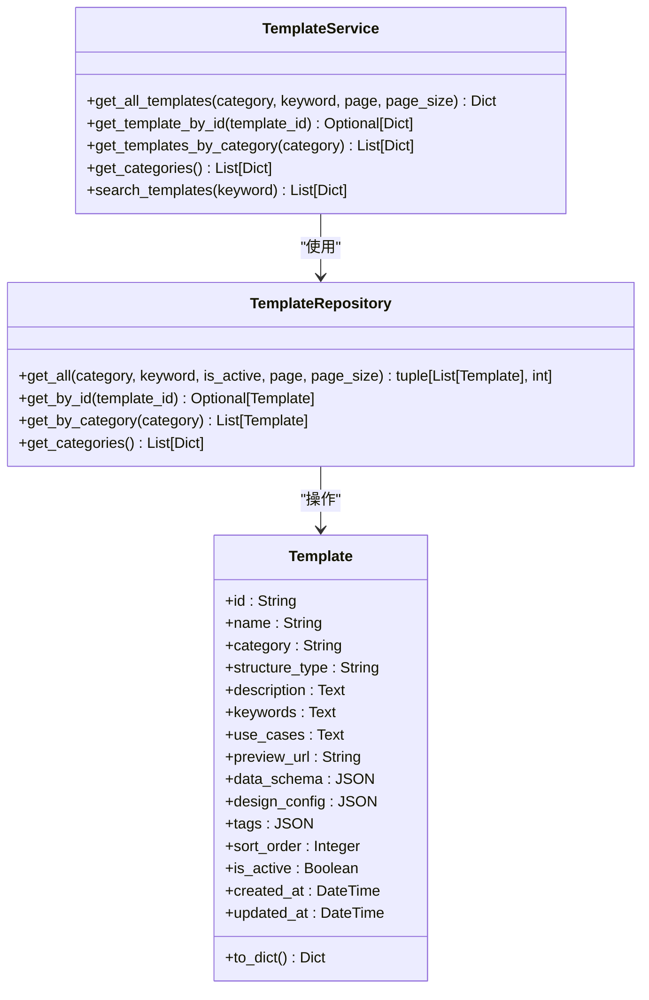
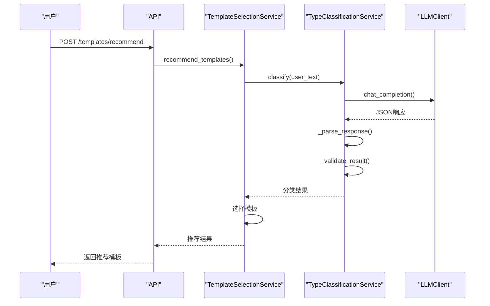
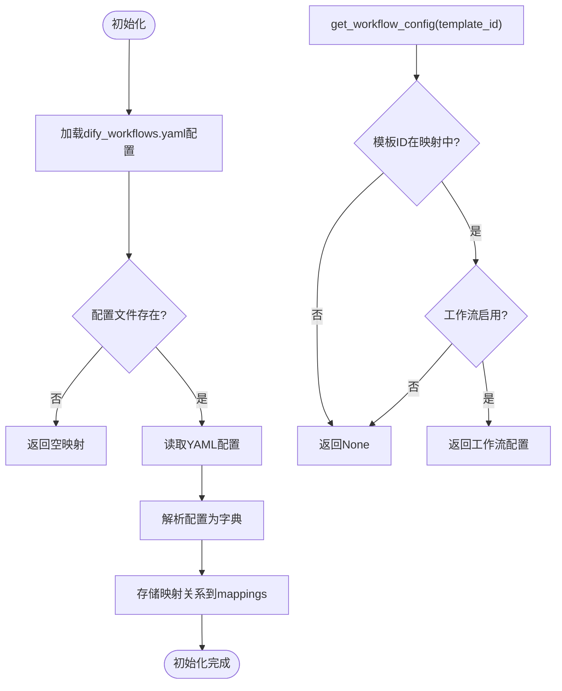
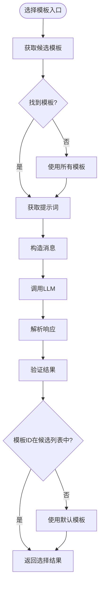
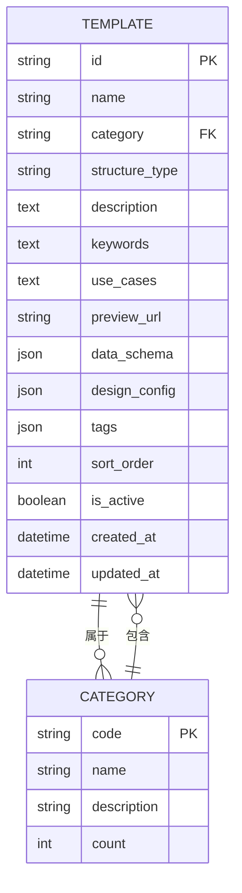
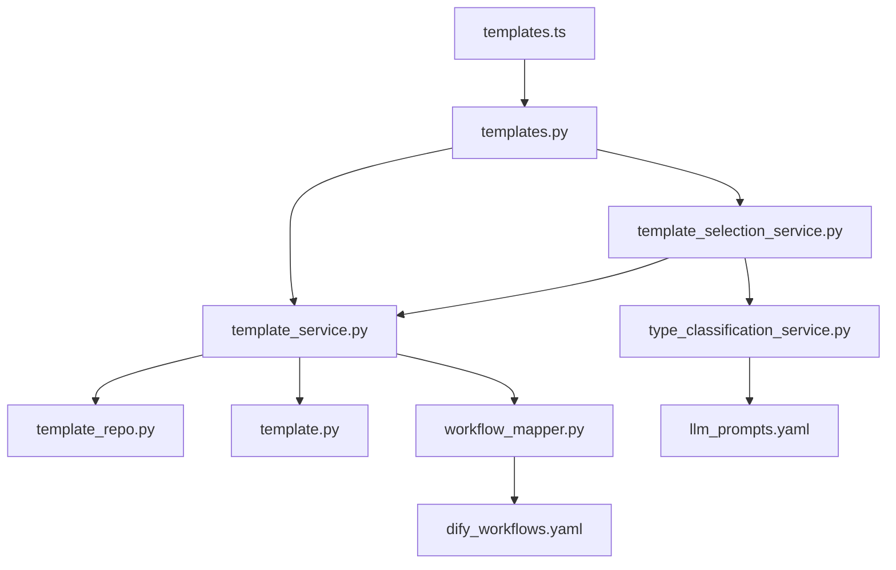

# 模板服务

<cite>
**本文档引用的文件**   
- [template_service.py](file://backend/app/services/template_service.py)
- [type_classification_service.py](file://backend/app/services/type_classification_service.py)
- [workflow_mapper.py](file://backend/app/services/workflow_mapper.py)
- [template_selection_service.py](file://backend/app/services/template_selection_service.py)
- [template.py](file://backend/app/models/template.py)
- [template_repo.py](file://backend/app/repositories/template_repo.py)
- [dify_workflows.yaml](file://backend/app/config/dify_workflows.yaml)
- [llm_prompts.yaml](file://backend/app/config/llm_prompts.yaml)
- [templates.py](file://backend/app/api/v1/templates.py)
</cite>

## 目录
1. [项目结构](#项目结构)
2. [核心组件](#核心组件)
3. [架构概述](#架构概述)
4. [详细组件分析](#详细组件分析)
5. [依赖分析](#依赖分析)
6. [性能考虑](#性能考虑)
7. [故障排除指南](#故障排除指南)
8. [结论](#结论)

## 项目结构

**图示来源**
- [template_service.py](file://backend/app/services/template_service.py)
- [type_classification_service.py](file://backend/app/services/type_classification_service.py)
- [workflow_mapper.py](file://backend/app/services/workflow_mapper.py)
- [template_selection_service.py](file://backend/app/services/template_selection_service.py)
- [template.py](file://backend/app/models/template.py)
- [template_repo.py](file://backend/app/repositories/template_repo.py)
- [dify_workflows.yaml](file://backend/app/config/dify_workflows.yaml)
- [llm_prompts.yaml](file://backend/app/config/llm_prompts.yaml)
- [templates.py](file://backend/app/api/v1/templates.py)

**本节来源**
- [template_service.py](file://backend/app/services/template_service.py)
- [type_classification_service.py](file://backend/app/services/type_classification_service.py)
- [workflow_mapper.py](file://backend/app/services/workflow_mapper.py)
- [template_selection_service.py](file://backend/app/services/template_selection_service.py)

## 核心组件

模板服务系统由多个核心组件构成，包括模板服务、类型识别服务、工作流映射器和模板选择服务。这些组件协同工作，为用户提供智能的模板推荐和管理功能。

**本节来源**
- [template_service.py](file://backend/app/services/template_service.py)
- [type_classification_service.py](file://backend/app/services/type_classification_service.py)
- [workflow_mapper.py](file://backend/app/services/workflow_mapper.py)
- [template_selection_service.py](file://backend/app/services/template_selection_service.py)

## 架构概述

**图示来源**
- [template_service.py](file://backend/app/services/template_service.py)
- [type_classification_service.py](file://backend/app/services/type_classification_service.py)
- [workflow_mapper.py](file://backend/app/services/workflow_mapper.py)
- [template_selection_service.py](file://backend/app/services/template_selection_service.py)
- [templates.py](file://backend/app/api/v1/templates.py)

## 详细组件分析

### 模板服务分析

模板服务是系统的核心组件，负责管理所有模板的生命周期，包括模板的分类管理、检索查询和元数据处理。

**图示来源**
- [template_service.py](file://backend/app/services/template_service.py#L160-L281)
- [template_repo.py](file://backend/app/repositories/template_repo.py#L13-L144)
- [template.py](file://backend/app/models/template.py#L9-L54)

**本节来源**
- [template_service.py](file://backend/app/services/template_service.py#L1-L281)
- [template_repo.py](file://backend/app/repositories/template_repo.py#L1-L144)
- [template.py](file://backend/app/models/template.py#L1-L54)

### 类型识别服务分析

类型识别服务负责分析用户需求并匹配最佳模板类型，通过LLM技术实现智能分类。

**图示来源**
- [type_classification_service.py](file://backend/app/services/type_classification_service.py#L14-L149)
- [template_selection_service.py](file://backend/app/services/template_selection_service.py#L15-L169)
- [templates.py](file://backend/app/api/v1/templates.py#L77-L99)

**本节来源**
- [type_classification_service.py](file://backend/app/services/type_classification_service.py#L1-L149)

### 工作流映射器分析

工作流映射器负责将模板与Dify工作流关联，实现模板与后端工作流的映射管理。

**图示来源**
- [workflow_mapper.py](file://backend/app/services/workflow_mapper.py#L13-L157)
- [dify_workflows.yaml](file://backend/app/config/dify_workflows.yaml#L1-L81)

**本节来源**
- [workflow_mapper.py](file://backend/app/services/workflow_mapper.py#L1-L157)
- [dify_workflows.yaml](file://backend/app/config/dify_workflows.yaml#L1-L81)

### 模板选择服务分析

模板选择服务根据用户需求和内容类型，从候选模板中选择最合适的模板。

**图示来源**
- [template_selection_service.py](file://backend/app/services/template_selection_service.py#L15-L169)
- [llm_prompts.yaml](file://backend/app/config/llm_prompts.yaml#L93-L137)

**本节来源**
- [template_selection_service.py](file://backend/app/services/template_selection_service.py#L1-L169)

### 模板分类体系

**图示来源**
- [template.py](file://backend/app/models/template.py#L9-L54)
- [template_repo.py](file://backend/app/repositories/template_repo.py#L113-L121)

## 依赖分析

**图示来源**
- [template_service.py](file://backend/app/services/template_service.py)
- [type_classification_service.py](file://backend/app/services/type_classification_service.py)
- [workflow_mapper.py](file://backend/app/services/workflow_mapper.py)
- [template_selection_service.py](file://backend/app/services/template_selection_service.py)
- [template.py](file://backend/app/models/template.py)
- [template_repo.py](file://backend/app/repositories/template_repo.py)
- [dify_workflows.yaml](file://backend/app/config/dify_workflows.yaml)
- [llm_prompts.yaml](file://backend/app/config/llm_prompts.yaml)
- [templates.py](file://backend/app/api/v1/templates.py)

**本节来源**
- [template_service.py](file://backend/app/services/template_service.py)
- [type_classification_service.py](file://backend/app/services/type_classification_service.py)
- [workflow_mapper.py](file://backend/app/services/workflow_mapper.py)
- [template_selection_service.py](file://backend/app/services/template_selection_service.py)

## 性能考虑

模板服务通过数据库索引、分页查询和缓存机制确保快速响应模板查询请求。系统使用复合索引(idx_category_sort)来优化分类和排序查询，同时通过分页机制限制单次查询的数据量，避免性能瓶颈。

**本节来源**
- [template.py](file://backend/app/models/template.py#L30-L33)
- [template_repo.py](file://backend/app/repositories/template_repo.py#L68-L71)

## 故障排除指南

当模板服务出现问题时，可以检查以下方面：
1. 确认数据库连接正常
2. 检查模板数据是否正确加载
3. 验证LLM服务是否可用
4. 确认配置文件路径正确

**本节来源**
- [template_service.py](file://backend/app/services/template_service.py)
- [type_classification_service.py](file://backend/app/services/type_classification_service.py)
- [workflow_mapper.py](file://backend/app/services/workflow_mapper.py)

## 结论

模板服务系统通过模块化设计实现了模板的分类管理、智能推荐和工作流集成。系统具有良好的可维护性和扩展性，便于未来添加新的模板类别或调整分类规则。