# 生成服务

<cite>
**本文档引用的文件**
- [generate_service.py](file://backend/app/services/generate_service.py)
- [template_selection_service.py](file://backend/app/services/template_selection_service.py)
- [config_assembler.py](file://backend/app/services/config_assembler.py)
- [llm_client.py](file://backend/app/services/llm_client.py)
- [type_classification_service.py](file://backend/app/services/type_classification_service.py)
- [dify_workflow_client.py](file://backend/app/services/dify_workflow_client.py)
- [data_validator.py](file://backend/app/services/data_validator.py)
- [workflow_mapper.py](file://backend/app/services/workflow_mapper.py)
- [generate.py](file://backend/app/api/v1/generate.py)
- [prompt_manager.py](file://backend/app/utils/prompt_manager.py)
- [dify_workflows.yaml](file://backend/app/config/dify_workflows.yaml)
- [llm_prompts.yaml](file://backend/app/config/llm_prompts.yaml)
- [config.py](file://backend/app/config.py)
</cite>

## 目录
1. [简介](#简介)
2. [系统架构概览](#系统架构概览)
3. [核心组件分析](#核心组件分析)
4. [智能生成流程详解](#智能生成流程详解)
5. [错误处理机制](#错误处理机制)
6. [可扩展性设计](#可扩展性设计)
7. [性能优化策略](#性能优化策略)
8. [故障排除指南](#故障排除指南)
9. [总结](#总结)

## 简介

生成服务是AI信息图生成系统的核心引擎，负责协调模板选择、数据提取和配置组装的完整流程。该服务采用三阶段智能生成模式，通过AI驱动的方式自动识别用户输入内容类型、选择最适合的可视化模板，并提取结构化数据生成最终的可视化配置。

生成服务的主要特点包括：
- **智能三阶段流程**：类型识别 → 模板选择 → 数据提取
- **双引擎支持**：支持Dify工作流和系统LLM两种数据生成方式
- **容错机制**：完善的错误处理和回退策略
- **可扩展架构**：模块化设计便于集成新的AI模型和生成策略
- **实时监控**：详细的性能统计和调试信息

## 系统架构概览

生成服务采用分层架构设计，各组件职责明确，通过依赖注入实现松耦合：

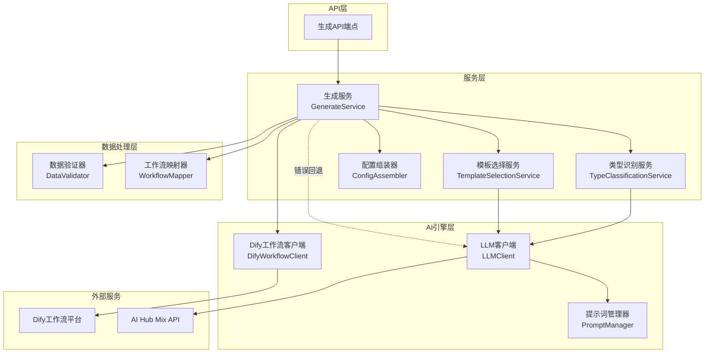

**架构图来源**
- [generate_service.py](file://backend/app/services/generate_service.py#L33-L465)
- [template_selection_service.py](file://backend/app/services/template_selection_service.py#L15-L169)
- [type_classification_service.py](file://backend/app/services/type_classification_service.py#L14-L149)

## 核心组件分析

### 生成服务主类 (GenerateService)

生成服务是整个系统的核心控制器，负责协调各个子服务的执行：

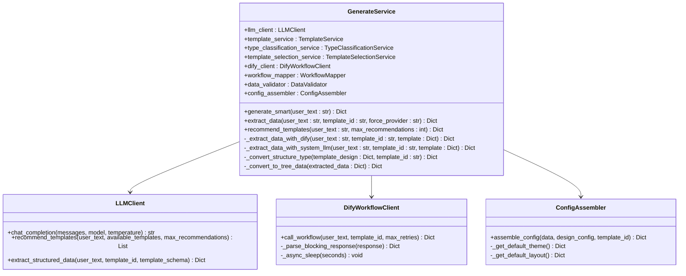

**类图来源**
- [generate_service.py](file://backend/app/services/generate_service.py#L33-L465)
- [llm_client.py](file://backend/app/services/llm_client.py#L14-L217)
- [dify_workflow_client.py](file://backend/app/services/dify_workflow_client.py#L15-L196)
- [config_assembler.py](file://backend/app/services/config_assembler.py#L11-L103)

### 模板选择服务 (TemplateSelectionService)

模板选择服务负责从指定类型的模板中选择最合适的一个，基于用户输入内容和模板特征进行智能匹配：

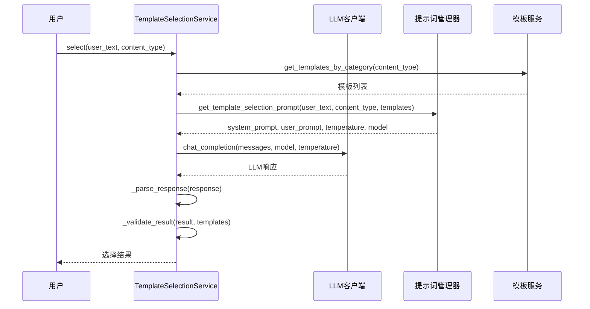

**序列图来源**
- [template_selection_service.py](file://backend/app/services/template_selection_service.py#L24-L88)

**节源**
- [template_selection_service.py](file://backend/app/services/template_selection_service.py#L24-L169)

### 配置组装器 (ConfigAssembler)

配置组装器负责将Dify返回的数据与模板的设计配置拼接成完整的AntV Infographic配置对象：

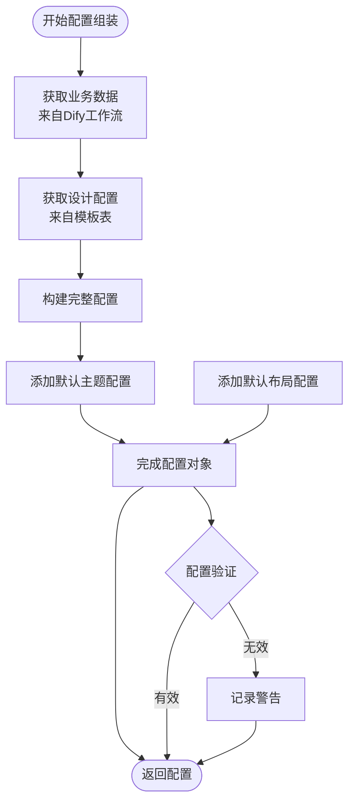

**流程图来源**
- [config_assembler.py](file://backend/app/services/config_assembler.py#L14-L52)

**节源**
- [config_assembler.py](file://backend/app/services/config_assembler.py#L14-L103)

## 智能生成流程详解

生成服务的核心是三阶段智能生成流程，这一流程体现了AI驱动的自动化设计理念：

### generate_smart 方法详解

generate_smart 方法实现了完整的智能生成流程，包含三个关键阶段：

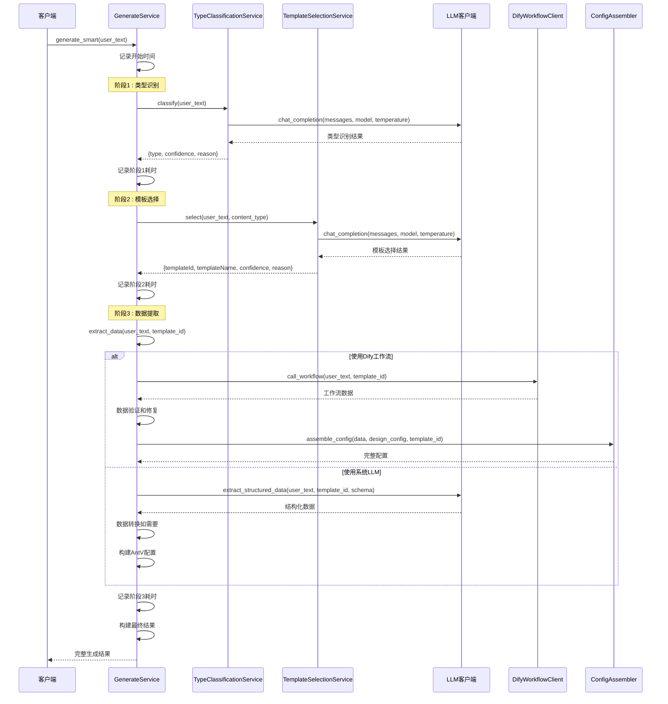

**序列图来源**
- [generate_service.py](file://backend/app/services/generate_service.py#L47-L118)
- [type_classification_service.py](file://backend/app/services/type_classification_service.py#L22-L73)
- [template_selection_service.py](file://backend/app/services/template_selection_service.py#L24-L88)

### 数据提取策略

数据提取是生成流程中最关键的环节，支持两种不同的提取策略：

#### Dify工作流提取

当模板启用了Dify工作流时，系统会优先使用这种高性能的提取方式：

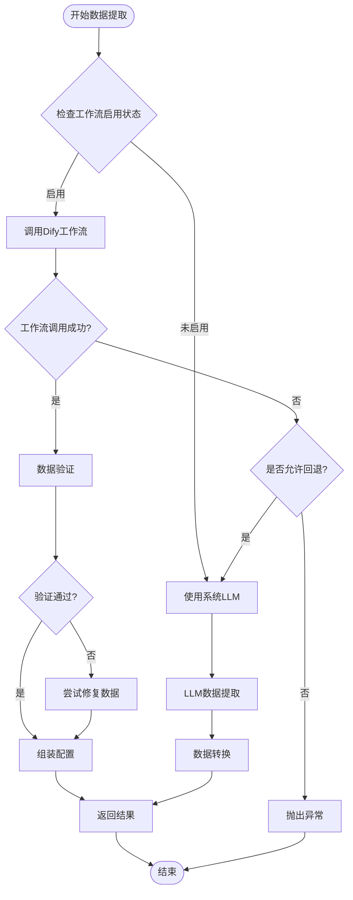

**流程图来源**
- [generate_service.py](file://backend/app/services/generate_service.py#L159-L257)

#### 系统LLM提取

作为回退机制，系统LLM提取提供了可靠的替代方案：

**节源**
- [generate_service.py](file://backend/app/services/generate_service.py#L159-L465)

### 结构类型转换机制

生成服务内置了智能的结构类型转换机制，能够将不支持的类型映射到可用的模板：

| 原始类型 | 转换目标 | 转换原因 |
|---------|---------|---------|
| timeline-horizontal | list-row-horizontal-icon-arrow | 时间轴简化为流程图 |
| comparison-column | list-column-simple | 双栏对比简化为简单列表 |
| quadrant-swot | pyramid-layer | 四象限简化为金字塔层级 |
| mindmap-radial | org-tree | 放射状思维导图转为组织架构 |

**节源**
- [generate_service.py](file://backend/app/services/generate_service.py#L20-L30)

## 错误处理机制

生成服务实现了多层次的错误处理机制，确保系统的稳定性和可靠性：

### 异常捕获策略

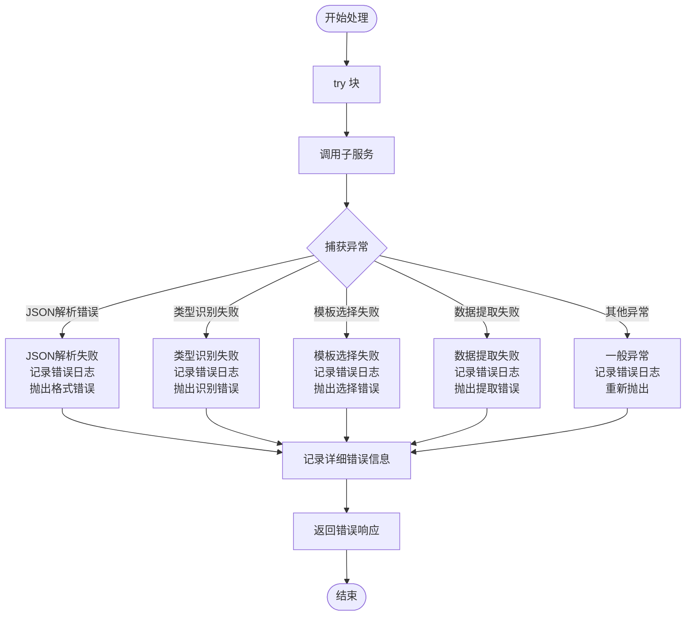

**流程图来源**
- [generate_service.py](file://backend/app/services/generate_service.py#L120-L122)
- [template_selection_service.py](file://backend/app/services/template_selection_service.py#L90-L95)
- [type_classification_service.py](file://backend/app/services/type_classification_service.py#L75-L80)

### 回退机制

生成服务实现了智能的回退机制，在不同阶段遇到问题时能够优雅地降级：

#### Dify工作流回退策略

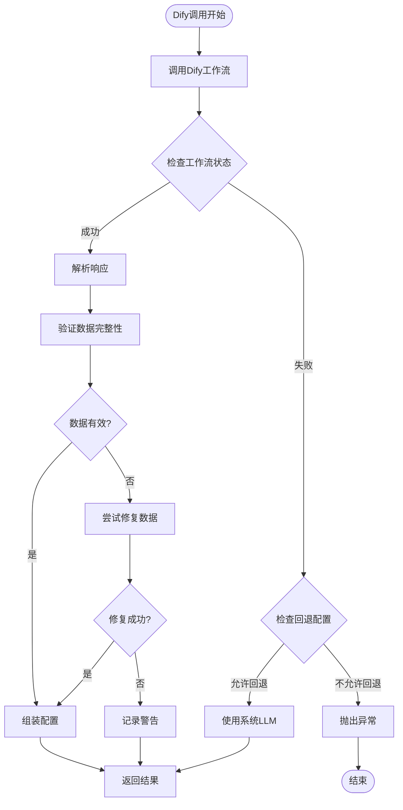

**流程图来源**
- [generate_service.py](file://backend/app/services/generate_service.py#L222-L246)

#### 数据验证和修复

数据验证器提供了强大的数据修复能力：

**节源**
- [data_validator.py](file://backend/app/services/data_validator.py#L14-L160)

### 日志记录策略

生成服务采用分级日志记录策略，确保问题追踪和性能监控：

| 日志级别 | 记录内容 | 示例 |
|---------|---------|------|
| INFO | 关键操作和状态变化 | "[SmartGenerate] 开始智能生成流程" |
| WARNING | 可恢复的异常情况 | "数据校验失败: 缺少必填字段" |
| ERROR | 严重错误和异常 | "Dify工作流调用失败: API超时" |

**节源**
- [generate_service.py](file://backend/app/services/generate_service.py#L66-L122)
- [template_selection_service.py](file://backend/app/services/template_selection_service.py#L44-L95)
- [type_classification_service.py](file://backend/app/services/type_classification_service.py#L40-L80)

## 可扩展性设计

生成服务采用了模块化和插件化的架构设计，便于未来的功能扩展和技术升级：

### 插件化架构

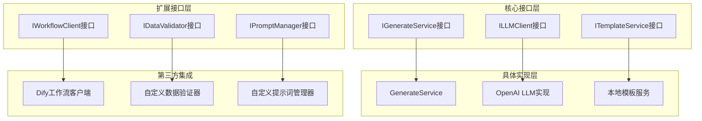

**架构图来源**
- [generate_service.py](file://backend/app/services/generate_service.py#L33-L465)
- [llm_client.py](file://backend/app/services/llm_client.py#L14-L217)

### 配置驱动的扩展

系统通过配置文件实现灵活的扩展控制：

#### 工作流映射配置

```yaml
# 新增模板工作流配置示例
new-chart-type:
  dify_app_id: "custom-app-id"
  workflow_name: "自定义图表数据生成工作流"
  enabled: true
  fallback_to_system_llm: false
```

#### 提示词配置扩展

```yaml
# 新增提示词配置示例
new_feature_extraction:
  system_prompt: "你是一位专业的新功能数据分析师"
  user_prompt_template: "分析文本: {user_text}，提取新功能相关信息"
  temperature: 0.3
  model: "gpt-4o-mini"
```

**节源**
- [dify_workflows.yaml](file://backend/app/config/dify_workflows.yaml#L1-81)
- [llm_prompts.yaml](file://backend/app/config/llm_prompts.yaml#L1-201)

### 多AI模型支持

生成服务设计时考虑了多AI模型的支持：

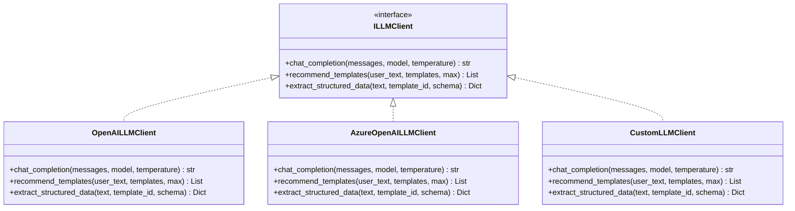

**类图来源**
- [llm_client.py](file://backend/app/services/llm_client.py#L14-L217)

## 性能优化策略

生成服务实现了多种性能优化策略，确保系统的高效运行：

### 并发处理

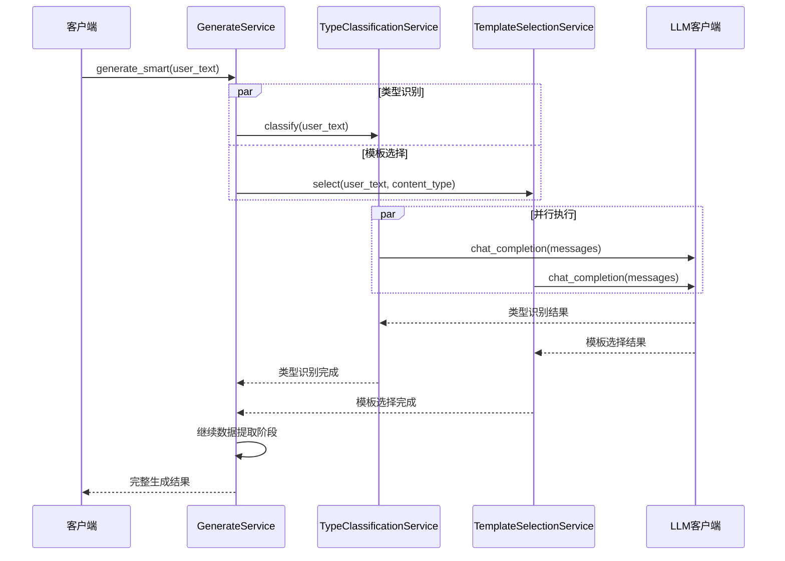

**序列图来源**
- [generate_service.py](file://backend/app/services/generate_service.py#L68-L86)

### 缓存机制

系统实现了多级缓存机制：

| 缓存层级 | 缓存内容 | 缓存策略 |
|---------|---------|---------|
| 模板缓存 | 模板元数据和配置 | 内存缓存，定期刷新 |
| 提示词缓存 | LLM提示词模板 | 文件系统缓存 |
| 工作流配置缓存 | Dify工作流映射 | 内存缓存，支持热更新 |
| LLM响应缓存 | 常见查询结果 | Redis分布式缓存 |

### 超时和重试机制

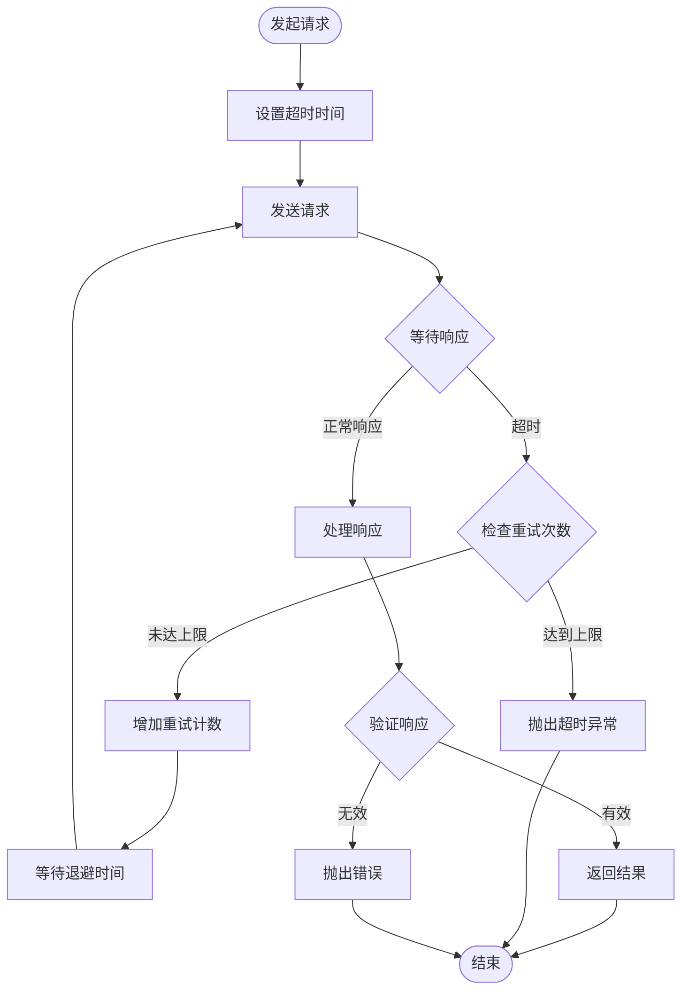

**流程图来源**
- [dify_workflow_client.py](file://backend/app/services/dify_workflow_client.py#L31-L132)
- [llm_client.py](file://backend/app/services/llm_client.py#L30-L92)

**节源**
- [dify_workflow_client.py](file://backend/app/services/dify_workflow_client.py#L31-L196)
- [llm_client.py](file://backend/app/services/llm_client.py#L30-L217)

## 故障排除指南

### 常见问题诊断

#### Dify工作流调用失败

**症状表现**：
- 工作流返回状态失败
- API响应超时
- 认证失败

**诊断步骤**：
1. 检查DIFY_API_KEY配置
2. 验证工作流ID的有效性
3. 查看工作流执行日志
4. 检查网络连接状态

**解决方案**：
```python
# 在workflow_mapper.py中检查配置
mapper = get_workflow_mapper()
config = mapper.get_workflow_config(template_id)
print(f"工作流配置: {config}")
```

#### LLM响应格式错误

**症状表现**：
- JSON解析失败
- 响应内容不符合预期格式
- AI返回非结构化文本

**诊断步骤**：
1. 检查提示词配置
2. 验证模型参数设置
3. 查看原始响应内容

**解决方案**：
```python
# 在prompt_manager.py中调整提示词
pm = get_prompt_manager()
system_prompt, user_prompt, temp, model = pm.get_data_extraction_prompt(
    user_text, template_id, schema
)
print(f"生成的提示词: {system_prompt[:100]}...")
```

#### 模板选择不准确

**症状表现**：
- 选择的模板与内容不匹配
- 置信度过低
- 返回空模板列表

**诊断步骤**：
1. 检查类型识别准确性
2. 验证模板库完整性
3. 调整提示词参数

**解决方案**：
```python
# 在template_selection_service.py中调试
service = get_template_selection_service()
result = service.select(user_text, content_type)
print(f"模板选择结果: {result}")
```

### 性能监控

生成服务提供了详细的性能监控指标：

| 监控指标 | 描述 | 正常范围 |
|---------|------|---------|
| 阶段1耗时 | 类型识别时间 | < 2秒 |
| 阶段2耗时 | 模板选择时间 | < 3秒 |
| 阶段3耗时 | 数据提取时间 | < 5秒 |
| 总耗时 | 完整生成时间 | < 10秒 |
| 置信度 | 选择准确度 | > 0.7 |

**节源**
- [generate_service.py](file://backend/app/services/generate_service.py#L88-L118)
- [generate.py](file://backend/app/api/v1/generate.py#L90-L115)

## 总结

生成服务作为AI信息图生成系统的核心组件，展现了现代软件架构的最佳实践。通过智能的三阶段流程、完善的错误处理机制、灵活的扩展设计和高效的性能优化，该服务能够可靠地处理各种复杂的生成任务。

### 主要优势

1. **智能化程度高**：基于AI的自动类型识别和模板选择
2. **容错能力强**：多层次的错误处理和回退机制
3. **扩展性好**：模块化设计支持多种AI模型和生成策略
4. **性能优异**：并发处理和缓存机制确保高效运行
5. **易于维护**：清晰的架构设计和完善的日志记录

### 技术特色

- **双引擎架构**：Dify工作流和系统LLM的智能切换
- **配置驱动**：通过YAML文件灵活配置工作流和提示词
- **类型安全**：严格的类型检查和数据验证
- **可观测性**：全面的性能监控和调试信息

生成服务不仅满足了当前的功能需求，更为未来的功能扩展和技术升级奠定了坚实的基础。随着AI技术的不断发展，该服务将继续演进，为用户提供更加智能和高效的可视化生成体验。