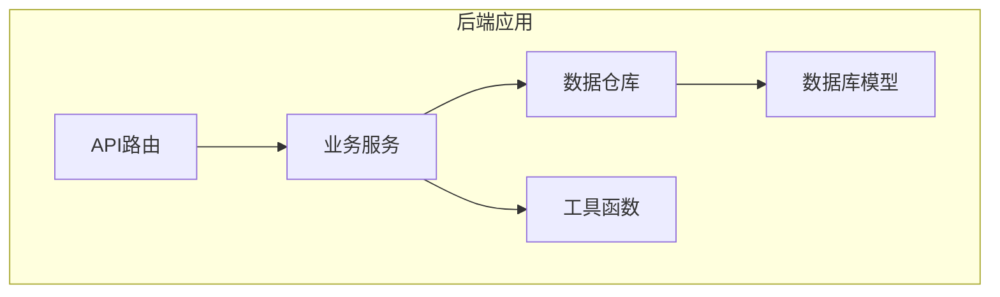
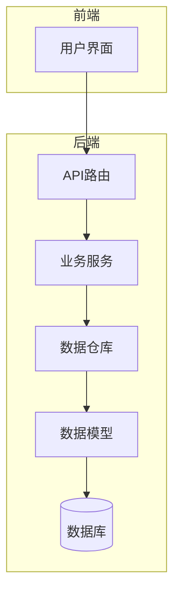
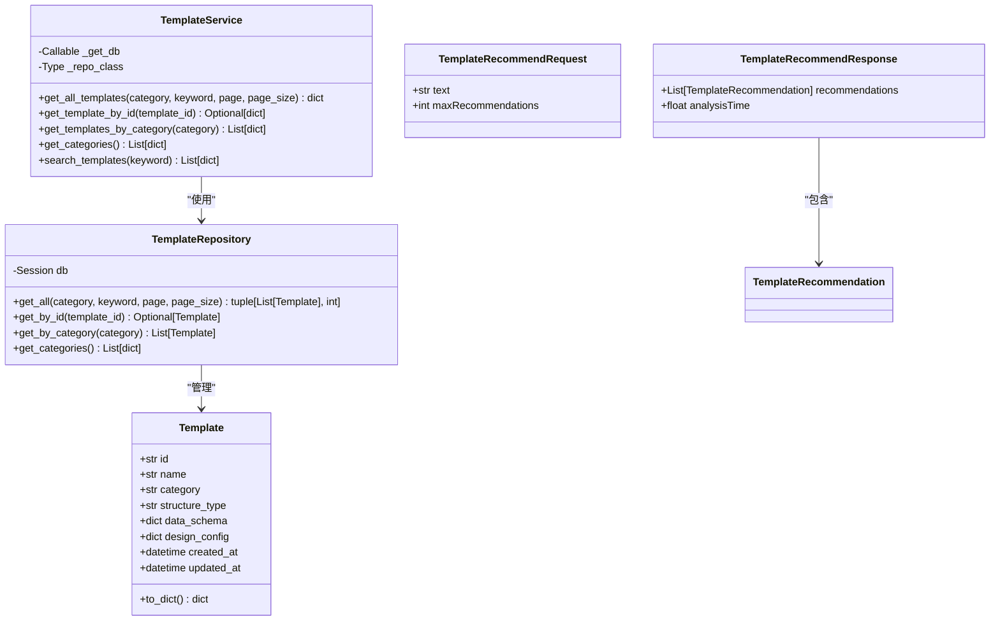
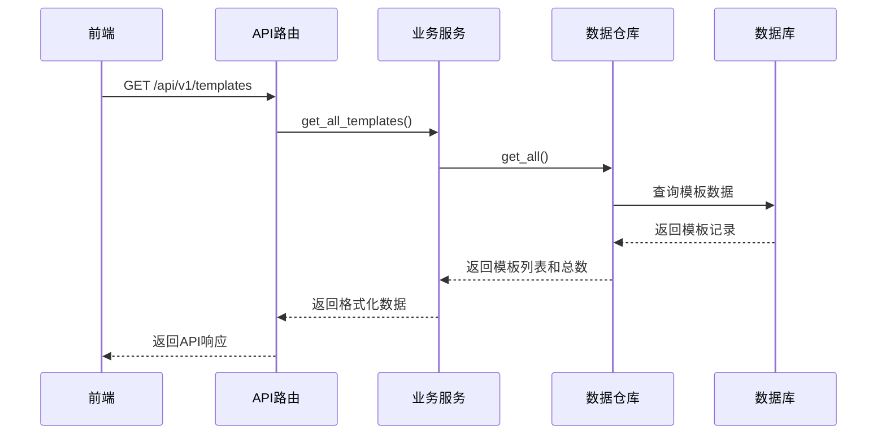
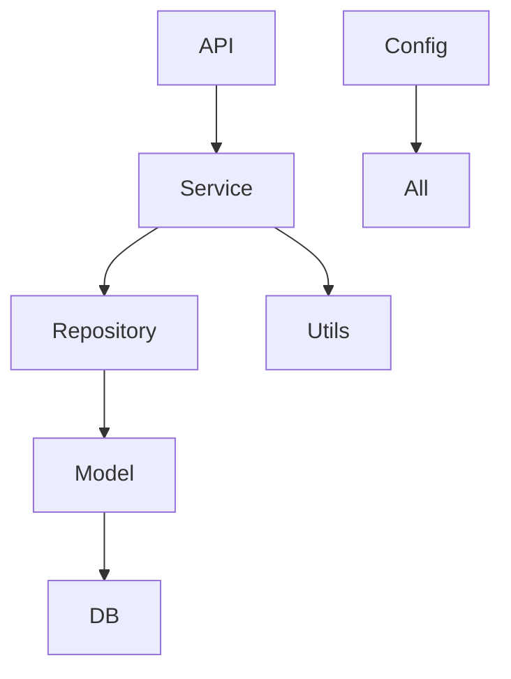

# 后端架构

<cite>
**本文档引用的文件**   
- [main.py](file://backend/app/main.py)
- [config.py](file://backend/app/config.py)
- [Dockerfile](file://backend/Dockerfile)
- [docker-compose.yml](file://backend/docker-compose.yml)
- [requirements.txt](file://archive/temp_files/requirements.txt)
- [base.py](file://backend/app/models/base.py)
- [template.py](file://backend/app/models/template.py)
- [work.py](file://backend/app/models/work.py)
- [common.py](file://backend/app/schemas/common.py)
- [template.py](file://backend/app/schemas/template.py)
- [template_repo.py](file://backend/app/repositories/template_repo.py)
- [templates.py](file://backend/app/api/v1/templates.py)
- [template_service.py](file://backend/app/services/template_service.py)
- [db.py](file://backend/app/utils/db.py)
</cite>

## 目录
1. [项目结构](#项目结构)
2. [核心组件](#核心组件)
3. [架构概述](#架构概述)
4. [详细组件分析](#详细组件分析)
5. [依赖分析](#依赖分析)
6. [性能考虑](#性能考虑)
7. [故障排除指南](#故障排除指南)
8. [结论](#结论)

## 项目结构

该项目采用分层架构设计，后端服务位于`backend`目录下，遵循FastAPI的标准项目结构。主要目录包括：
- `app/api/v1/`: API路由定义
- `app/models/`: 数据库模型定义
- `app/repositories/`: 数据访问层
- `app/schemas/`: Pydantic数据模型
- `app/services/`: 业务逻辑服务
- `app/utils/`: 工具函数

**图示来源**
- [main.py](file://backend/app/main.py#L1-L113)

**本节来源**
- [main.py](file://backend/app/main.py#L1-L113)
- [config.py](file://backend/app/config.py#L1-L51)

## 核心组件

后端服务基于FastAPI构建，采用路由-服务-模型分层架构。API路由处理HTTP请求，业务服务封装核心逻辑，数据模型通过SQLAlchemy ORM与数据库交互。Pydantic模型用于请求验证和响应序列化，确保数据完整性。

**本节来源**
- [main.py](file://backend/app/main.py#L1-L113)
- [config.py](file://backend/app/config.py#L1-L51)
- [template.py](file://backend/app/models/template.py#L1-L54)

## 架构概述

系统采用典型的分层架构，从前端到数据库的完整请求流程包括：API路由接收请求，服务层处理业务逻辑，仓库层执行数据访问，最终通过ORM操作数据库。配置管理通过Pydantic Settings实现，支持环境变量注入。

**图示来源**
- [main.py](file://backend/app/main.py#L1-L113)
- [template_service.py](file://backend/app/services/template_service.py#L1-L281)

## 详细组件分析

### 模板管理分析

系统实现了完整的模板管理功能，包括模板的增删改查和分类统计。API路由定义了获取模板列表、获取分类信息和推荐模板的端点。

#### 类图

**图示来源**
- [template.py](file://backend/app/models/template.py#L1-L54)
- [template_repo.py](file://backend/app/repositories/template_repo.py#L1-L144)
- [template_service.py](file://backend/app/services/template_service.py#L1-L281)
- [template.py](file://backend/app/schemas/template.py#L1-L27)

#### 请求处理序列图

**图示来源**
- [templates.py](file://backend/app/api/v1/templates.py#L1-L99)
- [template_service.py](file://backend/app/services/template_service.py#L1-L281)
- [template_repo.py](file://backend/app/repositories/template_repo.py#L1-L144)

**本节来源**
- [templates.py](file://backend/app/api/v1/templates.py#L1-L99)
- [template_service.py](file://backend/app/services/template_service.py#L1-L281)
- [template_repo.py](file://backend/app/repositories/template_repo.py#L1-L144)

## 依赖分析

系统依赖关系清晰，各层之间通过明确定义的接口进行通信。API路由依赖服务层，服务层依赖仓库层，仓库层依赖数据库模型。这种分层设计降低了耦合度，提高了代码的可维护性。

**图示来源**
- [main.py](file://backend/app/main.py#L1-L113)
- [template_service.py](file://backend/app/services/template_service.py#L1-L281)

**本节来源**
- [main.py](file://backend/app/main.py#L1-L113)
- [template_service.py](file://backend/app/services/template_service.py#L1-L281)
- [db.py](file://backend/app/utils/db.py#L1-L94)

## 性能考虑

系统在性能方面进行了多项优化：
1. 数据库查询使用分页机制，避免一次性加载大量数据
2. SQLAlchemy配置了连接池，提高数据库访问效率
3. 使用复合索引优化常见查询场景
4. 通过CORS中间件配置合理的跨域策略

## 故障排除指南

常见问题及解决方案：
- **数据库连接失败**：检查DATABASE_URL环境变量配置
- **模板无法加载**：确认数据库已初始化并导入模板数据
- **跨域问题**：检查CORS配置和前端请求来源
- **依赖安装失败**：确保requirements.txt文件完整且网络连接正常

**本节来源**
- [db.py](file://backend/app/utils/db.py#L1-L94)
- [config.py](file://backend/app/config.py#L1-L51)

## 结论

该后端架构采用FastAPI框架，实现了清晰的分层设计。通过Pydantic模型确保数据验证和序列化，利用SQLAlchemy ORM简化数据库操作。依赖注入机制和配置管理提高了系统的可配置性和可测试性。Docker容器化部署确保了环境一致性，适合生产环境使用。