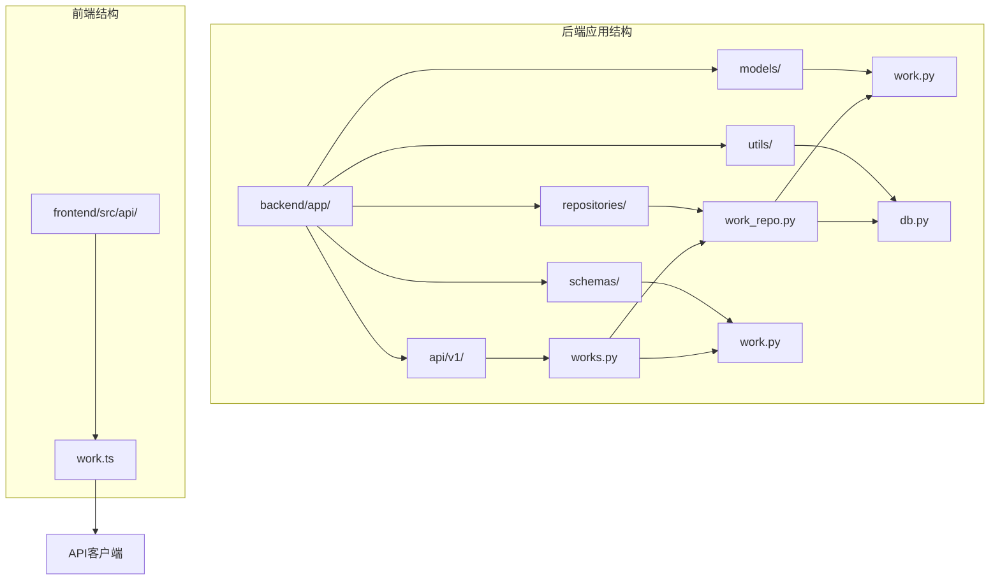
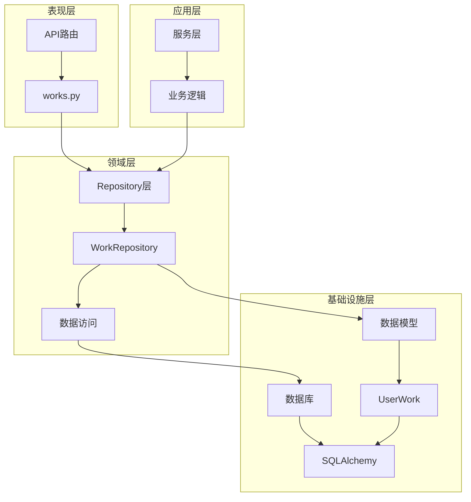
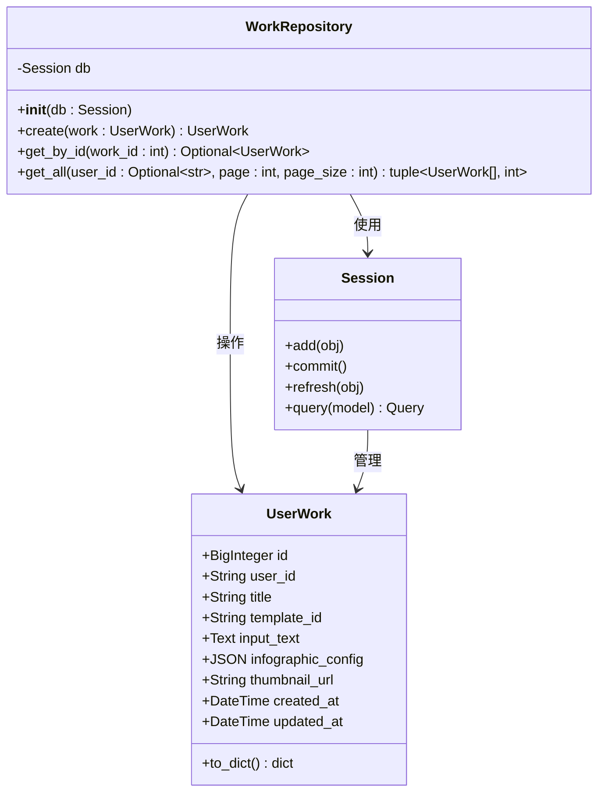
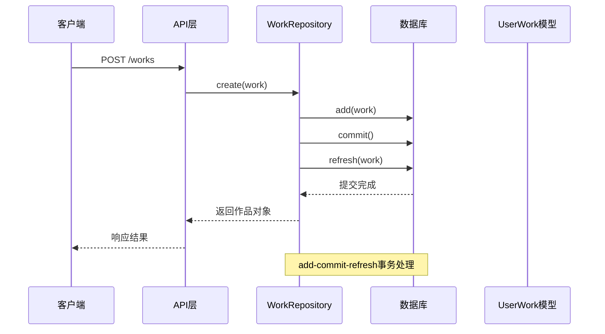
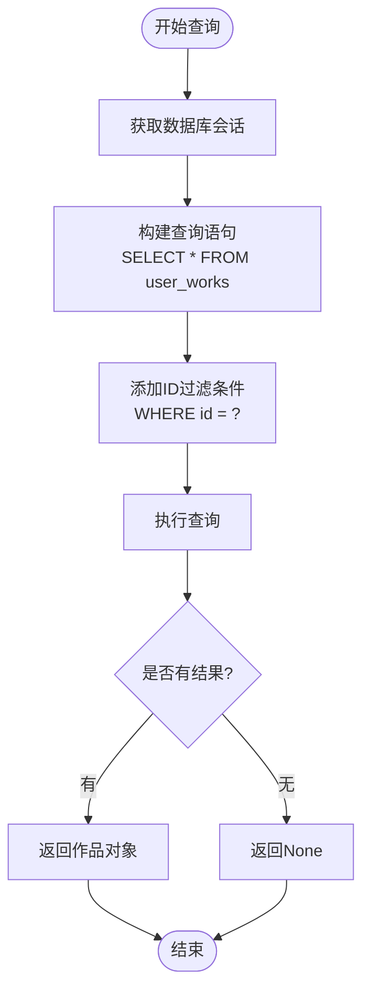
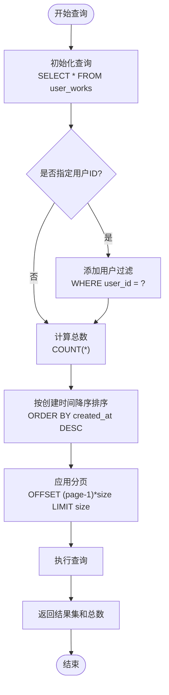
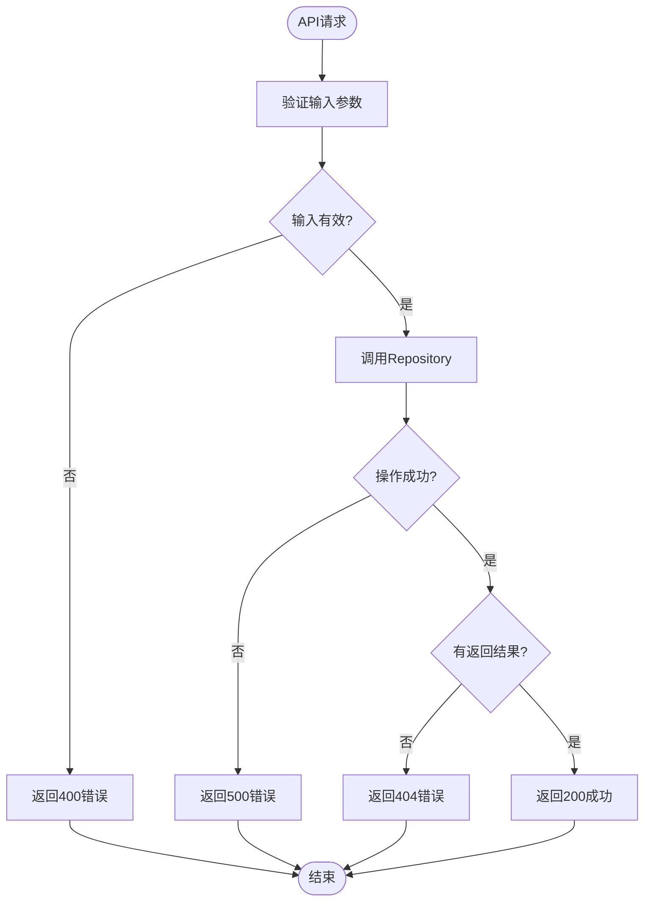
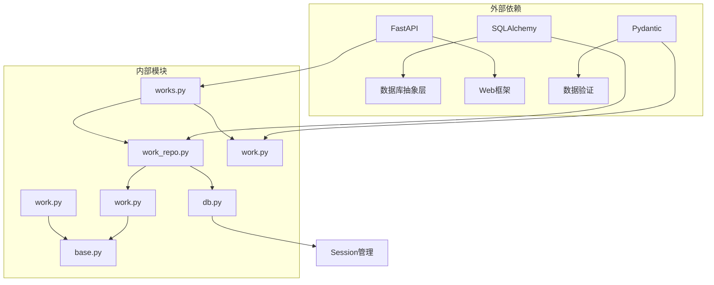
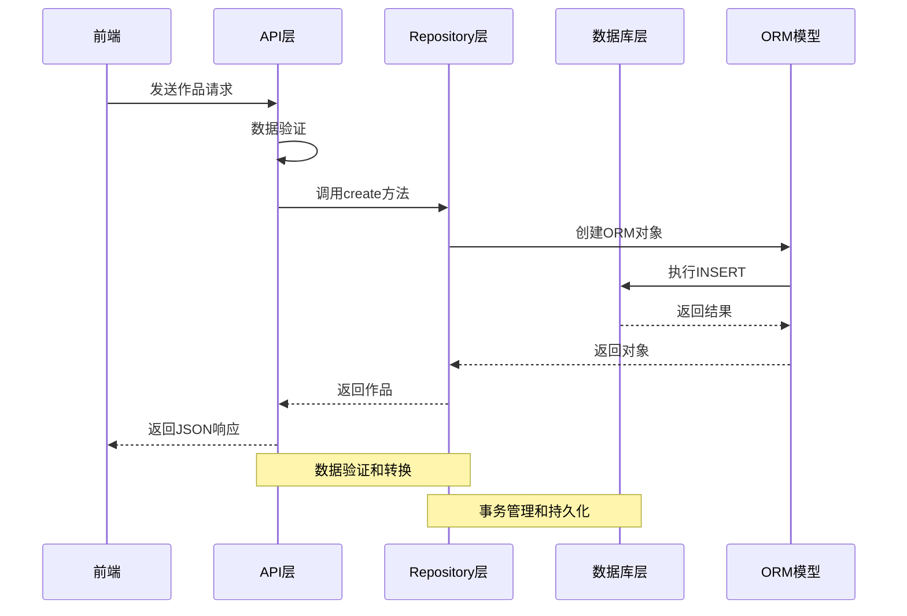

# 作品仓库

<cite>
**本文档中引用的文件**
- [work_repo.py](file://backend/app/repositories/work_repo.py)
- [work.py](file://backend/app/models/work.py)
- [works.py](file://backend/app/api/v1/works.py)
- [work.py](file://backend/app/schemas/work.py)
- [db.py](file://backend/app/utils/db.py)
</cite>

## 目录
1. [简介](#简介)
2. [项目结构](#项目结构)
3. [核心组件](#核心组件)
4. [架构概览](#架构概览)
5. [详细组件分析](#详细组件分析)
6. [依赖关系分析](#依赖关系分析)
7. [性能考虑](#性能考虑)
8. [故障排除指南](#故障排除指南)
9. [结论](#结论)

## 简介

作品仓库（WorkRepository）是GenAI图表项目中负责用户作品数据管理的核心组件。它实现了完整的CRUD操作，提供了事务处理保障，并通过用户ID实现了多用户数据隔离。该组件采用Repository设计模式，为上层服务层提供统一的数据访问接口。

## 项目结构

作品仓库相关文件在项目中的组织结构如下：



**图表来源**
- [work_repo.py](file://backend/app/repositories/work_repo.py#L1-L82)
- [work.py](file://backend/app/models/work.py#L1-L37)
- [works.py](file://backend/app/api/v1/works.py#L1-L106)

**章节来源**
- [work_repo.py](file://backend/app/repositories/work_repo.py#L1-L82)
- [work.py](file://backend/app/models/work.py#L1-L37)

## 核心组件

### WorkRepository类

WorkRepository是作品数据访问的核心类，提供以下主要功能：

#### 主要特性
- **CRUD操作**：支持作品的创建、查询、更新和删除
- **事务处理**：通过add-commit-refresh模式确保数据一致性
- **用户隔离**：基于user_id字段实现多用户数据隔离
- **分页查询**：支持带分页的作品列表查询
- **索引优化**：在关键字段上建立索引提升查询性能

#### 核心方法
- `create()`：创建新作品
- `get_by_id()`：根据ID获取单个作品
- `get_all()`：获取作品列表（支持分页和过滤）

**章节来源**
- [work_repo.py](file://backend/app/repositories/work_repo.py#L12-L82)

## 架构概览

作品仓库采用经典的分层架构设计，遵循Clean Architecture原则：



**图表来源**
- [works.py](file://backend/app/api/v1/works.py#L1-L106)
- [work_repo.py](file://backend/app/repositories/work_repo.py#L1-L82)

## 详细组件分析

### WorkRepository类详细分析

#### 类结构与初始化



**图表来源**
- [work_repo.py](file://backend/app/repositories/work_repo.py#L12-L82)
- [work.py](file://backend/app/models/work.py#L9-L37)

#### 创建操作（Create）

作品创建过程采用标准的事务处理模式：



**图表来源**
- [work_repo.py](file://backend/app/repositories/work_repo.py#L24-L37)
- [works.py](file://backend/app/api/v1/works.py#L15-L47)

#### 查询操作（Get By ID）

单个作品查询实现简单高效：



**图表来源**
- [work_repo.py](file://backend/app/repositories/work_repo.py#L39-L49)

#### 分页查询（Get All）

作品列表查询支持复杂的过滤和排序：



**图表来源**
- [work_repo.py](file://backend/app/repositories/work_repo.py#L51-L81)

**章节来源**
- [work_repo.py](file://backend/app/repositories/work_repo.py#L24-L81)

### 数据模型分析

#### UserWork模型结构

作品数据模型定义了完整的用户作品信息结构：

| 字段名 | 数据类型 | 约束 | 描述 |
|--------|----------|------|------|
| id | BigInteger | 主键，自增 | 作品唯一标识符 |
| user_id | String(100) | 可选，带索引 | 用户标识，实现数据隔离 |
| title | String(200) | 可选 | 作品标题 |
| template_id | String(100) | 外键，非空 | 使用的模板ID |
| input_text | Text | 非空 | 用户输入的原始文本 |
| infographic_config | JSON | 非空 | 完整的Infographic配置 |
| thumbnail_url | String(500) | 可选 | 缩略图URL |
| created_at | DateTime | 默认当前时间 | 创建时间戳 |
| updated_at | DateTime | 默认当前时间，自动更新 | 更新时间戳 |

#### 索引策略

模型中关键字段的索引设计：

- **user_id字段**：建立了独立索引，支持用户数据隔离查询
- **created_at字段**：隐式支持排序查询优化
- **template_id字段**：作为外键，自动建立索引

**章节来源**
- [work.py](file://backend/app/models/work.py#L14-L22)

### API层集成

#### RESTful API设计

作品仓库通过RESTful API为前端提供统一接口：

| 端点 | 方法 | 功能 | 参数 |
|------|------|------|------|
| `/works` | POST | 创建作品 | WorkCreateRequest |
| `/works` | GET | 获取作品列表 | userId, page, pageSize |
| `/works/{id}` | GET | 获取作品详情 | work_id |

#### 错误处理机制

API层实现了完善的错误处理：



**图表来源**
- [works.py](file://backend/app/api/v1/works.py#L15-L106)

**章节来源**
- [works.py](file://backend/app/api/v1/works.py#L15-L106)

## 依赖关系分析

### 组件依赖图



**图表来源**
- [work_repo.py](file://backend/app/repositories/work_repo.py#L1-L8)
- [db.py](file://backend/app/utils/db.py#L1-L94)

### 数据流分析

作品数据在各层间的流转过程：



**图表来源**
- [works.py](file://backend/app/api/v1/works.py#L15-L47)
- [work_repo.py](file://backend/app/repositories/work_repo.py#L24-L37)

**章节来源**
- [work_repo.py](file://backend/app/repositories/work_repo.py#L1-L82)
- [db.py](file://backend/app/utils/db.py#L1-L94)

## 性能考虑

### 查询优化策略

#### 索引优化建议

为了提升作品仓库的查询性能，建议在以下字段上创建索引：

| 字段 | 索引类型 | 用途 | 性能影响 |
|------|----------|------|----------|
| user_id | 单列索引 | 用户数据隔离查询 | 显著提升过滤性能 |
| created_at | 单列索引 | 排序和分页查询 | 优化时间范围查询 |
| template_id | 外键索引 | 关联查询优化 | 提升JOIN性能 |

#### 分页查询优化

分页查询的性能优化要点：

- **避免大偏移量**：对于大数据集，考虑使用游标分页而非偏移分页
- **批量加载**：合理设置page_size，平衡内存使用和网络传输
- **缓存策略**：对频繁查询的作品列表实施缓存机制

### 事务处理优化

#### add-commit-refresh模式

该模式的优势和注意事项：

- **优势**：
  - 确保数据一致性
  - 自动处理数据库字段更新
  - 简化业务逻辑复杂度
  
- **注意事项**：
  - 避免在事务中执行耗时操作
  - 合理控制事务范围
  - 实施适当的超时机制

### 内存和资源管理

#### 连接池配置

数据库连接池的最佳实践：

- **开发环境**：使用SQLite静态连接池
- **生产环境**：配置PostgreSQL连接池
- **参数调优**：根据并发需求调整pool_size和max_overflow

**章节来源**
- [work.py](file://backend/app/models/work.py#L15-L22)
- [db.py](file://backend/app/utils/db.py#L22-L36)

## 故障排除指南

### 常见问题及解决方案

#### 数据库连接问题

**问题症状**：Repository操作抛出连接异常

**可能原因**：
- 数据库服务未启动
- 连接池耗尽
- 网络连接中断

**解决方案**：
1. 检查数据库服务状态
2. 监控连接池使用情况
3. 实施连接重试机制

#### 事务回滚问题

**问题症状**：数据更新失败但未正确回滚

**排查步骤**：
1. 检查异常捕获逻辑
2. 验证事务边界
3. 确认数据库支持事务

#### 查询性能问题

**问题症状**：分页查询响应缓慢

**优化措施**：
1. 检查索引使用情况
2. 分析查询执行计划
3. 考虑查询缓存策略

### 调试技巧

#### 日志记录

启用详细的日志记录来跟踪问题：

```python
# 在repository层添加日志
logger.debug(f"Executing query with filters: user_id={user_id}, page={page}")
```

#### 性能监控

实施性能监控指标：

- 查询响应时间
- 连接池使用率
- 错误率统计

**章节来源**
- [work_repo.py](file://backend/app/repositories/work_repo.py#L1-L82)
- [db.py](file://backend/app/utils/db.py#L68-L93)

## 结论

作品仓库（WorkRepository）作为GenAI图表项目的核心数据访问组件，成功实现了以下目标：

### 技术成就

1. **完整的CRUD支持**：提供了标准化的数据操作接口
2. **可靠的事务处理**：通过add-commit-refresh模式确保数据一致性
3. **有效的用户隔离**：基于user_id字段实现多租户数据隔离
4. **高效的查询机制**：支持分页和过滤的查询优化
5. **良好的扩展性**：清晰的架构设计便于功能扩展

### 最佳实践体现

- **Repository模式**：分离关注点，提高代码可维护性
- **依赖注入**：通过构造函数注入数据库会话
- **错误处理**：完善的异常处理和错误响应机制
- **性能优化**：合理的索引设计和查询优化策略

### 发展建议

1. **监控和告警**：实施全面的性能监控和异常告警
2. **缓存策略**：对热点数据实施缓存机制
3. **异步处理**：考虑对耗时操作实施异步处理
4. **测试覆盖**：增加单元测试和集成测试覆盖率

作品仓库的设计和实现体现了现代软件开发的最佳实践，为项目的稳定运行和未来发展奠定了坚实的基础。