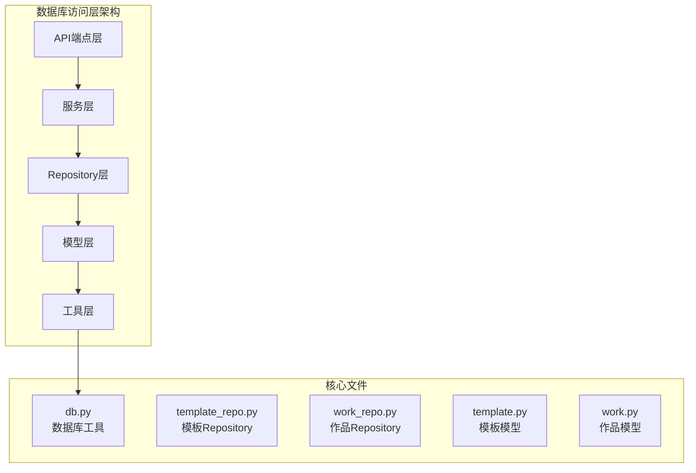
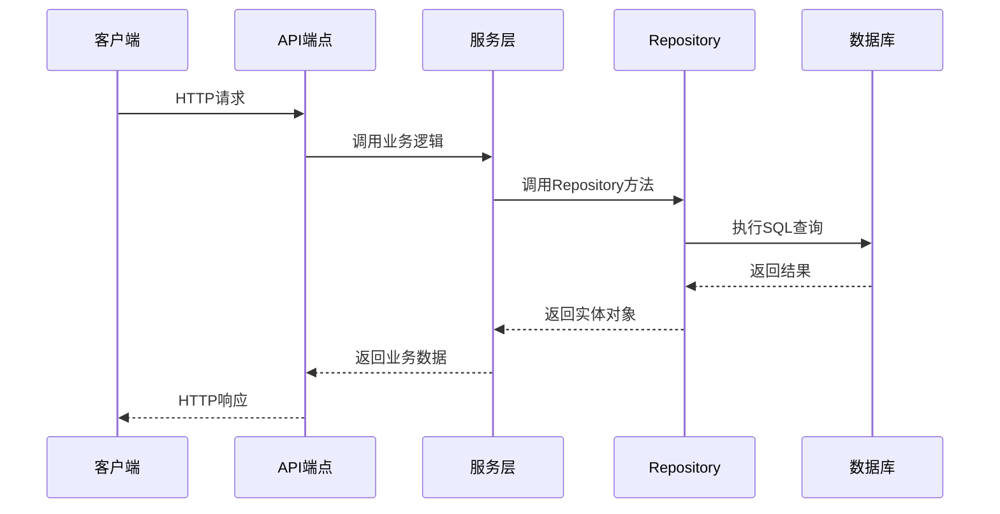
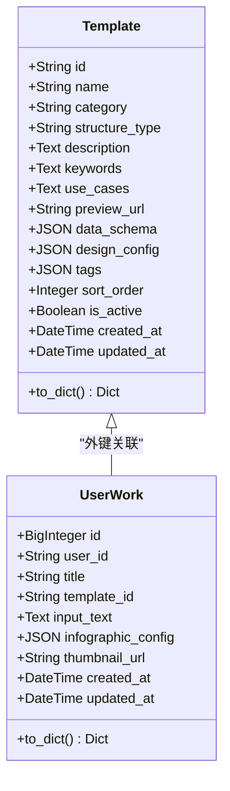
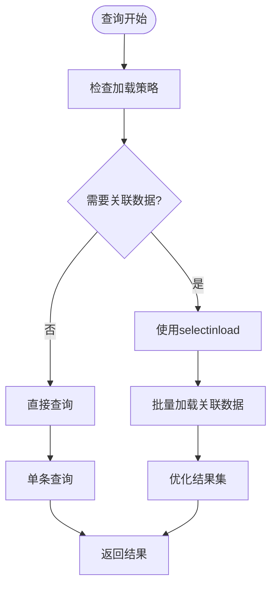
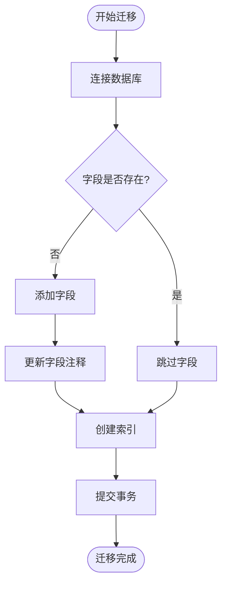

# 数据库访问

<cite>
**本文档中引用的文件**
- [backend/app/utils/db.py](file://backend/app/utils/db.py)
- [backend/app/repositories/template_repo.py](file://backend/app/repositories/template_repo.py)
- [backend/app/repositories/work_repo.py](file://backend/app/repositories/work_repo.py)
- [backend/app/models/template.py](file://backend/app/models/template.py)
- [backend/app/models/work.py](file://backend/app/models/work.py)
- [backend/app/models/base.py](file://backend/app/models/base.py)
- [backend/app/services/template_service.py](file://backend/app/services/template_service.py)
- [backend/app/api/v1/templates.py](file://backend/app/api/v1/templates.py)
- [backend/app/api/v1/works.py](file://backend/app/api/v1/works.py)
- [backend/app/config.py](file://backend/app/config.py)
- [backend/scripts/add_template_category_fields.py](file://backend/scripts/add_template_category_fields.py)
- [backend/scripts/add_missing_columns.py](file://backend/scripts/add_missing_columns.py)
</cite>

## 目录
1. [简介](#简介)
2. [项目结构](#项目结构)
3. [核心组件](#核心组件)
4. [架构概览](#架构概览)
5. [详细组件分析](#详细组件分析)
6. [数据库连接管理](#数据库连接管理)
7. [Repository模式实现](#repository模式实现)
8. [查询优化策略](#查询优化策略)
9. [数据库迁移策略](#数据库迁移策略)
10. [性能调优](#性能调优)
11. [故障排除指南](#故障排除指南)
12. [结论](#结论)

## 简介

本文档详细说明了基于SQLAlchemy的数据库访问层实现，重点介绍了Repository模式的应用、数据库连接管理、查询优化策略以及数据库迁移方法。该系统采用分层架构设计，通过清晰的职责分离实现了高效的数据访问和管理。

## 项目结构

数据库访问层采用模块化设计，主要包含以下核心模块：

**图表来源**
- [backend/app/utils/db.py](file://backend/app/utils/db.py#L1-L94)
- [backend/app/repositories/template_repo.py](file://backend/app/repositories/template_repo.py#L1-L144)
- [backend/app/repositories/work_repo.py](file://backend/app/repositories/work_repo.py#L1-L82)

**章节来源**
- [backend/app/utils/db.py](file://backend/app/utils/db.py#L1-L94)
- [backend/app/repositories/__init__.py](file://backend/app/repositories/__init__.py#L1-L7)

## 核心组件

### 数据库引擎配置

系统支持多种数据库后端，根据环境自动选择合适的配置：

- **开发环境**: 使用SQLite，便于本地开发和测试
- **生产环境**: 支持PostgreSQL，提供更好的性能和并发能力

### 连接池配置

数据库连接池采用智能配置策略：

- **SQLite**: 静态连接池，适用于单线程开发环境
- **PostgreSQL**: 动态连接池，支持连接预ping和溢出控制

### 会话管理

提供两种会话管理模式：
- **上下文管理器模式**: 自动事务管理和资源清理
- **手动管理模式**: 适用于依赖注入场景

**章节来源**
- [backend/app/utils/db.py](file://backend/app/utils/db.py#L17-L55)

## 架构概览

数据库访问层采用经典的三层架构模式，实现了清晰的职责分离：

**图表来源**
- [backend/app/api/v1/templates.py](file://backend/app/api/v1/templates.py#L17-L39)
- [backend/app/services/template_service.py](file://backend/app/services/template_service.py#L160-L201)

## 详细组件分析

### 数据库工具模块 (db.py)

数据库工具模块提供了完整的数据库连接和会话管理功能：

#### 核心功能特性

1. **环境感知配置**: 根据运行环境自动选择数据库类型
2. **连接池优化**: 针对不同数据库后端的最优连接池配置
3. **事务管理**: 提供自动和手动两种事务管理模式
4. **错误处理**: 完善的异常捕获和回滚机制

#### 主要类和函数

- **`get_db()`**: 上下文管理器，自动处理事务提交和回滚
- **`get_db_session()`**: 手动会话管理，适用于依赖注入
- **`init_db()`**: 数据库初始化，创建所有表结构

**章节来源**
- [backend/app/utils/db.py](file://backend/app/utils/db.py#L58-L94)

### 模型层设计

#### 模板模型 (Template)

模板模型定义了信息图模板的核心属性：

**图表来源**
- [backend/app/models/template.py](file://backend/app/models/template.py#L9-L54)
- [backend/app/models/work.py](file://backend/app/models/work.py#L9-L37)

#### 作品模型 (UserWork)

作品模型记录用户创建的信息图作品：

- **主键**: 自增BigInt类型，支持大量数据存储
- **外键**: 关联到模板模型，建立作品与模板的关联关系
- **JSON字段**: 存储复杂的数据结构和配置信息

**章节来源**
- [backend/app/models/template.py](file://backend/app/models/template.py#L1-L54)
- [backend/app/models/work.py](file://backend/app/models/work.py#L1-L37)

## 数据库连接管理

### 引擎创建和配置

数据库引擎采用条件配置策略：

#### SQLite配置
- **连接参数**: `check_same_thread=False`，允许多线程访问
- **连接池**: `StaticPool`，适用于开发环境
- **调试输出**: 根据DEBUG_MODE配置决定是否显示SQL语句

#### PostgreSQL配置
- **连接预ping**: 启用`pool_pre_ping`，自动检测失效连接
- **连接池大小**: `pool_size=10`，最大连接数
- **溢出控制**: `max_overflow=20`，允许的最大溢出连接数

### 会话工厂

会话工厂提供标准化的会话创建方式：

- **自动提交**: `autocommit=False`，需要显式提交
- **自动刷新**: `autoflush=False`，手动控制刷新时机
- **绑定引擎**: 明确绑定到特定的数据库引擎

**章节来源**
- [backend/app/utils/db.py](file://backend/app/utils/db.py#L17-L40)

## Repository模式实现

### TemplateRepository

TemplateRepository负责模板数据的CRUD操作和高级查询：

#### 核心方法

1. **`get_all()`**: 支持分页、筛选和搜索的模板列表查询
2. **`get_by_id()`**: 根据ID获取激活状态的模板
3. **`get_by_category()`**: 按分类获取模板列表
4. **`get_categories()`**: 获取分类统计信息

#### 查询优化特性

- **复合索引**: 在`category`和`sort_order`上建立复合索引
- **条件过滤**: 支持多条件组合查询
- **分页支持**: 内置分页机制，支持大数据集处理

### WorkRepository

WorkRepository专门处理用户作品数据：

#### 核心方法

1. **`create()`**: 创建新作品，自动处理ID生成和状态刷新
2. **`get_by_id()`**: 根据ID获取作品详情
3. **`get_all()`**: 获取用户作品列表，支持用户筛选

#### 事务处理

Repository层确保每个操作都在事务范围内执行，保证数据一致性。

**章节来源**
- [backend/app/repositories/template_repo.py](file://backend/app/repositories/template_repo.py#L13-L144)
- [backend/app/repositories/work_repo.py](file://backend/app/repositories/work_repo.py#L12-L82)

## 查询优化策略

### 关系预加载

虽然当前代码中没有显式的`selectinload`使用，但系统设计支持关系预加载优化：

#### N+1查询问题预防

#### 索引优化策略

- **单字段索引**: 在`user_id`、`template_id`等常用查询字段上建立索引
- **复合索引**: 在`category`和`sort_order`上建立复合索引
- **全文搜索**: 支持在`name`、`description`、`use_cases`字段上进行模糊匹配

### 分页查询优化

Repository层实现了高效的分页查询机制：

- **总数计算**: 使用`query.count()`获取总记录数
- **偏移量计算**: 基于页码和页面大小计算偏移量
- **限制返回**: 使用`limit()`控制返回记录数

**章节来源**
- [backend/app/repositories/template_repo.py](file://backend/app/repositories/template_repo.py#L25-L73)
- [backend/app/repositories/work_repo.py](file://backend/app/repositories/work_repo.py#L51-L81)

## 数据库迁移策略

### 迁移脚本设计

系统提供了灵活的数据库迁移机制：

#### 字段添加脚本

迁移脚本采用幂等设计，确保重复执行的安全性：

#### 迁移最佳实践

1. **备份策略**: 迁移前自动备份重要数据
2. **回滚机制**: 支持迁移失败后的状态恢复
3. **版本控制**: 记录迁移历史和版本信息
4. **兼容性检查**: 验证新旧版本的兼容性

**章节来源**
- [backend/scripts/add_template_category_fields.py](file://backend/scripts/add_template_category_fields.py#L1-L97)
- [backend/scripts/add_missing_columns.py](file://backend/scripts/add_missing_columns.py#L1-L49)

### 版本控制方法

#### 数据库版本管理

- **语义化版本**: 使用语义化版本号管理数据库结构变更
- **变更日志**: 记录每次迁移的具体变更内容
- **向后兼容**: 确保新版本能够处理旧版本的数据格式

#### 发布策略

- **灰度发布**: 逐步部署新的数据库结构
- **监控告警**: 实时监控数据库性能指标
- **快速回滚**: 支持快速回滚到稳定版本

## 性能调优

### 连接池配置优化

#### 生产环境调优参数

| 参数 | 开发环境 | 生产环境 | 说明 |
|------|----------|----------|------|
| `pool_size` | 默认 | 10 | 连接池初始大小 |
| `max_overflow` | 默认 | 20 | 最大溢出连接数 |
| `pool_pre_ping` | false | true | 连接预ping检测 |
| `echo` | 根据配置 | false | SQL语句输出 |

#### 查询性能优化

1. **索引策略**: 在高频查询字段上建立适当索引
2. **查询缓存**: 缓存频繁访问的查询结果
3. **批量操作**: 使用批量插入和更新提高效率
4. **连接复用**: 合理利用连接池减少连接开销

### 内存管理

- **会话生命周期**: 及时关闭不再使用的数据库会话
- **对象缓存**: 控制ORM对象的缓存大小
- **垃圾回收**: 定期清理无用的数据库连接

## 故障排除指南

### 常见问题及解决方案

#### 连接问题

1. **连接超时**: 检查网络连接和数据库服务器状态
2. **连接池耗尽**: 增加连接池大小或优化查询性能
3. **权限不足**: 验证数据库用户权限设置

#### 性能问题

1. **慢查询**: 分析查询计划，添加适当的索引
2. **内存泄漏**: 检查会话和连接的正确关闭
3. **锁竞争**: 优化事务范围和锁定策略

#### 数据一致性问题

1. **并发冲突**: 使用乐观锁或悲观锁机制
2. **数据损坏**: 实施数据验证和备份策略
3. **事务回滚**: 确保事务的完整性和原子性

### 监控和诊断

#### 性能监控指标

- **查询响应时间**: 监控关键查询的执行时间
- **连接池使用率**: 跟踪连接池的使用情况
- **错误率统计**: 记录数据库操作的错误频率
- **资源消耗**: 监控CPU和内存使用情况

#### 日志分析

- **SQL语句日志**: 启用SQL语句输出进行调试
- **性能日志**: 记录慢查询和异常操作
- **错误日志**: 分析数据库错误和异常情况

**章节来源**
- [backend/app/utils/db.py](file://backend/app/utils/db.py#L12-L13)

## 结论

基于SQLAlchemy的数据库访问层设计体现了现代Web应用的最佳实践。通过Repository模式的应用，实现了清晰的职责分离和良好的可维护性。完善的连接管理和事务处理机制确保了数据的一致性和系统的稳定性。

系统采用的查询优化策略，特别是分页查询和索引优化，为大规模数据处理提供了有效的解决方案。灵活的迁移机制和版本控制方法保证了系统的可演进性和数据的安全性。

通过合理的性能调优和监控策略，系统能够在高并发环境下保持稳定的性能表现。完善的故障排除指南为运维人员提供了实用的问题解决方法。

这种数据库访问层设计不仅满足了当前的功能需求，还为未来的扩展和优化奠定了坚实的基础。