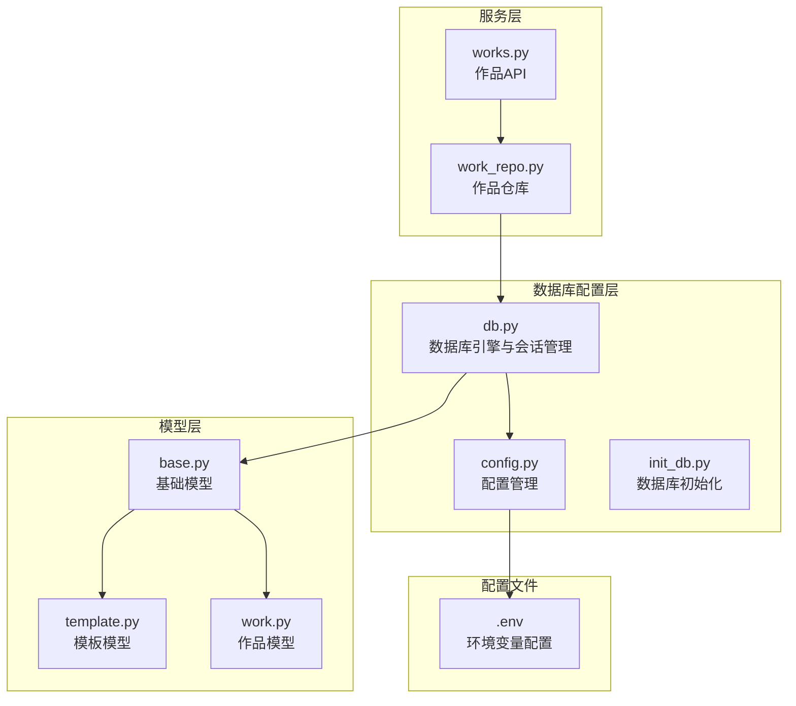
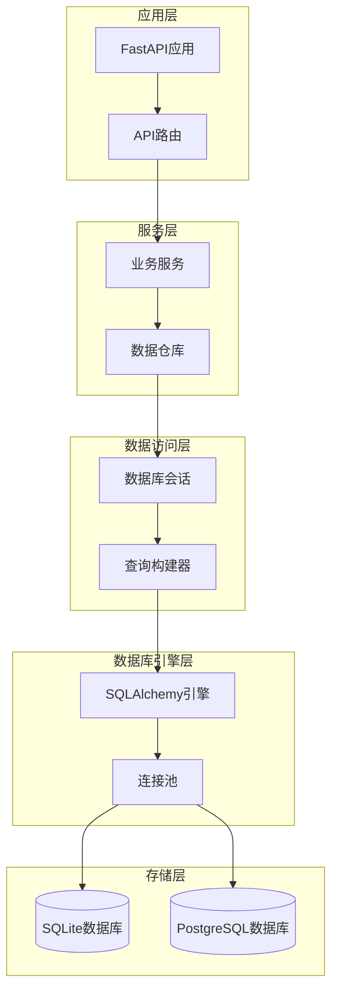
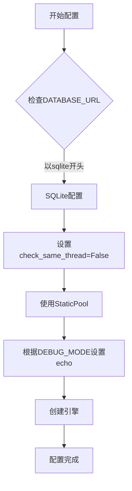
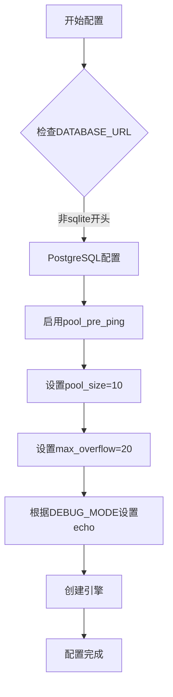
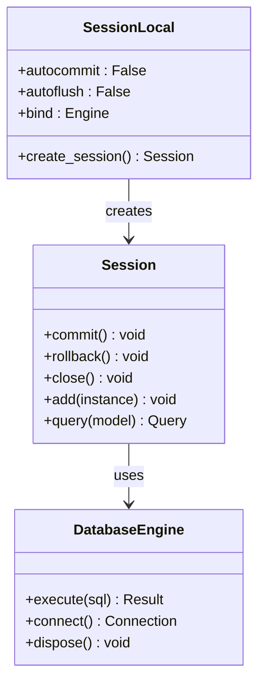
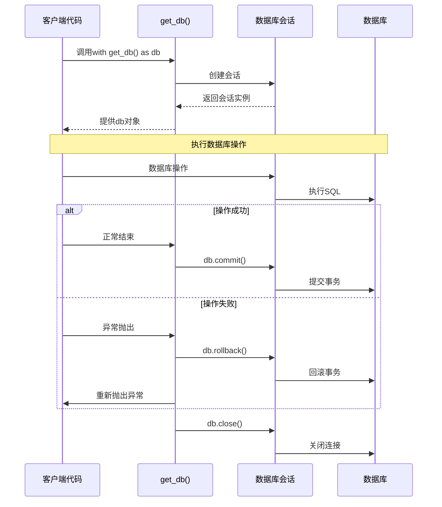
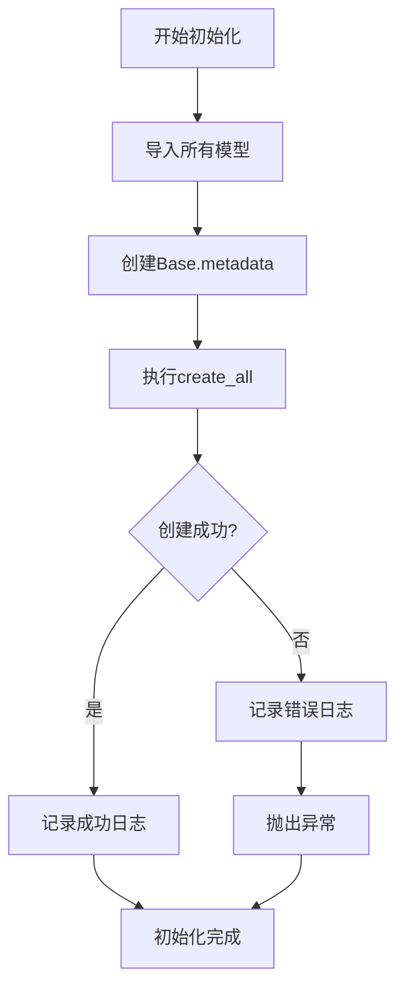
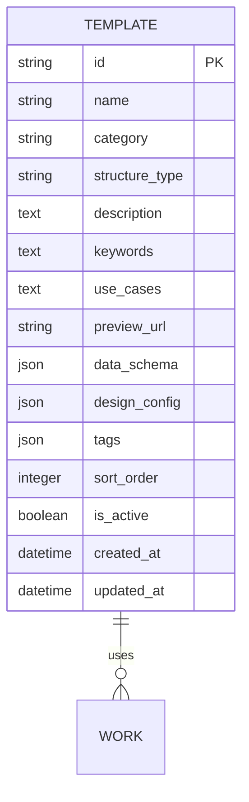
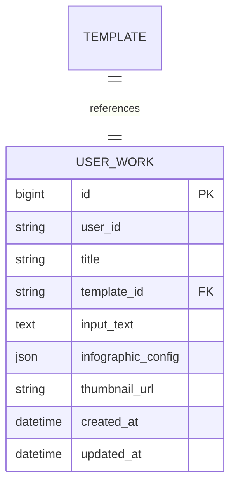
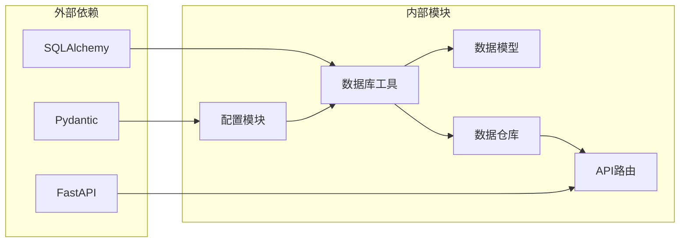

# 数据库配置

<cite>
**本文档引用的文件**
- [db.py](file://backend/app/utils/db.py)
- [config.py](file://backend/app/config.py)
- [init_db.py](file://backend/scripts/init_db.py)
- [main.py](file://backend/app/main.py)
- [base.py](file://backend/app/models/base.py)
- [template.py](file://backend/app/models/template.py)
- [work.py](file://backend/app/models/work.py)
- [work_repo.py](file://backend/app/repositories/work_repo.py)
- [templates.py](file://backend/app/api/v1/templates.py)
- [works.py](file://backend/app/api/v1/works.py)
- [.env](file://backend/.env)
</cite>

## 目录
1. [简介](#简介)
2. [项目结构](#项目结构)
3. [核心组件](#核心组件)
4. [架构概览](#架构概览)
5. [详细组件分析](#详细组件分析)
6. [依赖关系分析](#依赖关系分析)
7. [性能考虑](#性能考虑)
8. [故障排除指南](#故障排除指南)
9. [结论](#结论)

## 简介

本文档详细说明了GenAI Chart项目的数据库配置系统，重点介绍`db.py`模块的实现。该系统采用SQLAlchemy ORM框架，支持开发环境（SQLite）和生产环境（PostgreSQL）的不同配置策略，提供了完整的数据库连接管理、会话控制和事务处理机制。

## 项目结构

数据库配置系统的核心文件组织如下：



**图表来源**
- [db.py](file://backend/app/utils/db.py#L1-L94)
- [config.py](file://backend/app/config.py#L1-L51)
- [base.py](file://backend/app/models/base.py#L1-L8)

**章节来源**
- [db.py](file://backend/app/utils/db.py#L1-L94)
- [config.py](file://backend/app/config.py#L1-L51)

## 核心组件

数据库配置系统包含以下核心组件：

### 1. 数据库引擎创建
系统根据环境自动选择合适的数据库引擎：
- **开发环境**：SQLite数据库，使用内存池和线程安全配置
- **生产环境**：PostgreSQL数据库，使用连接池优化

### 2. 会话工厂（SessionLocal）
提供标准化的数据库会话管理，支持自动提交和手动控制。

### 3. 上下文管理器（get_db）
实现完整的事务生命周期管理，包括自动提交、异常回滚和会话关闭。

### 4. 数据库初始化（init_db）
负责创建所有数据库表结构，确保数据模型的一致性。

**章节来源**
- [db.py](file://backend/app/utils/db.py#L18-L55)

## 架构概览

数据库系统的整体架构采用分层设计模式：



**图表来源**
- [main.py](file://backend/app/main.py#L1-L113)
- [db.py](file://backend/app/utils/db.py#L18-L40)

## 详细组件分析

### 数据库引擎配置

#### 开发环境配置（SQLite）



**图表来源**
- [db.py](file://backend/app/utils/db.py#L22-L28)

SQLite配置特点：
- **线程安全**：通过`check_same_thread=False`允许多线程访问
- **内存池**：使用`StaticPool`避免文件锁问题
- **调试支持**：在调试模式下启用SQL语句输出

#### 生产环境配置（PostgreSQL）



**图表来源**
- [db.py](file://backend/app/utils/db.py#L29-L36)

PostgreSQL配置特点：
- **连接预检查**：通过`pool_pre_ping`保持连接活跃
- **连接池优化**：10个初始连接，最多20个溢出连接
- **性能监控**：支持SQL语句输出便于调试

**章节来源**
- [db.py](file://backend/app/utils/db.py#L18-L36)

### Session工厂配置

Session工厂是数据库会话管理的核心组件：



**图表来源**
- [db.py](file://backend/app/utils/db.py#L39-L40)

配置特性：
- **自动提交禁用**：需要显式调用commit
- **自动刷新禁用**：避免不必要的数据库交互
- **绑定引擎**：确保会话使用正确的数据库连接

**章节来源**
- [db.py](file://backend/app/utils/db.py#L39-L40)

### get_db上下文管理器

get_db函数实现了完整的事务生命周期管理：



**图表来源**
- [db.py](file://backend/app/utils/db.py#L58-L76)

事务管理特性：
- **自动提交**：正常情况下自动提交事务
- **异常回滚**：捕获异常时自动回滚
- **资源清理**：确保会话正确关闭

**章节来源**
- [db.py](file://backend/app/utils/db.py#L58-L76)

### init_db函数

init_db函数负责数据库表结构的初始化：



**图表来源**
- [db.py](file://backend/app/utils/db.py#L42-L55)

初始化过程：
- **模型导入**：确保所有数据模型被正确注册
- **元数据创建**：基于Base类生成数据库元数据
- **表创建**：一次性创建所有表结构
- **错误处理**：提供详细的错误信息

**章节来源**
- [db.py](file://backend/app/utils/db.py#L42-L55)

### 数据模型设计

系统包含两个主要的数据模型：

#### Template模型


**图表来源**
- [template.py](file://backend/app/models/template.py#L9-L33)

#### UserWork模型


**图表来源**
- [work.py](file://backend/app/models/work.py#L9-L23)

**章节来源**
- [template.py](file://backend/app/models/template.py#L1-L54)
- [work.py](file://backend/app/models/work.py#L1-L37)

### FastAPI依赖注入集成

系统通过多种方式集成FastAPI依赖注入：

#### 方式一：上下文管理器（推荐）
```python
# 在API路由中使用
@router.post("")
async def create_work(request: WorkCreateRequest):
    db = get_db()
    try:
        repo = WorkRepository(db)
        # 数据库操作
        db.commit()
    except Exception:
        db.rollback()
        raise
    finally:
        db.close()
```

#### 方式二：直接会话获取
```python
# 在服务层中使用
def get_db_session() -> Session:
    return SessionLocal()
```

**章节来源**
- [works.py](file://backend/app/api/v1/works.py#L25-L47)
- [work_repo.py](file://backend/app/repositories/work_repo.py#L12-L82)

## 依赖关系分析

数据库配置系统的依赖关系图：



**图表来源**
- [db.py](file://backend/app/utils/db.py#L7-L10)
- [config.py](file://backend/app/config.py#L4-L6)

关键依赖关系：
- **SQLAlchemy**：提供ORM功能和数据库抽象
- **Pydantic**：配置验证和类型安全
- **FastAPI**：依赖注入和API框架集成

**章节来源**
- [db.py](file://backend/app/utils/db.py#L7-L10)
- [config.py](file://backend/app/config.py#L4-L6)

## 性能考虑

### 连接池优化

- **SQLite**：使用StaticPool避免文件锁，适合开发环境
- **PostgreSQL**：配置连接池参数，支持高并发访问
- **连接预检查**：防止连接失效导致的查询失败

### 事务管理

- **自动提交控制**：避免不必要的数据库写入
- **异常处理**：确保事务完整性
- **资源释放**：及时关闭数据库连接

### 查询优化

- **索引设计**：为常用查询字段建立索引
- **批量操作**：减少数据库往返次数
- **缓存策略**：结合应用层缓存提升性能

## 故障排除指南

### 常见问题及解决方案

#### 1. SQLite连接问题
**症状**：多线程环境下出现连接错误
**解决方案**：确认`check_same_thread=False`配置已启用

#### 2. PostgreSQL连接超时
**症状**：长时间运行后连接断开
**解决方案**：调整`pool_pre_ping`和连接池参数

#### 3. 表创建失败
**症状**：init_db执行失败
**解决方案**：检查数据库权限和模型定义

#### 4. 事务未提交
**症状**：数据变更未生效
**解决方案**：确保正确调用commit方法

**章节来源**
- [db.py](file://backend/app/utils/db.py#L22-L36)
- [init_db.py](file://backend/scripts/init_db.py#L21-L33)

## 结论

GenAI Chart项目的数据库配置系统提供了完整而灵活的解决方案：

### 主要优势

1. **环境适配**：自动识别开发和生产环境，提供最优配置
2. **事务安全**：完整的事务生命周期管理，确保数据一致性
3. **性能优化**：合理的连接池配置和查询优化策略
4. **易于维护**：清晰的代码结构和完善的错误处理

### 最佳实践建议

1. **开发阶段**：使用SQLite简化部署和调试
2. **生产部署**：切换到PostgreSQL并调整连接池参数
3. **依赖注入**：优先使用上下文管理器模式
4. **监控告警**：建立数据库连接和性能监控机制

该数据库配置系统为GenAI Chart项目提供了稳定可靠的数据存储基础设施，支持系统的持续发展和扩展需求。