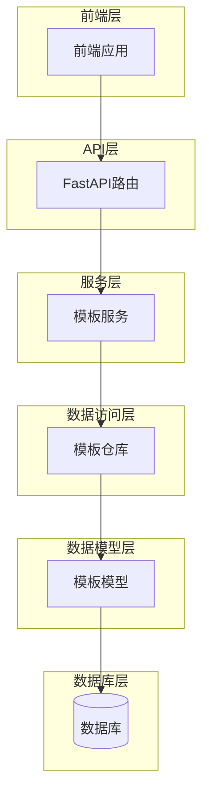
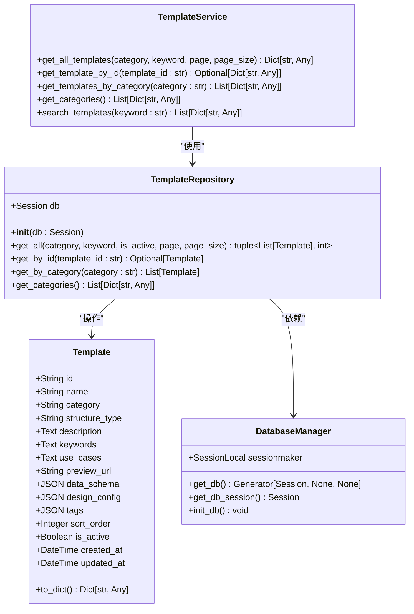
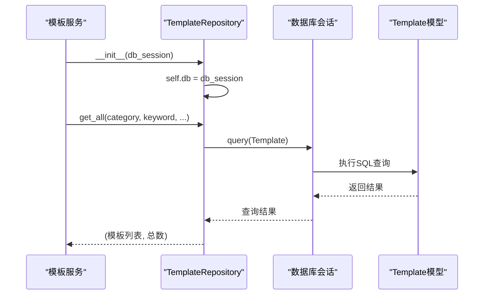
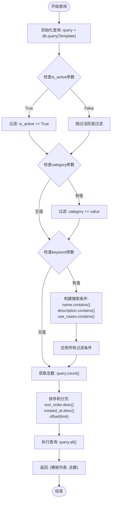
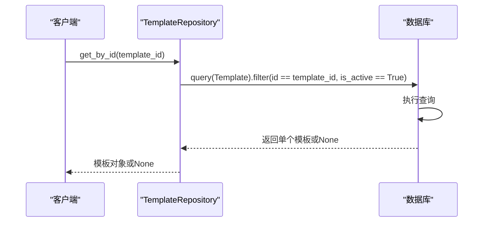
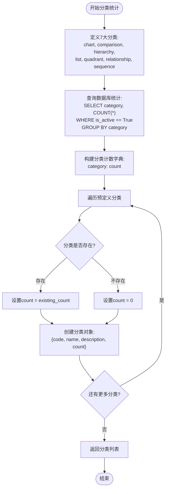
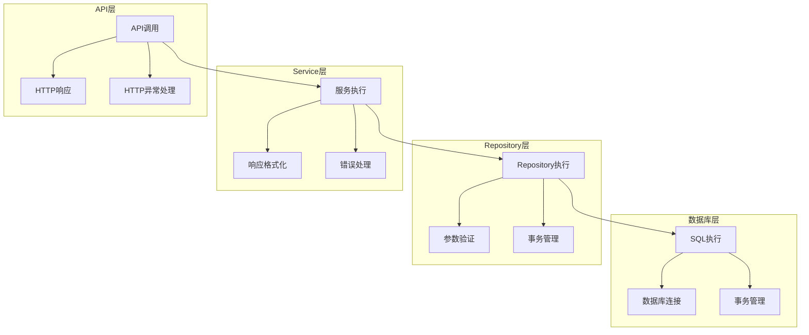
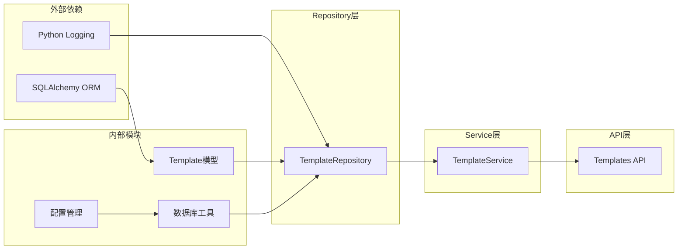

# 模板仓库

<cite>
**本文档中引用的文件**
- [template_repo.py](file://backend/app/repositories/template_repo.py)
- [template.py](file://backend/app/models/template.py)
- [templates.py](file://backend/app/api/v1/templates.py)
- [template_service.py](file://backend/app/services/template_service.py)
- [db.py](file://backend/app/utils/db.py)
- [import_templates.py](file://backend/scripts/import_templates.py)
- [init_template_categories.py](file://backend/scripts/init_template_categories.py)
- [add_template_category_fields.py](file://backend/scripts/add_template_category_fields.py)
</cite>

## 目录
1. [简介](#简介)
2. [项目结构](#项目结构)
3. [核心组件](#核心组件)
4. [架构概览](#架构概览)
5. [详细组件分析](#详细组件分析)
6. [依赖关系分析](#依赖关系分析)
7. [性能考虑](#性能考虑)
8. [故障排除指南](#故障排除指南)
9. [结论](#结论)

## 简介

TemplateRepository类是AntV Infographic项目中负责模板数据访问的核心组件。它作为数据访问层，提供了对模板数据的统一接口，支持分页查询、条件筛选、分类统计等功能。该类采用Repository模式，实现了数据访问逻辑与业务逻辑的分离，为上层服务层提供了稳定可靠的数据操作接口。

## 项目结构

该项目采用分层架构设计，主要包含以下模块：

**图表来源**
- [templates.py](file://backend/app/api/v1/templates.py#L1-L99)
- [template_service.py](file://backend/app/services/template_service.py#L160-L280)
- [template_repo.py](file://backend/app/repositories/template_repo.py#L13-L144)

**章节来源**
- [template_repo.py](file://backend/app/repositories/template_repo.py#L1-L144)
- [template.py](file://backend/app/models/template.py#L1-L54)

## 核心组件

TemplateRepository类是模板数据访问的核心组件，提供了以下关键功能：

### 主要方法概述

| 方法名 | 功能描述 | 参数 | 返回值 |
|--------|----------|------|--------|
| `get_all` | 获取模板列表（支持分页和筛选） | category, keyword, is_active, page, page_size | (模板列表, 总数) |
| `get_by_id` | 根据ID获取单个模板 | template_id | 模板对象或None |
| `get_by_category` | 根据分类获取模板列表 | category | 模板列表 |
| `get_categories` | 获取分类统计信息 | 无 | 分类列表 |

### 数据模型结构

模板数据模型包含以下核心字段：

| 字段名 | 类型 | 描述 | 索引 |
|--------|------|------|------|
| id | String(100) | 模板唯一标识符 | 主键 |
| name | String(200) | 模板名称 | - |
| category | String(50) | 分类代码 | 是 |
| structure_type | String(100) | 结构类型 | 是 |
| description | Text | 模板描述 | - |
| keywords | Text | 关键词列表 | - |
| use_cases | Text | 适用场景 | - |
| preview_url | String(500) | 预览图URL | - |
| data_schema | JSON | 数据结构Schema | - |
| design_config | JSON | 设计配置 | - |
| tags | JSON | 标签数组 | - |
| sort_order | Integer | 排序权重 | - |
| is_active | Boolean | 是否启用 | - |
| created_at | DateTime | 创建时间 | - |
| updated_at | DateTime | 更新时间 | - |

**章节来源**
- [template_repo.py](file://backend/app/repositories/template_repo.py#L13-L144)
- [template.py](file://backend/app/models/template.py#L9-L54)

## 架构概览

TemplateRepository类采用了经典的Repository模式，实现了数据访问层的抽象化：

**图表来源**
- [template_repo.py](file://backend/app/repositories/template_repo.py#L13-L144)
- [template.py](file://backend/app/models/template.py#L9-L54)
- [template_service.py](file://backend/app/services/template_service.py#L160-L280)
- [db.py](file://backend/app/utils/db.py#L58-L94)

## 详细组件分析

### TemplateRepository类实现

#### 初始化方法

Repository类通过构造函数接收数据库会话，确保了依赖注入和测试的便利性：

**图表来源**
- [template_repo.py](file://backend/app/repositories/template_repo.py#L16-L23)
- [template_service.py](file://backend/app/services/template_service.py#L165-L169)

#### get_all方法实现

get_all方法是最复杂的方法，支持多种筛选条件和分页功能：

**图表来源**
- [template_repo.py](file://backend/app/repositories/template_repo.py#L25-L73)

#### get_by_id方法实现

该方法提供精确的模板查找功能，同时确保只返回激活状态的模板：

**图表来源**
- [template_repo.py](file://backend/app/repositories/template_repo.py#L75-L88)

#### get_categories方法实现

该方法实现了分类统计功能，整合了预定义分类信息与数据库统计：

**图表来源**
- [template_repo.py](file://backend/app/repositories/template_repo.py#L105-L144)

**章节来源**
- [template_repo.py](file://backend/app/repositories/template_repo.py#L25-L144)

### 数据库索引优化

为了提高查询性能，模板表定义了多个索引：

| 索引名称 | 字段组合 | 用途 |
|----------|----------|------|
| idx_category_sort | category, sort_order | 分类+排序查询优化 |
| idx_structure_type | structure_type | 结构类型查询优化 |
| 主键索引 | id | 唯一标识查询优化 |

复合索引idx_category_sort特别针对常见的分类查询场景进行了优化，能够显著提升get_by_category方法的查询性能。

**章节来源**
- [template.py](file://backend/app/models/template.py#L30-L33)
- [add_template_category_fields.py](file://backend/scripts/add_template_category_fields.py#L72-L83)

### 异常处理策略

系统采用了多层次的异常处理策略：

**图表来源**
- [db.py](file://backend/app/utils/db.py#L58-L94)
- [template_service.py](file://backend/app/services/template_service.py#L160-L280)

**章节来源**
- [db.py](file://backend/app/utils/db.py#L58-L94)
- [import_templates.py](file://backend/scripts/import_templates.py#L48-L146)

## 依赖关系分析

TemplateRepository类的依赖关系体现了清晰的分层架构：

**图表来源**
- [template_repo.py](file://backend/app/repositories/template_repo.py#L1-L11)
- [template_service.py](file://backend/app/services/template_service.py#L160-L169)
- [db.py](file://backend/app/utils/db.py#L1-L11)

**章节来源**
- [template_repo.py](file://backend/app/repositories/template_repo.py#L1-L11)
- [template_service.py](file://backend/app/services/template_service.py#L160-L280)

## 性能考虑

### 查询性能优化

1. **索引策略**：
   - 在category字段上建立了索引，优化分类查询
   - 在structure_type字段上建立了索引，支持结构类型查询
   - 复合索引idx_category_sort优化了分类+排序查询

2. **分页优化**：
   - 使用offset和limit实现高效分页
   - 避免全表扫描，只加载必要的数据

3. **查询优化**：
   - 条件筛选按效率优先级排列
   - 使用SQLAlchemy的惰性加载特性

### 数据一致性保障

1. **事务管理**：
   - 使用数据库事务确保操作的原子性
   - 自动回滚机制处理异常情况

2. **数据验证**：
   - 在导入脚本中实现了严格的数据验证
   - 支持数据完整性检查和修复

3. **并发控制**：
   - 数据库连接池管理
   - 适当的锁机制防止数据竞争

**章节来源**
- [template.py](file://backend/app/models/template.py#L30-L33)
- [import_templates.py](file://backend/scripts/import_templates.py#L24-L46)
- [db.py](file://backend/app/utils/db.py#L22-L36)

## 故障排除指南

### 常见问题及解决方案

1. **数据库连接问题**：
   - 检查DATABASE_URL配置
   - 验证数据库服务状态
   - 确认连接池配置

2. **查询性能问题**：
   - 检查索引是否正确创建
   - 分析SQL查询计划
   - 调整分页大小参数

3. **数据导入问题**：
   - 验证JSON文件格式
   - 检查数据完整性
   - 查看错误日志

### 监控和调试

系统提供了完善的日志记录功能，可以通过配置DEBUG_MODE来启用详细的SQL语句输出。

**章节来源**
- [db.py](file://backend/app/utils/db.py#L18-L36)
- [import_templates.py](file://backend/scripts/import_templates.py#L16-L22)

## 结论

TemplateRepository类作为模板数据访问的核心组件，成功实现了以下目标：

1. **数据访问抽象**：通过Repository模式实现了数据访问逻辑的封装
2. **功能完整性**：支持分页查询、条件筛选、分类统计等完整功能
3. **性能优化**：通过索引和查询优化确保了良好的性能表现
4. **异常处理**：建立了完善的异常处理和恢复机制
5. **扩展性**：清晰的架构设计便于功能扩展和维护

该实现为整个AntV Infographic项目提供了稳定可靠的模板数据访问能力，支撑了信息图表生成系统的各项功能需求。通过合理的分层设计和性能优化，确保了系统在高并发场景下的稳定运行。