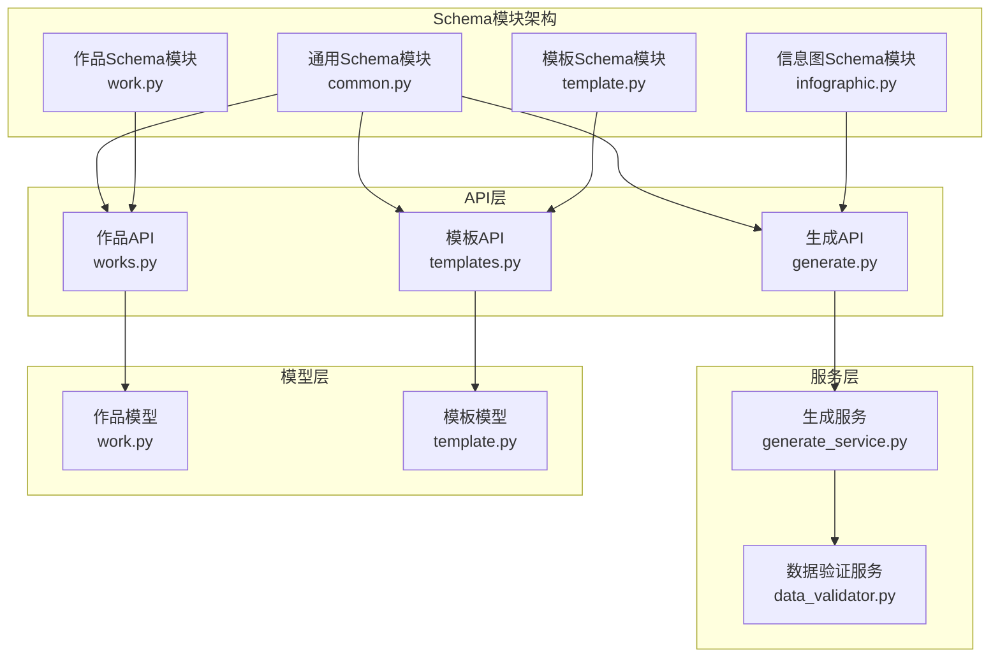
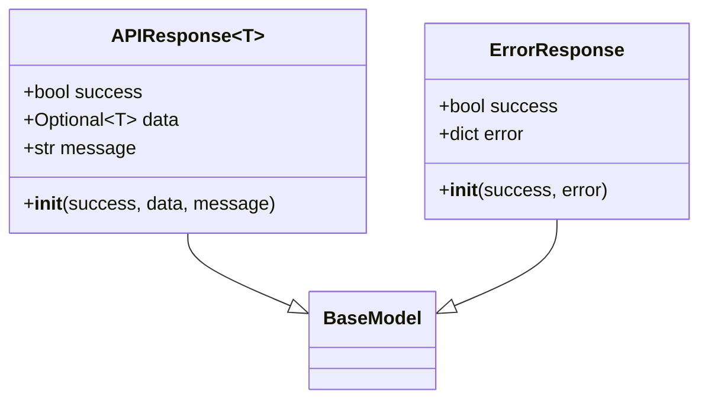
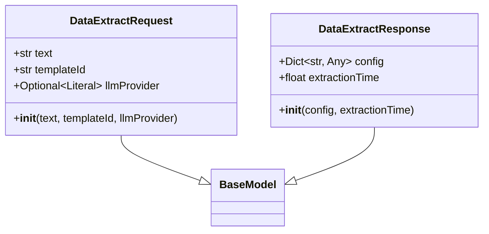
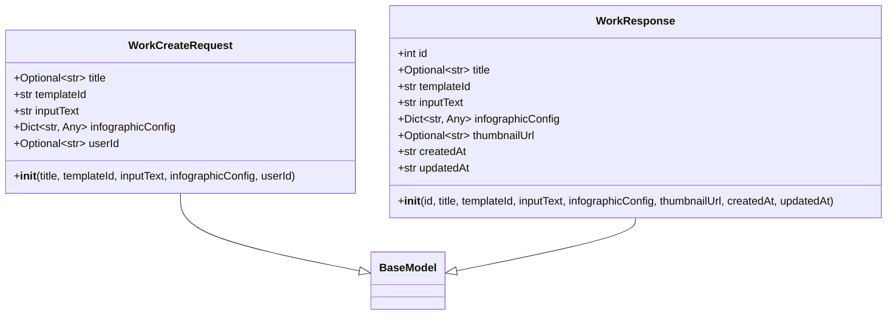
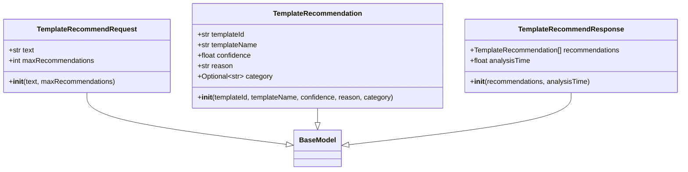
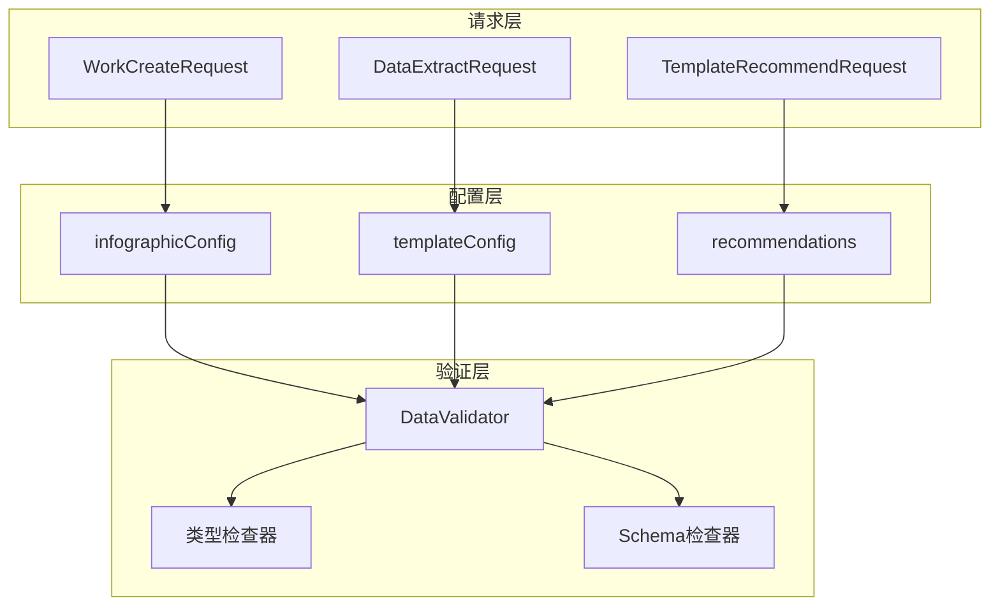
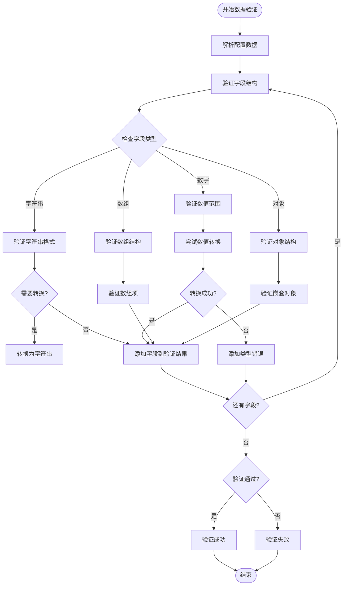
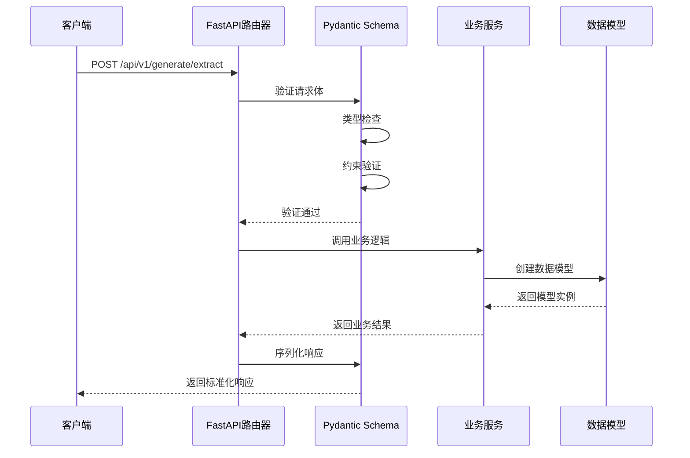
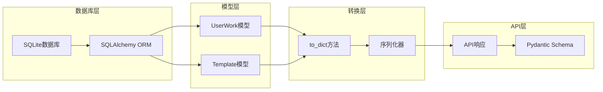
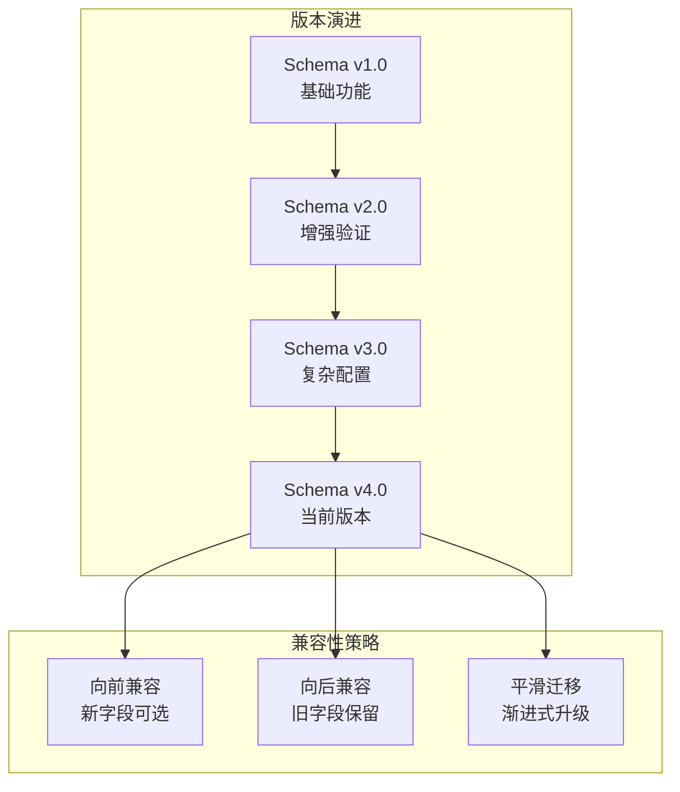

# Schema定义

<cite>
**本文档引用的文件**
- [infographic.py](file://backend/app/schemas/infographic.py)
- [common.py](file://backend/app/schemas/common.py)
- [work.py](file://backend/app/schemas/work.py)
- [template.py](file://backend/app/schemas/template.py)
- [generate.py](file://backend/app/api/v1/generate.py)
- [templates.py](file://backend/app/api/v1/templates.py)
- [works.py](file://backend/app/api/v1/works.py)
- [generate_service.py](file://backend/app/services/generate_service.py)
- [data_validator.py](file://backend/app/services/data_validator.py)
- [work.py](file://backend/app/models/work.py)
- [template.py](file://backend/app/models/template.py)
- [check_schema.py](file://tests/backend/check_schema.py)
</cite>

## 目录
1. [简介](#简介)
2. [Schema架构概览](#schema架构概览)
3. [核心Schema组件](#核心schema组件)
4. [嵌套结构设计](#嵌套结构设计)
5. [数据验证机制](#数据验证机制)
6. [API集成与使用](#api集成与使用)
7. [数据转换与序列化](#数据转换与序列化)
8. [版本管理策略](#版本管理策略)
9. [最佳实践指南](#最佳实践指南)
10. [故障排除](#故障排除)

## 简介

本文档详细阐述了GenAI Chart项目中Pydantic Schema定义的设计理念和实现细节。Schema系统作为API数据验证和序列化的核心组件，确保了前后端数据交互的一致性和可靠性。通过精心设计的Schema层次结构，系统能够有效处理复杂的AI生成信息图配置数据，并提供标准化的响应格式。

## Schema架构概览

GenAI Chart的Schema系统采用模块化设计，主要分为以下几个核心模块：



**图表来源**
- [common.py](file://backend/app/schemas/common.py#L1-L21)
- [infographic.py](file://backend/app/schemas/infographic.py#L1-L22)
- [work.py](file://backend/app/schemas/work.py#L1-L27)
- [template.py](file://backend/app/schemas/template.py#L1-L27)

**章节来源**
- [common.py](file://backend/app/schemas/common.py#L1-L21)
- [infographic.py](file://backend/app/schemas/infographic.py#L1-L22)
- [work.py](file://backend/app/schemas/work.py#L1-L27)
- [template.py](file://backend/app/schemas/template.py#L1-L27)

## 核心Schema组件

### 通用响应Schema

通用响应Schema提供了统一的API响应格式，支持泛型类型以适应不同的业务场景。



**图表来源**
- [common.py](file://backend/app/schemas/common.py#L10-L21)

#### APIResponse泛型设计

APIResponse采用泛型设计，允许在编译时确定响应数据的类型：

- **success**: 布尔值，表示操作是否成功
- **data**: 可选的泛型类型，包含具体的响应数据
- **message**: 字符串，默认为"操作成功"

#### ErrorResponse专门化设计

ErrorResponse针对错误场景进行了专门化设计：

- **success**: 默认为False，明确标识错误状态
- **error**: 字典类型，包含详细的错误信息

**章节来源**
- [common.py](file://backend/app/schemas/common.py#L10-L21)

### Infographic配置Schema

Infographic模块定义了AI生成信息图的核心数据结构，支持数据提取和配置生成。



**图表来源**
- [infographic.py](file://backend/app/schemas/infographic.py#L8-L22)

#### DataExtractRequest详细字段

- **text**: 用户输入的文本内容，必需字段，最小长度为1
- **templateId**: 指定使用的模板ID，必需字段
- **llmProvider**: LLM提供商选择，可选，支持'system'或'dify'

#### DataExtractResponse核心结构

- **config**: 完整的Infographic配置对象，类型为字典
- **extractionTime**: 数据提取耗时，浮点数类型

**章节来源**
- [infographic.py](file://backend/app/schemas/infographic.py#L8-L22)

### 作品管理Schema

作品Schema负责管理用户创建的信息图作品，包含完整的作品生命周期数据。



**图表来源**
- [work.py](file://backend/app/schemas/work.py#L8-L27)

#### WorkCreateRequest构建要素

- **title**: 作品标题，可选字段
- **templateId**: 使用的模板ID，必需字段
- **inputText**: 用户输入的原始文本，必需字段
- **infographicConfig**: 完整的Infographic配置，必需字段
- **userId**: 用户ID，可选字段，用于用户作品管理

#### WorkResponse完整信息

WorkResponse提供作品的完整信息视图：

- **id**: 作品唯一标识符
- **title**: 作品标题
- **templateId**: 使用的模板ID
- **inputText**: 原始输入文本
- **infographicConfig**: 配置数据
- **thumbnailUrl**: 缩略图URL
- **createdAt**: 创建时间
- **updatedAt**: 更新时间

**章节来源**
- [work.py](file://backend/app/schemas/work.py#L8-L27)

### 模板推荐Schema

模板推荐Schema处理AI驱动的模板选择和推荐功能。



**图表来源**
- [template.py](file://backend/app/schemas/template.py#L8-L27)

#### TemplateRecommendRequest配置

- **text**: 用户输入的文本内容，必需字段，最小长度为1
- **maxRecommendations**: 最多推荐数量，默认为5，范围1-10

#### TemplateRecommendation详细信息

- **templateId**: 模板唯一标识符
- **templateName**: 模板名称
- **confidence**: 置信度分数
- **reason**: 推荐理由
- **category**: 可选的模板分类

#### TemplateRecommendResponse聚合结果

- **recommendations**: 推荐结果列表
- **analysisTime**: 分析耗时

**章节来源**
- [template.py](file://backend/app/schemas/template.py#L8-L27)

## 嵌套结构设计

GenAI Chart的Schema系统采用了精心设计的嵌套结构，以支持复杂的信息图配置数据验证。

### 多层嵌套验证



**图表来源**
- [work.py](file://backend/app/schemas/work.py#L12-L13)
- [infographic.py](file://backend/app/schemas/infographic.py#L10-L11)
- [template.py](file://backend/app/schemas/template.py#L10-L11)

### 复杂配置数据结构

系统支持多层次的配置数据验证：

1. **顶层验证**: 请求参数的基本类型和约束检查
2. **中间层验证**: 复杂对象结构的完整性检查
3. **底层验证**: 具体字段值的业务规则验证

**章节来源**
- [work.py](file://backend/app/schemas/work.py#L12-L13)
- [infographic.py](file://backend/app/schemas/infographic.py#L10-L11)
- [template.py](file://backend/app/schemas/template.py#L10-L11)

## 数据验证机制

### 自定义验证器实现

GenAI Chart实现了专门的数据验证服务，用于处理特定业务规则的数据校验。



**图表来源**
- [data_validator.py](file://backend/app/services/data_validator.py#L51-L123)

### 字段验证规则

数据验证器支持多种字段类型的验证：

1. **字符串验证**: 检查字符串格式和长度约束
2. **数值验证**: 支持整数和浮点数，包含范围检查
3. **数组验证**: 验证数组结构和项类型
4. **对象验证**: 深度验证嵌套对象结构

### 模板参数有效性检查

系统实现了专门的模板参数有效性检查机制：

- **必需字段检查**: 确保所有必需字段都存在
- **类型一致性检查**: 验证字段类型与预期一致
- **业务规则验证**: 应用特定的业务约束
- **格式规范化**: 自动转换和规范化数据格式

**章节来源**
- [data_validator.py](file://backend/app/services/data_validator.py#L51-L123)

## API集成与使用

### FastAPI路由中的Schema使用

GenAI Chart在FastAPI路由中广泛使用Schema进行请求体验证和响应模型声明。



**图表来源**
- [generate.py](file://backend/app/api/v1/generate.py#L62-L88)
- [works.py](file://backend/app/api/v1/works.py#L15-L46)

### 实际代码示例

#### 智能生成API端点

智能生成端点展示了Schema在复杂业务流程中的应用：

```python
@router.post("/smart", summary="智能生成信息图（三阶段流程）")
async def smart_generate(request: SmartGenerateRequest):
    # Schema自动验证请求参数
    # 自动生成错误响应
    result = await generate_service.generate_smart(user_text=request.text)
    return APIResponse(success=True, data=result, message="智能生成成功")
```

#### 数据提取API端点

数据提取端点演示了多层Schema验证：

```python
@router.post("/extract", summary="提取结构化数据（传统模式）")
async def extract_data(request: DataExtractRequest):
    # 多层验证：请求参数 → 模板配置 → 数据结构
    result = await generate_service.extract_data(
        user_text=request.text,
        template_id=request.templateId,
        force_provider=request.llmProvider
    )
    return APIResponse(success=True, data=result, message="数据提取成功")
```

#### 作品创建API端点

作品创建端点展示了完整的工作流集成：

```python
@router.post("", summary="保存作品")
async def create_work(request: WorkCreateRequest):
    # 数据库模型转换和验证
    work = UserWork(
        title=request.title,
        template_id=request.templateId,
        input_text=request.inputText,
        infographic_config=request.infographicConfig,
        user_id=request.userId
    )
    created_work = repo.create(work)
    return APIResponse(success=True, data=created_work.to_dict(), message="作品保存成功")
```

**章节来源**
- [generate.py](file://backend/app/api/v1/generate.py#L31-L88)
- [works.py](file://backend/app/api/v1/works.py#L15-L46)

## 数据转换与序列化

### 数据库模型到API响应的转换

GenAI Chart实现了完整的数据转换管道，确保数据库模型能够正确转换为API响应格式。



**图表来源**
- [work.py](file://backend/app/models/work.py#L24-L37)
- [template.py](file://backend/app/models/template.py#L35-L53)

### 字段映射和过滤规则

系统实现了智能的字段映射和过滤机制：

#### Work模型转换规则

Work模型的to_dict方法实现了以下转换规则：

1. **字段重命名**: 将Python风格的snake_case转换为JavaScript风格的camelCase
2. **日期格式化**: 将datetime对象转换为ISO格式字符串
3. **空值处理**: 正确处理null值和缺失字段
4. **类型转换**: 确保返回值符合Schema定义的类型要求

#### 模板模型转换规则

模板模型同样实现了类似的转换机制：

1. **JSON字段处理**: 自动解析JSON存储的配置数据
2. **列表字段处理**: 将逗号分隔的字符串转换为列表
3. **布尔值处理**: 确保布尔值的正确转换
4. **时间戳处理**: 统一时间格式

### 序列化优化策略

为了提高性能和减少内存占用，系统采用了以下优化策略：

1. **延迟加载**: 只在需要时加载完整数据
2. **字段选择**: 根据API需求选择性地序列化字段
3. **缓存机制**: 缓存常用的转换结果
4. **批量处理**: 批量处理多个对象的转换

**章节来源**
- [work.py](file://backend/app/models/work.py#L24-L37)
- [template.py](file://backend/app/models/template.py#L35-L53)

## 版本管理策略

### Schema版本控制机制

GenAI Chart采用了渐进式的Schema版本管理策略，确保API的向前和向后兼容性。



### API兼容性保证

系统通过以下机制确保API兼容性：

1. **字段标记策略**: 新增字段标记为可选，避免破坏现有客户端
2. **默认值机制**: 为新增字段提供合理的默认值
3. **废弃通知**: 提前通知API变更，给予客户端迁移时间
4. **多版本共存**: 在过渡期内同时支持多个版本的Schema

### 迁移工具和脚本

GenAI Chart提供了完整的数据库迁移工具：

```python
# 示例：模板分类字段迁移
def add_template_category_fields():
    """添加模板分类相关字段"""
    # 新增category字段
    # 新增structure_type字段  
    # 新增keywords字段
    # 创建索引优化查询
```

**章节来源**
- [add_template_category_fields.py](file://backend/scripts/add_template_category_fields.py#L1-L97)

## 最佳实践指南

### Schema设计原则

1. **单一职责**: 每个Schema专注于特定的业务领域
2. **最小化原则**: 只包含必要的字段和验证规则
3. **可扩展性**: 设计时考虑未来的扩展需求
4. **一致性**: 保持命名规范和设计模式的一致性

### 验证策略建议

1. **分层验证**: 在不同层次实施相应的验证策略
2. **提前验证**: 在业务逻辑执行前进行数据验证
3. **详细错误**: 提供清晰的错误信息帮助调试
4. **性能考虑**: 平衡验证严格性和性能影响

### 错误处理最佳实践

1. **统一错误格式**: 使用统一的错误响应格式
2. **详细错误信息**: 提供足够的上下文信息
3. **安全考虑**: 避免泄露敏感信息
4. **用户体验**: 提供友好的错误提示

### 性能优化建议

1. **懒加载**: 只在需要时进行深度验证
2. **缓存策略**: 缓存验证结果避免重复计算
3. **批量处理**: 批量处理相似的验证任务
4. **异步验证**: 对于耗时验证使用异步处理

## 故障排除

### 常见Schema验证问题

#### 类型验证失败

**问题症状**: Pydantic抛出类型验证错误

**解决方案**:
1. 检查字段类型定义是否正确
2. 验证输入数据的类型匹配
3. 使用自定义转换器处理类型转换

#### 约束验证失败

**问题症状**: 字段值超出设定的约束范围

**解决方案**:
1. 检查约束条件定义
2. 验证输入数据是否符合约束
3. 提供更明确的错误提示

#### 嵌套结构验证失败

**问题症状**: 复杂嵌套对象验证失败

**解决方案**:
1. 分层验证嵌套结构
2. 检查子Schema定义
3. 使用递归验证机制

### 性能问题诊断

#### 验证性能瓶颈

**诊断步骤**:
1. 监控验证时间消耗
2. 分析复杂度较高的验证规则
3. 识别重复验证的字段

**优化方案**:
1. 实施缓存机制
2. 优化验证算法
3. 减少不必要的验证

#### 内存使用优化

**优化策略**:
1. 使用生成器处理大数据集
2. 及时释放不需要的对象
3. 实施内存池管理

### 调试技巧

#### Schema验证调试

1. **启用详细日志**: 启用Pydantic的详细验证日志
2. **单元测试**: 编写针对性的Schema验证测试
3. **边界测试**: 测试各种边界条件和异常情况

#### 数据转换调试

1. **断点调试**: 在to_dict方法设置断点
2. **数据对比**: 对比原始数据和转换后的数据
3. **类型检查**: 验证转换后的数据类型正确性

**章节来源**
- [check_schema.py](file://tests/backend/check_schema.py#L1-L23)

## 结论

GenAI Chart的Schema定义系统展现了现代Web应用中数据验证和序列化的最佳实践。通过Pydantic的强大功能，系统实现了：

1. **强类型安全**: 编译时和运行时的双重类型检查
2. **自动文档生成**: 基于Schema的API文档自动生成
3. **灵活的数据验证**: 支持复杂业务规则的自定义验证
4. **优秀的开发者体验**: 清晰的错误信息和完善的类型提示

这套Schema系统不仅确保了应用的稳定性和可靠性，还为后续的功能扩展和维护奠定了坚实的基础。随着项目的不断发展，这套Schema设计将继续发挥重要作用，支撑着GenAI Chart成为强大的AI驱动信息图生成平台。