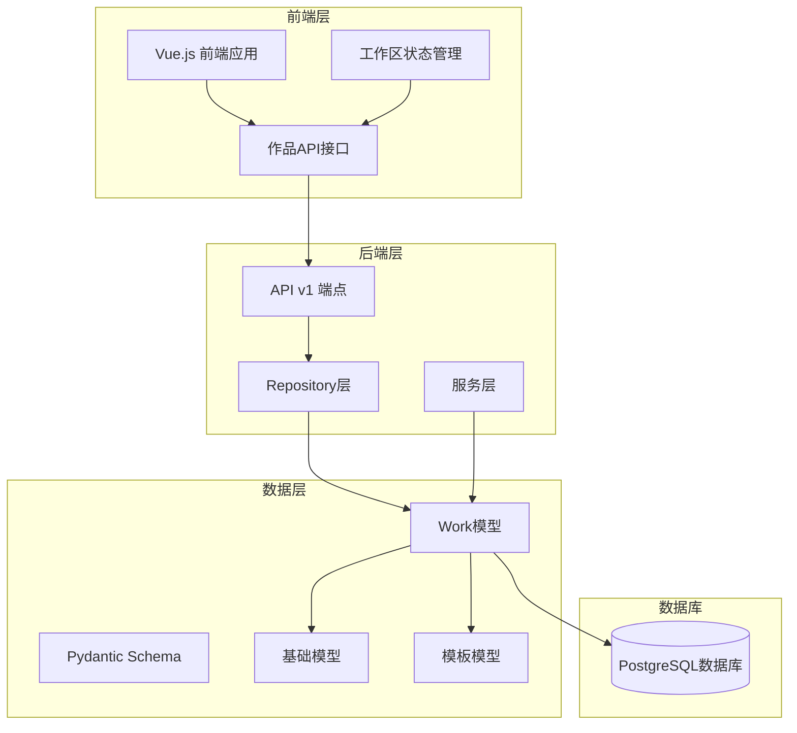
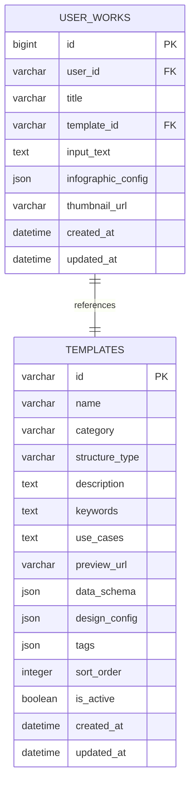
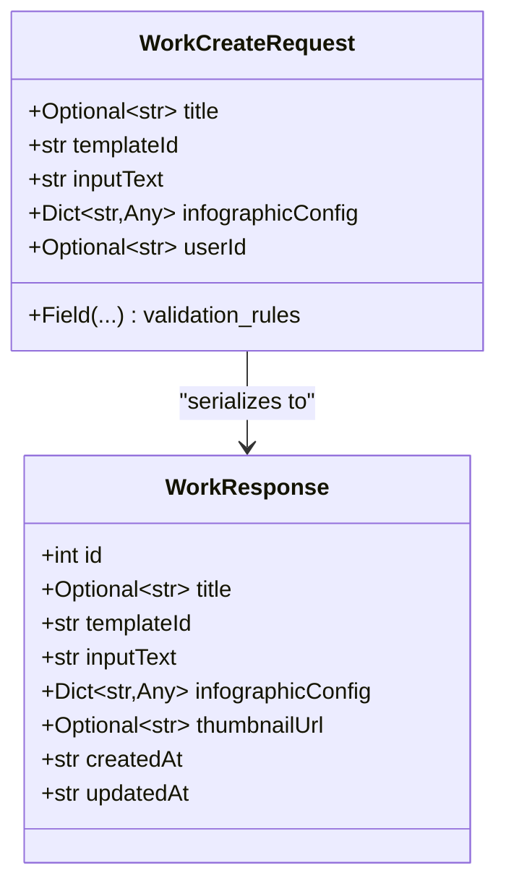
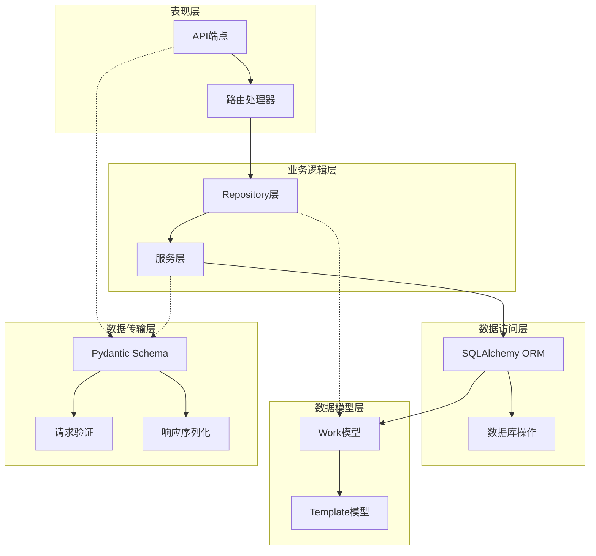
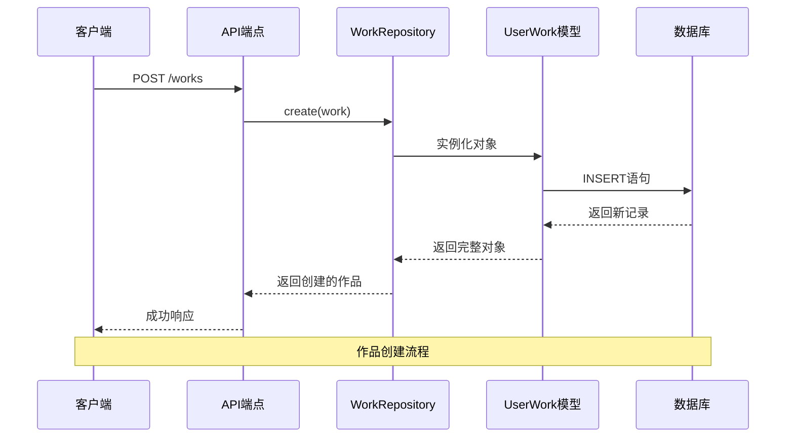
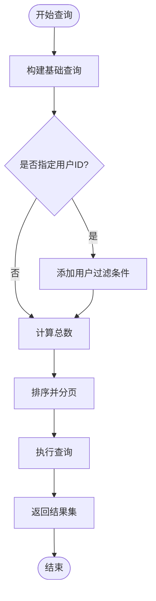
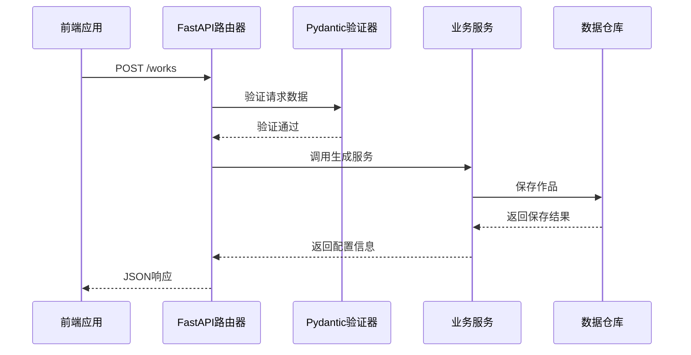
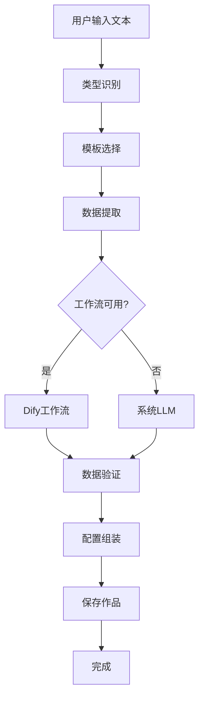
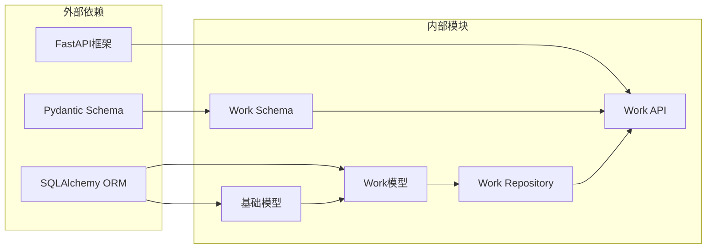
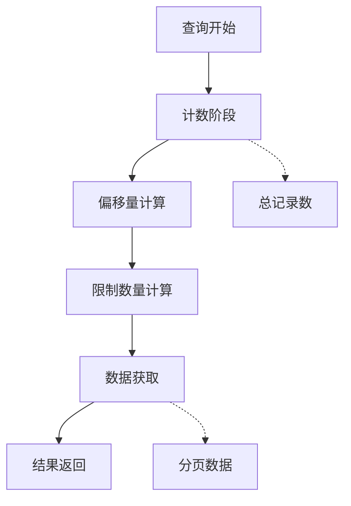

# 作品模型

<cite>
**本文档中引用的文件**
- [work.py](file://backend/app/models/work.py)
- [work.py](file://backend/app/schemas/work.py)
- [work_repo.py](file://backend/app/repositories/work_repo.py)
- [works.py](file://backend/app/api/v1/works.py)
- [base.py](file://backend/app/models/base.py)
- [template.py](file://backend/app/models/template.py)
- [generate_service.py](file://backend/app/services/generate_service.py)
- [dify_workflow_client.py](file://backend/app/services/dify_workflow_client.py)
- [work.ts](file://frontend/src/api/work.ts)
- [workspace.ts](file://frontend/src/stores/workspace.ts)
</cite>

## 目录
1. [简介](#简介)
2. [项目结构](#项目结构)
3. [核心组件](#核心组件)
4. [架构概览](#架构概览)
5. [详细组件分析](#详细组件分析)
6. [依赖关系分析](#依赖关系分析)
7. [性能考虑](#性能考虑)
8. [故障排除指南](#故障排除指南)
9. [结论](#结论)

## 简介

作品模型是GenAI图表系统的核心数据结构，负责存储和管理用户创作的信息图作品。该模型采用分层架构设计，结合SQLAlchemy ORM和Pydantic Schema，提供了完整的数据持久化、验证和序列化功能。作品模型不仅存储基本信息，还支持复杂的工作流处理、状态管理和版本控制。

## 项目结构

作品模型的实现分布在多个层次中，形成了清晰的分层架构：

**图表来源**
- [works.py](file://backend/app/api/v1/works.py#L1-L106)
- [work_repo.py](file://backend/app/repositories/work_repo.py#L1-L82)
- [work.py](file://backend/app/models/work.py#L1-L37)

## 核心组件

### Work数据库模型

Work模型是整个系统的核心数据实体，继承自基础模型类，定义了作品的所有必要字段和关系。

#### 主要字段定义

| 字段名 | 数据类型 | 约束条件 | 描述 |
|--------|----------|----------|------|
| id | BigInteger | 主键，自增 | 作品唯一标识符 |
| user_id | String(100) | 可选，带索引 | 用户标识，支持匿名用户 |
| title | String(200) | 可选 | 作品标题，默认为空 |
| template_id | String(100) | 外键，非空 | 关联的模板ID |
| input_text | Text | 非空 | 用户输入的原始文本 |
| infographic_config | JSON | 非空 | 完整的Infographic配置 |
| thumbnail_url | String(500) | 可选 | 缩略图URL地址 |
| created_at | DateTime | 默认当前时间 | 作品创建时间戳 |
| updated_at | DateTime | 自动更新 | 最后修改时间戳 |

#### 外键关联关系

作品模型与模板模型建立了严格的外键关联关系，确保数据完整性：

**图表来源**
- [work.py](file://backend/app/models/work.py#L13-L22)
- [template.py](file://backend/app/models/template.py#L14-L28)

**章节来源**
- [work.py](file://backend/app/models/work.py#L1-L37)
- [template.py](file://backend/app/models/template.py#L1-L54)

### Pydantic Schema设计

Schema层提供了API请求验证和响应序列化的功能，确保数据传输的一致性和安全性。

#### WorkCreateRequest Schema

**图表来源**
- [work.py](file://backend/app/schemas/work.py#L8-L27)

**章节来源**
- [work.py](file://backend/app/schemas/work.py#L1-L27)

## 架构概览

作品模型采用了经典的三层架构模式，实现了关注点分离和高内聚低耦合的设计原则。

**图表来源**
- [works.py](file://backend/app/api/v1/works.py#L15-L106)
- [work_repo.py](file://backend/app/repositories/work_repo.py#L12-L82)
- [work.py](file://backend/app/models/work.py#L9-L37)

## 详细组件分析

### WorkRepository数据访问层

Repository模式提供了统一的数据访问接口，封装了数据库操作的复杂性。

#### 核心方法分析

**图表来源**
- [works.py](file://backend/app/api/v1/works.py#L25-L47)
- [work_repo.py](file://backend/app/repositories/work_repo.py#L24-L37)

#### 分页查询实现

Repository层实现了高效的分页查询功能，支持大数据量场景下的性能优化：

**图表来源**
- [work_repo.py](file://backend/app/repositories/work_repo.py#L51-L82)

**章节来源**
- [work_repo.py](file://backend/app/repositories/work_repo.py#L1-L82)

### API端点处理

API层负责处理HTTP请求，协调Repository和服务层完成业务逻辑。

#### 请求处理流程

**图表来源**
- [works.py](file://backend/app/api/v1/works.py#L15-L47)

**章节来源**
- [works.py](file://backend/app/api/v1/works.py#L1-L106)

### 工作流集成

作品模型与Dify工作流深度集成，支持智能化的数据生成和配置组装。

#### 智能生成流程

**图表来源**
- [generate_service.py](file://backend/app/services/generate_service.py#L47-L118)
- [dify_workflow_client.py](file://backend/app/services/dify_workflow_client.py#L31-L132)

**章节来源**
- [generate_service.py](file://backend/app/services/generate_service.py#L1-L465)
- [dify_workflow_client.py](file://backend/app/services/dify_workflow_client.py#L1-L196)

## 依赖关系分析

作品模型的依赖关系体现了良好的软件工程实践，实现了松耦合和高内聚的设计。

**图表来源**
- [work.py](file://backend/app/models/work.py#L5-L6)
- [work.py](file://backend/app/schemas/work.py#L4-L5)
- [works.py](file://backend/app/api/v1/works.py#L4-L10)

**章节来源**
- [work.py](file://backend/app/models/work.py#L1-L37)
- [work.py](file://backend/app/schemas/work.py#L1-L27)
- [work_repo.py](file://backend/app/repositories/work_repo.py#L1-L82)

## 性能考虑

### 索引优化策略

为了支持大规模用户作品的高效查询，作品模型采用了多层次的索引优化策略：

| 索引类型 | 字段 | 用途 | 性能提升 |
|----------|------|------|----------|
| 主键索引 | id | 唯一标识 | O(log n)查找 |
| 复合索引 | user_id, created_at | 用户作品列表 | 排序和过滤 |
| 外键索引 | template_id | 关联查询 | JOIN优化 |
| JSON索引 | infographic_config | 配置检索 | 部分字段查询 |

### 分页查询优化

Repository层实现了高效的分页查询机制，避免全表扫描对性能的影响：

**图表来源**
- [work_repo.py](file://backend/app/repositories/work_repo.py#L73-L81)

### 内存管理

前端工作区状态管理采用了Vue 3的响应式系统，实现了高效的内存管理和状态同步：

**章节来源**
- [work_repo.py](file://backend/app/repositories/work_repo.py#L51-L82)
- [workspace.ts](file://frontend/src/stores/workspace.ts#L1-L74)

## 故障排除指南

### 常见问题及解决方案

#### 1. 外键约束错误
当尝试保存不存在的模板ID时，会出现外键约束错误。系统通过以下机制处理：
- 在Repository层进行预验证
- API端点返回明确的错误信息
- 前端显示友好的错误提示

#### 2. JSON数据格式错误
Infographic配置的JSON格式错误会导致数据验证失败：
- Pydantic Schema提供详细的格式验证
- 后端返回具体的字段错误信息
- 前端根据错误信息引导用户修正

#### 3. 性能问题
大量作品查询时可能出现性能瓶颈：
- 启用数据库连接池
- 实现适当的缓存策略
- 优化索引结构

**章节来源**
- [works.py](file://backend/app/api/v1/works.py#L94-L105)
- [work_repo.py](file://backend/app/repositories/work_repo.py#L39-L48)

## 结论

作品模型作为GenAI图表系统的核心组件，成功地实现了以下目标：

1. **数据完整性保障**：通过外键约束和数据验证确保了数据的准确性和一致性
2. **性能优化**：采用分层架构、索引优化和分页查询等技术手段提升了系统性能
3. **可扩展性**：模块化设计使得系统易于扩展和维护
4. **用户体验**：前后端分离的架构提供了流畅的用户体验

该模型为信息图创作平台提供了坚实的数据基础，支持从简单文本输入到复杂配置生成的完整工作流程。随着系统的不断发展，作品模型将继续演进以满足日益增长的业务需求。