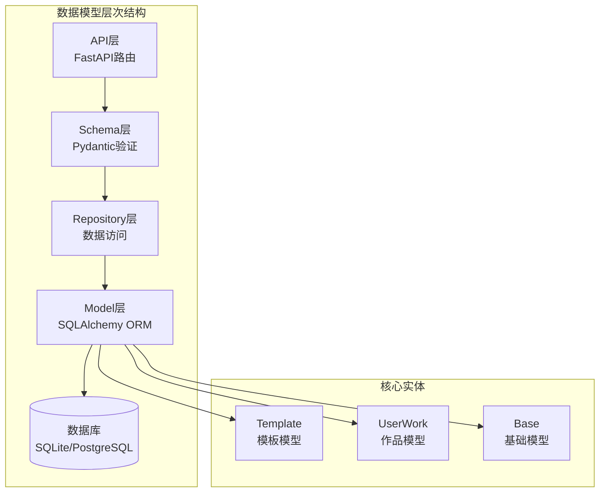
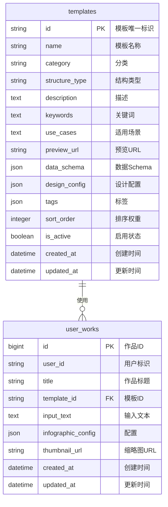
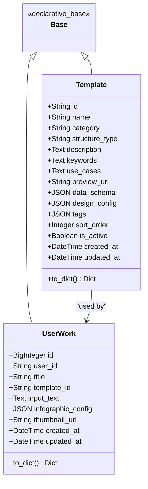
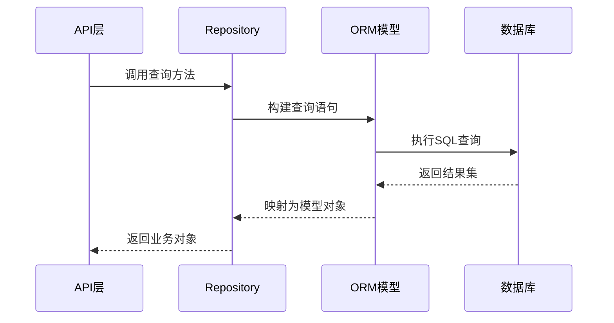
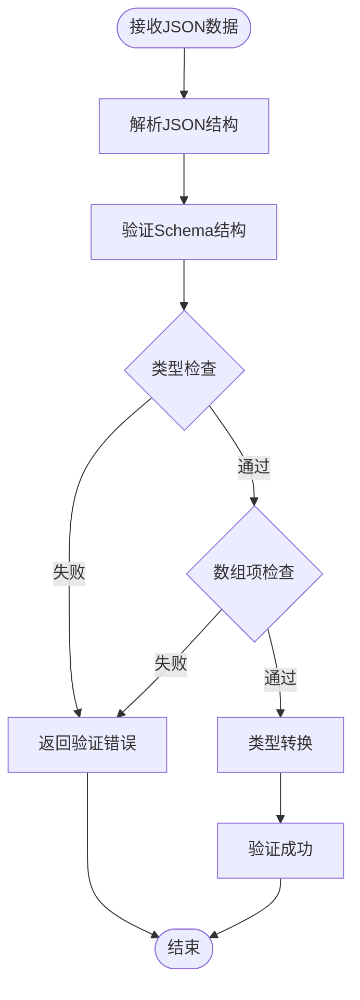
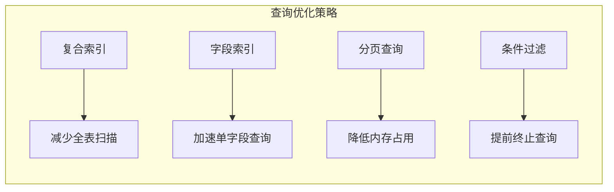
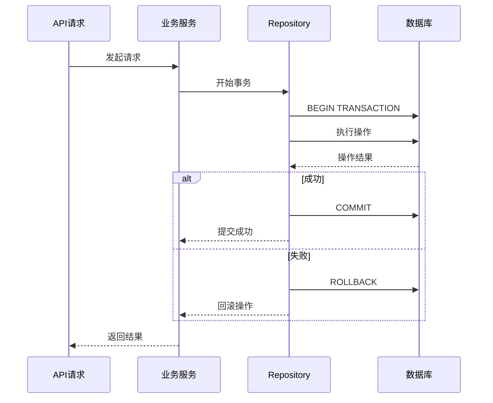

# 数据模型

<cite>
**本文档中引用的文件**
- [base.py](file://backend/app/models/base.py)
- [template.py](file://backend/app/models/template.py)
- [work.py](file://backend/app/models/work.py)
- [template_repo.py](file://backend/app/repositories/template_repo.py)
- [work_repo.py](file://backend/app/repositories/work_repo.py)
- [template.py](file://backend/app/schemas/template.py)
- [work.py](file://backend/app/schemas/work.py)
- [db.py](file://backend/app/utils/db.py)
- [config.py](file://backend/app/config.py)
- [main.py](file://backend/app/main.py)
- [templates.py](file://backend/app/api/v1/templates.py)
- [works.py](file://backend/app/api/v1/works.py)
</cite>

## 目录
1. [简介](#简介)
2. [项目结构概览](#项目结构概览)
3. [核心数据模型](#核心数据模型)
4. [数据库架构](#数据库架构)
5. [Pydantic Schema层](#pydantic-schema层)
6. [ORM映射关系](#orm映射关系)
7. [数据验证机制](#数据验证机制)
8. [索引策略](#索引策略)
9. [扩展性设计](#扩展性设计)
10. [最佳实践](#最佳实践)

## 简介

本文档详细描述了基于SQLAlchemy和Pydantic的后端数据模型架构。该系统采用分层设计模式，包含数据库模型层、Repository仓储层、Schema验证层和API服务层，为AI信息图生成系统提供了完整的数据管理解决方案。

## 项目结构概览

**图表来源**
- [main.py](file://backend/app/main.py#L1-L113)
- [db.py](file://backend/app/utils/db.py#L1-L94)

## 核心数据模型

### Template模型（模板）

Template模型是系统的核心实体之一，用于存储信息图模板的完整信息。

#### 字段定义

| 字段名 | 数据类型 | 约束条件 | 业务含义 |
|--------|----------|----------|----------|
| id | String(100) | 主键，唯一标识 | 模板的唯一标识符 |
| name | String(200) | 非空 | 模板名称（中文显示） |
| category | String(50) | 非空，带索引 | 分类（chart/comparison/hierarchy/list/quadrant/relationship/sequence） |
| structure_type | String(100) | 可为空，带索引 | AntV结构类型 |
| description | Text | 可为空 | 模板描述信息 |
| keywords | Text | 可为空 | 关键词列表（逗号分隔） |
| use_cases | Text | 可为空 | 适用场景说明 |
| preview_url | String(500) | 可为空 | 预览图URL地址 |
| data_schema | JSON | 非空 | 数据结构Schema定义 |
| design_config | JSON | 非空 | AntV设计配置参数 |
| tags | JSON | 可为空 | 标签数组 |
| sort_order | Integer | 默认0 | 排序权重 |
| is_active | Boolean | 默认True | 是否启用状态 |
| created_at | DateTime | 默认当前时间 | 创建时间戳 |
| updated_at | DateTime | 自动更新 | 更新时间戳 |

#### 业务特性

- **分类体系**：支持7大分类，便于模板管理和推荐
- **结构化配置**：通过JSON字段存储复杂的设计配置
- **版本控制**：通过时间戳字段实现数据变更追踪
- **软删除**：通过`is_active`字段实现逻辑删除

**章节来源**
- [template.py](file://backend/app/models/template.py#L1-L54)

### UserWork模型（用户作品）

UserWork模型记录用户创建的信息图作品及其相关信息。

#### 字段定义

| 字段名 | 数据类型 | 约束条件 | 业务含义 |
|--------|----------|----------|----------|
| id | BigInteger | 主键，自增 | 作品唯一标识符 |
| user_id | String(100) | 可为空，带索引 | 用户标识符 |
| title | String(200) | 可为空 | 作品标题 |
| template_id | String(100) | 外键，非空 | 关联的模板ID |
| input_text | Text | 非空 | 用户输入的原始文本 |
| infographic_config | JSON | 非空 | 完整的Infographic配置 |
| thumbnail_url | String(500) | 可为空 | 缩略图URL |
| created_at | DateTime | 默认当前时间 | 创建时间戳 |
| updated_at | DateTime | 自动更新 | 更新时间戳 |

#### 关联关系

- **一对一关系**：每个作品必须关联一个有效的模板
- **可选用户关联**：支持匿名用户创作功能
- **配置完整性**：通过JSON字段存储完整的配置信息

**章节来源**
- [work.py](file://backend/app/models/work.py#L1-L37)

## 数据库架构

### 表结构设计

**图表来源**
- [template.py](file://backend/app/models/template.py#L9-L33)
- [work.py](file://backend/app/models/work.py#L9-L23)

### 数据库初始化

系统支持多种数据库配置：

- **开发环境**：SQLite数据库，便于本地开发
- **生产环境**：PostgreSQL数据库，支持高并发访问
- **连接池优化**：PostgreSQL使用连接池提高性能

**章节来源**
- [db.py](file://backend/app/utils/db.py#L18-L40)

## Pydantic Schema层

### Template相关Schema

#### TemplateRecommendRequest
用于模板推荐的请求验证：

- **text**：用户输入的文本内容（必填，最小长度1）
- **maxRecommendations**：最多推荐数量（默认5，范围1-10）

#### TemplateRecommendation
单个模板推荐结果：

- **templateId**：模板ID
- **templateName**：模板名称
- **confidence**：推荐置信度
- **reason**：推荐理由
- **category**：可选分类信息

#### TemplateRecommendResponse
模板推荐响应：

- **recommendations**：推荐结果列表
- **analysisTime**：分析耗时

**章节来源**
- [template.py](file://backend/app/schemas/template.py#L1-L27)

### Work相关Schema

#### WorkCreateRequest
作品创建请求验证：

- **title**：作品标题（可选）
- **templateId**：模板ID（必填）
- **inputText**：原始文本（必填，最小长度1）
- **infographicConfig**：配置信息（必填）
- **userId**：用户ID（可选）

#### WorkResponse
作品响应数据：

- **id**：作品ID
- **title**：作品标题
- **templateId**：模板ID
- **inputText**：原始文本
- **infographicConfig**：配置信息
- **thumbnailUrl**：缩略图URL
- **createdAt**：创建时间
- **updatedAt**：更新时间

**章节来源**
- [work.py](file://backend/app/schemas/work.py#L1-L27)

## ORM映射关系

### SQLAlchemy配置

系统使用SQLAlchemy作为ORM框架，通过声明式基类实现模型映射：

**图表来源**
- [base.py](file://backend/app/models/base.py#L1-L8)
- [template.py](file://backend/app/models/template.py#L9-L54)
- [work.py](file://backend/app/models/work.py#L9-L37)

### Repository模式

系统采用Repository模式实现数据访问抽象：

**图表来源**
- [template_repo.py](file://backend/app/repositories/template_repo.py#L13-L144)
- [work_repo.py](file://backend/app/repositories/work_repo.py#L12-L82)

**章节来源**
- [template_repo.py](file://backend/app/repositories/template_repo.py#L1-L144)
- [work_repo.py](file://backend/app/repositories/work_repo.py#L1-L82)

## 数据验证机制

### JSON Schema验证

系统实现了完整的JSON Schema验证机制，确保数据结构的正确性：

#### 验证流程

**图表来源**
- [data_validator.py](file://backend/app/services/data_validator.py#L51-L123)

#### 支持的验证类型

- **字符串验证**：长度限制、格式检查
- **数字验证**：类型转换、范围检查
- **数组验证**：项数限制、项类型检查
- **对象验证**：必需字段、嵌套结构

**章节来源**
- [data_validator.py](file://backend/app/services/data_validator.py#L51-L123)

### 字段约束

#### 数据库层面约束

- **主键约束**：确保记录唯一性
- **外键约束**：维护数据完整性
- **非空约束**：保证必要字段存在
- **默认值**：自动填充默认值

#### Schema层面约束

- **长度限制**：字符串字段的最大长度
- **取值范围**：数值字段的有效范围
- **格式验证**：URL、日期等格式检查
- **枚举验证**：分类字段的可选值

## 索引策略

### 复合索引设计

系统采用复合索引提升查询性能：

#### Template表索引

- **idx_category_sort**：`(category, sort_order)` - 支持分类和排序查询
- **category字段索引**：加速分类筛选
- **structure_type字段索引**：支持结构类型查询

#### UserWork表索引

- **user_id字段索引**：支持用户作品查询
- **template_id字段索引**：支持模板关联查询

### 查询优化

**图表来源**
- [template_repo.py](file://backend/app/repositories/template_repo.py#L30-L72)
- [work_repo.py](file://backend/app/repositories/work_repo.py#L51-L82)

**章节来源**
- [template.py](file://backend/app/models/template.py#L30-L33)

## 扩展性设计

### 模板分类扩展

系统支持灵活的模板分类体系：

#### 当前分类体系

| 分类代码 | 中文名称 | 描述 | 扩展点 |
|----------|----------|------|--------|
| chart | 图表型 | 数值展示，柱状图等 | 新增图表类型 |
| comparison | 对比型 | 优劣对比、SWOT分析 | 新增对比维度 |
| hierarchy | 层级型 | 组织结构、分类信息 | 新增层级结构 |
| list | 列表型 | 步骤说明、清单 | 新增列表样式 |
| quadrant | 四象限型 | 市场定位、风险评估 | 新增象限模型 |
| relationship | 关系型 | 关系网络、关联分析 | 新增关系类型 |
| sequence | 顺序型 | 时间线、流程图 | 新增序列类型 |

#### 扩展机制

- **动态分类**：无需修改数据库结构即可添加新分类
- **分类统计**：自动统计各分类下的模板数量
- **分类推荐**：基于分类的智能推荐算法

**章节来源**
- [template_repo.py](file://backend/app/repositories/template_repo.py#L105-L144)

### 配置扩展

#### JSON字段设计

- **data_schema**：支持任意复杂的数据结构定义
- **design_config**：灵活的设计参数配置
- **tags**：动态标签系统
- **infographic_config**：完整的配置信息

#### 版本兼容性

- **向后兼容**：新版本可以读取旧版本数据
- **渐进增强**：支持逐步添加新功能
- **配置迁移**：自动处理配置升级

### 作品扩展

#### 用户系统集成

- **用户ID关联**：支持用户账户系统
- **权限控制**：基于用户的访问控制
- **个性化推荐**：基于用户历史的推荐

#### 多媒体支持

- **缩略图生成**：自动生成作品缩略图
- **导出格式**：支持多种导出格式
- **分享功能**：作品分享和收藏

## 最佳实践

### 数据一致性

#### 事务管理

**图表来源**
- [db.py](file://backend/app/utils/db.py#L58-L77)

#### 并发控制

- **乐观锁**：通过版本号控制并发更新
- **悲观锁**：在必要时使用数据库锁
- **重试机制**：自动处理并发冲突

### 性能优化

#### 连接池配置

- **SQLite**：静态连接池，适合开发环境
- **PostgreSQL**：动态连接池，支持高并发
- **连接复用**：避免频繁建立连接

#### 查询优化

- **批量操作**：减少数据库往返次数
- **缓存策略**：缓存热点数据
- **分页查询**：避免大量数据传输

### 安全考虑

#### 输入验证

- **Schema验证**：严格的输入数据验证
- **SQL注入防护**：使用ORM防止SQL注入
- **XSS防护**：对用户输入进行转义

#### 数据保护

- **敏感信息脱敏**：用户隐私数据保护
- **访问控制**：基于角色的权限管理
- **审计日志**：操作记录和追踪

**章节来源**
- [db.py](file://backend/app/utils/db.py#L58-L94)

## 结论

该数据模型架构通过分层设计、ORM映射、Schema验证和Repository模式，构建了一个完整、可扩展、高性能的数据管理系统。系统具备良好的扩展性，能够支持未来功能的平滑演进，同时保持数据的一致性和安全性。