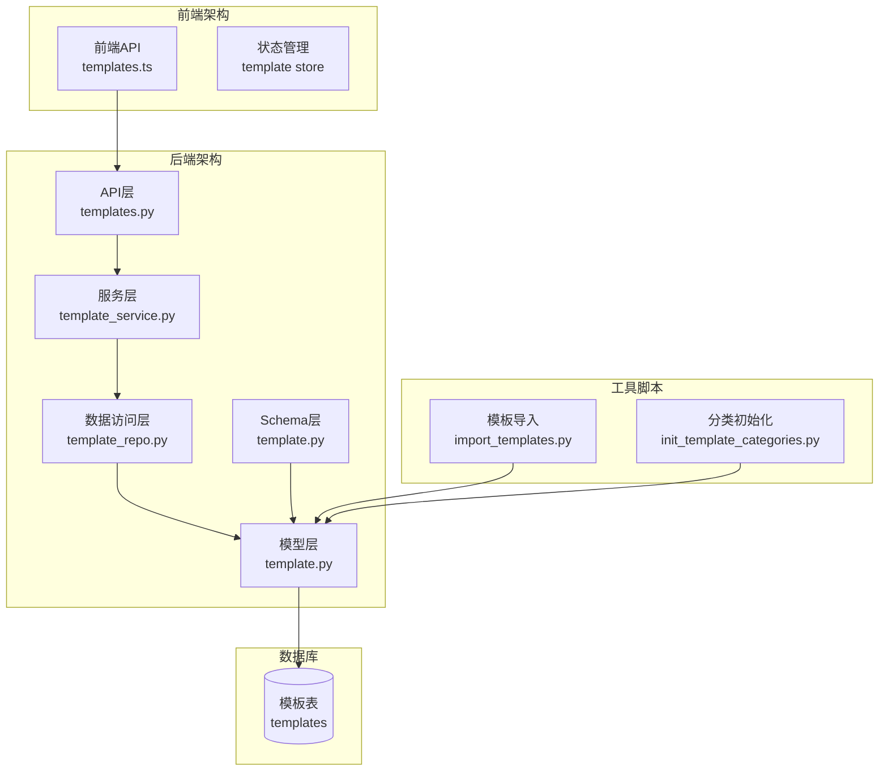
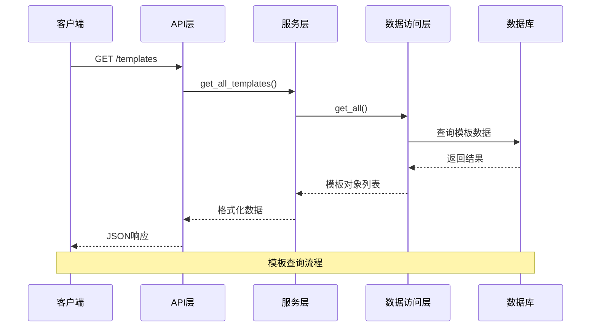
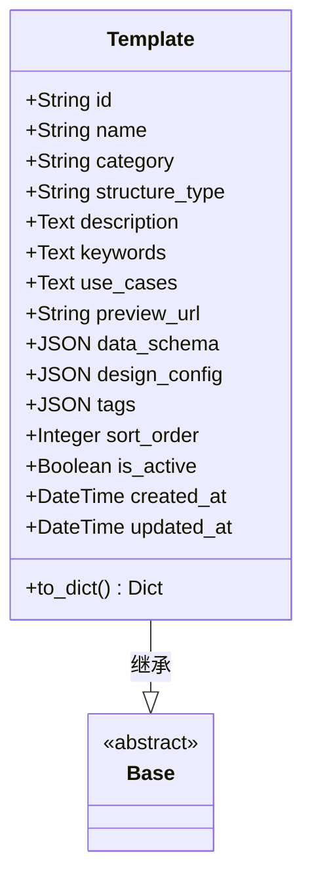
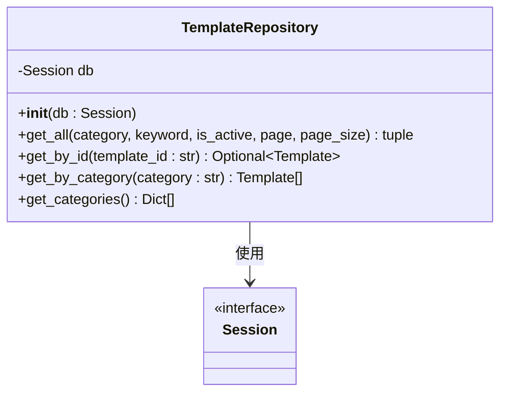
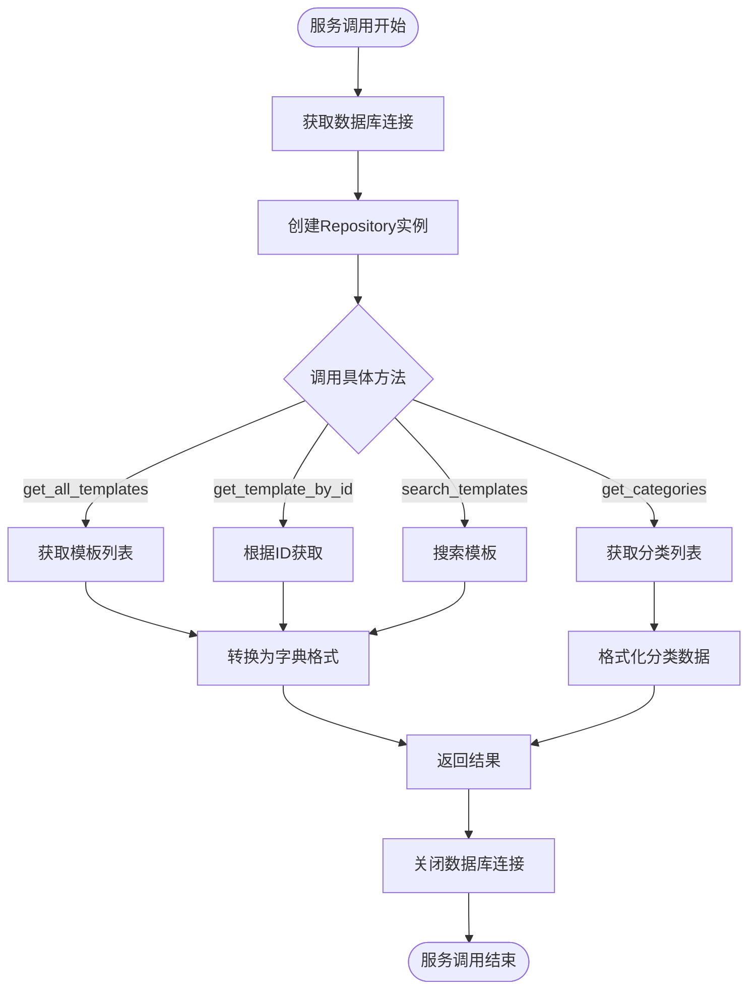
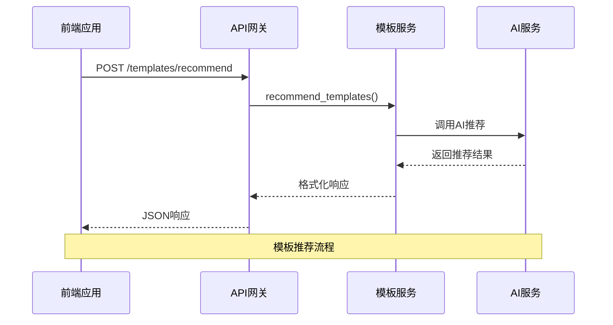
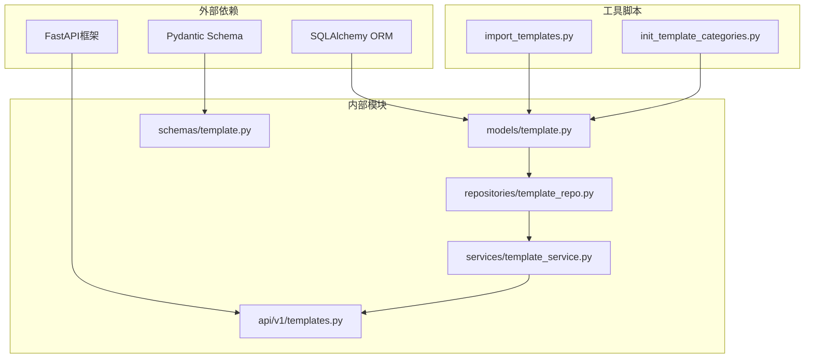

# 模板模型

<cite>
**本文档中引用的文件**
- [template.py](file://backend/app/models/template.py)
- [template.py](file://backend/app/schemas/template.py)
- [template_repo.py](file://backend/app/repositories/template_repo.py)
- [template_service.py](file://backend/app/services/template_service.py)
- [templates.py](file://backend/app/api/v1/templates.py)
- [prompts.py](file://backend/app/utils/prompts.py)
- [templates.ts](file://frontend/src/api/templates.ts)
- [init_template_categories.py](file://backend/scripts/init_template_categories.py)
- [import_templates.py](file://backend/scripts/import_templates.py)
</cite>

## 目录
1. [简介](#简介)
2. [项目结构](#项目结构)
3. [核心组件](#核心组件)
4. [架构概览](#架构概览)
5. [详细组件分析](#详细组件分析)
6. [依赖关系分析](#依赖关系分析)
7. [性能考虑](#性能考虑)
8. [故障排除指南](#故障排除指南)
9. [结论](#结论)

## 简介

本文档详细描述了GenAI Chart项目中的模板模型系统，这是一个基于SQLAlchemy ORM和Pydantic Schema的完整模板管理系统。该系统支持7种主要的信息图模板分类，包括图表型、对比型、层级型、列表型、四象限型、关系型和顺序型，为用户提供智能化的模板推荐和高效的信息图生成能力。

模板模型系统采用分层架构设计，包含数据库模型层、数据访问层、服务层和API接口层，确保了系统的可扩展性和维护性。通过JSON结构化存储模板配置和数据模式，系统能够灵活支持各种类型的信息图模板。

## 项目结构

模板模型系统在项目中的组织结构如下：

**图表来源**
- [templates.py](file://backend/app/api/v1/templates.py#L1-L99)
- [template_service.py](file://backend/app/services/template_service.py#L1-L281)
- [template_repo.py](file://backend/app/repositories/template_repo.py#L1-L144)
- [template.py](file://backend/app/models/template.py#L1-L54)

**章节来源**
- [templates.py](file://backend/app/api/v1/templates.py#L1-L99)
- [template_service.py](file://backend/app/services/template_service.py#L1-L281)
- [template_repo.py](file://backend/app/repositories/template_repo.py#L1-L144)

## 核心组件

### Template数据库模型

Template类是整个模板系统的核心数据库模型，使用SQLAlchemy ORM映射到数据库表。该模型定义了模板的所有基本属性和业务逻辑。

#### 主要字段定义

| 字段名 | 数据类型 | 约束 | 业务含义 | 默认值 |
|--------|----------|------|----------|--------|
| id | String(100) | 主键 | 模板唯一标识符 | - |
| name | String(200) | 非空 | 模板名称（中文） | - |
| category | String(50) | 非空，索引 | 分类代码 | - |
| structure_type | String(100) | 可空，索引 | AntV结构类型 | null |
| description | Text | 可空 | 模板描述 | null |
| keywords | Text | 可空 | 关键词列表（逗号分隔） | null |
| use_cases | Text | 可空 | 适用场景说明 | null |
| preview_url | String(500) | 可空 | 预览图URL | null |
| data_schema | JSON | 非空 | 数据结构Schema | - |
| design_config | JSON | 非空 | AntV设计配置 | - |
| tags | JSON | 可空 | 标签数组 | null |
| sort_order | Integer | 默认0 | 排序权重 | 0 |
| is_active | Boolean | 默认true | 是否启用 | true |
| created_at | DateTime | 默认当前时间 | 创建时间 | 当前时间 |
| updated_at | DateTime | 自动更新 | 更新时间 | 当前时间 |

#### 索引设计

系统在模板表上设置了复合索引以优化查询性能：
- `idx_category_sort`: 联合索引(`category`, `sort_order`)，用于分类和排序查询

#### 转换方法

Template类提供了`to_dict()`方法，将数据库对象转换为字典格式，便于API响应和前端使用。

**章节来源**
- [template.py](file://backend/app/models/template.py#L1-L54)

### Pydantic Schema定义

模板Schema层负责API层的数据验证和序列化，确保数据的完整性和一致性。

#### 模板推荐相关Schema

| Schema类 | 用途 | 主要字段 |
|----------|------|----------|
| TemplateRecommendRequest | 模板推荐请求 | text（用户输入文本）、maxRecommendations（推荐数量） |
| TemplateRecommendation | 单个推荐结果 | templateId、templateName、confidence、reason、category |
| TemplateRecommendResponse | 推荐响应 | recommendations（推荐列表）、analysisTime（分析时间） |

**章节来源**
- [template.py](file://backend/app/schemas/template.py#L1-L27)

## 架构概览

模板模型系统采用经典的分层架构，确保了关注点分离和系统的可维护性：

**图表来源**
- [templates.py](file://backend/app/api/v1/templates.py#L17-L39)
- [template_service.py](file://backend/app/services/template_service.py#L170-L198)
- [template_repo.py](file://backend/app/repositories/template_repo.py#L25-L73)

## 详细组件分析

### 数据库模型层分析

#### Template类设计

Template类继承自Base类，使用SQLAlchemy ORM进行数据库映射。该类的设计体现了领域驱动设计的原则：

**图表来源**
- [template.py](file://backend/app/models/template.py#L9-L54)

#### 字段约束和验证

每个字段都经过精心设计，确保数据的完整性和业务逻辑的正确性：

- **主键约束**: `id`字段作为模板的唯一标识符，确保每个模板的唯一性
- **非空约束**: `name`、`data_schema`、`design_config`字段不能为空，保证基本属性的完整性
- **索引优化**: `category`和`structure_type`字段建立索引，优化查询性能
- **默认值**: `sort_order`和`is_active`字段设置合理默认值，简化数据插入

**章节来源**
- [template.py](file://backend/app/models/template.py#L14-L28)

### 数据访问层分析

#### TemplateRepository类

TemplateRepository提供了模板数据的CRUD操作和高级查询功能：

**图表来源**
- [template_repo.py](file://backend/app/repositories/template_repo.py#L13-L144)

#### 查询功能详解

Repository层提供了丰富的查询功能：

1. **分页查询**: 支持按分类、关键词筛选，返回分页结果
2. **精确查询**: 根据ID获取单个模板
3. **分类查询**: 获取特定分类下的所有模板
4. **分类统计**: 获取所有分类及其模板数量统计

**章节来源**
- [template_repo.py](file://backend/app/repositories/template_repo.py#L25-L144)

### 服务层分析

#### TemplateService类

TemplateService封装了业务逻辑，协调Repository和外部服务：

**图表来源**
- [template_service.py](file://backend/app/services/template_service.py#L160-L281)

#### 模板分类系统

系统实现了智能的模板分类机制，支持7大分类体系：

| 分类代码 | 中文名称 | 特征描述 | 示例场景 |
|----------|----------|----------|----------|
| chart | 图表型 | 包含数值数据、统计信息 | 销售数据、用户增长、KPI指标 |
| comparison | 对比型 | 两个或多个事物的对比 | 产品对比、竞品分析、优缺点对比 |
| hierarchy | 层级型 | 具有上下级、父子关系 | 组织架构、产品分类、知识体系 |
| list | 列表型 | 并列的项目、要点 | 产品功能、解决方案、特性列表 |
| quadrant | 四象限型 | 两个维度划分，四个区域 | 时间管理矩阵、SWOT分析、风险矩阵 |
| relationship | 关系型 | 元素之间的关联、因果 | 因果分析、业务流程、关系网络 |
| sequence | 顺序型 | 有先后顺序、时间线 | 操作流程、项目进度、用户旅程 |

**章节来源**
- [template_service.py](file://backend/app/services/template_service.py#L12-L157)
- [template_repo.py](file://backend/app/repositories/template_repo.py#L105-L144)

### API层分析

#### RESTful API设计

API层提供了完整的RESTful接口，支持模板的查询、推荐和管理：

**图表来源**
- [templates.py](file://backend/app/api/v1/templates.py#L77-L99)

#### 前端API集成

前端通过专门的API模块与后端通信：

| 方法名 | 功能 | 参数 | 返回值 |
|--------|------|------|--------|
| getTemplates | 获取模板列表 | category, keyword, page, pageSize | Promise\<any\> |
| getCategories | 获取分类列表 | 无 | Promise\<any\> |
| recommendTemplates | AI推荐模板 | text, maxRecommendations | Promise\<any\> |

**章节来源**
- [templates.py](file://frontend/src/api/templates.ts#L22-L52)

### 数据模式和配置

#### JSON结构设计

模板系统使用JSON结构存储复杂的数据配置：

1. **data_schema**: 定义模板的数据结构要求
2. **design_config**: 存储AntV设计配置参数
3. **tags**: 支持多维标签系统

#### 模板类型支持

系统支持多种AntV Infographic模板类型：

- **序列型**: timeline-horizontal、sequence-timeline
- **比较型**: comparison-column、matrix-2x2
- **层级型**: hierarchy-tree、list-pyramid
- **列表型**: list-row、list-column
- **关系型**: mindmap-radial、relation-graph
- **四象限型**: quadrant、quadrant-swot

**章节来源**
- [template_service.py](file://backend/app/services/template_service.py#L13-L157)

## 依赖关系分析

模板模型系统的依赖关系展现了清晰的分层架构：

**图表来源**
- [template.py](file://backend/app/models/template.py#L1-L6)
- [template_repo.py](file://backend/app/repositories/template_repo.py#L1-L8)
- [template_service.py](file://backend/app/services/template_service.py#L1-L8)

### 循环依赖检测

系统设计避免了循环依赖：
- Model层不依赖Service层
- Service层不依赖API层  
- Repository层独立于其他层

**章节来源**
- [template_repo.py](file://backend/app/repositories/template_repo.py#L1-L144)
- [template_service.py](file://backend/app/services/template_service.py#L1-L281)

## 性能考虑

### 查询优化策略

1. **索引优化**: 在`category`和`structure_type`字段建立索引，加速分类查询
2. **复合索引**: `idx_category_sort`联合索引优化分类+排序查询
3. **分页查询**: 支持大数据量的分页处理，避免内存溢出
4. **懒加载**: 使用SQLAlchemy的延迟加载机制

### 缓存策略

虽然当前实现未包含缓存，但系统设计支持缓存集成：
- 分类统计数据可以缓存
- 热门模板可以缓存
- 推荐结果可以缓存

### 扩展性设计

系统具有良好的扩展性：
- 支持新的模板类型
- 可扩展的分类体系
- 灵活的标签系统
- 可插拔的推荐算法

## 故障排除指南

### 常见问题及解决方案

#### 数据库连接问题

**症状**: 查询超时或连接失败
**原因**: 数据库连接池耗尽或网络问题
**解决方案**: 
- 检查数据库连接配置
- 增加连接池大小
- 实现连接重试机制

#### 模板分类错误

**症状**: 模板被分配到错误的分类
**原因**: 分类逻辑不准确或数据不一致
**解决方案**:
- 运行分类初始化脚本
- 手动更新模板分类
- 检查分类规则逻辑

#### 推荐算法问题

**症状**: AI推荐结果不准确
**原因**: 训练数据不足或特征提取错误
**解决方案**:
- 增加训练数据量
- 优化特征提取逻辑
- 调整推荐算法参数

**章节来源**
- [init_template_categories.py](file://backend/scripts/init_template_categories.py#L24-L197)
- [import_templates.py](file://backend/scripts/import_templates.py#L24-L146)

### 调试技巧

1. **日志记录**: 启用详细的日志记录
2. **单元测试**: 编写全面的单元测试
3. **性能监控**: 监控查询性能和响应时间
4. **数据验证**: 实施严格的数据验证

## 结论

GenAI Chart的模板模型系统是一个设计精良、功能完整的模板管理解决方案。该系统通过分层架构实现了关注点分离，通过SQLAlchemy ORM提供了强大的数据库操作能力，通过Pydantic Schema确保了数据的完整性和一致性。

系统的主要优势包括：

1. **完整的生命周期管理**: 从模板创建、存储、查询到推荐的全流程支持
2. **智能分类系统**: 基于内容特征的自动分类和人工干预相结合
3. **灵活的配置系统**: JSON结构支持复杂的模板配置和扩展
4. **高效的查询性能**: 通过索引优化和分页查询支持大规模数据处理
5. **良好的扩展性**: 支持新的模板类型和分类规则

该系统为信息图生成提供了坚实的基础，支持智能化的模板推荐和高效的内容生成，是现代数据可视化应用的重要组成部分。

未来的改进方向包括：
- 引入缓存机制提升性能
- 扩展推荐算法的准确性
- 增强模板的自定义能力
- 优化移动端的用户体验