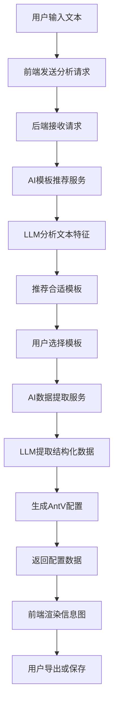
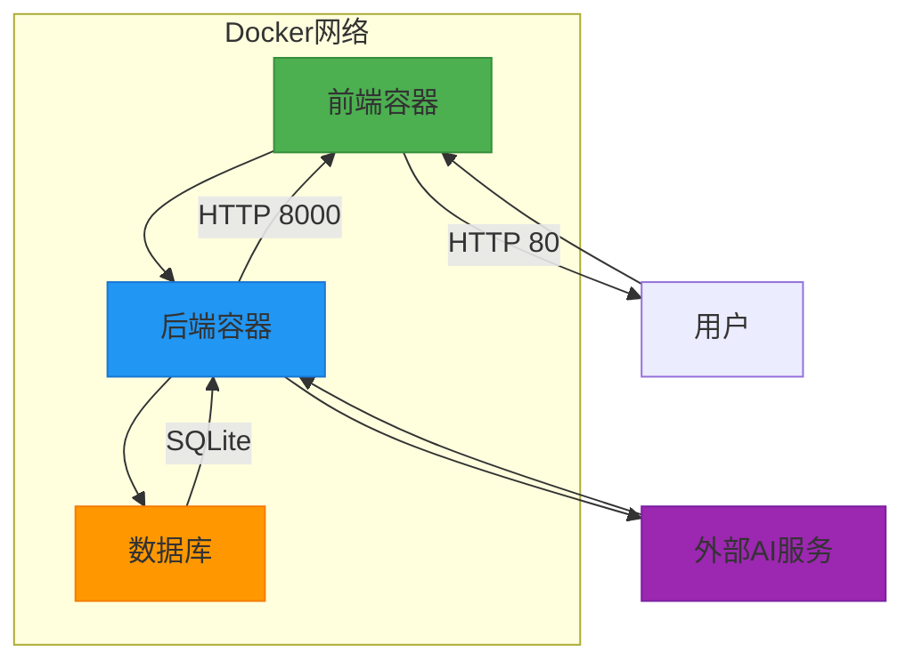
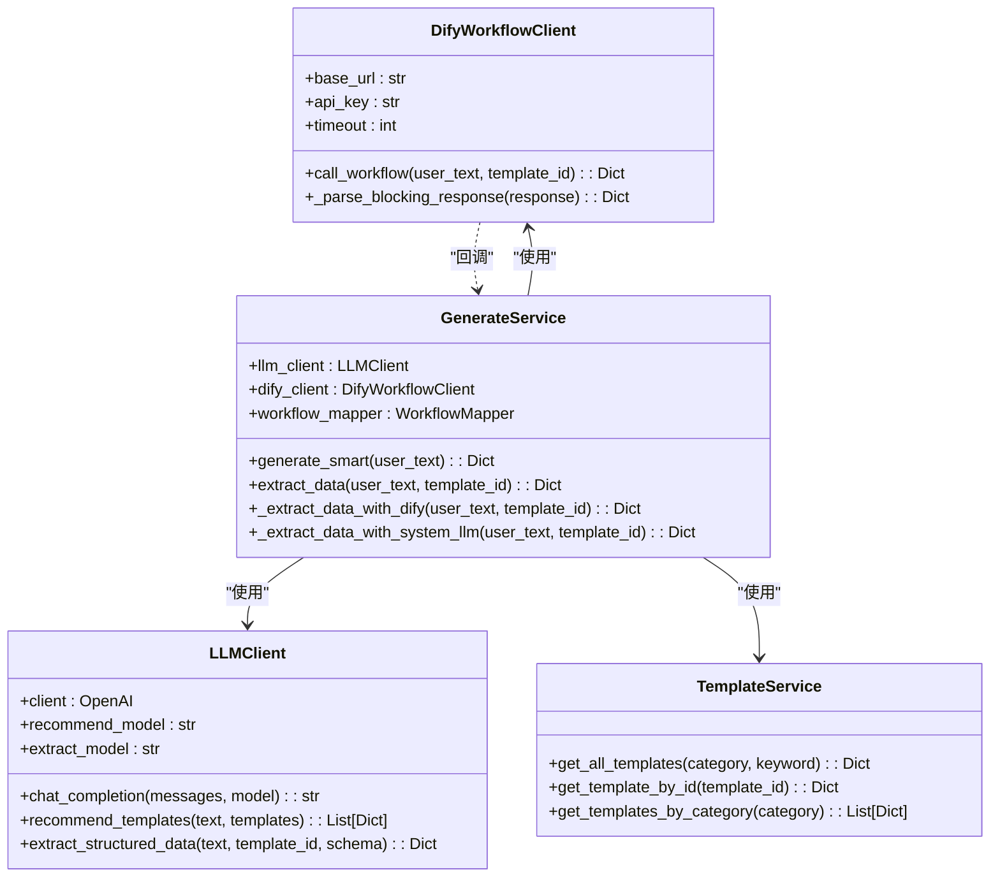
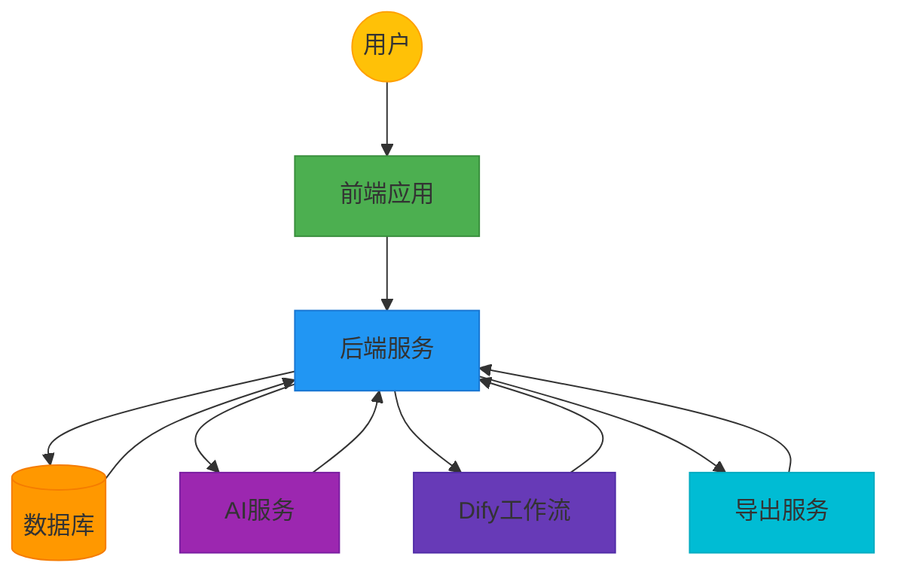
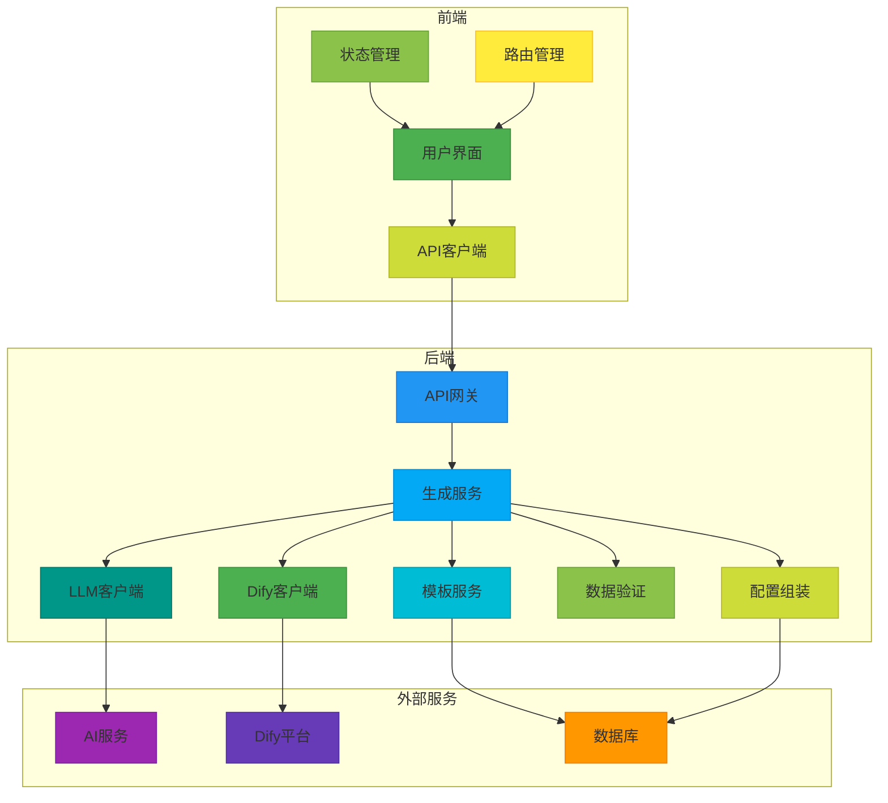

# 系统架构

<cite>
**本文档引用的文件**  
- [README.md](file://README.md)
- [docker-compose.yml](file://docker-compose.yml)
- [backend/Dockerfile](file://backend/Dockerfile)
- [frontend/Dockerfile](file://frontend/Dockerfile)
- [backend/app/main.py](file://backend/app/main.py)
- [frontend/src/main.ts](file://frontend/src/main.ts)
- [backend/app/api/v1/generate.py](file://backend/app/api/v1/generate.py)
- [backend/app/services/generate_service.py](file://backend/app/services/generate_service.py)
- [backend/app/services/dify_workflow_client.py](file://backend/app/services/dify_workflow_client.py)
- [frontend/src/api/client.ts](file://frontend/src/api/client.ts)
- [backend/app/config.py](file://backend/app/config.py)
- [backend/app/services/llm_client.py](file://backend/app/services/llm_client.py)
- [backend/app/services/template_service.py](file://backend/app/services/template_service.py)
- [frontend/src/stores/workspace.ts](file://frontend/src/stores/workspace.ts)
- [antv_infographic/infographic/dev/src/Infographic.tsx](file://antv_infographic/infographic/dev/src/Infographic.tsx)
</cite>

## 目录

1. [系统架构](#系统架构)
2. [前后端分离设计](#前后端分离设计)
3. [数据流分析](#数据流分析)
4. [容器化部署架构](#容器化部署架构)
5. [AI集成架构](#ai集成架构)
6. [系统上下文图](#系统上下文图)
7. [组件图](#组件图)
8. [技术权衡与决策](#技术权衡与决策)
9. [可扩展性与性能考虑](#可扩展性与性能考虑)

## 系统架构

genai_chart-1是一个基于AI的信息图生成系统，采用前后端分离的架构设计。系统通过Vue 3构建前端用户界面，使用FastAPI提供后端RESTful API服务，利用AntV Infographic库进行信息图渲染，并集成大语言模型（LLM）实现智能模板推荐和数据提取功能。

系统整体架构分为三个主要层次：前端展示层、后端服务层和AI集成层。前端展示层负责用户交互和信息图渲染；后端服务层处理业务逻辑、数据管理和API路由；AI集成层则通过LLM服务和Dify工作流实现智能化功能。

系统支持多种格式的导出功能，包括SVG、PNG、PDF和PPTX，满足不同场景下的使用需求。同时，系统提供了作品管理功能，允许用户保存和管理生成的信息图作品。

**Section sources**
- [README.md](file://README.md#L1-L323)

## 前后端分离设计

本系统采用典型的前后端分离架构模式，前端和后端通过RESTful API进行通信。前端基于Vue 3框架构建，使用TypeScript、Vite、Pinia和Vue Router等现代前端技术栈；后端采用Python的FastAPI框架，结合SQLAlchemy和SQLite/PostgreSQL数据库。

前端应用通过Axios库与后端API进行通信，主要API端点包括：
- `/api/v1/templates`：模板管理相关接口
- `/api/v1/generate`：信息图生成相关接口
- `/api/v1/works`：作品管理相关接口
- `/api/v1/export`：导出功能相关接口

前端通过Pinia进行状态管理，使用`workspace` store管理用户输入、选中的模板和生成的配置等状态信息。路由配置由Vue Router管理，当前系统包含AI工作区和示例页面两个主要路由。

后端使用FastAPI的路由系统将不同功能模块组织在`api/v1`目录下，每个模块有独立的路由器。CORS中间件配置允许前端应用跨域访问API，确保前后端分离架构的正常运行。

**Section sources**
- [backend/app/main.py](file://backend/app/main.py#L1-L113)
- [frontend/src/main.ts](file://frontend/src/main.ts#L1-L17)
- [frontend/src/api/client.ts](file://frontend/src/api/client.ts#L1-L46)
- [frontend/src/router/index.ts](file://frontend/src/router/index.ts#L1-L34)
- [frontend/src/stores/workspace.ts](file://frontend/src/stores/workspace.ts#L1-L74)

## 数据流分析

系统从用户输入到AI分析再到信息图渲染的完整数据流如下：

**Diagram sources**
- [backend/app/api/v1/generate.py](file://backend/app/api/v1/generate.py#L1-L116)
- [backend/app/services/generate_service.py](file://backend/app/services/generate_service.py#L1-L465)
- [antv_infographic/infographic/dev/src/Infographic.tsx](file://antv_infographic/infographic/dev/src/Infographic.tsx#L1-L46)

当用户在前端输入文本内容并点击"分析并推荐模板"按钮时，前端会向后端发送请求。后端的`generate_service`服务首先调用`type_classification_service`进行类型识别，然后通过`template_selection_service`选择合适的模板，最后调用`extract_data`方法从文本中提取结构化数据。

数据提取完成后，后端将生成符合AntV Infographic要求的配置对象并返回给前端。前端接收到配置后，使用AntV Infographic库渲染出最终的信息图，并提供导出和保存功能。

**Section sources**
- [backend/app/services/generate_service.py](file://backend/app/services/generate_service.py#L1-L465)
- [backend/app/api/v1/generate.py](file://backend/app/api/v1/generate.py#L1-L116)

## 容器化部署架构

系统采用Docker容器化部署，通过docker-compose.yml文件定义了完整的部署拓扑。架构包含前端、后端和数据库三个主要容器，通过Docker网络进行通信。

**Diagram sources**
- [docker-compose.yml](file://docker-compose.yml#L1-L55)
- [backend/Dockerfile](file://backend/Dockerfile#L1-L44)
- [frontend/Dockerfile](file://frontend/Dockerfile#L1-L34)

后端容器基于python:3.11-slim镜像构建，安装了Cairo图形库、中文字体和lxml依赖，确保能够正确处理图形渲染和XML解析。容器暴露8000端口，映射到宿主机的相同端口。通过volumes配置，实现了代码热更新和数据持久化。

前端容器采用多阶段构建策略，第一阶段使用Node.js构建应用，第二阶段使用Nginx提供静态文件服务。容器暴露80端口，通过Nginx反向代理将请求转发给后端服务，实现了前后端的无缝集成。

**Section sources**
- [docker-compose.yml](file://docker-compose.yml#L1-L55)
- [backend/Dockerfile](file://backend/Dockerfile#L1-L44)
- [frontend/Dockerfile](file://frontend/Dockerfile#L1-L34)

## AI集成架构

系统通过集成大语言模型（LLM）和Dify工作流实现了智能化功能。AI集成架构包括LLM服务调用、Dify工作流集成和智能模板推荐三个核心组件。

**Diagram sources**
- [backend/app/services/llm_client.py](file://backend/app/services/llm_client.py#L1-L217)
- [backend/app/services/dify_workflow_client.py](file://backend/app/services/dify_workflow_client.py#L1-L196)
- [backend/app/services/generate_service.py](file://backend/app/services/generate_service.py#L1-L465)
- [backend/app/services/template_service.py](file://backend/app/services/template_service.py#L1-L281)

系统支持两种AI数据生成方式：系统LLM和Dify工作流。`GenerateService`会优先尝试使用Dify工作流，如果调用失败则回退到系统LLM。这种设计提供了高可用性，确保即使Dify服务不可用，系统仍能通过备用方案继续运行。

智能模板推荐功能通过分析用户输入的文本内容，结合可用模板的元数据，利用LLM推荐最合适的模板。模板元数据存储在`TEMPLATE_METADATA`常量中，包含模板ID、名称、分类、描述和适用场景等信息。

**Section sources**
- [backend/app/services/llm_client.py](file://backend/app/services/llm_client.py#L1-L217)
- [backend/app/services/dify_workflow_client.py](file://backend/app/services/dify_workflow_client.py#L1-L196)
- [backend/app/services/generate_service.py](file://backend/app/services/generate_service.py#L1-L465)
- [backend/app/services/template_service.py](file://backend/app/services/template_service.py#L1-L281)

## 系统上下文图

**Diagram sources**
- [README.md](file://README.md#L1-L323)
- [docker-compose.yml](file://docker-compose.yml#L1-L55)

系统上下文图展示了genai_chart-1系统与外部实体之间的交互关系。用户通过浏览器与前端应用交互，前端应用通过RESTful API与后端服务通信。后端服务负责协调各个组件的工作，包括访问数据库存储模板和作品信息，调用AI服务进行智能分析，集成Dify工作流执行复杂任务，以及使用导出服务生成不同格式的文件。

**Section sources**
- [README.md](file://README.md#L1-L323)
- [docker-compose.yml](file://docker-compose.yml#L1-L55)

## 组件图

**Diagram sources**
- [backend/app/main.py](file://backend/app/main.py#L1-L113)
- [backend/app/services/generate_service.py](file://backend/app/services/generate_service.py#L1-L465)
- [frontend/src/main.ts](file://frontend/src/main.ts#L1-L17)

组件图详细展示了系统内部各组件之间的关系和依赖。前端部分由用户界面、状态管理、API客户端和路由管理四个主要组件构成，采用Vue 3的组合式API和Pinia状态管理库。后端部分以API网关为核心，协调生成服务、模板服务、LLM客户端、Dify客户端、数据验证和配置组装等组件的工作。

**Section sources**
- [backend/app/main.py](file://backend/app/main.py#L1-L113)
- [backend/app/services/generate_service.py](file://backend/app/services/generate_service.py#L1-L465)
- [frontend/src/main.ts](file://frontend/src/main.ts#L1-L17)

## 技术权衡与决策

系统在技术选型上进行了多项重要决策，主要基于性能、开发效率和生态系统成熟度等因素。

选择Vue 3作为前端框架主要基于以下原因：Vue 3提供了优秀的开发体验，其组合式API使得复杂状态管理更加清晰；TypeScript支持提供了类型安全，减少了运行时错误；Vite构建工具提供了快速的开发服务器启动和热模块替换，显著提升了开发效率。

后端选择FastAPI而非传统的Flask或Django，主要因为FastAPI具有以下优势：基于Python类型提示的自动API文档生成，减少了文档维护成本；异步支持良好，能够处理高并发请求；性能接近Node.js和Go，远超传统Python Web框架。

在AI集成方面，系统设计了双重机制：既支持直接调用LLM服务，也支持通过Dify工作流。这种设计提供了灵活性和可扩展性，允许在不修改核心代码的情况下，通过配置Dify工作流来实现复杂的AI逻辑。

**Section sources**
- [README.md](file://README.md#L1-L323)
- [backend/app/config.py](file://backend/app/config.py#L1-L51)

## 可扩展性与性能考虑

系统在设计时充分考虑了可扩展性和性能优化，为未来的演进提供了坚实基础。

可扩展性方面，系统采用模块化设计，各服务组件职责单一，易于替换和扩展。模板系统通过数据库存储模板元数据，新增模板只需在数据库中添加记录，无需修改代码。AI服务抽象了LLM客户端接口，可以轻松切换不同的LLM提供商。

性能优化方面，系统采用了多项策略：前端使用Vite进行代码分割和懒加载，减少初始加载时间；后端API采用异步处理，提高并发能力；Dify工作流调用设置了重试机制和超时控制，确保系统的稳定性。

未来演进方向包括：引入缓存机制减少重复的LLM调用；优化数据库查询，添加索引提高检索效率；实现工作流的流式响应，提供更好的用户体验；支持更多导出格式和自定义模板功能。

**Section sources**
- [backend/app/services/generate_service.py](file://backend/app/services/generate_service.py#L1-L465)
- [backend/app/services/dify_workflow_client.py](file://backend/app/services/dify_workflow_client.py#L1-L196)
- [frontend/src/api/client.ts](file://frontend/src/api/client.ts#L1-L46)