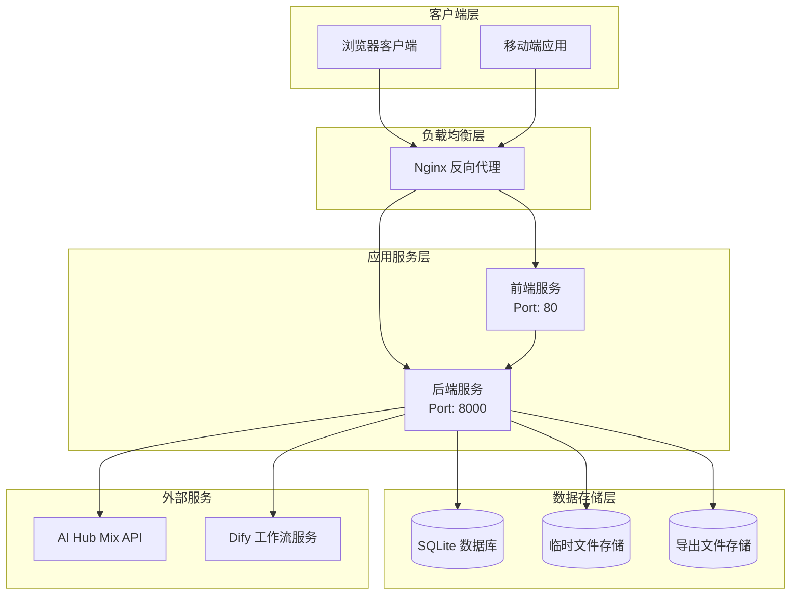
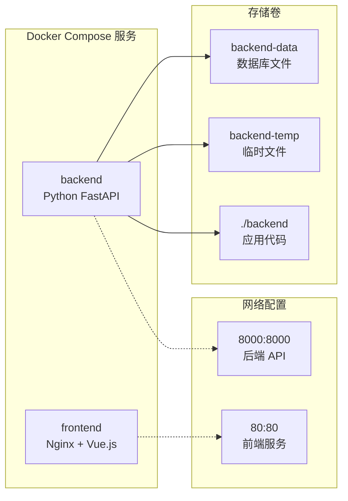
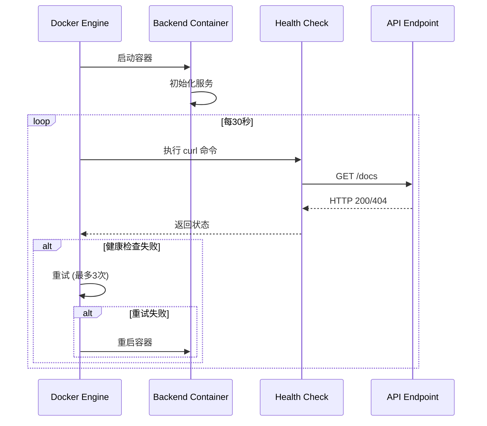
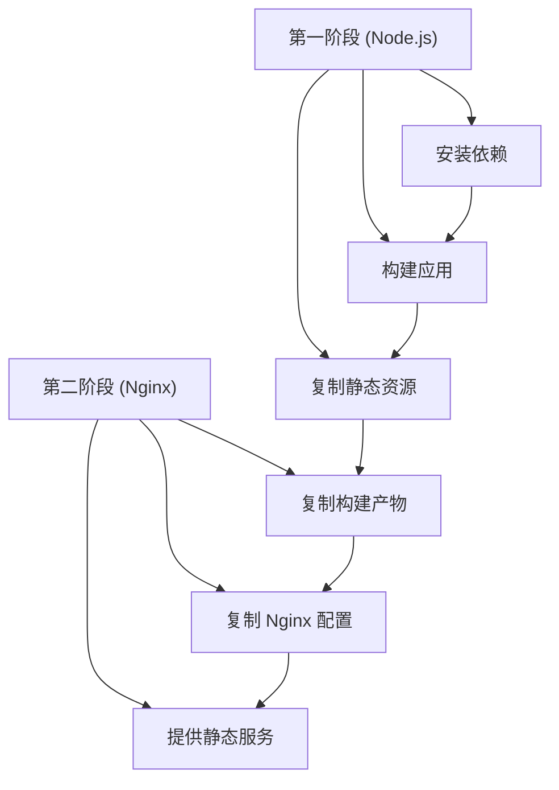
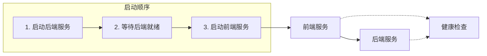
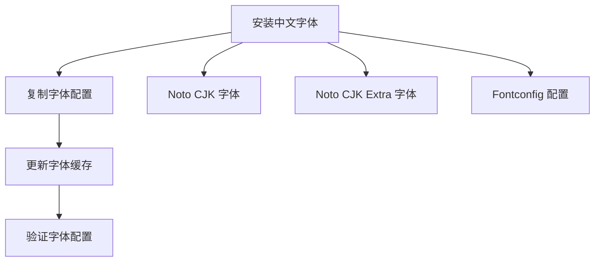
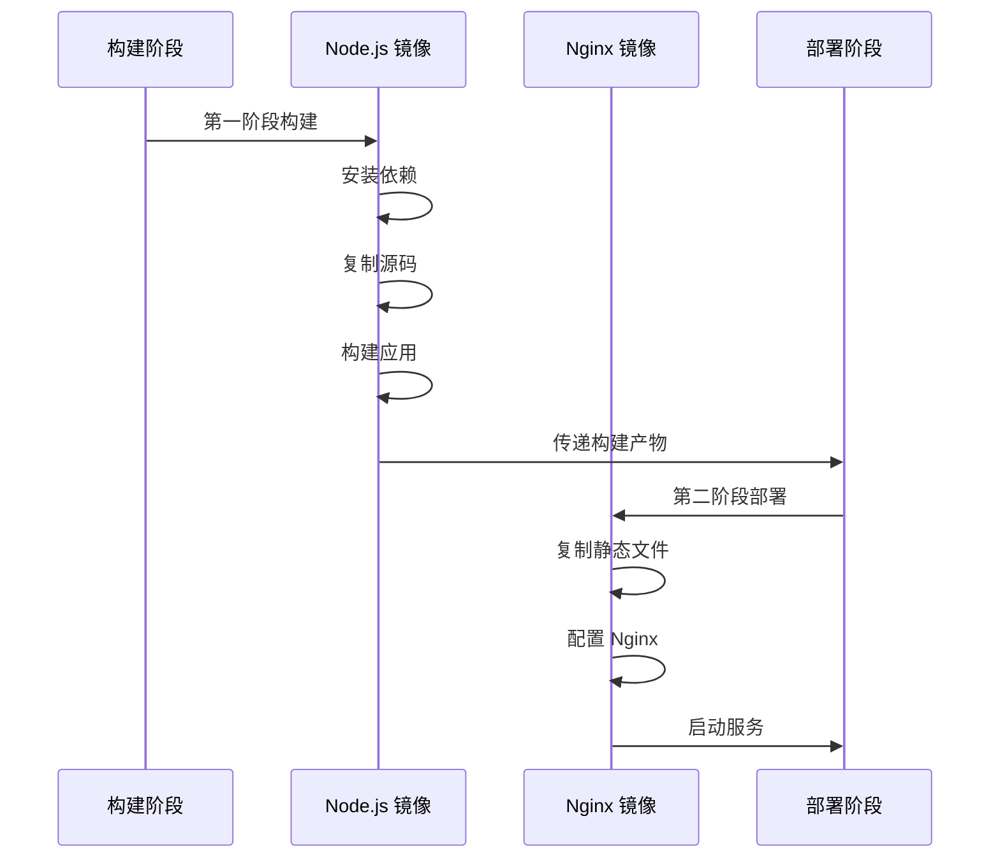
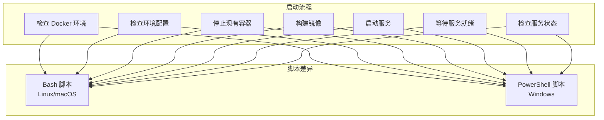
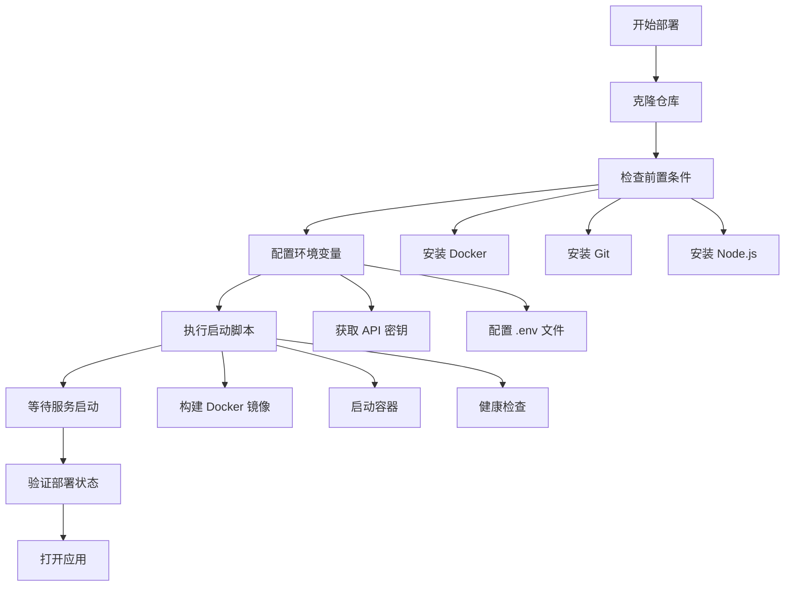
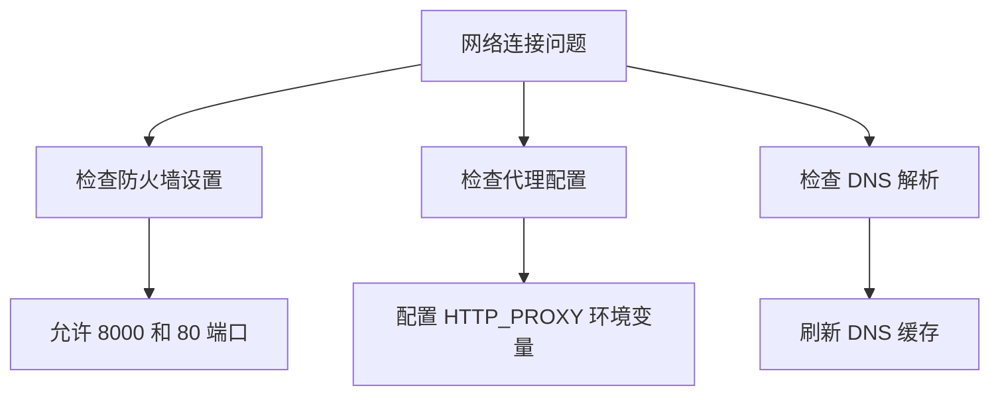

# 容器化部署指南

<cite>
**本文档引用的文件**
- [docker-compose.yml](file://docker-compose.yml)
- [backend/Dockerfile](file://backend/Dockerfile)
- [frontend/Dockerfile](file://frontend/Dockerfile)
- [start-docker.sh](file://start-docker.sh)
- [start-docker.ps1](file://start-docker.ps1)
- [backend/.env](file://backend/.env)
- [frontend/nginx.conf](file://frontend/nginx.conf)
- [README.md](file://README.md)
</cite>

## 目录
1. [概述](#概述)
2. [系统架构](#系统架构)
3. [前置条件](#前置条件)
4. [Docker Compose 配置详解](#docker-compose-配置详解)
5. [后端服务配置](#后端服务配置)
6. [前端服务配置](#前端服务配置)
7. [启动脚本分析](#启动脚本分析)
8. [部署流程](#部署流程)
9. [环境配置](#环境配置)
10. [常见问题解决](#常见问题解决)
11. [运维管理](#运维管理)

## 概述

genai_chart-1 是一个基于 AntV Infographic 和大语言模型的智能信息图生成系统。本指南详细介绍了如何使用 Docker 容器化技术部署该系统，包括完整的服务编排配置、环境变量设置和故障排除方法。

### 核心特性

- **AI 智能推荐**: 基于文本内容自动推荐合适的信息图模板
- **多格式导出**: 支持 SVG、PNG、PDF、PPTX 等多种格式
- **模板管理系统**: 7大分类，100+模板数据库
- **作品管理**: 保存和管理生成的信息图作品
- **实时预览**: 左右分栏设计，实时预览生成效果

## 系统架构



**图表来源**
- [docker-compose.yml](file://docker-compose.yml#L3-L54)
- [frontend/nginx.conf](file://frontend/nginx.conf#L1-L27)

## 前置条件

### 系统要求

| 组件 | 最低要求 | 推荐配置 |
|------|----------|----------|
| 操作系统 | Windows 10+/macOS 10.15+/Linux | 所有平台 |
| 内存 | 4GB RAM | 8GB+ RAM |
| 存储空间 | 2GB 可用空间 | 5GB+ 可用空间 |
| 网络 | 稳定的互联网连接 | 高速网络 |

### 必需软件

| 软件 | 版本要求 | 安装方式 |
|------|----------|----------|
| Docker | 20.10+ | 官方安装包 |
| Docker Compose | 2.0+ | 包含在 Docker Desktop 中 |
| Git | 2.20+ | 可选 |

### API 密钥准备

系统需要以下 API 密钥才能正常运行：

| 服务 | 必需性 | 获取方式 |
|------|--------|----------|
| AI Hub Mix API Key | 必需 | 注册 [aihubmix.com](https://aihubmix.com/) |
| Dify API Key | 可选 | 注册 [dify.ai](https://dify.ai/) |

## Docker Compose 配置详解

### 服务编排架构



**图表来源**
- [docker-compose.yml](file://docker-compose.yml#L5-L54)

### 后端服务配置

#### 构建配置

| 配置项 | 值 | 说明 |
|--------|-----|------|
| 构建上下文 | `.` | 当前目录作为构建上下文 |
| Dockerfile 路径 | `backend/Dockerfile` | 指定后端专用的 Dockerfile |
| 容器名称 | `genai-chart-backend` | 容器的唯一标识符 |

#### 端口映射

| 容器端口 | 主机端口 | 用途 |
|----------|----------|------|
| 8000 | 8000 | FastAPI API 服务 |
| 8000 | 8000 | Health check 端点 |

#### 卷挂载

| 主机路径 | 容器路径 | 用途 |
|----------|----------|------|
| `./backend` | `/app` | 应用代码热重载 |
| `./backend/data` | `/app/data` | 数据库文件存储 |
| `./backend/temp` | `/app/temp` | 临时文件存储 |

#### 环境变量配置

系统支持以下环境变量：

| 变量名 | 默认值 | 说明 |
|--------|--------|------|
| `AIHUBMIX_API_KEY` | - | AI Hub Mix API 密钥 |
| `AIHUBMIX_BASE_URL` | `https://aihubmix.com/v1` | AI 服务基础 URL |
| `LLM_MODEL` | `gpt-4o` | 默认使用的 LLM 模型 |
| `DIFY_API_KEY` | - | Dify 工作流 API 密钥 |
| `DIFY_BASE_URL` | - | Dify 服务基础 URL |
| `DATABASE_URL` | `sqlite:///./data/genai_chart.db` | 数据库连接字符串 |

#### 健康检查机制



**图表来源**
- [docker-compose.yml](file://docker-compose.yml#L29-L33)

### 前端服务配置

#### 多阶段构建

前端服务采用多阶段构建策略：



**图表来源**
- [frontend/Dockerfile](file://frontend/Dockerfile#L1-L34)

#### Nginx 配置详解

前端服务使用专门的 Nginx 配置实现以下功能：

| 配置段 | 功能 | 实现方式 |
|--------|------|----------|
| Vue Router 支持 | History 模式路由 | `try_files $uri $uri/ /index.html;` |
| API 代理 | 后端服务代理 | `proxy_pass http://backend:8000/api/` |
| 静态资源缓存 | 性能优化 | `expires 1y;` |
| CORS 配置 | 跨域支持 | 自动设置请求头 |

#### 服务依赖关系



**图表来源**
- [docker-compose.yml](file://docker-compose.yml#L43-L45)

## 后端服务配置

### Dockerfile 分析

#### 基础镜像选择

后端使用 `python:3.11-slim` 作为基础镜像，具有以下优势：

- **轻量化**: Alpine 基础镜像，减少镜像大小
- **稳定性**: Python 3.11 LTS 版本，长期支持
- **安全性**: 定期安全更新

#### 系统依赖安装

系统需要安装以下依赖包：

| 依赖包 | 用途 | 必需性 |
|--------|------|--------|
| `libcairo2` | 图形渲染引擎 | 必需 |
| `libpango-1.0-0` | 文本布局引擎 | 必需 |
| `fonts-noto-cjk` | 中文字体支持 | 必需 |
| `libxml2-dev` | XML 解析 | 必需 |
| `fontconfig` | 字体配置 | 必需 |

#### 字体配置

系统特别配置了中文字体支持：



**图表来源**
- [backend/Dockerfile](file://backend/Dockerfile#L7-L25)

#### 应用启动配置

| 配置项 | 值 | 说明 |
|--------|-----|------|
| 工作目录 | `/app` | 应用根目录 |
| 暴露端口 | `8000` | FastAPI 服务端口 |
| 启动命令 | `uvicorn app.main:app --host 0.0.0.0 --port 8000` | 生产环境启动 |

### 环境变量配置

#### AI 服务配置

```yaml
# AI Hub Mix 配置
AIHUBMIX_API_KEY=${AIHUBMIX_API_KEY}
AIHUBMIX_BASE_URL=${AIHUBMIX_BASE_URL:-https://aihubmix.com/v1}
AIHUBMIX_MODEL_RECOMMEND=${LLM_MODEL:-gpt-4o-mini}
AIHUBMIX_MODEL_EXTRACT=${LLM_MODEL:-gpt-4o-mini}
```

#### 数据库配置

```yaml
# SQLite 数据库配置
DATABASE_URL=sqlite:///./data/genai_chart.db
```

#### Dify 工作流配置

```yaml
# Dify 工作流可选配置
DIFY_API_KEY=${DIFY_API_KEY}
DIFY_BASE_URL=${DIFY_BASE_URL}
```

**节来源**
- [docker-compose.yml](file://docker-compose.yml#L17-L27)
- [backend/.env](file://backend/.env#L1-L25)

## 前端服务配置

### 多阶段构建流程



**图表来源**
- [frontend/Dockerfile](file://frontend/Dockerfile#L1-L34)

### Nginx 配置详解

#### 路由配置

前端使用 Vue Router 的 History 模式，需要特殊处理：

```nginx
location / {
    try_files $uri $uri/ /index.html;
}
```

#### API 代理配置

```nginx
location /api/ {
    proxy_pass http://backend:8000/api/;
    proxy_set_header Host $host;
    proxy_set_header X-Real-IP $remote_addr;
    proxy_set_header X-Forwarded-For $proxy_add_x_forwarded_for;
    proxy_set_header X-Forwarded-Proto $scheme;
}
```

#### 静态资源优化

```nginx
location ~* \.(js|css|png|jpg|jpeg|gif|ico|svg)$ {
    expires 1y;
    add_header Cache-Control "public, immutable";
}
```

### 前端技术栈

| 技术 | 版本 | 用途 |
|------|------|------|
| Vue.js | 3.x | 前端框架 |
| TypeScript | Latest | 类型安全 |
| Vite | Latest | 构建工具 |
| Pinia | Latest | 状态管理 |
| Vue Router | Latest | 路由管理 |

**节来源**
- [frontend/nginx.conf](file://frontend/nginx.conf#L1-L27)

## 启动脚本分析

### 脚本架构对比

系统提供了两个启动脚本，分别适用于不同的操作系统：



**图表来源**
- [start-docker.sh](file://start-docker.sh#L1-L128)
- [start-docker.ps1](file://start-docker.ps1#L1-L134)

### Bash 脚本功能详解

#### 环境检查

```bash
# 检查 Docker 是否安装
if ! command -v docker &> /dev/null; then
    echo -e "${RED}✗ Docker 未安装，请先安装 Docker${NC}"
    echo -e "${YELLOW}安装指南: https://docs.docker.com/get-docker/${NC}"
    exit 1
fi
```

#### 环境变量处理

脚本智能处理环境配置：

1. **优先级检查**: `.env` → `backend/.env` → 默认配置
2. **交互式配置**: 当缺少必要配置时提示用户
3. **配置验证**: 确保关键 API 密钥已设置

#### 错误处理机制

```bash
# 构建镜像
docker-compose build --no-cache
if [ $? -ne 0 ]; then
    echo -e "${RED}✗ 构建失败${NC}"
    exit 1
fi
```

### PowerShell 脚本功能详解

#### 现代化错误处理

```powershell
try {
    $dockerVersion = docker --version
    Write-Host "✓ Docker 已安装: $dockerVersion" -ForegroundColor Green
} catch {
    Write-Host "✗ Docker 未安装，请先安装 Docker Desktop" -ForegroundColor Red
    Write-Host "下载地址: https://www.docker.com/products/docker-desktop" -ForegroundColor Yellow
    exit 1
}
```

#### 用户交互增强

PowerShell 脚本提供了更友好的用户交互：

- **彩色输出**: 使用 ANSI 颜色编码
- **进度指示**: 明确的步骤提示
- **自动浏览器打开**: 部署完成后自动打开应用

### 脚本执行流程对比

| 步骤 | Bash 脚本 | PowerShell 脚本 |
|------|-----------|-----------------|
| 环境检查 | `command -v docker` | `docker --version` |
| 文件检查 | `[ -f "filename" ]` | `(Test-Path "filename")` |
| 条件判断 | `[ condition ]` | `$condition` |
| 输出颜色 | `\033[0;31m` | `-ForegroundColor Red` |
| 用户输入 | `read -p "message"` | `Read-Host "message"` |

**节来源**
- [start-docker.sh](file://start-docker.sh#L17-L47)
- [start-docker.ps1](file://start-docker.ps1#L8-L39)

## 部署流程

### 完整部署步骤



### 部署验证清单

#### 基础验证

| 验证项 | 命令 | 预期结果 |
|--------|------|----------|
| Docker 运行状态 | `docker ps` | 显示正在运行的容器 |
| 端口监听 | `netstat -an \| grep 8000` | 端口 8000 正在监听 |
| 服务响应 | `curl http://localhost:8000/docs` | 返回 API 文档页面 |

#### 功能验证

| 功能模块 | 验证方法 | 预期行为 |
|----------|----------|----------|
| 后端 API | 访问 `http://localhost:8000/docs` | 显示 Swagger UI |
| 前端界面 | 访问 `http://localhost` | 显示主应用界面 |
| AI 功能 | 尝试生成信息图 | 返回生成的图表 |
| 导出功能 | 下载 PNG/SVG 文件 | 成功生成文件 |

### 部署时间估算

| 阶段 | Linux/macOS | Windows |
|------|-------------|---------|
| 环境准备 | 2-5分钟 | 5-10分钟 |
| 镜像构建 | 5-15分钟 | 10-20分钟 |
| 服务启动 | 1-3分钟 | 2-5分钟 |
| 完成部署 | 8-23分钟 | 17-35分钟 |

## 环境配置

### .env 文件配置

#### 必需配置项

```bash
# AI Hub Mix 配置
AIHUBMIX_API_KEY=your_actual_api_key_here
AIHUBMIX_BASE_URL=https://aihubmix.com/v1
AIHUBMIX_MODEL_RECOMMEND=gpt-4o-mini
AIHUBMIX_MODEL_EXTRACT=gpt-4o-mini

# 应用配置
APP_NAME=AI信息图生成系统
APP_VERSION=1.0.0
DEBUG_MODE=false

# CORS 配置
ALLOWED_ORIGINS=http://localhost:5173,http://localhost:5174,http://localhost:3000

# API 配置
API_PREFIX=/api/v1
```

#### 可选配置项

```bash
# Dify 工作流配置
DIFY_API_BASE_URL=https://dify-uat.42lab.cn/v1
DIFY_API_KEY=your_dify_api_key
DIFY_API_TIMEOUT=90
DIFY_RESPONSE_MODE=blocking
```

### 环境变量最佳实践

#### 安全配置

1. **API 密钥保护**: 不要将 `.env` 文件提交到版本控制系统
2. **权限设置**: 确保 `.env` 文件权限为 600
3. **定期轮换**: 定期更换 API 密钥

#### 性能优化

```bash
# 生产环境配置
DEBUG_MODE=false
AIHUBMIX_TIMEOUT=30
DIFY_API_TIMEOUT=60
```

#### 开发环境配置

```bash
# 开发环境配置
DEBUG_MODE=true
AIHUBMIX_TIMEOUT=60
DIFY_API_TIMEOUT=120
```

### 平台特定配置

#### Linux/macOS

```bash
# 设置环境变量
export AIHUBMIX_API_KEY="your_key"
export DIFY_API_KEY="your_key"

# 或者在 .env 文件中
echo "AIHUBMIX_API_KEY=your_key" >> .env
echo "DIFY_API_KEY=your_key" >> .env
```

#### Windows

```powershell
# PowerShell 方式
$env:AIHUBMIX_API_KEY = "your_key"
$env:DIFY_API_KEY = "your_key"

# 或者在 .env 文件中
Set-Content -Path ".env" -Value @"
AIHUBMIX_API_KEY=your_key
DIFY_API_KEY=your_key
"@
```

**节来源**
- [backend/.env](file://backend/.env#L1-L25)

## 常见问题解决

### 部署问题诊断

#### Docker 相关问题

| 问题症状 | 可能原因 | 解决方案 |
|----------|----------|----------|
| `docker: command not found` | Docker 未安装 | 安装 Docker Desktop |
| `Permission denied` | 权限不足 | 添加用户到 docker 组 |
| `Cannot connect to the Docker daemon` | Docker 服务未启动 | 启动 Docker 服务 |

#### 网络连接问题



#### API 密钥问题

```bash
# 验证 API 密钥有效性
curl -H "Authorization: Bearer YOUR_API_KEY" \
     https://aihubmix.com/v1/models
```

### 性能问题优化

#### 内存不足

```yaml
# docker-compose.yml 增加内存限制
services:
  backend:
    mem_limit: 1g
    memswap_limit: 2g
```

#### 磁盘空间不足

```bash
# 清理 Docker 镜像和容器
docker system prune -f
docker volume prune -f
```

### 故障排除工具

#### 日志查看

```bash
# 查看所有服务日志
docker-compose logs -f

# 查看特定服务日志
docker-compose logs backend
docker-compose logs frontend

# 查看最近的日志
docker-compose logs --tail=100 backend
```

#### 容器状态检查

```bash
# 检查容器运行状态
docker ps -a

# 检查容器详细信息
docker inspect genai-chart-backend

# 进入容器调试
docker-compose exec backend bash
```

### 错误代码参考

| 错误类型 | 状态码 | 描述 | 解决方案 |
|----------|--------|------|----------|
| 网络超时 | 504 | API 请求超时 | 检查网络连接和 API 密钥 |
| 认证失败 | 401 | API 密钥无效 | 验证 API 密钥配置 |
| 服务不可用 | 503 | 后端服务未就绪 | 等待服务启动完成 |
| 文件权限 | 500 | 文件写入失败 | 检查磁盘空间和权限 |

## 运维管理

### 监控和维护

#### 健康检查配置

系统内置了健康检查机制：

```yaml
healthcheck:
  test: ["CMD", "curl", "-f", "http://localhost:8000/docs"]
  interval: 30s
  timeout: 10s
  retries: 3
```

#### 日志管理

```bash
# 日志轮转配置
mkdir -p logs
docker-compose logs --follow --tail=100 > logs/app.log 2>&1

# 日志分析
grep "ERROR" logs/app.log | tail -20
grep "WARNING" logs/app.log | tail -20
```

### 备份和恢复

#### 数据备份

```bash
# 备份数据库
docker-compose exec backend sqlite3 /app/data/genai_chart.db ".backup /app/temp/backup.db"

# 备份配置文件
tar -czf backup.tar.gz .env docker-compose.yml
```

#### 系统监控

```bash
# 监控资源使用
docker stats genai-chart-backend genai-chart-frontend

# 监控磁盘使用
df -h | grep docker
```

### 升级和更新

#### 代码更新流程

```bash
# 更新代码
git pull origin main

# 重建镜像
docker-compose build --no-cache

# 重启服务
docker-compose up -d
```

#### 数据库迁移

```bash
# 运行数据库迁移脚本
docker-compose exec backend python scripts/migrate_database.py

# 验证迁移结果
docker-compose exec backend python scripts/check_migration.py
```

### 安全加固

#### 网络安全

```yaml
# 限制网络访问
services:
  backend:
    networks:
      - internal
    ports:
      - "127.0.0.1:8000:8000"  # 仅本地访问

networks:
  internal:
    driver: bridge
    internal: true
```

#### 容器安全

```bash
# 使用非 root 用户
docker-compose exec backend whoami  # 应该显示非 root 用户

# 检查容器权限
docker inspect genai-chart-backend | grep User
```

### 性能优化建议

#### 资源分配

| 服务 | CPU | 内存 | 存储 |
|------|-----|------|------|
| 后端服务 | 1-2 核心 | 1-2 GB | 5 GB |
| 前端服务 | 0.5-1 核心 | 512 MB | 1 GB |
| 数据库 | 0.5-1 核心 | 512 MB | 2 GB |

#### 缓存优化

```nginx
# Nginx 缓存配置
location ~* \.(js|css|png|jpg|jpeg|gif|ico|svg)$ {
    expires 1y;
    add_header Cache-Control "public, immutable";
    add_header Vary Accept-Encoding;
}
```

**节来源**
- [docker-compose.yml](file://docker-compose.yml#L29-L33)
- [frontend/nginx.conf](file://frontend/nginx.conf#L21-L26)

## 结论

本容器化部署指南提供了完整的 genai_chart-1 应用部署方案，涵盖了从环境准备到生产运维的各个环节。通过 Docker 容器化技术，系统实现了：

- **环境一致性**: 确保开发、测试、生产环境的一致性
- **快速部署**: 简化部署流程，降低部署复杂度
- **资源隔离**: 提高系统稳定性和安全性
- **易于扩展**: 支持水平扩展和负载均衡

### 下一步建议

1. **性能监控**: 部署后持续监控系统性能指标
2. **安全审计**: 定期进行安全漏洞扫描和修复
3. **备份策略**: 建立完善的备份和恢复机制
4. **自动化运维**: 考虑引入 CI/CD 流水线

通过遵循本指南的最佳实践，您可以确保 genai_chart-1 系统的稳定运行和持续发展。