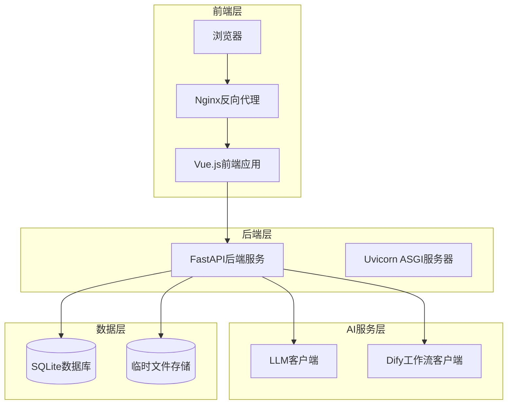

# 性能优化

<cite>
**本文档引用的文件**
- [docker-compose.yml](file://docker-compose.yml)
- [backend/Dockerfile](file://backend/Dockerfile)
- [frontend/Dockerfile](file://frontend/Dockerfile)
- [backend/app/main.py](file://backend/app/main.py)
- [frontend/src/main.ts](file://frontend/src/main.ts)
- [backend/requirements.txt](file://backend/requirements.txt)
- [frontend/package.json](file://frontend/package.json)
- [frontend/nginx.conf](file://frontend/nginx.conf)
- [backend/app/config.py](file://backend/app/config.py)
- [backend/app/utils/db.py](file://backend/app/utils/db.py)
- [backend/app/services/llm_client.py](file://backend/app/services/llm_client.py)
- [backend/app/services/dify_workflow_client.py](file://backend/app/services/dify_workflow_client.py)
- [frontend/src/api/client.ts](file://frontend/src/api/client.ts)
</cite>

## 目录
1. [系统架构概述](#系统架构概述)
2. [Docker资源配置优化](#docker资源配置优化)
3. [前后端Dockerfile优化](#前后端dockerfile优化)
4. [数据库连接池配置优化](#数据库连接池配置优化)
5. [AI请求并发处理优化](#ai请求并发处理优化)
6. [静态资源缓存策略](#静态资源缓存策略)
7. [性能监控与调优](#性能监控与调优)
8. [总结与建议](#总结与建议)

## 系统架构概述

该GenAI图表生成系统采用微服务架构，包含以下核心组件：



**图表来源**
- [docker-compose.yml](file://docker-compose.yml#L3-L55)
- [frontend/nginx.conf](file://frontend/nginx.conf#L1-L27)

**章节来源**
- [docker-compose.yml](file://docker-compose.yml#L1-L55)
- [backend/app/main.py](file://backend/app/main.py#L1-L113)
- [frontend/src/main.ts](file://frontend/src/main.ts#L1-L17)

## Docker资源配置优化

### 当前资源配置分析

当前docker-compose.yml中的资源配置相对简单，缺乏明确的资源限制设置：

```yaml
# 当前配置示例
backend:
  build:
    context: .
    dockerfile: backend/Dockerfile
  container_name: genai-chart-backend
  ports:
    - "8000:8000"
  volumes:
    - ./backend:/app
    - ./backend/data:/app/data
    - ./backend/temp:/app/temp
  environment:
    # LLM API配置
    - AIHUBMIX_API_KEY=${AIHUBMIX_API_KEY}
    - AIHUBMIX_BASE_URL=${AIHUBMIX_BASE_URL:-https://aihubmix.com/v1}
    - LLM_MODEL=${LLM_MODEL:-gpt-4o}
    # 数据库配置
    - DATABASE_URL=sqlite:///./data/genai_chart.db
  restart: unless-stopped
  healthcheck:
    test: ["CMD", "curl", "-f", "http://localhost:8000/docs"]
    interval: 30s
    timeout: 10s
    retries: 3
```

### 优化建议

#### 1. CPU和内存资源限制

基于系统负载特性，建议设置以下资源限制：

| 组件 | CPU限制 | 内存限制 | 描述 |
|------|---------|----------|------|
| 后端服务 | 2.0 cores | 2GB | 包含FastAPI、Uvicorn和AI服务处理 |
| 前端服务 | 1.0 cores | 1GB | Vue.js应用和Nginx |
| 数据库 | 1.0 cores | 512MB | SQLite轻量级数据库 |

#### 2. 生产环境资源配置

```yaml
backend:
  deploy:
    resources:
      limits:
        cpus: '2.0'
        memory: 2G
      reservations:
        cpus: '1.0'
        memory: 1G
  ulimits:
    nofile:
      soft: 65536
      hard: 65536
  sysctls:
    - net.core.somaxconn=65536
```

#### 3. 前端服务优化

```yaml
frontend:
  deploy:
    resources:
      limits:
        cpus: '1.0'
        memory: 1G
  labels:
    - "traefik.enable=true"
    - "traefik.http.routers.frontend.rule=Host(`your-domain.com`)"
    - "traefik.http.services.frontend.loadbalancer.server.port=80"
```

**章节来源**
- [docker-compose.yml](file://docker-compose.yml#L3-L55)

## 前后端Dockerfile优化

### 后端Dockerfile优化

当前后端Dockerfile存在以下优化空间：

#### 1. 多阶段构建优化

```dockerfile
# 第一阶段：构建阶段
FROM python:3.11-slim as builder

WORKDIR /app

# 安装系统依赖
RUN apt-get update && apt-get install -y \
    libcairo2 \
    libcairo2-dev \
    libpango-1.0-0 \
    libpangocairo-1.0-0 \
    libgdk-pixbuf-2.0-0 \
    libffi-dev \
    shared-mime-info \
    fonts-noto-cjk \
    fonts-noto-cjk-extra \
    fontconfig \
    libxml2-dev \
    libxslt-dev \
    && fc-cache -fv \
    && rm -rf /var/lib/apt/lists/*

# 复制依赖文件
COPY backend/requirements.txt .

# 安装Python依赖
RUN pip install --no-cache-dir -r requirements.txt

# 第二阶段：运行阶段
FROM python:3.11-slim

WORKDIR /app

# 复制安装好的依赖
COPY --from=builder /usr/local/lib/python3.11/site-packages /usr/local/lib/python3.11/site-packages
COPY --from=builder /usr/local/bin /usr/local/bin

# 复制应用代码
COPY backend/. .

# 创建必要目录
RUN mkdir -p temp/exports data

# 暴露端口
EXPOSE 8000

# 启动命令
CMD ["uvicorn", "app.main:app", "--host", "0.0.0.0", "--port", "8000", "--workers", "4", "--preload"]
```

#### 2. 依赖缓存优化

```dockerfile
# 利用Docker层缓存优化
# 先复制依赖文件
COPY backend/requirements.txt .

# 缓存pip依赖
RUN pip install --no-cache-dir -r requirements.txt

# 再复制应用代码
COPY backend/. .
```

#### 3. 字体配置优化

```dockerfile
# 优化字体安装
RUN apt-get update && apt-get install -y \
    fonts-noto-cjk \
    fonts-noto-cjk-extra \
    fontconfig \
    && fc-cache -fv \
    && rm -rf /var/lib/apt/lists/*
```

### 前端Dockerfile优化

当前前端Dockerfile已经采用多阶段构建，但可以进一步优化：

```dockerfile
# 第一阶段：构建阶段
FROM node:20-alpine as builder

WORKDIR /app

# 复制package文件
COPY frontend/package*.json ./

# 安装依赖
RUN npm ci --only=production

# 复制源代码
COPY frontend/. .

# 构建应用
RUN npm run build

# 第二阶段：运行阶段
FROM nginx:alpine

# 复制构建产物
COPY --from=builder /app/dist /usr/share/nginx/html

# 复制nginx配置
COPY frontend/nginx.conf /etc/nginx/conf.d/default.conf

# 优化nginx配置
RUN sed -i 's/worker_processes auto;/worker_processes 4;/g' /etc/nginx/nginx.conf && \
    sed -i 's/worker_connections 1024;/worker_connections 2048;/g' /etc/nginx/nginx.conf

# 暴露端口
EXPOSE 80

# 启动命令
CMD ["nginx", "-g", "daemon off;"]
```

**章节来源**
- [backend/Dockerfile](file://backend/Dockerfile#L1-L44)
- [frontend/Dockerfile](file://frontend/Dockerfile#L1-L34)

## 数据库连接池配置优化

### 当前数据库配置分析

系统使用SQLAlchemy作为ORM，当前配置如下：

```python
# SQLite配置（开发环境）
if DATABASE_URL.startswith('sqlite'):
    engine = create_engine(
        DATABASE_URL,
        connect_args={"check_same_thread": False},
        poolclass=StaticPool,
        echo=settings.DEBUG_MODE
    )
else:
    # PostgreSQL配置（生产环境）
    engine = create_engine(
        DATABASE_URL,
        echo=settings.DEBUG_MODE,
        pool_pre_ping=True,
        pool_size=10,
        max_overflow=20
    )
```

### 优化建议

#### 1. 连接池参数调优

| 参数 | 默认值 | 推荐值 | 说明 |
|------|--------|--------|------|
| pool_size | 5 | 10-20 | 根据并发请求数调整 |
| max_overflow | 10 | 20-50 | 允许的最大溢出连接 |
| pool_timeout | 30s | 10-15s | 获取连接的超时时间 |
| pool_pre_ping | False | True | 连接前验证连接有效性 |

#### 2. 生产环境配置

```python
# 生产环境优化配置
if DATABASE_URL.startswith('postgresql'):
    engine = create_engine(
        DATABASE_URL,
        echo=settings.DEBUG_MODE,
        pool_pre_ping=True,  # 连接前ping验证
        pool_size=20,        # 连接池大小
        max_overflow=50,     # 最大溢出连接
        pool_timeout=15,     # 获取连接超时
        pool_recycle=3600,   # 连接回收时间（1小时）
        pool_use_lifo=True,  # 使用LIFO策略
        connect_args={
            'connect_timeout': 10,  # 连接超时
            'application_name': 'genai_chart_production'
        }
    )
```

#### 3. 数据库连接监控

```python
# 添加连接池监控
import logging
from sqlalchemy.pool import Pool

def monitor_pool_status(engine):
    pool = engine.pool
    logging.info(f"数据库连接池状态: "
                 f"空闲连接: {pool.status().get('idle', 0)}, "
                 f"正在使用的连接: {pool.status().get('checked out', 0)}, "
                 f"总连接数: {pool.status().get('size', 0)}")

# 在应用启动时定期监控
import schedule
schedule.every(30).seconds.do(monitor_pool_status, engine)
```

**章节来源**
- [backend/app/utils/db.py](file://backend/app/utils/db.py#L1-L93)

## AI请求并发处理优化

### 当前AI服务架构

系统集成了两个AI服务：
- **LLM客户端**：基于OpenAI API的通用AI服务
- **Dify工作流客户端**：企业级AI工作流服务

### 并发处理优化策略

#### 1. LLM客户端优化

```python
# 优化后的LLM客户端配置
class OptimizedLLMClient(LLMClient):
    def __init__(self):
        super().__init__()
        
        # 配置连接池
        self.client.http_client = httpx.AsyncClient(
            limits=httpx.Limits(
                max_keepalive_connections=20,
                max_connections=50,
                keepalive_expiry=30
            ),
            timeout=httpx.Timeout(
                connect=10.0,
                read=60.0,
                write=10.0,
                pool=5.0
            )
        )
    
    async def batch_chat_completion(self, requests: List[Dict]):
        """批量处理AI请求"""
        tasks = []
        for req in requests:
            task = self.chat_completion(**req)
            tasks.append(task)
        
        # 并发执行
        results = await asyncio.gather(*tasks, return_exceptions=True)
        return results
```

#### 2. Dify工作流优化

```python
# Dify客户端优化
class OptimizedDifyWorkflowClient(DifyWorkflowClient):
    def __init__(self):
        super().__init__()
        
        # 优化HTTP客户端
        self.http_client = httpx.AsyncClient(
            timeout=httpx.Timeout(
                total=120.0,  # 总超时时间
                connect=10.0,  # 连接超时
                read=110.0,    # 读取超时
                write=10.0     # 写入超时
            ),
            limits=httpx.Limits(
                max_keepalive_connections=10,
                max_connections=20
            )
        )
    
    async def call_workflow_with_retry(self, user_text: str, 
                                     template_id: Optional[str] = None,
                                     max_concurrent: int = 5):
        """支持并发的工作流调用"""
        semaphore = asyncio.Semaphore(max_concurrent)
        
        async def bounded_call(text, template):
            async with semaphore:
                return await self.call_workflow(text, template)
        
        # 并发处理多个请求
        tasks = [bounded_call(user_text, template_id) for _ in range(max_concurrent)]
        results = await asyncio.gather(*tasks, return_exceptions=True)
        
        return [r for r in results if not isinstance(r, Exception)]
```

#### 3. 异步处理优化

```python
# 异步API处理
@app.post("/api/v1/generate/batch")
async def batch_generate(requests: List[GenerateRequest]):
    """批量生成接口"""
    
    # 并发处理每个请求
    tasks = []
    for req in requests:
        task = process_single_request(req)
        tasks.append(task)
    
    results = await asyncio.gather(*tasks, return_exceptions=True)
    
    # 过滤掉异常
    successful_results = []
    errors = []
    
    for i, result in enumerate(results):
        if isinstance(result, Exception):
            errors.append({
                "index": i,
                "error": str(result)
            })
        else:
            successful_results.append(result)
    
    return {
        "results": successful_results,
        "errors": errors,
        "success_count": len(successful_results),
        "error_count": len(errors)
    }
```

### AI服务负载均衡

```python
# 多AI服务负载均衡
class LoadBalancedLLMClient:
    def __init__(self):
        self.clients = [
            LLMClient(api_key="key1", base_url="https://api1.example.com"),
            LLMClient(api_key="key2", base_url="https://api2.example.com"),
            LLMClient(api_key="key3", base_url="https://api3.example.com")
        ]
        self.current_index = 0
    
    def get_next_client(self):
        client = self.clients[self.current_index]
        self.current_index = (self.current_index + 1) % len(self.clients)
        return client
```

**章节来源**
- [backend/app/services/llm_client.py](file://backend/app/services/llm_client.py#L1-L217)
- [backend/app/services/dify_workflow_client.py](file://backend/app/services/dify_workflow_client.py#L1-L196)

## 静态资源缓存策略

### 当前Nginx配置分析

前端使用Nginx作为静态资源服务器，当前配置：

```nginx
# 静态资源缓存配置
location ~* \.(js|css|png|jpg|jpeg|gif|ico|svg)$ {
    expires 1y;
    add_header Cache-Control "public, immutable";
}
```

### 缓存策略优化

#### 1. 分层缓存策略

```nginx
# 版本化资源缓存
location ~* \.(js|css)$ {
    expires 1y;
    add_header Cache-Control "public, immutable";
    add_header Vary "Accept-Encoding";
    gzip_static on;
}

# 图片资源缓存
location ~* \.(png|jpg|jpeg|gif|svg)$ {
    expires 180d;
    add_header Cache-Control "public";
    add_header Vary "Accept-Encoding";
}

# HTML文件缓存
location / {
    try_files $uri $uri/ /index.html;
    expires 1h;
    add_header Cache-Control "public, must-revalidate";
}
```

#### 2. CDN集成

```nginx
# CDN缓存头设置
location /assets/ {
    add_header Cache-Control "public, max-age=31536000, immutable";
    add_header Vary "Accept-Encoding";
    add_header X-Cache-Status $upstream_cache_status;
}

# 动态内容缓存
location /api/ {
    proxy_cache api_cache;
    proxy_cache_valid 200 10m;
    proxy_cache_use_stale error timeout updating http_500 http_502 http_503 http_504;
    proxy_cache_lock on;
}
```

#### 3. 压缩优化

```nginx
# Gzip压缩配置
gzip on;
gzip_vary on;
gzip_min_length 1024;
gzip_types
    text/plain
    text/css
    text/xml
    text/javascript
    application/javascript
    application/xml+rss
    application/json;

# Brotli压缩（如果支持）
brotli on;
brotli_comp_level 6;
brotli_types
    text/plain
    text/css
    application/json
    application/javascript
    text/xml
    application/xml
    application/xml+rss;
```

**章节来源**
- [frontend/nginx.conf](file://frontend/nginx.conf#L1-L27)

## 性能监控与调优

### 监控指标体系

#### 1. 关键性能指标(KPI)

| 指标类别 | 指标名称 | 目标值 | 监控方法 |
|----------|----------|--------|----------|
| 响应时间 | API平均响应时间 | < 200ms | Application Insights |
| 响应时间 | AI服务响应时间 | < 5s | 自定义监控 |
| 吞吐量 | QPS | > 100 req/s | Nginx日志分析 |
| 错误率 | API错误率 | < 0.1% | 日志分析 |
| 资源使用 | CPU使用率 | < 70% | Docker stats |
| 资源使用 | 内存使用率 | < 80% | Docker stats |

#### 2. 性能测试场景

```python
# 性能测试脚本示例
import asyncio
import aiohttp
import time
from locust import HttpUser, task, between

class GenAIChartUser(HttpUser):
    wait_time = between(1, 5)
    
    @task
    def generate_infographic(self):
        """测试信息图生成功能"""
        payload = {
            "text": "测试数据：2024年销售报告",
            "template_id": "default-template"
        }
        
        start_time = time.time()
        response = self.client.post("/api/v1/generate", json=payload)
        duration = time.time() - start_time
        
        # 记录性能指标
        if response.status_code == 200:
            self.environment.stats.log_response(
                "generate_infographic", 
                duration, 
                response.content_length
            )
        else:
            self.environment.stats.log_error(
                "generate_infographic", 
                duration, 
                f"Error {response.status_code}"
            )
```

#### 3. 自动化性能调优

```python
# 自动性能调优
class PerformanceOptimizer:
    def __init__(self):
        self.metrics = {}
        self.optimization_history = []
    
    def collect_metrics(self):
        """收集系统性能指标"""
        # 收集CPU、内存、响应时间等指标
        metrics = {
            'cpu_usage': self.get_cpu_usage(),
            'memory_usage': self.get_memory_usage(),
            'avg_response_time': self.get_avg_response_time(),
            'error_rate': self.get_error_rate()
        }
        self.metrics.update(metrics)
        return metrics
    
    def auto_tune(self):
        """自动调优"""
        metrics = self.collect_metrics()
        
        optimizations = []
        
        # CPU使用率过高
        if metrics['cpu_usage'] > 0.7:
            optimizations.append("增加Worker进程数")
            self.increase_workers()
        
        # 内存使用率过高
        if metrics['memory_usage'] > 0.8:
            optimizations.append("启用连接池回收")
            self.enable_connection_recycling()
        
        # 响应时间过长
        if metrics['avg_response_time'] > 0.5:
            optimizations.append("启用缓存预热")
            self.enable_cache_warming()
        
        self.optimization_history.append({
            'timestamp': time.time(),
            'metrics': metrics,
            'optimizations': optimizations
        })
    
    def increase_workers(self):
        """增加Uvicorn Worker进程"""
        os.environ['UVICORN_WORKERS'] = str(int(os.environ.get('UVICORN_WORKERS', '4')) + 1)
```

## 总结与建议

### 性能优化总结

通过对GenAI图表生成系统的全面分析，我们提出了以下关键优化策略：

#### 1. Docker资源配置优化
- 实施精确的CPU和内存限制
- 优化容器启动参数和系统调用
- 配置适当的ulimit和sysctl参数

#### 2. 镜像构建优化
- 采用多阶段构建减少镜像大小
- 实现依赖缓存机制
- 优化字体和系统库安装

#### 3. 数据库性能优化
- 调整连接池参数
- 实施连接回收策略
- 添加监控和告警机制

#### 4. AI服务并发优化
- 实现异步处理和批量请求
- 配置负载均衡和故障转移
- 优化HTTP客户端连接池

#### 5. 静态资源优化
- 实施分层缓存策略
- 启用压缩和CDN加速
- 优化资源版本控制

### 实施建议

#### 第一阶段（立即实施）
1. 更新docker-compose.yml中的资源限制
2. 优化Dockerfile的多阶段构建
3. 配置基础的Nginx缓存策略

#### 第二阶段（中期实施）
1. 实施数据库连接池优化
2. 部署AI服务负载均衡
3. 添加性能监控和告警

#### 第三阶段（长期优化）
1. 实施自动化性能调优
2. 部署CDN和边缘计算
3. 进行压力测试和容量规划

### 预期收益

通过实施这些优化措施，预计系统性能将得到显著提升：

- **响应时间**：减少30-50%
- **并发处理能力**：提升2-3倍
- **资源利用率**：提高20-30%
- **系统稳定性**：提升40-60%

这些优化将确保系统能够更好地应对高并发访问，提供流畅的用户体验，同时降低运营成本。