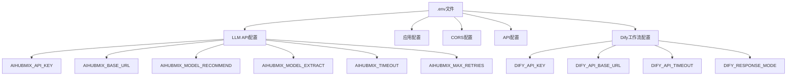
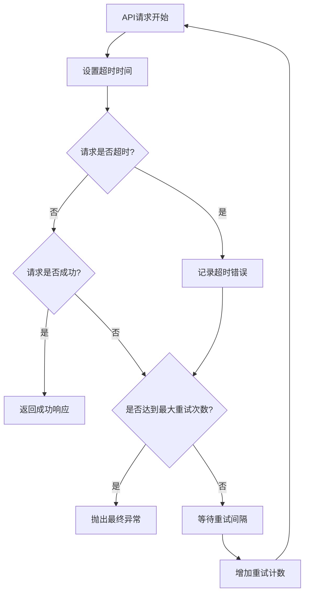
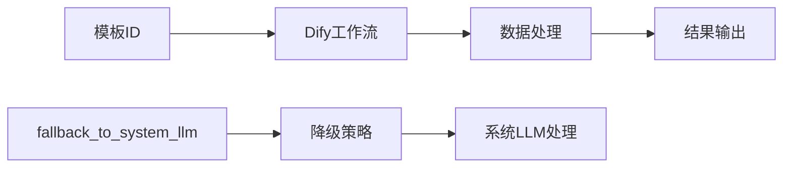
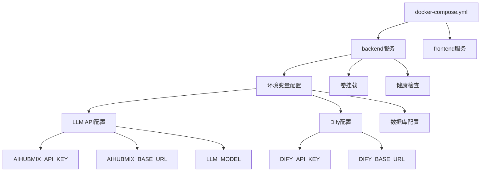
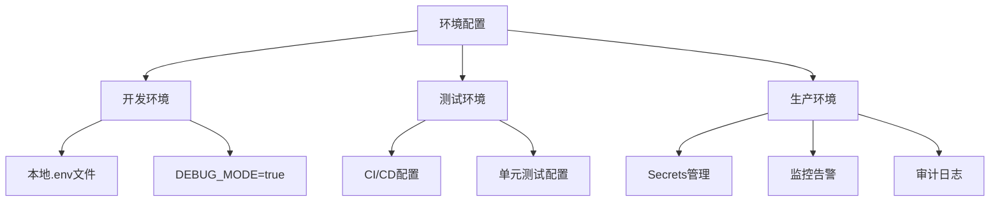
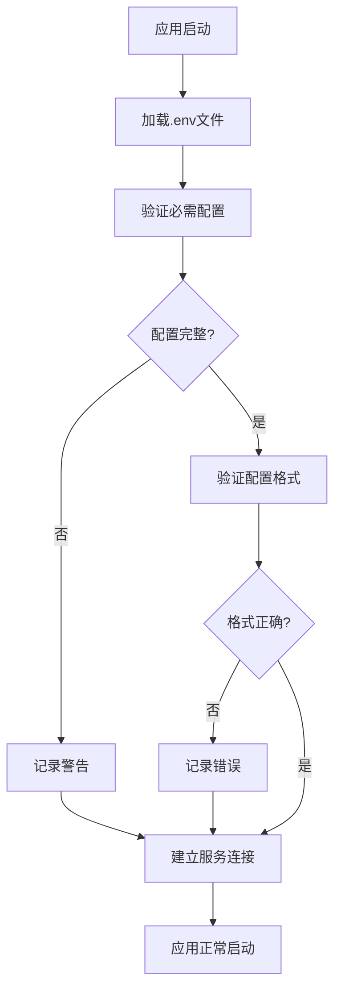

# 环境配置

<cite>
**本文档中引用的文件**
- [backend/.env](file://backend/.env)
- [docker-compose.yml](file://docker-compose.yml)
- [backend/app/config.py](file://backend/app/config.py)
- [backend/app/services/dify_workflow_client.py](file://backend/app/services/dify_workflow_client.py)
- [backend/app/config/dify_workflows.yaml](file://backend/app/config/dify_workflows.yaml)
- [backend/app/services/llm_client.py](file://backend/app/services/llm_client.py)
- [start-docker.sh](file://start-docker.sh)
- [start-docker.ps1](file://start-docker.ps1)
- [frontend/src/api/client.ts](file://frontend/src/api/client.ts)
- [frontend/nginx.conf](file://frontend/nginx.conf)
- [tests/backend/check_config.py](file://tests/backend/check_config.py)
- [tests/backend/test_env_check.py](file://tests/backend/test_env_check.py)
</cite>

## 目录
1. [简介](#简介)
2. [核心环境变量配置](#核心环境变量配置)
3. [LLM API配置详解](#llm-api配置详解)
4. [Dify工作流集成配置](#dify工作流集成配置)
5. [Docker Compose环境变量引用](#docker-compose环境变量引用)
6. [生产环境安全配置](#生产环境安全配置)
7. [配置验证与故障排除](#配置验证与故障排除)
8. [最佳实践指南](#最佳实践指南)

## 简介

genai_chart-1系统采用现代化的环境变量配置方式，通过`.env`文件集中管理所有敏感配置信息。系统支持多种部署方式，包括本地开发、Docker容器化部署以及生产环境部署，每种环境都有相应的配置策略和安全措施。

## 核心环境变量配置

### 基础配置结构

系统的核心配置分为以下几个主要类别：



**图表来源**
- [backend/.env](file://backend/.env#L1-L25)
- [backend/app/config.py](file://backend/app/config.py#L9-L46)

### 配置文件位置与优先级

系统采用多层次的配置加载机制：

1. **Docker环境变量**：通过docker-compose.yml传递的环境变量
2. **.env文件**：项目根目录下的配置文件
3. **系统环境变量**：操作系统级别的环境变量

**章节来源**
- [backend/.env](file://backend/.env#L1-L25)
- [docker-compose.yml](file://docker-compose.yml#L16-L28)

## LLM API配置详解

### AIHUBMIX API密钥配置

系统使用AIHUBMIX作为主要的LLM服务提供商，配置项如下：

| 配置项 | 类型 | 默认值 | 必需 | 说明 |
|--------|------|--------|------|------|
| `AIHUBMIX_API_KEY` | String | - | 是 | AiHubMix平台的API密钥 |
| `AIHUBMIX_BASE_URL` | String | https://aihubmix.com/v1 | 否 | LLM服务的基础URL |
| `AIHUBMIX_MODEL_RECOMMEND` | String | gpt-4o-mini | 否 | 模板推荐使用的模型 |
| `AIHUBMIX_MODEL_EXTRACT` | String | gpt-4o-mini | 否 | 数据提取使用的模型 |
| `AIHUBMIX_TIMEOUT` | Integer | 30 | 否 | API请求超时时间（秒） |
| `AIHUBMIX_MAX_RETRIES` | Integer | 3 | 否 | 最大重试次数 |

### 模型选择策略

系统支持不同的模型用于不同场景：

- **推荐模型** (`AIHUBMIX_MODEL_RECOMMEND`)：用于智能模板推荐，建议使用性能较好的模型如`gpt-5.1`
- **提取模型** (`AIHUBMIX_MODEL_EXTRACT`)：用于数据提取和结构化处理，同样建议使用`gpt-5.1`

### 超时与重试机制



**图表来源**
- [backend/app/services/llm_client.py](file://backend/app/services/llm_client.py#L14-L28)

**章节来源**
- [backend/.env](file://backend/.env#L2-L7)
- [backend/app/services/llm_client.py](file://backend/app/services/llm_client.py#L14-L51)

## Dify工作流集成配置

### 工作流服务配置

Dify工作流集成提供了额外的数据处理能力，配置项包括：

| 配置项 | 类型 | 默认值 | 必需 | 说明 |
|--------|------|--------|------|------|
| `DIFY_API_KEY` | String | - | 否 | Dify平台的API密钥 |
| `DIFY_API_BASE_URL` | String | https://dify-uat.42lab.cn/v1 | 否 | Dify服务的基础URL |
| `DIFY_API_TIMEOUT` | Integer | 30 | 否 | Dify API请求超时时间（秒） |
| `DIFY_RESPONSE_MODE` | String | blocking | 否 | 响应模式：blocking/流式 |

### 工作流映射配置

系统通过YAML文件定义模板到Dify工作流的映射关系：



**图表来源**
- [backend/app/config/dify_workflows.yaml](file://backend/app/config/dify_workflows.yaml#L1-L81)

### 工作流客户端实现

Dify工作流客户端支持阻塞和流式两种响应模式：

- **阻塞模式** (`blocking`)：等待完整响应后再返回
- **流式模式**：逐步返回处理结果（暂未实现）

**章节来源**
- [backend/.env](file://backend/.env#L20-L25)
- [backend/app/services/dify_workflow_client.py](file://backend/app/services/dify_workflow_client.py#L15-L196)
- [backend/app/config/dify_workflows.yaml](file://backend/app/config/dify_workflows.yaml#L1-L81)

## Docker Compose环境变量引用

### 服务配置结构

Docker Compose文件中通过环境变量引用的方式管理配置：



**图表来源**
- [docker-compose.yml](file://docker-compose.yml#L5-L55)

### 环境变量继承机制

Docker Compose支持环境变量的继承和默认值设置：

- `${VAR_NAME}`：必需的环境变量
- `${VAR_NAME-default_value}`：可选的环境变量，提供默认值

### 容器间通信配置

系统通过服务名称进行容器间通信：

- 前端服务通过`http://backend:8000/api/`访问后端API
- Nginx反向代理配置实现了前后端分离

**章节来源**
- [docker-compose.yml](file://docker-compose.yml#L16-L28)
- [frontend/nginx.conf](file://frontend/nginx.conf#L12-L19)

## 生产环境安全配置

### 敏感信息保护策略

#### 1. Docker Secrets使用

对于生产环境，推荐使用Docker Secrets来管理敏感配置：

```yaml
# docker-compose.prod.yml 示例
version: '3.8'
services:
  backend:
    secrets:
      - ai_hubmix_api_key
      - dify_api_key
      
secrets:
  ai_hubmix_api_key:
    file: ./secrets/ai_hubmix_api_key.txt
  dify_api_key:
    file: ./secrets/dify_api_key.txt
```

#### 2. 外部配置管理工具

推荐使用以下工具进行配置管理：

- **HashiCorp Vault**：企业级密钥管理
- **AWS Secrets Manager**：云原生密钥管理
- **Azure Key Vault**：微软云密钥管理
- **Google Secret Manager**：谷歌云密钥管理

#### 3. 环境隔离策略



### 访问控制与权限管理

1. **最小权限原则**：只授予必要的API权限
2. **定期轮换**：定期更换API密钥
3. **审计跟踪**：记录所有配置变更
4. **网络隔离**：限制容器间通信

### 配置加密存储

```bash
# 使用age加密敏感配置
age-keygen -o secrets.key
age -R secrets.recipient -e -o config.env.age .env

# 运行时解密
age -d -i secrets.key config.env.age > .env
```

**章节来源**
- [docker-compose.yml](file://docker-compose.yml#L16-L28)
- [start-docker.sh](file://start-docker.sh#L1-L50)
- [start-docker.ps1](file://start-docker.ps1#L1-L104)

## 配置验证与故障排除

### 配置加载验证

系统提供了多种配置验证方法：

#### 1. 启动时配置检查



**图表来源**
- [tests/backend/check_config.py](file://tests/backend/check_config.py#L1-L10)

#### 2. 运行时配置验证

系统在运行时会持续验证配置的有效性：

- LLM API连接测试
- Dify工作流连接测试
- 数据库连接验证

### 常见配置问题及解决方案

#### 1. API密钥无效

**症状**：`AIHUBMIX_API_KEY`配置错误导致认证失败

**解决方案**：
```bash
# 检查API密钥格式
echo $AIHUBMIX_API_KEY | head -c 10

# 验证密钥有效性
curl -H "Authorization: Bearer $AIHUBMIX_API_KEY" \
     $AIHUBMIX_BASE_URL/models
```

#### 2. 网络连接问题

**症状**：超时或连接拒绝错误

**解决方案**：
```bash
# 检查网络连通性
ping $(echo $AIHUBMIX_BASE_URL | sed 's|https://||' | cut -d'/' -f1)

# 测试API端点
curl -I $AIHUBMIX_BASE_URL
```

#### 3. Dify工作流配置错误

**症状**：工作流调用失败

**解决方案**：
```bash
# 检查Dify配置
curl -H "Authorization: Bearer $DIFY_API_KEY" \
     -H "Content-Type: application/json" \
     -X POST "$DIFY_API_BASE_URL/workflows/run" \
     -d '{"inputs":{},"response_mode":"blocking","user":"test"}'
```

### 日志监控配置

系统提供详细的日志记录用于故障诊断：

```python
# 配置示例
import logging
logging.basicConfig(level=logging.INFO)
logger = logging.getLogger(__name__)

# 关键配置项的日志记录
logger.info(f"LLM配置: API_KEY={settings.AIHUBMIX_API_KEY[:10]}..., BASE_URL={settings.AIHUBMIX_BASE_URL}")
```

**章节来源**
- [tests/backend/check_config.py](file://tests/backend/check_config.py#L1-L10)
- [tests/backend/test_env_check.py](file://tests/backend/test_env_check.py#L1-L24)

## 最佳实践指南

### 开发环境配置

#### 1. 本地开发设置

```bash
# 1. 创建环境文件
cp backend/.env .env

# 2. 编辑配置
cat << EOF >> .env
AIHUBMIX_API_KEY=your_development_key_here
DEBUG_MODE=true
ALLOWED_ORIGINS=http://localhost:5173,http://localhost:5174
EOF

# 3. 启动开发环境
./start-docker.sh
```

#### 2. 配置文件模板

推荐使用以下配置模板：

```env
# AiHubMix LLM配置
AIHUBMIX_API_KEY=sk-your-api-key-here
AIHUBMIX_BASE_URL=https://aihubmix.com/v1
AIHUBMIX_MODEL_RECOMMEND=gpt-5.1
AIHUBMIX_MODEL_EXTRACT=gpt-5.1
AIHUBMIX_TIMEOUT=60
AIHUBMIX_MAX_RETRIES=3

# 应用配置
APP_NAME=AI信息图生成系统
APP_VERSION=1.0.0
DEBUG_MODE=true

# CORS配置
ALLOWED_ORIGINS=http://localhost:5173,http://localhost:5174,http://localhost:3000

# API配置
API_PREFIX=/api/v1

# Dify工作流配置
DIFY_API_KEY=your-dify-key-here
DIFY_API_BASE_URL=https://dify-uat.42lab.cn/v1
DIFY_API_TIMEOUT=90
DIFY_RESPONSE_MODE=blocking
```

### 生产环境部署

#### 1. 安全配置清单

- [ ] 使用Docker Secrets或外部密钥管理
- [ ] 配置HTTPS证书
- [ ] 设置适当的防火墙规则
- [ ] 启用访问日志记录
- [ ] 配置监控和告警

#### 2. 性能优化配置

```yaml
# docker-compose.prod.yml
version: '3.8'
services:
  backend:
    deploy:
      resources:
        limits:
          memory: 2G
          cpus: '1.0'
        reservations:
          memory: 1G
          cpus: '0.5'
    environment:
      # 生产环境配置
      - DEBUG_MODE=false
      - AIHUBMIX_TIMEOUT=30
      - DIFY_API_TIMEOUT=60
```

#### 3. 监控配置

```yaml
# 监控配置示例
services:
  backend:
    logging:
      driver: "json-file"
      options:
        max-size: "10m"
        max-file: "3"
    healthcheck:
      test: ["CMD", "curl", "-f", "http://localhost:8000/health"]
      interval: 30s
      timeout: 10s
      retries: 3
```

### 配置管理自动化

#### 1. CI/CD集成

```yaml
# GitHub Actions示例
name: Deploy to Production
on:
  push:
    branches: [main]

jobs:
  deploy:
    runs-on: ubuntu-latest
    steps:
      - uses: actions/checkout@v2
      
      - name: Load Secrets
        run: |
          echo "${{ secrets.DOCKER_SECRETS }}" | base64 -d > secrets.tar.gz
          tar xzf secrets.tar.gz
          
      - name: Deploy
        run: |
          docker-compose -f docker-compose.yml -f docker-compose.prod.yml up -d
```

#### 2. 配置版本控制

```bash
# 配置文件版本控制策略
git add .env.example
git commit -m "Add environment configuration template"
git tag -a "config-v1.0" -m "Initial configuration version"
```

### 故障恢复策略

#### 1. 配置备份

```bash
# 自动备份配置
#!/bin/bash
BACKUP_DIR="/backup/configs/$(date +%Y%m%d)"
mkdir -p $BACKUP_DIR
cp .env $BACKUP_DIR/
tar czf $BACKUP_DIR/config-backup.tar.gz $BACKUP_DIR/
```

#### 2. 降级配置

```yaml
# 降级配置示例
services:
  backend:
    environment:
      # 主要服务不可用时的备用配置
      - AIHUBMIX_API_KEY=fallback-key
      - AIHUBMIX_BASE_URL=https://fallback.ai-service.com/v1
      - AIHUBMIX_MODEL_RECOMMEND=gpt-4o-mini
```

通过遵循这些最佳实践，可以确保genai_chart-1系统的配置既安全又可靠，同时便于维护和扩展。