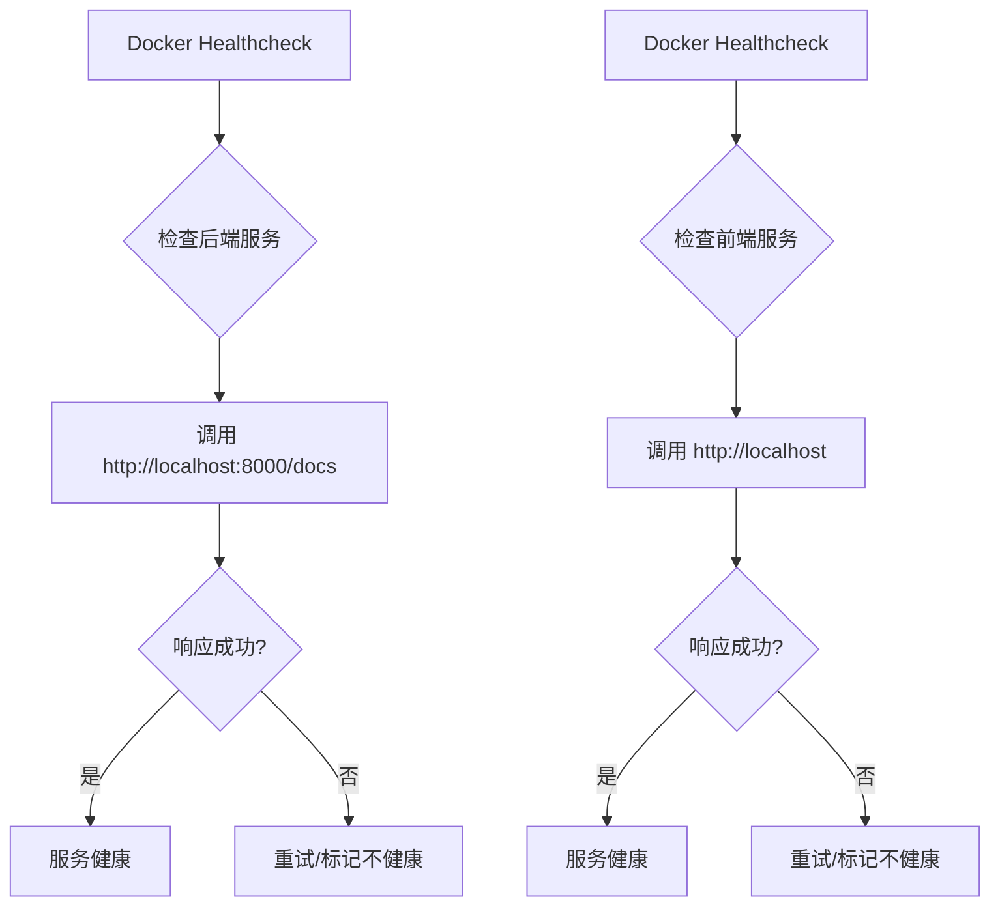
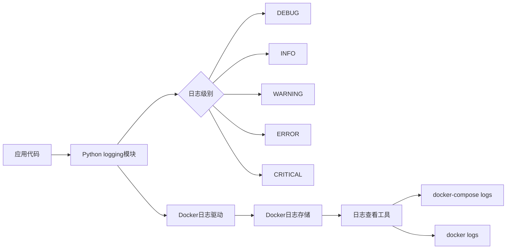
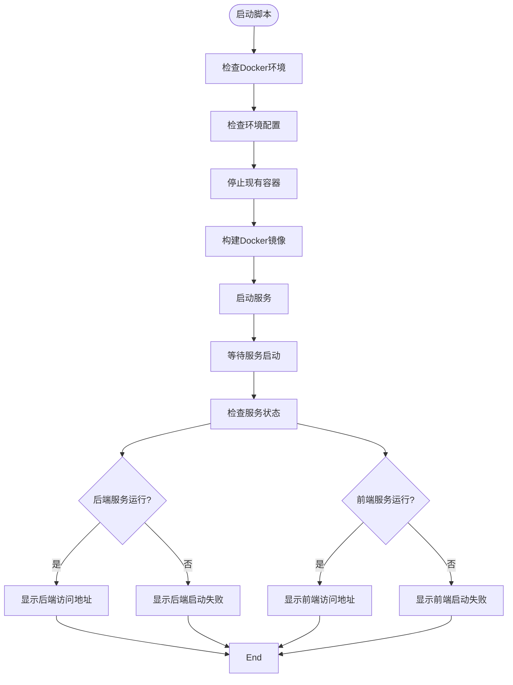
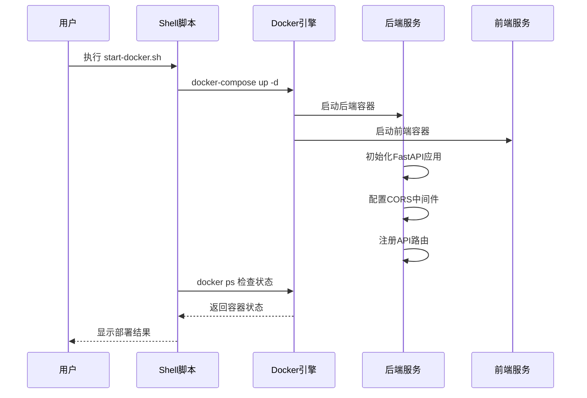

# 监控与日志

<cite>
**本文档引用的文件**  
- [docker-compose.yml](file://docker-compose.yml)
- [start-docker.sh](file://start-docker.sh)
- [main.py](file://backend/app/main.py)
- [Dockerfile](file://backend/Dockerfile)
- [Dockerfile](file://frontend/Dockerfile)
- [config.py](file://backend/app/config.py)
- [.env](file://backend/.env)
- [export_service.py](file://backend/app/services/export_service.py)
- [generate_service.py](file://backend/app/services/generate_service.py)
- [generate.py](file://backend/app/api/v1/generate.py)
- [export.py](file://backend/app/api/v1/export.py)
</cite>

## 目录
1. [系统健康检查机制](#系统健康检查机制)
2. [日志收集与监控体系](#日志收集与监控体系)
3. [服务状态检查与告警](#服务状态检查与告警)
4. [日志查看与故障排查](#日志查看与故障排查)
5. [最佳实践与维护建议](#最佳实践与维护建议)

## 系统健康检查机制

本系统通过Docker Compose的healthcheck指令实现服务健康检查，确保前后端服务的稳定运行。在`docker-compose.yml`文件中，为backend和frontend服务分别配置了健康检查机制。

后端服务通过访问`http://localhost:8000/docs`端点来检查健康状态，该端点由FastAPI应用提供。前端服务则通过访问`http://localhost`来验证其运行状态。这些健康检查每30秒执行一次，超时时间为10秒，最多重试3次。

**Diagram sources**
- [docker-compose.yml](file://docker-compose.yml#L29-L34)
- [docker-compose.yml](file://docker-compose.yml#L46-L50)

**Section sources**
- [docker-compose.yml](file://docker-compose.yml#L5-L55)
- [main.py](file://backend/app/main.py#L94-L103)

## 日志收集与监控体系

系统采用Docker默认的日志驱动收集前后端日志，结合应用内部的日志记录机制构建完整的监控体系。后端服务使用Python标准库的logging模块进行日志记录，配置了详细的日志格式，包括时间戳、日志级别、模块名称和消息内容。

在`main.py`中，通过`logging.basicConfig`配置了日志级别为INFO，格式包含时间戳、模块名、日志级别和消息。各个服务模块（如export_service.py、generate_service.py）都使用`logging.getLogger(__name__)`创建独立的日志记录器，便于追踪特定模块的运行情况。

**Diagram sources**
- [main.py](file://backend/app/main.py#L11-L15)
- [export_service.py](file://backend/app/services/export_service.py#L4)
- [generate_service.py](file://backend/app/services/generate_service.py#L6)

**Section sources**
- [main.py](file://backend/app/main.py#L1-L16)
- [export_service.py](file://backend/app/services/export_service.py#L1-L670)
- [generate_service.py](file://backend/app/services/generate_service.py#L1-L465)

## 服务状态检查与告警

系统通过`start-docker.sh`脚本中的状态检查逻辑构建监控告警体系。该脚本在启动服务后，使用`docker ps`命令检查容器的运行状态，并根据检查结果输出相应的提示信息。

脚本通过`docker ps --filter "name=genai-chart-backend" --format "{{.Status}}"`和`docker ps --filter "name=genai-chart-frontend" --format "{{.Status}}"`命令获取后端和前端服务的状态。如果服务正常运行，则显示绿色的"✓"符号和访问地址；如果服务启动失败，则显示红色的"✗"符号和错误信息。

**Diagram sources**
- [start-docker.sh](file://start-docker.sh#L83-L104)

**Section sources**
- [start-docker.sh](file://start-docker.sh#L1-L128)
- [docker-compose.yml](file://docker-compose.yml#L3-L55)

## 日志查看与故障排查

用户可以通过多种方式查看服务日志并分析错误信息。最直接的方法是使用`docker-compose logs`命令，该命令在`start-docker.sh`脚本的"常用命令"部分有明确提示。

对于后端服务的故障排查，首先应检查FastAPI应用的运行状态。`main.py`文件中定义了根路径`/`和健康检查路径`/health`，可以通过访问`http://localhost:8000/health`来验证后端服务是否正常运行。如果服务异常，应查看日志中的错误信息，特别是全局异常处理器记录的错误。

**Diagram sources**
- [start-docker.sh](file://start-docker.sh#L72-L76)
- [main.py](file://backend/app/main.py#L83-L92)

**Section sources**
- [main.py](file://backend/app/main.py#L1-L113)
- [start-docker.sh](file://start-docker.sh#L1-L128)
- [generate.py](file://backend/app/api/v1/generate.py#L1-L116)
- [export.py](file://backend/app/api/v1/export.py#L1-L208)

## 最佳实践与维护建议

为了确保系统的稳定运行和高效的故障排查，建议遵循以下最佳实践：

1. **定期检查服务健康状态**：使用`docker-compose ps`命令定期检查服务的运行状态，确保所有服务都处于"Up"状态。

2. **监控日志输出**：使用`docker-compose logs -f`命令实时监控日志输出，及时发现和处理异常情况。

3. **配置环境变量**：确保`.env`文件中的API密钥和其他配置项正确设置，避免因配置错误导致服务启动失败。

4. **处理依赖问题**：在`export_service.py`中，导出功能依赖于`cairosvg`和`python-pptx`等第三方库，确保这些依赖已正确安装。

5. **使用健康检查端点**：定期访问`/health`端点验证服务的健康状态，该端点返回JSON格式的健康检查结果。

6. **错误处理策略**：系统实现了全局异常处理机制，在`main.py`中通过`@app.exception_handler(Exception)`装饰器捕获未处理的异常，并记录详细的错误信息。

通过遵循这些最佳实践，可以有效提高系统的可靠性和可维护性，确保信息图生成系统的稳定运行。

**Section sources**
- [.env](file://backend/.env#L1-L25)
- [config.py](file://backend/app/config.py#L1-L51)
- [Dockerfile](file://backend/Dockerfile#L1-L44)
- [Dockerfile](file://frontend/Dockerfile#L1-L34)