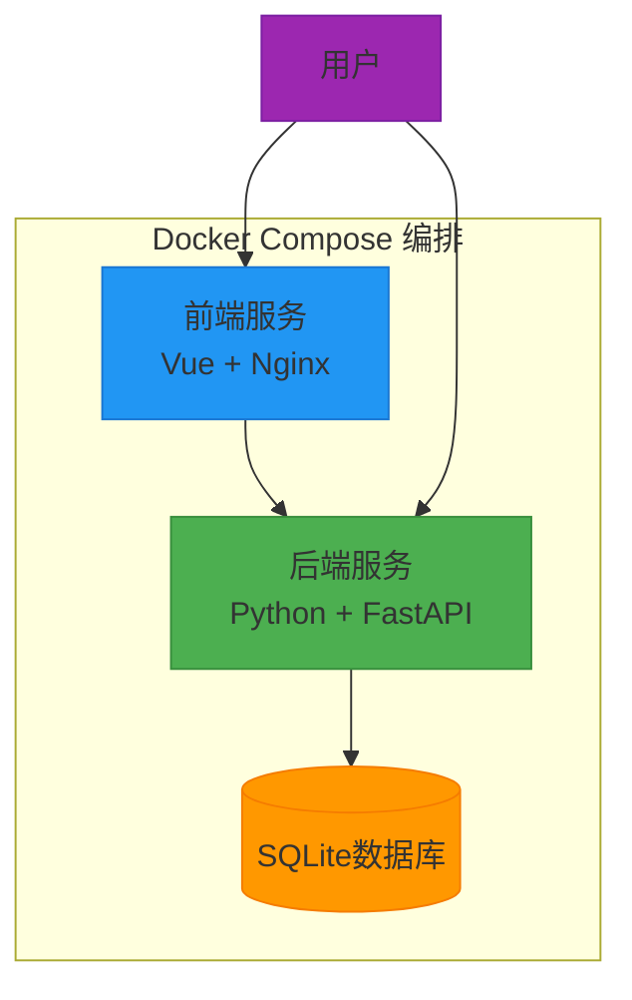
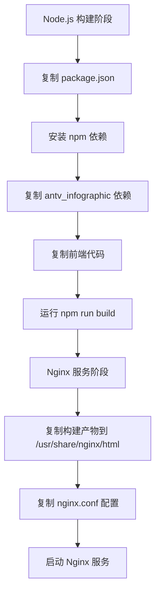
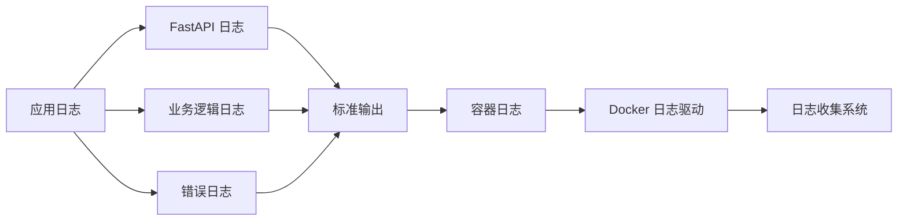

# 部署与运维

<cite>
**本文档引用的文件**  
- [docker-compose.yml](file://docker-compose.yml)
- [backend/Dockerfile](file://backend/Dockerfile)
- [frontend/Dockerfile](file://frontend/Dockerfile)
- [backend/.env](file://backend/.env)
- [frontend/nginx.conf](file://frontend/nginx.conf)
- [start-docker.sh](file://start-docker.sh)
- [start-docker.ps1](file://start-docker.ps1)
- [backend/app/main.py](file://backend/app/main.py)
- [backend/app/config.py](file://backend/app/config.py)
- [archive/temp_files/requirements.txt](file://archive/temp_files/requirements.txt)
- [README.md](file://README.md)
</cite>

## 目录
1. [简介](#简介)
2. [Docker容器化部署](#docker容器化部署)
3. [环境变量配置](#环境变量配置)
4. [监控与日志收集](#监控与日志收集)
5. [性能调优建议](#性能调优建议)
6. [备份与恢复方案](#备份与恢复方案)
7. [健康检查与故障排查](#健康检查与故障排查)

## 简介

本指南提供在生产环境中部署和运维 genai_chart-1 应用的完整说明。该系统是一个基于 AntV Infographic 和大语言模型的智能信息图生成平台，支持 AI 模板推荐、智能数据提取、多格式导出（SVG、PNG、PPTX）和作品管理等功能。本文档详细介绍了使用 Docker 容器化技术进行部署的完整流程，包括前后端服务、数据库和网络的编排设置，以及环境变量、监控、性能调优、备份恢复和故障排查的最佳实践。

**Section sources**
- [README.md](file://README.md#L1-L323)

## Docker容器化部署

genai_chart-1 应用通过 `docker-compose.yml` 文件进行容器化编排，包含前端和后端两个主要服务。部署过程通过 `start-docker.sh`（Linux/macOS）或 `start-docker.ps1`（Windows）脚本自动化执行。



**Diagram sources**
- [docker-compose.yml](file://docker-compose.yml#L3-L55)
- [backend/Dockerfile](file://backend/Dockerfile#L1-L44)
- [frontend/Dockerfile](file://frontend/Dockerfile#L1-L34)

### 后端服务部署

后端服务基于 `python:3.11-slim` 镜像构建，负责处理所有 API 请求、AI 集成和数据库操作。

- **构建上下文**: 项目根目录，Dockerfile 位于 `backend/Dockerfile`
- **端口映射**: 容器内 8000 端口映射到主机 8000 端口
- **数据卷**: 持久化存储数据库文件（`./backend/data`）和临时文件（`./backend/temp`）
- **健康检查**: 通过 `curl` 检查 `/docs` 路径的可达性
- **依赖安装**: 安装 Cairo 图形库、Noto CJK 中文字体和 Python 依赖包

**Section sources**
- [docker-compose.yml](file://docker-compose.yml#L5-L34)
- [backend/Dockerfile](file://backend/Dockerfile#L1-L44)

### 前端服务部署

前端服务采用多阶段构建，首先使用 Node.js 镜像构建 Vue 应用，然后使用 Nginx 镜像提供静态文件服务。

- **构建上下文**: 项目根目录，Dockerfile 位于 `frontend/Dockerfile`
- **端口映射**: 容器内 80 端口映射到主机 80 端口
- **依赖**: 复制 `antv_infographic` 库作为依赖
- **反向代理**: Nginx 配置将 `/api/` 路径的请求代理到后端服务
- **静态资源缓存**: 对 JS、CSS、图片等静态资源设置一年的缓存有效期



**Diagram sources**
- [frontend/Dockerfile](file://frontend/Dockerfile#L1-L34)
- [frontend/nginx.conf](file://frontend/nginx.conf#L1-L27)

**Section sources**
- [frontend/Dockerfile](file://frontend/Dockerfile#L1-L34)
- [frontend/nginx.conf](file://frontend/nginx.conf#L1-L27)

### 自动化部署脚本

项目提供跨平台的自动化部署脚本，简化部署流程。

- **Linux/macOS**: `start-docker.sh`
- **Windows**: `start-docker.ps1`

这些脚本执行以下步骤：
1. 检查 Docker 环境是否安装
2. 检查并配置 `.env` 环境文件
3. 停止并清理现有容器
4. 构建 Docker 镜像
5. 启动服务
6. 显示部署完成信息和常用命令

**Section sources**
- [start-docker.sh](file://start-docker.sh#L1-L128)
- [start-docker.ps1](file://start-docker.ps1#L1-L134)

## 环境变量配置

环境变量通过 `.env` 文件进行管理，该文件不应提交到版本控制系统中。

### 核心配置项

**Section sources**
- [backend/.env](file://backend/.env#L1-L25)
- [backend/app/config.py](file://backend/app/config.py#L9-L51)

#### LLM API 配置

| 环境变量 | 默认值 | 说明 |
|---------|-------|------|
| `AIHUBMIX_API_KEY` | (必填) | AiHubMix 平台的 API 密钥 |
| `AIHUBMIX_BASE_URL` | `https://aihubmix.com/v1` | LLM API 基础 URL |
| `LLM_MODEL` | `gpt-4o` | 使用的 LLM 模型名称 |

#### Dify 工作流配置（可选）

| 环境变量 | 默认值 | 说明 |
|---------|-------|------|
| `DIFY_API_KEY` | (可选) | Dify 工作流平台的 API 密钥 |
| `DIFY_BASE_URL` | (可选) | Dify API 基础 URL |

#### 数据库配置

| 环境变量 | 默认值 | 说明 |
|---------|-------|------|
| `DATABASE_URL` | `sqlite:///./data/genai_chart.db` | 数据库连接字符串 |

### 安全考虑

- **敏感信息保护**: API 密钥等敏感信息应通过环境变量注入，避免硬编码在代码中
- **文件权限**: `.env` 文件应设置适当的文件权限（如 600），限制访问
- **生产环境**: 在生产环境中，应使用更安全的密钥管理方案，如 Hashicorp Vault 或云服务商的密钥管理服务
- **CORS 配置**: 生产环境中应明确指定 `ALLOWED_ORIGINS`，避免使用 `*` 通配符

**Section sources**
- [backend/.env](file://backend/.env#L1-L25)
- [backend/app/config.py](file://backend/app/config.py#L26-L27)

## 监控与日志收集

### 关键指标跟踪

系统通过内置的健康检查端点和日志记录提供监控能力。

- **健康检查**: `/health` 端点返回服务状态
- **API 文档**: `/docs` 端点提供 Swagger UI
- **日志级别**: 配置为 INFO 级别，记录关键操作和错误



**Diagram sources**
- [backend/app/main.py](file://backend/app/main.py#L94-L103)
- [backend/app/main.py](file://backend/app/main.py#L11-L16)

### 告警设置

建议配置以下告警规则：

- **服务不可用**: 当 `/health` 端点连续 3 次返回非 200 状态码时触发
- **API 延迟过高**: 当 API 响应时间超过 5 秒时触发
- **错误率上升**: 当 HTTP 5xx 错误率超过 1% 时触发
- **磁盘空间不足**: 当数据库卷使用率超过 80% 时触发

**Section sources**
- [backend/app/main.py](file://backend/app/main.py#L94-L103)
- [docker-compose.yml](file://docker-compose.yml#L30-L33)

## 性能调优建议

### 资源分配

根据应用负载合理分配容器资源：

```yaml
# docker-compose.yml 片段
services:
  backend:
    # ...
    deploy:
      resources:
        limits:
          cpus: '2'
          memory: 4G
        reservations:
          cpus: '1'
          memory: 2G
```

- **CPU**: 建议至少分配 1 个 CPU 核心
- **内存**: 建议至少分配 2GB 内存，4GB 更佳
- **存储**: 确保有足够的磁盘空间用于数据库和临时文件

### 缓存策略

系统已内置多层缓存策略：

- **前端静态资源缓存**: Nginx 配置对 JS、CSS、图片等资源设置一年缓存
- **浏览器缓存**: 设置 `Cache-Control: public, immutable` 头部
- **应用层缓存**: 可在 `services/` 目录中实现 Redis 缓存以提高性能

**Section sources**
- [frontend/nginx.conf](file://frontend/nginx.conf#L22-L25)
- [docker-compose.yml](file://docker-compose.yml#L12-L15)

## 备份与恢复方案

### 数据备份

数据库文件位于 `./backend/data/genai_chart.db`，应定期备份。

```bash
# 备份脚本示例
#!/bin/bash
BACKUP_DIR="/backup/genai_chart"
DATE=$(date +%Y%m%d_%H%M%S)
mkdir -p $BACKUP_DIR
cp ./backend/data/genai_chart.db $BACKUP_DIR/genai_chart_$DATE.db
# 保留最近7天的备份
find $BACKUP_DIR -name "genai_chart_*.db" -mtime +7 -delete
```

### 恢复流程

1. 停止所有容器：`docker-compose down`
2. 替换数据库文件：`cp backup/genai_chart.db ./backend/data/genai_chart.db`
3. 重新启动服务：`docker-compose up -d`

**Section sources**
- [docker-compose.yml](file://docker-compose.yml#L14-L15)

## 健康检查与故障排查

### 健康检查端点

系统提供 `/health` 端点用于健康检查：

```bash
curl http://localhost:8000/health
# 返回示例
{
  "status": "healthy",
  "service": "AI信息图生成系统",
  "version": "1.0.0"
}
```

**Section sources**
- [backend/app/main.py](file://backend/app/main.py#L94-L103)

### 实用工具和方法

#### 常用 Docker 命令

| 命令 | 说明 |
|------|------|
| `docker-compose logs -f` | 查看实时日志 |
| `docker-compose down` | 停止并删除容器 |
| `docker-compose restart` | 重启所有服务 |
| `docker-compose exec backend bash` | 进入后端容器 |

#### 故障排查步骤

1. **检查容器状态**: `docker ps` 查看容器是否正常运行
2. **查看日志**: `docker-compose logs` 查看错误信息
3. **检查网络连接**: 确认前端能否通过 `http://backend:8000` 访问后端
4. **验证环境变量**: 检查 `.env` 文件中的配置是否正确
5. **测试数据库连接**: 进入后端容器测试数据库文件是否可访问

**Section sources**
- [start-docker.sh](file://start-docker.sh#L120-L124)
- [start-docker.ps1](file://start-docker.ps1#L115-L122)