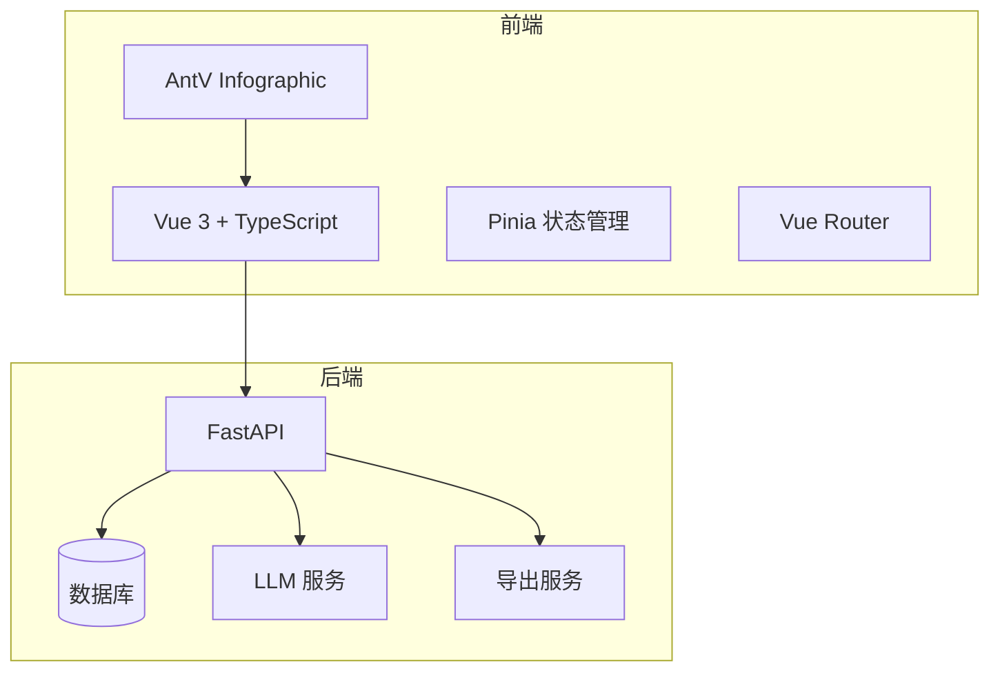
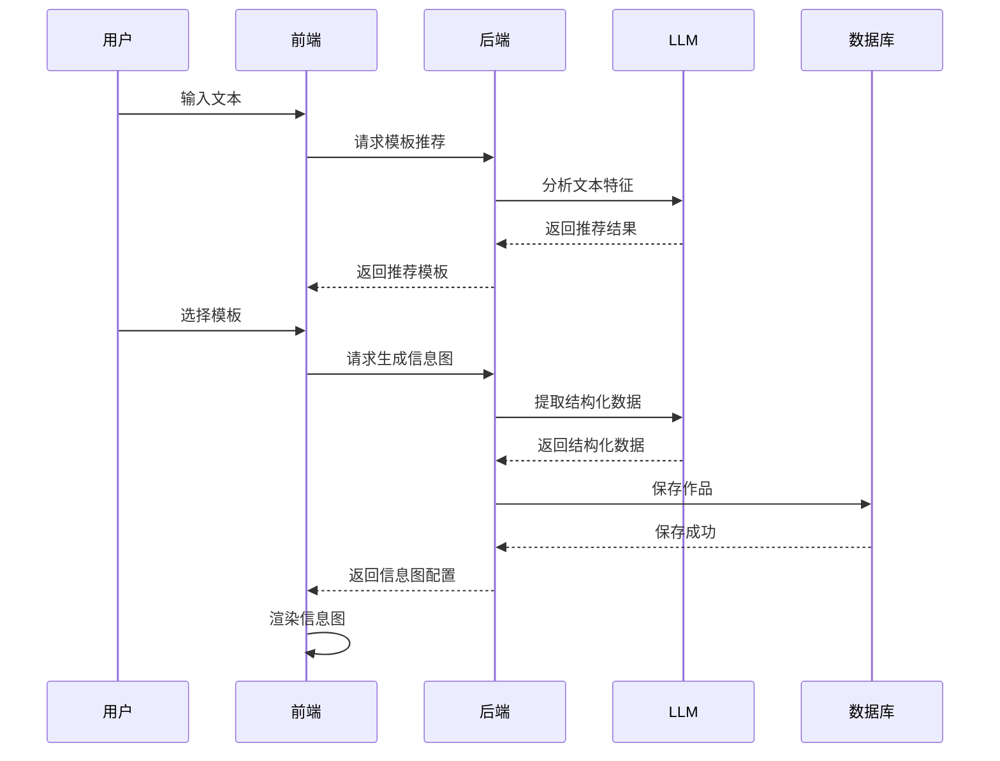

# 项目概述

<cite>
**本文档引用文件**  
- [README.md](file://README.md)
- [main.py](file://backend/app/main.py)
- [generate.py](file://backend/app/api/v1/generate.py)
- [generate_service.py](file://backend/app/services/generate_service.py)
- [template_service.py](file://backend/app/services/template_service.py)
- [Infographic.tsx](file://antv_infographic/infographic/src/runtime/Infographic.tsx)
- [work.py](file://backend/app/models/work.py)
- [workspace.ts](file://frontend/src/stores/workspace.ts)
- [docker-compose.yml](file://docker-compose.yml)
</cite>

## 目录
1. [简介](#简介)
2. [核心功能](#核心功能)
3. [技术架构](#技术架构)
4. [系统组件关系](#系统组件关系)
5. [主要使用场景](#主要使用场景)
6. [部署与开发环境](#部署与开发环境)
7. [学习路径指引](#学习路径指引)

## 简介

genai_chart-1 是一个基于 AntV Infographic 和大语言模型的智能信息图生成系统。该系统允许用户通过输入文本内容，利用 AI 自动分析并推荐合适的信息图模板，提取结构化数据，并最终生成专业的信息图。系统支持多格式导出（SVG、PNG、PDF、PPTX），具备模板分类系统和作品管理功能，提供 AI 工作区实现左右分栏实时预览，操作简单直观。

**Section sources**
- [README.md](file://README.md#L1-L323)

## 核心功能

genai_chart-1 系统具备以下核心功能：

1. **AI 模板推荐**：根据用户输入的文本内容，智能推荐最合适的信息图模板。
2. **智能数据提取**：自动从文本中提取关键信息并进行结构化处理。
3. **信息图生成**：使用 AntV Infographic 渲染引擎生成专业信息图。
4. **多格式导出**：支持导出为 SVG、PNG、PDF 和 PPTX 等多种格式。
5. **模板分类系统**：提供 7 大分类和超过 100 个模板的数据库。
6. **作品管理**：用户可以保存和管理自己的信息图作品。
7. **AI 工作区**：提供左右分栏界面，支持实时预览，简化操作流程。

**Section sources**
- [README.md](file://README.md#L11-L17)

## 技术架构

genai_chart-1 采用前后端分离的架构设计，前端使用 Vue 3 和 TypeScript，后端采用 FastAPI 和 Python。

### 前端技术栈
- **框架**：Vue 3
- **语言**：TypeScript
- **构建工具**：Vite
- **状态管理**：Pinia
- **路由**：Vue Router
- **UI 组件库**：Ant Design Vue
- **可视化库**：@antv/infographic

### 后端技术栈
- **框架**：FastAPI
- **语言**：Python
- **数据库**：SQLAlchemy + SQLite/PostgreSQL
- **AI 服务**：AiHubMix（兼容 OpenAI API）
- **导出工具**：cairosvg + python-pptx



**Diagram sources**
- [main.py](file://backend/app/main.py#L1-L113)
- [package.json](file://frontend/package.json#L1-L27)

**Section sources**
- [README.md](file://README.md#L19-L25)

## 系统组件关系

genai_chart-1 系统由多个组件构成，各组件之间通过明确的接口进行交互。

### 前端 UI
前端 UI 负责用户交互，包括输入文本、选择模板、预览信息图和导出结果。前端通过 Pinia 管理应用状态，使用 Vue Router 进行页面导航。

### 后端服务
后端服务提供 RESTful API，处理前端请求。主要功能包括：
- **模板管理**：获取模板列表、推荐模板。
- **信息图生成**：提取结构化数据、生成信息图配置。
- **作品管理**：保存和管理用户作品。
- **导出**：将信息图导出为多种格式。

### 可视化引擎
AntV Infographic 是系统的核心可视化引擎，负责将配置数据渲染为信息图。前端通过调用 Infographic 类的 render 方法将配置渲染到指定容器中。

### AI 集成点
系统通过 AiHubMix 服务集成大语言模型，实现 AI 模板推荐和智能数据提取。后端服务调用 LLM API 进行文本分析和数据提取。



**Diagram sources**
- [generate.py](file://backend/app/api/v1/generate.py#L1-L116)
- [generate_service.py](file://backend/app/services/generate_service.py#L1-L465)
- [Infographic.tsx](file://antv_infographic/infographic/src/runtime/Infographic.tsx#L1-L93)

**Section sources**
- [generate.py](file://backend/app/api/v1/generate.py#L1-L116)
- [generate_service.py](file://backend/app/services/generate_service.py#L1-L465)
- [Infographic.tsx](file://antv_infographic/infographic/src/runtime/Infographic.tsx#L1-L93)

## 主要使用场景

### 使用 AI 工作区
1. 访问 `http://localhost:5173`。
2. 在左侧输入框中输入内容。
3. 点击“分析并推荐模板”按钮。
4. 查看推荐结果，选择喜欢的模板。
5. 右侧实时预览生成的信息图。
6. 点击“导出”按钮选择格式（SVG/PNG/PDF/PPTX）。
7. 点击“保存”按钮保存到作品库。

### 使用经典创建页面
1. 访问 `http://localhost:5173`。
2. 点击“开始创建”按钮。
3. 在文本框输入要生成信息图的文本内容。
4. 点击“分析并推荐模板”，AI 会推荐合适的模板。
5. 选择一个推荐的模板。
6. 点击“生成信息图”。
7. 查看生成的信息图，可下载 SVG 格式。

**Section sources**
- [README.md](file://README.md#L111-L129)

## 部署与开发环境

### 系统部署
系统支持通过 Docker 进行部署。使用 `docker-compose.yml` 文件定义了前端和后端服务的配置。

```yaml
version: '3.8'
services:
  backend:
    build:
      context: .
      dockerfile: backend/Dockerfile
    container_name: genai-chart-backend
    ports:
      - "8000:8000"
    volumes:
      - ./backend:/app
      - ./backend/data:/app/data
      - ./backend/temp:/app/temp
    environment:
      - AIHUBMIX_API_KEY=${AIHUBMIX_API_KEY}
      - AIHUBMIX_BASE_URL=${AIHUBMIX_BASE_URL:-https://aihubmix.com/v1}
      - DATABASE_URL=sqlite:///./data/genai_chart.db
    restart: unless-stopped

  frontend:
    build:
      context: .
      dockerfile: frontend/Dockerfile
    container_name: genai-chart-frontend
    ports:
      - "80:80"
    depends_on:
      - backend
    restart: unless-stopped
```

### 开发环境配置
1. **前置要求**：
   - Node.js 18+
   - Python 3.11+
   - npm 或 yarn

2. **后端配置**：
   - 安装 Python 依赖：`pip install -r requirements.txt`
   - 配置环境变量：复制 `.env.example` 为 `.env`，并填写 AiHubMix API 密钥。
   - 启动后端服务：`python -m app.main` 或 `uvicorn app.main:app --reload --port 8000`

3. **前端配置**：
   - 安装依赖：`npm install`
   - 启动开发服务器：`npm run dev`

**Section sources**
- [docker-compose.yml](file://docker-compose.yml#L1-L55)
- [README.md](file://README.md#L33-L108)

## 学习路径指引

### 初学者学习路径
1. 阅读 `README.md` 文件，了解系统简介和快速开始指南。
2. 阅读 `QUICK_START.md`，完成 5 分钟快速启动。
3. 使用 AI 工作区创建信息图，熟悉基本操作。
4. 查看 `FINAL_COMPLETION_REPORT.md`，了解所有功能详情。

### 经验丰富的开发者学习路径
1. 阅读 `SMART_GENERATION_GUIDE.md`，深入了解智能生成功能。
2. 阅读 `TEMPLATE_EXPANSION_GUIDE.md`，学习如何扩展模板。
3. 阅读 `LLM_PROVIDER_CONFIG.md`，了解 LLM 提供商配置。
4. 查看 `tests/backend/` 目录下的测试脚本，了解系统测试流程。
5. 修改 `backend/app/utils/prompts.py` 中的提示词模板，优化 AI 推荐和数据提取效果。

**Section sources**
- [README.md](file://README.md#L265-L306)